# PALEO ARCHIVE - ALL IN ONE CODE REPOSITORY

## File: index.html

`html
<!DOCTYPE html>
<html lang="en" data-page="index">
<head>
    <meta charset="UTF-8">
    <meta name="viewport" content="width=device-width, initial-scale=1.0">
    <meta name="description" content="PALEOLOGIST | Exploring Earth's ancient past to protect life's future. Deep-time expedition archive, specimen field guide, and prehistoric gallery.">
    <meta property="og:title" content="PALEOLOGIST | Exploring Earth's Ancient Past">
    <meta property="og:description" content="A cinematic museum & field guide experience covering ancient species, deep geologic time, and prehistoric life.">
    <meta property="og:type" content="website">
    <meta property="og:image" content="assets/images/originals/hero-banner.jpg">
    <title>PALEOLOGIST | Discover. Learn. Protect.</title>
    <link rel="preconnect" href="https://fonts.googleapis.com">
    <link rel="preconnect" href="https://fonts.gstatic.com" crossorigin>
    <link rel="preload" as="image" href="assets/images/originals/hero-banner.jpg" fetchpriority="high">
    <link href="https://fonts.googleapis.com/css2?family=Cinzel:wght@400;600;700;900&family=Outfit:wght@300;400;500;600;700&family=Share+Tech+Mono&family=Orbitron:wght@400;700;900&display=swap" rel="stylesheet">
    
    <link rel="stylesheet" href="assets/css/site.css">
</head>
<body class="pl-shell">

    <!-- GLOBAL HEADER -->
    <header class="pl-header">
        

            <a href="index.html" class="pl-logo">
              <svg class="pl-logo-icon" width="28" height="28" viewBox="0 0 32 32" fill="none" xmlns="http://www.w3.org/2000/svg">
                <path d="M16 3C8.82 3 3 8.82 3 16s5.82 13 13 13 13-5.82 13-13S23.18 3 16 3zm0 24c-6.08 0-11-4.92-11-11s4.92-11 11-11 11 4.92 11 11-4.92 11-11 11z" fill="#c29b62"/>
                <path d="M16 7c-4.97 0-9 4.03-9 9s4.03 9 9 9c3.86 0 7.12-2.44 8.36-5.89-.35.08-.71.13-1.09.13-2.9 0-5.27-2.36-5.27-5.24 0-1.74.85-3.28 2.16-4.23C19.78 8.1 17.98 7 16 7z" fill="#c29b62" opacity="0.6"/>
                <circle cx="16" cy="16" r="3.5" fill="#e5b869"/>
              </svg>
              PALEOLOGIST
            </a>

            <nav class="pl-nav" id="plNav" aria-label="Primary Navigation">
                <a href="index.html" class="pl-nav-link active">HOME / 首页</a>
                <a href="gallery.html" class="pl-nav-link">FIELD GUIDE / 物种图鉴</a>
                <a href="timescale.html" class="pl-nav-link">TIMELINE / 地质年代</a>
                <a href="gallery.html#gallery-showcase" class="pl-nav-link">EXHIBITION / 馆藏化石</a>
                <a href="form.html" class="pl-nav-link">HYBRID LAB / 基因合成</a>
            </nav>

            

                <button type="button" class="pl-alert-badge-btn js-open-alert" id="openRedAlertBtn" aria-label="Open Red Code Alert System">
                    
                    RED CODE ALERT
                </button>
                <button class="pl-menu-toggle" id="plMenuToggle" aria-label="Toggle navigation">
                  <svg width="22" height="22" viewBox="0 0 24 24" fill="none" stroke="currentColor" stroke-width="2">
                    <path d="M3 12h18M3 6h18M3 18h18"/>
                  </svg>
                </button>
            

        

    </header>

    <!-- MAIN CONTENT -->
    <main>
        <!-- HERO SECTION -->
        <section class="pl-hero" aria-label="Hero Expedition Introduction">
            

                <h1 class="pl-hero-title">DISCOVER. LEARN. PROTECT.</h1>
                
Exploring Earth's ancient past to protect life's future.

                <a href="#explore-sections" class="pl-btn-gold">EXPLORE NOW &nbsp;›</a>
            

        </section>

        <!-- EXPLORE OUR SECTIONS (4-ITEM BENTO GRID) -->
        <section class="pl-container" id="explore-sections" aria-label="Explore Sections">
            

                
CURATED EXPEDITIONS

                <h2 class="pl-section-title">EXPLORE OUR SECTIONS</h2>
            

            

                <!-- 01: SPECIES FIELD GUIDE -->
                <a href="gallery.html" class="pl-section-card" aria-label="Explore Species Field Guide">
                    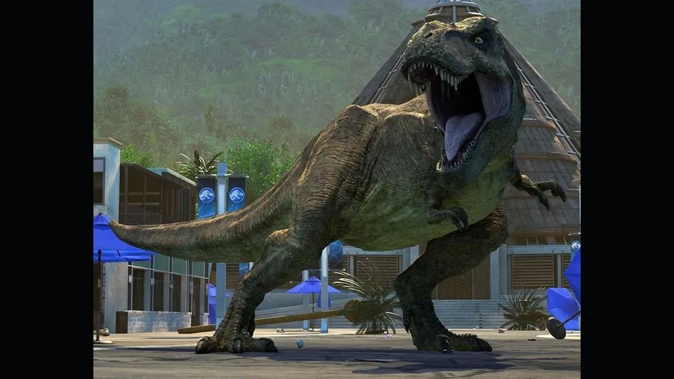
                    

                    

                        <h3 class="pl-card-title">SPECIES FIELD GUIDE</h3>
                        
Browse ancient species and learn their stories.

                        VIEW ALL &nbsp;›
                    

                </a>

                <!-- 02: GEOLOGIC TIMELINE -->
                <a href="timescale.html" class="pl-section-card" aria-label="Explore Geologic Timeline">
                    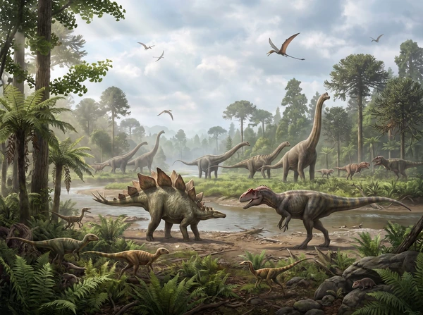
                    

                    

                        <h3 class="pl-card-title">GEOLOGIC TIMELINE</h3>
                        
Travel through deep time and major geologic events.

                        VIEW TIMELINE &nbsp;›
                    

                </a>

                <!-- 03: GALLERY -->
                <a href="gallery.html#gallery-showcase" class="pl-section-card" aria-label="Explore Museum Fossil Gallery">
                    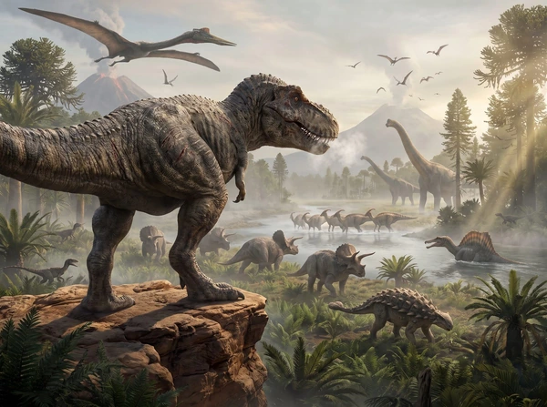
                    

                    

                        <h3 class="pl-card-title">GALLERY</h3>
                        
Explore fossils, skeletons, and prehistoric worlds.

                        VIEW GALLERY &nbsp;›
                    

                </a>

                <!-- 04: HYBRID LAB -->
                <a href="form.html" class="pl-section-card" aria-label="Explore Hybrid DNA Lab">
                    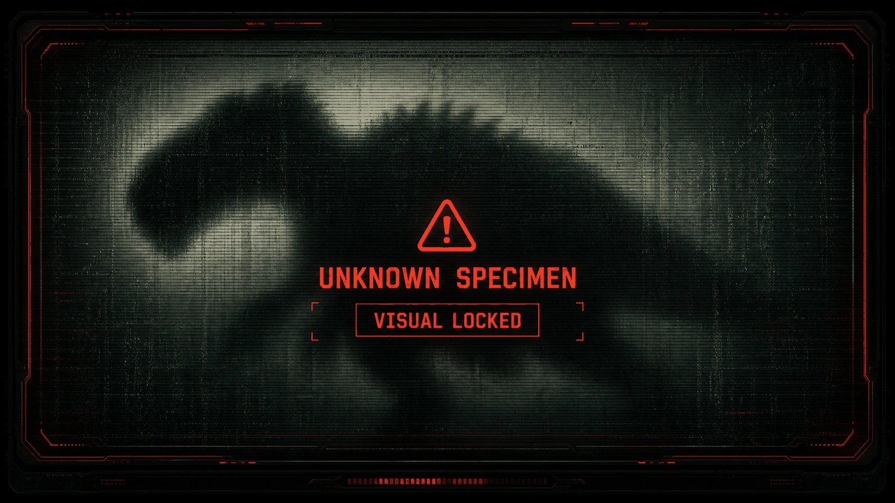
                    

                    

                        <h3 class="pl-card-title">HYBRID LAB</h3>
                        
Create your own hybrid species in the lab.

                        CREATE HYBRID &nbsp;›
                    

                </a>
            

            <!-- RED CODE ALERT BANNER -->
            

                

                    

                        <svg width="24" height="24" viewBox="0 0 24 24" fill="currentColor">
                            <path d="M1 21h22L12 2 1 21zm12-3h-2v-2h2v2zm0-4h-2v-4h2v4z"/>
                        </svg>
                    

                    

                        <h3 class="pl-alert-title">RED CODE ALERT</h3>
                        
Species are disappearing. View the Red Code List and learn about endangered ancient life.

                        <button type="button" class="pl-alert-action-btn js-open-alert">VIEW ALERT LIST &nbsp;›</button>
                    

                

                

                    

                        

                            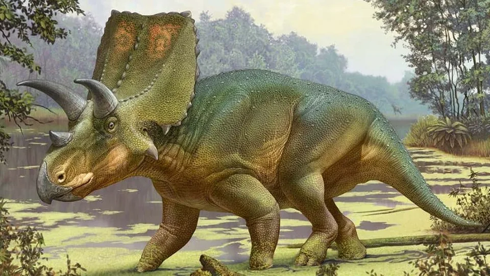
                        

                        TRICERATOPS
                    

                    

                        

                            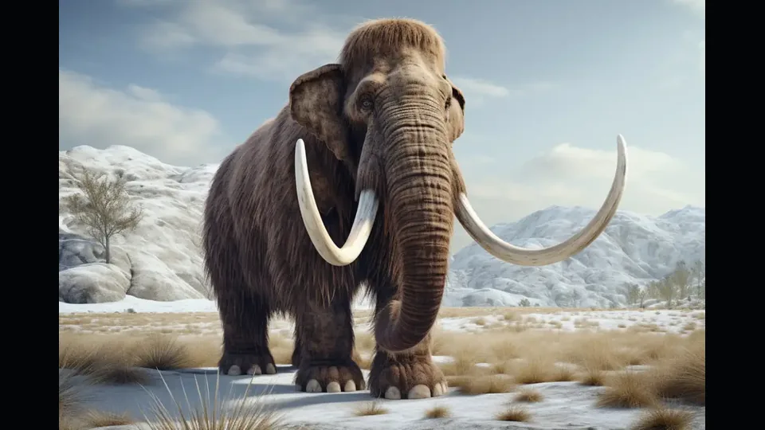
                        

                        WOOLLY MAMMOTH
                    

                    

                        

                            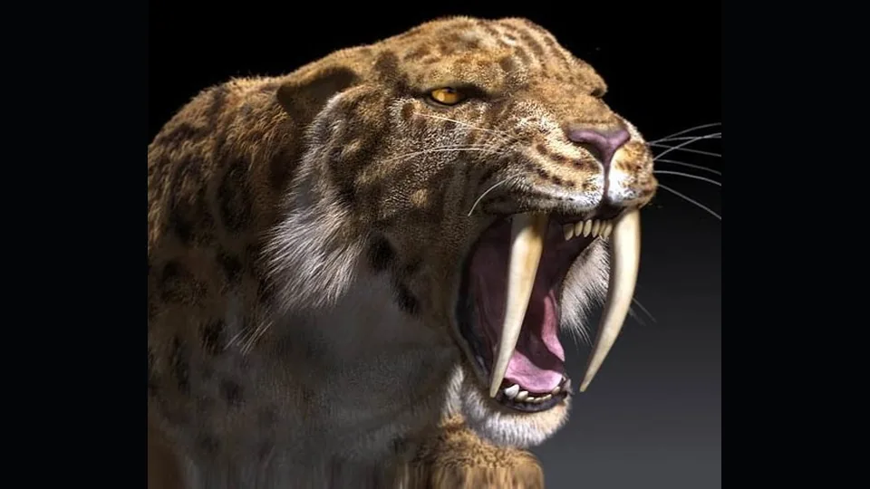
                        

                        SABER-TOOTHED TIGER
                    

                    

                        

                            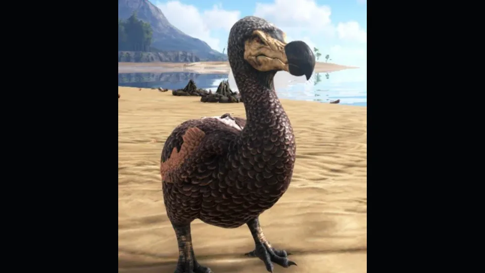
                        

                        DODO
                    

                

            

            <!-- OPTIONAL EXPEDITION PROFILE ACCESS TERMINAL -->
            

                

                    ▶ FIELD TERMINAL ACCESS / 古生物考查队终端会话配置 (OPTIONAL SESSION PROFILE)
                

                

                    <aside class="portal-container" id="portalContainer" aria-label="Archive access terminal">
                        <form id="loginForm" novalidate>
                            

                                <label class="form-label" for="username">Operator Name / 操作员代号</label>
                                <input type="text" id="username" class="form-input" placeholder="ENTER CODENAME / 输入代号..." autocomplete="off">
                                
Name must be at least 3 characters / 代号长度不能少于3个字符

                            

                            

                                <label class="form-label" for="accessKey">Access Key / Security Code / 访问密钥</label>
                                <input type="password" id="accessKey" class="form-input" placeholder="INGEN-XXXXXX..." autocomplete="off">
                                
Key format invalid / 密钥格式不匹配 (需符合 INGEN-XXXXXX 格式)

                            

                            

                                <label class="form-label" for="clearance">Clearance Level / 安全许可等级</label>
                                <select id="clearance" class="form-select">
                                    <option value="level 1">LEVEL 1 - VISITOR Clearance / 1级许可 - 访客等级</option>
                                    <option value="level 2">LEVEL 2 - FIELD TECH Clearance / 2级许可 - 野外技术员</option>
                                    <option value="level 3">LEVEL 3 - PALEOBIOLOGIST Clearance / 3级许可 - 古生物研究员</option>
                                    <option value="level 4" selected>LEVEL 4 - CLASSIFIED ARCHIVE CLEARANCE / 4级许可 - 机密归档</option>
                                </select>
                            

                            

                                <label class="form-label" for="themeSelect">Terminal Theme Tint / 终端显示色调</label>
                                <select id="themeSelect" class="form-select" onchange="changeThemeTint(this.value)">
                                    <option value="green">ARCHIVE GOLD (DEFAULT) / 档案金 (默认)</option>
                                    <option value="amber">AMBER TINT (WARNING) / 琥珀黄 (警示)</option>
                                    <option value="red">CRT RED (ALARM) / 警报红 (危机)</option>
                                </select>
                            

                            <button type="submit" class="submit-btn">INITIATE SESSION / 启动终端</button>
                        </form>
                    </aside>
                

            

        </section>
    </main>

    <!-- RED CODE ALERT MODAL -->
    

        

            <button type="button" class="pl-modal-close js-close-alert" aria-label="Close Alert Dialog">✕</button>
            

                <h2 class="pl-alert-modal-title" id="alertModalTitle">
                    ▲ RED CODE ALERT
                </h2>
                
Ancient species are disappearing. Awareness is the first step to preservation.

            

            

                <button type="button" class="pl-alert-tab active" data-status="all">ALL STATUSES</button>
                <button type="button" class="pl-alert-tab" data-status="cr">CRITICALLY ENDANGERED (CR)</button>
                <button type="button" class="pl-alert-tab" data-status="en">ENDANGERED (EN)</button>
                <button type="button" class="pl-alert-tab" data-status="vu">VULNERABLE (VU)</button>
            

            

                <!-- Card 1 -->
                

                    
                    

                        <h4 class="pl-threat-name">TRICERATOPS</h4>
                        CR
                    

                    
Late Cretaceous · ~68–66 Mya

                    
Extreme environmental collapse following the Chicxulub bolide impact. Global wildfire and thermal radiation.

                

                <!-- Card 2 -->
                

                    
                    

                        <h4 class="pl-threat-name">WOOLLY MAMMOTH</h4>
                        EN
                    

                    
Pleistocene · ~400–4 kya

                    
Post-glacial warming causing loss of mammoth steppe habitat, compounded by human hunting pressure.

                

                <!-- Card 3 -->
                

                    
                    

                        <h4 class="pl-threat-name">SABER-TOOTHED TIGER</h4>
                        VU
                    

                    
Pleistocene · ~2.5 Mya–10 kya

                    
Extinction of large herbivore prey base and competitive exclusion during quaternary climate shifts.

                

                <!-- Card 4 -->
                

                    
                    

                        <h4 class="pl-threat-name">DODO</h4>
                        CR
                    

                    
Holocene · ~1681 AD Extinct

                    
Direct human predation and introduction of invasive nest predators (rats, pigs, dogs) on Mauritius.

                

            

            <!-- WHAT CAN YOU DO? -->
            

                

                    <h3 class="pl-what-title">WHAT CAN YOU DO?</h3>
                    
Preserving biodiversity begins with understanding history.

                

                

                    

                        
1. LEARN

                        
Educate yourself and your community on ancient mass extinction triggers.

                    

                    

                        
2. SHARE

                        
Promote scientific research and paleobiological conservation studies.

                    

                    

                        
3. SUPPORT

                        
Support habitat preservation and active ecological restoration worldwide.

                    

                

            

        

    

    <!-- GLOBAL FOOTER -->
    <footer class="pl-footer">
        

            

                <!-- Brand Column -->
                

                    <a class="pl-brand" href="index.html">
                        <svg class="pl-brand-icon" viewBox="0 0 24 24" fill="currentColor">
                            <path d="M12 2C6.48 2 2 6.48 2 12s4.48 10 10 10 10-4.48 10-10S17.52 2 12 2zm1 17.93c-3.95-.49-7-3.85-7-7.93 0-.62.08-1.21.21-1.79L9 15v1c0 1.1.9 2 2 2v1.93zm6.9-2.54c-.26-.81-1-1.39-1.9-1.39h-1v-3c0-.55-.45-1-1-1H8v-2h2c.55 0 1-.45 1-1V7h2c1.1 0 2-.9 2-2v-.41c2.93 1.19 5 4.06 5 7.41 0 2.08-.8 3.97-2.1 5.39z"/>
                        </svg>
                        PALEOLOGIST
                    </a>
                    

                        Unearthing the past. 
                        Understanding the present. 
                        Protecting the future.
                    

                    

                        <a href="#" class="pl-social-link" aria-label="YouTube">▶</a>
                        <a href="#" class="pl-social-link" aria-label="Facebook">f</a>
                        <a href="#" class="pl-social-link" aria-label="Twitter">𝕏</a>
                        <a href="#" class="pl-social-link" aria-label="Instagram">📷</a>
                    

                

                <!-- Menu Column -->
                

                    
MENU

                    <ul class="pl-footer-list">
                        <li><a href="index.html">Home</a></li>
                        <li><a href="gallery.html">Species Field Guide</a></li>
                        <li><a href="timescale.html">Geologic Timeline</a></li>
                        <li><a href="gallery.html#gallery-showcase">Fossil Gallery</a></li>
                        <li><a href="form.html">Hybrid Lab</a></li>
                        <li><a href="#" class="js-open-alert">Red Code Alert</a></li>
                    </ul>
                

                <!-- Resources Column -->
                

                    
RESOURCES

                    <ul class="pl-footer-list">
                        <li><a href="gallery.html">Field Articles</a></li>
                        <li><a href="timescale.html">Deep-Time Research</a></li>
                        <li><a href="#">For Educators</a></li>
                        <li><a href="#">Specimen Downloads</a></li>
                        <li><a href="#">Expedition FAQ</a></li>
                    </ul>
                

                <!-- About Column -->
                

                    
ABOUT

                    <ul class="pl-footer-list">
                        <li><a href="#">About Us</a></li>
                        <li><a href="#">Our Mission</a></li>
                        <li><a href="#">Expedition Team</a></li>
                        <li><a href="#">Preservation Fund</a></li>
                        <li><a href="#">Contact</a></li>
                    </ul>
                

                <!-- Fossil Art Column -->
                

                    <svg class="pl-footer-skull" viewBox="0 0 100 80" fill="none" stroke="currentColor" stroke-width="1.2" stroke-linecap="round" stroke-linejoin="round" style="color:var(--pl-gold);">
                        <!-- Theropod (T-Rex) skull profile — museum line-art etching -->
                        <!-- Cranium + upper jaw outline -->
                        <path d="M8,34 C6,26 10,18 18,12 C26,7 38,4 50,4 C62,4 72,6 80,12 C88,18 93,28 94,38 L94,42 L8,42 C6,40 6,36 8,34 Z"/>
                        <!-- Mandible (lower jaw) -->
                        <path d="M92,46 C90,54 84,62 74,68 C64,74 50,76 38,76 C26,76 14,68 8,58 C5,52 5,48 5,46"/>
                        <!-- Orbit (eye socket) -->
                        <ellipse cx="60" cy="22" rx="9" ry="10"/>
                        <!-- Antorbital fenestra -->
                        <ellipse cx="38" cy="24" rx="6" ry="8"/>
                        <!-- Lateral temporal fenestra -->
                        <ellipse cx="80" cy="24" rx="5" ry="7"/>
                        <!-- External naris (nostril) -->
                        <ellipse cx="16" cy="22" rx="3.5" ry="4.5"/>
                        <!-- Upper teeth (serrated, from maxilla) -->
                        <path d="M14,42 L16,53 L19,42 L23,55 L27,42 L30,53 L33,42 L37,55 L41,42 L44,52 L47,42"/>
                        <!-- Lower teeth (from dentary) -->
                        <path d="M12,46 L15,36 L18,46 L22,33 L26,46 L30,35 L34,46 L38,34 L42,46 L46,38 L50,46"/>
                        <!-- Postorbital bar (bone strut behind orbit) -->
                        <line x1="68" y1="30" x2="72" y2="42" opacity="0.6"/>
                        <!-- Lacrimal crest (brow ridge) -->
                        <path d="M48,6 C51,2 55,3 58,6" stroke-width="1.6"/>
                        <!-- Jaw joint articulation -->
                        <path d="M93,42 C95,44 95,46 93,46" opacity="0.5"/>
                    </svg>
                

            

            

                © 2026 PALEOLOGIST ARCHIVE. All rights reserved.
                Deep-Time Biodiversity & Paleobiology Archive
            

        

    </footer>

    <!-- Booting Overlay screen (preserved for session auth) -->
    

        
ACCESS GRANTED / 准予接入

        

            
        

    

</body>
</html>

`

## File: gallery.html

`html
<!DOCTYPE html>
<html lang="en" data-page="gallery">
<head>
    <meta charset="UTF-8">
    <meta name="viewport" content="width=device-width, initial-scale=1.0">
    <meta name="description" content="PALEOLOGIST | Species Field Guide - Explore detailed profiles of ancient species, geological eras, and fossil discoveries.">
    <meta property="og:title" content="PALEOLOGIST | Species Field Guide">
    <meta property="og:description" content="Comprehensive specimen database and fossil gallery across deep geological time.">
    <meta property="og:type" content="website">
    <meta property="og:image" content="assets/images/originals/trex.jpg">
    <title>PALEOLOGIST | Species Field Guide & Gallery</title>
    <link rel="preconnect" href="https://fonts.googleapis.com">
    <link rel="preconnect" href="https://fonts.gstatic.com" crossorigin>
    <link href="https://fonts.googleapis.com/css2?family=Cinzel:wght@400;600;700;900&family=Outfit:wght@300;400;500;600;700&family=Share+Tech+Mono&family=Orbitron:wght@400;700;900&display=swap" rel="stylesheet">
    
    
    <link rel="stylesheet" href="assets/css/site.css">
</head>
<body class="pl-shell">

<!-- BOOT -->

  
PALEOARCHIVE

  

<!-- PADDOCK BOARD -->

  
FIELD STATUS BOARD / 古生物区域监控
PALEO ARCHIVE · DEEP TIME INDEX

  

    

T-REX KINGDOM / 霸王龙王国

● SECURE / 安全

LAST CHK: --:--

    

RAPTOR PEN B / 迅猛龙收容区B

● SECURE / 安全

LAST CHK: --:--

    

MOSASAUR LAGOON / 沧龙潟湖

● SECURE / 安全

LAST CHK: --:--

    

JW AVIARY / 翼龙馆

● SECURE / 安全

LAST CHK: --:--

    

GYROSPHERE VALLEY / 陀螺谷

● SECURE / 安全

LAST CHK: --:--

    

SECTOR 5 CROC BAY / 5区鳄湾

● SECURE / 安全

LAST CHK: --:--

    

CENOZOIC SECTOR 7 / 新生代7区

● SECURE / 安全

LAST CHK: --:--

    

INDOMINUS ENCLOSURE / 暴虐霸王龙收容区

● SECURE / 安全

LAST CHK: --:--

  

  

SYS: --:--:--

    <!-- GLOBAL HEADER -->
    <header class="pl-header">
        

            <a href="index.html" class="pl-logo">
              <svg class="pl-logo-icon" width="28" height="28" viewBox="0 0 32 32" fill="none" xmlns="http://www.w3.org/2000/svg">
                <path d="M16 3C8.82 3 3 8.82 3 16s5.82 13 13 13 13-5.82 13-13S23.18 3 16 3zm0 24c-6.08 0-11-4.92-11-11s4.92-11 11-11 11 4.92 11 11-4.92 11-11 11z" fill="#c29b62"/>
                <path d="M16 7c-4.97 0-9 4.03-9 9s4.03 9 9 9c3.86 0 7.12-2.44 8.36-5.89-.35.08-.71.13-1.09.13-2.9 0-5.27-2.36-5.27-5.24 0-1.74.85-3.28 2.16-4.23C19.78 8.1 17.98 7 16 7z" fill="#c29b62" opacity="0.6"/>
                <circle cx="16" cy="16" r="3.5" fill="#e5b869"/>
              </svg>
              PALEOLOGIST
            </a>

            <nav class="pl-nav" id="plNav" aria-label="Primary Navigation">
                <a href="index.html" class="pl-nav-link">HOME / 首页</a>
                <a href="gallery.html" class="pl-nav-link active">FIELD GUIDE / 物种图鉴</a>
                <a href="timescale.html" class="pl-nav-link">TIMELINE / 地质年代</a>
                <a href="gallery.html#gallery-showcase" class="pl-nav-link">EXHIBITION / 馆藏化石</a>
                <a href="form.html" class="pl-nav-link">HYBRID LAB / 基因合成</a>
            </nav>

            

                <button type="button" class="pl-alert-badge-btn js-open-alert" id="openRedAlertBtn" aria-label="Open Red Code Alert System">
                    
                    RED CODE ALERT
                </button>
                <button class="pl-menu-toggle" id="plMenuToggle" aria-label="Toggle navigation">
                  <svg width="22" height="22" viewBox="0 0 24 24" fill="none" stroke="currentColor" stroke-width="2">
                    <path d="M3 12h18M3 6h18M3 18h18"/>
                  </svg>
                </button>
            

        

    </header>

<!-- PAGE WRAP START -->
<main class="pl-container page-wrap" style="padding-top: 100px; padding-bottom: 80px;">
    

        
COMPREHENSIVE SPECIES DATABASE

        <h1 class="pl-section-title" style="font-size: clamp(2rem, 3.5vw, 2.8rem); margin-bottom: 8px;">SPECIES FIELD GUIDE</h1>
        
Explore detailed profiles of ancient species across deep geological time.

        

            <input type="search" id="searchInput" class="pl-search-input" placeholder="Search species (e.g. Tyrannosaurus, Triceratops, 霸王龙)..." autocomplete="off">
            <select id="eraFilterSelect" class="pl-filter-select" aria-label="Filter by Era">
                <option value="all">ALL ERAS / 全部年代</option>
                <option value="cretaceous">CRETACEOUS / 白垩纪</option>
                <option value="jurassic">JURASSIC / 侏罗纪</option>
                <option value="triassic">TRIASSIC / 三叠纪</option>
                <option value="permian">PERMIAN / 二叠纪</option>
                <option value="carboniferous">CARBONIFEROUS / 石炭纪</option>
                <option value="devonian">DEVONIAN / 泥盆纪</option>
                <option value="cenozoic">CENOZOIC / 新生代</option>
            </select>
            <select id="dietFilterSelect" class="pl-filter-select" aria-label="Filter by Diet">
                <option value="all">ALL DIETS / 全部食性</option>
                <option value="carnivore">CARNIVORE / 肉食</option>
                <option value="herbivore">HERBIVORE / 草食</option>
                <option value="piscivore">PISCIVORE / 食鱼</option>
                <option value="omnivore">OMNIVORE / 杂食</option>
            </select>
            <select id="statusFilterSelect" class="pl-filter-select" aria-label="Filter by Conservation Status">
                <option value="all">ALL STATUSES / 全部保护状态</option>
                <option value="cr">CRITICALLY ENDANGERED (CR)</option>
                <option value="en">ENDANGERED (EN)</option>
                <option value="vu">VULNERABLE (VU)</option>
                <option value="lc">LEAST CONCERN (LC)</option>
            </select>
            <select id="sortSelect" class="pl-filter-select" onchange="sortCards()" aria-label="Sort specimens">
                <option value="default">DEFAULT / 默认排序</option>
                <option value="name">NAME (A-Z) / 名称</option>
                <option value="era">ERA / 地质年代</option>
                <option value="rarity">ARCHIVE PRIORITY / 优先级</option>
            </select>
        

        

            <button class="filter-btn active" data-val="all" onclick="filterSelection('all')">ALL / 全部</button>
            <button class="filter-btn" data-val="hybrid" onclick="filterSelection('hybrid')">HYBRIDS / 混种生物</button>
            <button class="filter-btn" data-val="carnivore" onclick="filterSelection('carnivore')">CARNIVORES / 肉食恐龙</button>
            <button class="filter-btn" data-val="herbivore" onclick="filterSelection('herbivore')">HERBIVORES / 草食恐龙</button>
            <button class="filter-btn" data-val="pterosaur" onclick="filterSelection('pterosaur')">PTEROSAURS / 翼龙类</button>
            <button class="filter-btn" data-val="amphibian" onclick="filterSelection('amphibian')">EARLY TETRAPODS / 早期四足类</button>
            <button class="filter-btn" data-val="aquatic" onclick="filterSelection('aquatic')">AQUATIC LIFE / 水生古生物</button>
            <button class="filter-btn" data-val="cenozoic" onclick="filterSelection('cenozoic')">CENOZOIC / 新生代动物</button>
        

    

    

        0 RECORDS / 0 条记录
        SCIENTIFIC RECORDS + FIELD DISCOVERY FILES
    

    

        
HYBRID RECORDS / 混种与基因异常记录

        

    

    

        
CARNIVORES / 肉食恐龙

        

    

    

        
HERBIVORES / 草食恐龙

        

    

    

        
PTEROSAURS / 翼龙类

        

    

    

        
EARLY TETRAPODS / 早期四足类

        

    

    

        
AQUATIC LIFE / 水生古生物

        

    

    

        
CENOZOIC / 新生代动物

        

    

    

        PALEO_DOC_ID: PALEO_DB_2026 | PAGE: 999
    

    

        <h1>SECURITY BREACH / 安全失效</h1>
        
ASSET IS TOO DANGEROUS FOR DEPLOYMENT / 资产危险度极高，系统已拒绝部署

    

    

        

            

                

                    
                

                

                    

                        SPECIMEN / 标本
                        <strong id="mPlateName">-</strong>
                    

                    

                        GEOLOGICAL ERA / 地质年代
                        <strong id="mPlateEra">-</strong>
                    

                    

                        PRIMARY LOCALITY / 主要出土地点
                        <strong id="mPlateLocation">-</strong>
                    

                

            

            

                

                    <button class="close-btn" onclick="closeModal()" aria-label="Close specimen dossier / 关闭标本档案" style="position:absolute;top:20px;right:20px;background:none;border:none;color:#fff;font-size:2rem;cursor:pointer;z-index:10;">&times;</button>
                    
SPECIMEN DOSSIER / 标本档案

                    
NAME

                    
Chinese Name

                

            <!-- Containment Protocol -->
            

              

              
CONTAINMENT PROTOCOL / 安全收容规程

            

                

                    
<label>CLASSIFICATION / 生物分类</label>...

                    
<label>ARCHIVE CODE / 档案编号</label>...

                    
<label>SIMULATION THREAT / 模拟威胁等级</label>...

                    
<label>GEOLOGICAL ERA / 生存地质年代</label>...

                    
<label>BODY LENGTH / 体长或翼展</label>...

                    
<label>ESTIMATED MASS / 估计体重</label>...

                    
<label>SIMULATION ATTACK INDEX / 模拟攻击指数</label>...

                    
<label>SIMULATION VITALITY / 模拟生命指数</label>...

                    
<label>SYNTHESIS RESULT / 合成结果</label>VERIFIED RECORD

                

                
FIELD SUMMARY / 物种概要

                
Loading...

                
KEY PALEOBIOLOGY NOTE / 古生物学要点

                
...

                 
                <!-- Habitat Map -->
                

                  
PRIMARY FOSSIL LOCALITY / 主要化石出土地点

                  

                    <svg id="modalMap" viewBox="0 0 800 400" role="img" aria-label="World map showing the selected fossil locality" xmlns="http://www.w3.org/2000/svg">
                      <rect width="800" height="400" class="map-ocean"/>
                      <!-- Latitude and longitude grid -->
                      <g aria-hidden="true">
                        <line x1="0" y1="66.7" x2="800" y2="66.7" class="map-grid"/>
                        <line x1="0" y1="133.3" x2="800" y2="133.3" class="map-grid"/>
                        <line x1="0" y1="200" x2="800" y2="200" class="map-grid"/>
                        <line x1="0" y1="266.7" x2="800" y2="266.7" class="map-grid"/>
                        <line x1="0" y1="333.3" x2="800" y2="333.3" class="map-grid"/>
                        <line x1="133.3" y1="0" x2="133.3" y2="400" class="map-grid"/>
                        <line x1="266.7" y1="0" x2="266.7" y2="400" class="map-grid"/>
                        <line x1="400" y1="0" x2="400" y2="400" class="map-grid"/>
                        <line x1="533.3" y1="0" x2="533.3" y2="400" class="map-grid"/>
                        <line x1="666.7" y1="0" x2="666.7" y2="400" class="map-grid"/>
                      </g>
                      <!-- North America -->
                      <path class="map-region" id="reg-north_america" d="M28 78 L48 55 L76 48 L97 55 L116 42 L151 41 L175 50 L196 47 L222 59 L239 73 L262 79 L275 95 L268 110 L249 117 L239 134 L222 145 L211 161 L195 174 L179 181 L165 199 L149 213 L132 204 L119 184 L101 176 L88 158 L72 148 L60 132 L43 119 L35 99 Z M13 94 L29 77 L43 82 L39 105 L24 116 L10 108 Z M268 112 L286 115 L294 126 L282 136 L265 132 Z"/>
                      <!-- Greenland -->
                      <path class="map-region" id="reg-greenland" d="M294 36 L319 17 L350 23 L370 47 L362 76 L343 102 L316 97 L299 72 Z"/>
                      <!-- South America -->
                      <path class="map-region" id="reg-south_america" d="M217 198 L245 184 L279 188 L304 206 L320 230 L316 254 L300 274 L292 301 L276 330 L260 359 L244 349 L238 322 L225 301 L216 273 L202 250 L196 225 Z"/>
                      <!-- Europe -->
                      <path class="map-region" id="reg-europe" d="M377 82 L395 70 L413 76 L427 66 L448 72 L463 85 L458 99 L474 108 L461 122 L444 118 L433 131 L415 124 L402 133 L386 123 L374 108 L363 99 Z M352 91 L363 79 L373 83 L369 96 L357 101 Z M404 54 L414 43 L425 50 L423 65 L411 68 Z"/>
                      <!-- Africa -->
                      <path class="map-region" id="reg-africa" d="M388 137 L421 126 L459 132 L487 151 L504 180 L500 215 L486 239 L475 270 L453 304 L431 298 L416 274 L405 245 L388 222 L376 188 L379 157 Z M492 264 L507 253 L515 273 L505 294 L494 286 Z"/>
                      <!-- Asia -->
                      <path class="map-region" id="reg-asia" d="M451 63 L477 48 L510 50 L535 40 L566 51 L595 45 L624 55 L654 49 L686 60 L719 74 L749 92 L770 112 L759 133 L736 141 L720 159 L698 164 L683 183 L657 190 L642 208 L616 211 L594 196 L573 201 L553 185 L529 190 L511 172 L490 168 L482 146 L460 130 L468 111 L452 97 Z M638 216 L657 209 L670 222 L665 243 L649 249 L637 235 Z M705 187 L721 179 L735 189 L728 207 L711 208 Z"/>
                      <!-- Australia -->
                      <path class="map-region" id="reg-australia" d="M654 276 L682 258 L720 260 L748 278 L763 305 L751 333 L723 350 L689 344 L663 324 L646 300 Z M746 355 L757 349 L764 361 L754 369 Z"/>
                      <!-- Antarctica -->
                      <path class="map-region" id="reg-antarctica" d="M64 366 L118 357 L174 363 L228 355 L285 365 L341 359 L399 367 L458 358 L519 365 L579 357 L640 365 L704 358 L758 371 L744 392 L676 397 L604 391 L532 398 L459 391 L388 398 L316 390 L244 398 L171 391 L101 397 L55 386 Z"/>
                      <!-- Isla Nublar -->
                      <circle class="map-region" id="reg-isla_nublar" cx="190" cy="177" r="4"/>
                      <!-- Internal geographic boundaries -->
                      <g aria-hidden="true">
                        <path class="map-border" d="M92 158 L126 145 L165 151 L197 174 M151 41 L160 89 L196 121 M222 145 L249 117"/>
                        <path class="map-border" d="M232 192 L246 225 L238 270 M279 188 L278 237 L300 274"/>
                        <path class="map-border" d="M402 133 L421 126 L433 99 M444 118 L459 132"/>
                        <path class="map-border" d="M421 126 L432 173 L405 201 M459 132 L452 191 L486 239"/>
                        <path class="map-border" d="M490 168 L535 142 L573 163 L616 149 L657 164 M529 190 L553 151 L566 51 M616 211 L624 55 M683 183 L686 60"/>
                        <path class="map-border" d="M682 258 L690 300 L663 324 M720 260 L713 310 L751 333"/>
                      </g>
                      <!-- Map labels -->
                      <text class="map-land-label" x="145" y="125">NORTH AMERICA</text>
                      <text class="map-land-label" x="260" y="260">SOUTH AMERICA</text>
                      <text class="map-land-label" x="430" y="180">AFRICA</text>
                      <text class="map-land-label" x="425" y="99">EUROPE</text>
                      <text class="map-land-label" x="610" y="125">ASIA</text>
                      <text class="map-land-label" x="706" y="305">AUSTRALIA</text>
                      <text class="map-water-label" x="92" y="247">PACIFIC</text>
                      <text class="map-water-label" x="360" y="228">ATLANTIC</text>
                      <text class="map-water-label" x="568" y="277">INDIAN OCEAN</text>
                      <!-- Dynamic fossil locality marker -->
                      <g class="fossil-marker" id="fossilMarker" transform="translate(400 200)">
                        <circle class="marker-ring" cx="0" cy="0" r="8"/>
                        <circle class="marker-core" cx="0" cy="0" r="4"/>
                        <path class="marker-cross" d="M-11 0 H11 M0 -11 V11"/>
                      </g>
                      <line class="map-marker-leader" id="mapMarkerLeader" x1="400" y1="200" x2="420" y2="180"/>
                      <g class="map-marker-label" id="mapMarkerLabel" transform="translate(420 168)">
                        <rect width="174" height="22" rx="2"/>
                        <text id="mapMarkerText" x="8" y="14">FOSSIL LOCALITY</text>
                      </g>
                    </svg>
                    

                      FOSSIL SITE / 化石地点
                      -
                      -
                    

                  

                

                <button class="deploy-btn" onclick="deployAsset()" style="margin-top:30px; padding:15px; width:100%; background:rgba(255,255,255,0.05); border:1px solid #666; color:#fff; font-family:inherit; cursor:pointer; text-transform:uppercase; letter-spacing:2px; transition:0.2s;">RUN PADDOCK SIMULATION / 运行园区模拟</button>
            

        

    

    

        <button type="button" class="load-more-btn" id="loadMoreBtn">LOAD MORE RECORDS / 加载更多记录</button>
    

    <!-- GALLERY SHOWCASE SECTION (BOARD 4 FROM PROTOTYPE.PNG) -->
    <section id="gallery-showcase" style="margin-top: 80px; padding-top: 40px; border-top: 1px solid var(--pl-border);">
        

            
MUSEUM EXHIBITION ARCHIVE

            <h2 class="pl-section-title">GALLERY</h2>
            
Explore fossils, skeletons, and prehistoric worlds.

        

        

            <button type="button" class="pl-alert-tab pl-gallery-tab active" data-cat="all">ALL</button>
            <button type="button" class="pl-alert-tab pl-gallery-tab" data-cat="fossils">FOSSILS</button>
            <button type="button" class="pl-alert-tab pl-gallery-tab" data-cat="skeletons">SKELETONS</button>
            <button type="button" class="pl-alert-tab pl-gallery-tab" data-cat="habitats">HABITATS</button>
            <button type="button" class="pl-alert-tab pl-gallery-tab" data-cat="artwork">ARTWORK</button>
        

        

            <!-- Fossil 1 -->
            

                
                

                    Tyrannosaurid Skeleton Specimen
                    Museum Hall · Hell Creek Formation
                

            

            <!-- Fossil 2 -->
            

                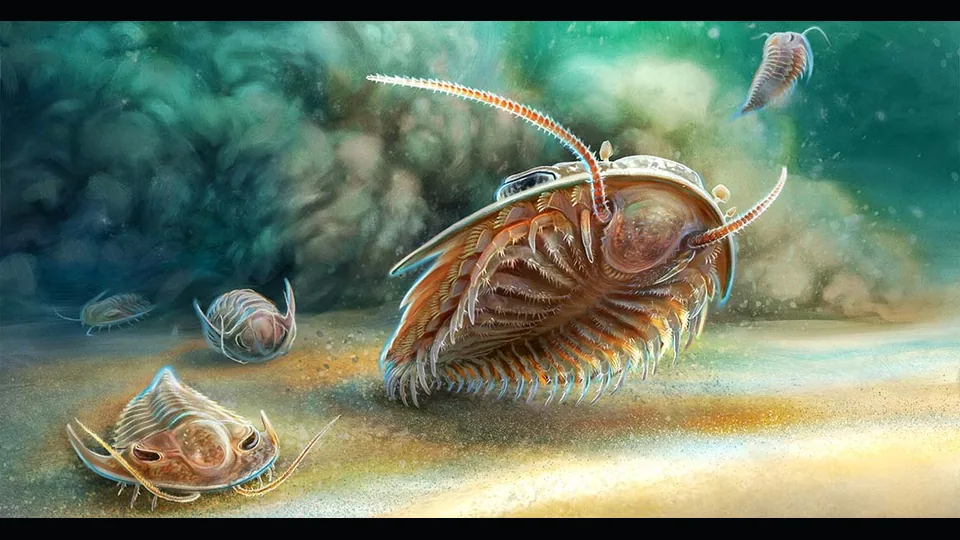
                

                    Cambrian Trilobite Matrix
                    Fossil Bed · Utah Shale
                

            

            <!-- Fossil 3 -->
            

                
                

                    Jurassic Conifer Floodplain
                    Paleoenvironment Reconstruction
                

            

            <!-- Fossil 4 -->
            

                
                

                    Triceratops Horridus Portrait
                    Expedition Field Artwork
                

            

            <!-- Fossil 5 -->
            

                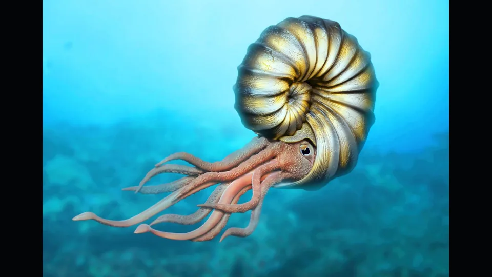
                

                    Pyritized Ammonite Concretion
                    Marine Jurassic Locality
                

            

            <!-- Fossil 6 -->
            

                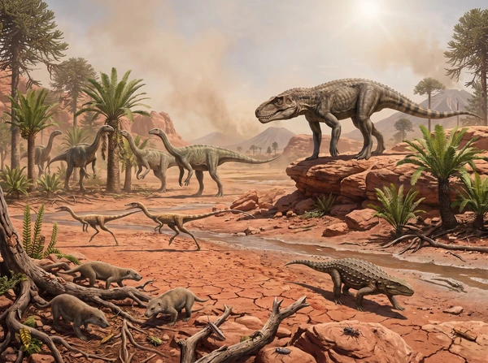
                

                    Triassic Pangean Rift Valley
                    Deep Time Geomorphology
                

            

        

    </section>

<!-- BREACH -->

  
CONTAINMENT BREACH / 警告：收容突破

  
ASSET ESCAPED PADDOCK / 资产已逃离园区

  
PADDOCK / 对应园区: -

</main><!-- /page-wrap -->

    <!-- RED CODE ALERT MODAL -->
    

        

            <button type="button" class="pl-modal-close js-close-alert" aria-label="Close Alert Dialog">✕</button>
            

                <h2 class="pl-alert-modal-title" id="alertModalTitle">
                    ▲ RED CODE ALERT
                </h2>
                
Ancient species are disappearing. Awareness is the first step to preservation.

            

            

                <button type="button" class="pl-alert-tab active" data-status="all">ALL STATUSES</button>
                <button type="button" class="pl-alert-tab" data-status="cr">CRITICALLY ENDANGERED (CR)</button>
                <button type="button" class="pl-alert-tab" data-status="en">ENDANGERED (EN)</button>
                <button type="button" class="pl-alert-tab" data-status="vu">VULNERABLE (VU)</button>
            

            

                <!-- Card 1 -->
                

                    
                    

                        <h4 class="pl-threat-name">TRICERATOPS</h4>
                        CR
                    

                    
Late Cretaceous · ~68–66 Mya

                    
Extreme environmental collapse following the Chicxulub bolide impact. Global wildfire and thermal radiation.

                

                <!-- Card 2 -->
                

                    
                    

                        <h4 class="pl-threat-name">WOOLLY MAMMOTH</h4>
                        EN
                    

                    
Pleistocene · ~400–4 kya

                    
Post-glacial warming causing loss of mammoth steppe habitat, compounded by human hunting pressure.

                

                <!-- Card 3 -->
                

                    
                    

                        <h4 class="pl-threat-name">SABER-TOOTHED TIGER</h4>
                        VU
                    

                    
Pleistocene · ~2.5 Mya–10 kya

                    
Extinction of large herbivore prey base and competitive exclusion during quaternary climate shifts.

                

                <!-- Card 4 -->
                

                    
                    

                        <h4 class="pl-threat-name">DODO</h4>
                        CR
                    

                    
Holocene · ~1681 AD Extinct

                    
Direct human predation and introduction of invasive nest predators on Mauritius.

                

            

            <!-- WHAT CAN YOU DO? -->
            

                

                    <h3 class="pl-what-title">WHAT CAN YOU DO?</h3>
                    
Preserving biodiversity begins with understanding history.

                

                

                    

                        
1. LEARN

                        
Educate yourself and your community on ancient mass extinction triggers.

                    

                    

                        
2. SHARE

                        
Promote scientific research and paleobiological conservation studies.

                    

                    

                        
3. SUPPORT

                        
Support habitat preservation and active ecological restoration worldwide.

                    

                

            

        

    

    <!-- GLOBAL FOOTER -->
    <footer class="pl-footer">
      

        

          

            

              <svg class="pl-footer-logo-icon" viewBox="0 0 32 32" fill="none" xmlns="http://www.w3.org/2000/svg">
                <path d="M16 3C8.82 3 3 8.82 3 16s5.82 13 13 13 13-5.82 13-13S23.18 3 16 3zm0 24c-6.08 0-11-4.92-11-11s4.92-11 11-11 11 4.92 11 11-4.92 11-11 11z" fill="#c29b62"/>
                <circle cx="16" cy="16" r="3.5" fill="#e5b869"/>
              </svg>
              PALEOLOGIST
            

            

              An interactive deep-time digital museum and field expedition catalog dedicated to Earth's evolutionary heritage, prehistoric taxonomy, and biosphere conservation.
            

            

              
              SYSTEM OPERATIONAL · DATABASE V4.8.2
            

          

          

            
NAVIGATION / 快速导航

            

              <a href="index.html" class="pl-footer-link">Home / 博物馆主页</a>
              <a href="gallery.html" class="pl-footer-link">Field Guide / 物种图鉴</a>
              <a href="timescale.html" class="pl-footer-link">Geologic Timeline / 地质年代表</a>
              <a href="form.html" class="pl-footer-link">Hybrid Lab / 基因合成实验室</a>
              <a href="gallery.html#gallery-showcase" class="pl-footer-link">Exhibition Archive / 馆藏化石</a>
            

          

          

            

              <svg class="pl-fossil-svg" viewBox="0 0 160 120" fill="none" xmlns="http://www.w3.org/2000/svg">
                <path d="M20 60 Q 50 30, 80 45 T 140 35" stroke="#c29b62" stroke-width="2" stroke-linecap="round" fill="none"/>
                <path d="M35 55 Q 38 75, 42 90" stroke="#c29b62" stroke-width="1.5" stroke-linecap="round"/>
                <path d="M50 48 Q 55 78, 60 98" stroke="#c29b62" stroke-width="1.5" stroke-linecap="round"/>
                <path d="M68 44 Q 74 76, 80 102" stroke="#c29b62" stroke-width="1.5" stroke-linecap="round"/>
                <path d="M85 45 Q 92 74, 98 96" stroke="#c29b62" stroke-width="1.5" stroke-linecap="round"/>
                <path d="M102 44 Q 108 68, 114 85" stroke="#c29b62" stroke-width="1.5" stroke-linecap="round"/>
                <path d="M120 40 Q 124 58, 128 72" stroke="#c29b62" stroke-width="1.5" stroke-linecap="round"/>
                <path d="M135 36 Q 148 24, 155 35 Q 150 48, 138 42 Z" stroke="#c29b62" stroke-width="1.5" fill="rgba(194, 155, 98, 0.15)"/>
                <circle cx="148" cy="32" r="2.5" fill="#e5b869"/>
              </svg>
              
SPECIMEN #FSL-908 · VERTEBRATE OSTEOLOGY

            

          

        

        

          

            © 2026 PALEOLOGIST ARCHIVE · FUNDAMENTALS OF WEB PROGRAMMING
          

          

            LAT 37°14'06"N · LON 115°48'40"W · ELEV 1,360M
          

        

      

    </footer>

</body>
</html>

`

## File: timescale.html

`html
<!DOCTYPE html>
<html lang="en" data-page="timescale">
<head>
    <meta charset="UTF-8">
    <meta name="viewport" content="width=device-width, initial-scale=1.0">
    <meta name="description" content="Navigate the PALEOLOGIST deep-time timeline from the earliest life through the Cenozoic.">
    <meta property="og:title" content="PALEOLOGIST | Geologic Timeline">
    <meta property="og:description" content="A bilingual geological timeline connecting major periods, evolutionary transitions, and representative prehistoric life.">
    <meta property="og:type" content="website">
    <meta property="og:image" content="assets/images/originals/trilobite.jpg">
    <title>PALEOLOGIST | Geologic Timeline / 地质年代表</title>
    <link rel="preconnect" href="https://fonts.googleapis.com">
    <link rel="preconnect" href="https://fonts.gstatic.com" crossorigin>
    <link rel="preload" as="image" href="assets/images/timeline/hanwuji.jpg">
    <link href="https://fonts.googleapis.com/css2?family=Cinzel:wght@400;600;700;900&family=Outfit:wght@300;400;500;600;700&family=Share+Tech+Mono&family=Orbitron:wght@400;700;900&display=swap" rel="stylesheet">
    <link rel="stylesheet" href="assets/css/site.css">
    
    
</head>
<body class="pl-shell">

<!-- GLOBAL NAVIGATION HEADER -->
<header class="pl-header">
  

    <a href="index.html" class="pl-logo">
      <svg class="pl-logo-icon" width="28" height="28" viewBox="0 0 32 32" fill="none" xmlns="http://www.w3.org/2000/svg">
        <path d="M16 3C8.82 3 3 8.82 3 16s5.82 13 13 13 13-5.82 13-13S23.18 3 16 3zm0 24c-6.08 0-11-4.92-11-11s4.92-11 11-11 11 4.92 11 11-4.92 11-11 11z" fill="#c29b62"/>
        <path d="M16 7c-4.97 0-9 4.03-9 9s4.03 9 9 9c3.86 0 7.12-2.44 8.36-5.89-.35.08-.71.13-1.09.13-2.9 0-5.27-2.36-5.27-5.24 0-1.74.85-3.28 2.16-4.23C19.78 8.1 17.98 7 16 7z" fill="#c29b62" opacity="0.6"/>
        <circle cx="16" cy="16" r="3.5" fill="#e5b869"/>
      </svg>
      PALEOLOGIST
    </a>

    <nav class="pl-nav" id="plNav">
      <a href="index.html" class="pl-nav-link">HOME / 首页</a>
      <a href="gallery.html" class="pl-nav-link">FIELD GUIDE / 物种图鉴</a>
      <a href="timescale.html" class="pl-nav-link active">TIMELINE / 地质年代</a>
      <a href="gallery.html#gallery-showcase" class="pl-nav-link">EXHIBITION / 馆藏化石</a>
      <a href="form.html" class="pl-nav-link">HYBRID LAB / 基因合成</a>
    </nav>

    

      <button class="pl-alert-badge-btn js-open-alert" id="openRedAlertBtn" aria-label="Open Red Code Alert Modal">
        
        RED CODE ALERT
      </button>
      <button class="pl-menu-toggle" id="plMenuToggle" aria-label="Toggle navigation">
        <svg width="22" height="22" viewBox="0 0 24 24" fill="none" stroke="currentColor" stroke-width="2">
          <path d="M3 12h18M3 6h18M3 18h18"/>
        </svg>
      </button>
    

  

</header>

<!-- MAIN CONTAINER -->
<main class="pl-container" style="padding-top: 100px; padding-bottom: 80px;">
  <!-- PAGE HEADER -->
  

    

      

        CHRONO-STRATIGRAPHY / 深时地质学
        <h1 class="pl-section-title" style="margin-top: 8px; margin-bottom: 10px;">GEOLOGIC TIMELINE / 地质年代表</h1>
        

          Deep-time evolutionary transitions across Earth's eras. Navigate tectonic movements, atmospheric shifts, and major life radiations from the Cambrian explosion to the Quaternary megafauna.
        

      

      

        OPERATOR: GUEST | CLR: LEVEL 4
      

    

    <!-- SCOPE STRIP -->
    

      EONS / 宙
      ERAS / 代
      PERIODS / 纪
      EPOCHS / 世
    

  

  <!-- CONTAINER -->
  

    <!-- LEFT: CHRONOLOGICAL SELECTOR -->
    

      <!-- Populated via Javascript -->
    

    <!-- RIGHT: DETAIL DISPLAY PANE -->
    

      

        

          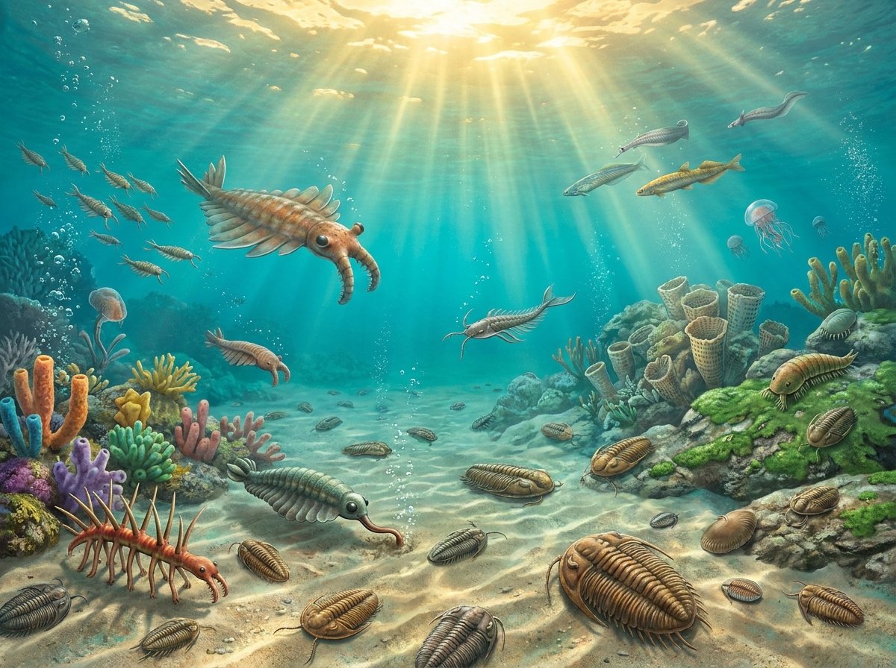
          
IMAGE PENDING / 图片待补

          

            
PALEOZOIC ERA

            
CAMBRIAN PERIOD / 寒武纪

            
541.0 - 485.4 million years ago / 5.41亿 - 4.85亿年前

          

        

        

          

            
Tectonic Activity & Geography / 地壳板块运动与地理

            
-

            
Mass Extinction Event / 生物大灭绝事件

            
-

            
Evolutionary Milestones / 进化里程碑与主要生命事件

            
-

            
Dominant Archetypes / 主要优势与代表性古生物

            
-

          

          

            

              

                
Atmospheric Oxygen / 大气含氧量

                
-

              

              

                
Atmospheric CO2 / 大气CO₂浓度

                
-

              

              

                
Surface Temperature / 地表平均温度

                
-

              

              

                
Sea Level / 平均海平面高度

                
-

              

            

            

              
Major Events / 主要事件

              

            

          

        

        <button class="action-btn" id="queryBtn" onclick="queryArchive()" style="margin-top: 24px; width: 100%; font-family: var(--font-display); font-size: 0.92rem; font-weight: 700; letter-spacing: 2px;">QUERY ARCHIVES / 查询数据库档案</button>
      

    

  

</main>

<!-- RED CODE ALERT MODAL -->

  

    

      

        URGENT CALL TO ACTION
        <h2 class="pl-modal-title" id="modalAlertTitle">RED CODE ALERT / 红色警戒</h2>
      

      <button class="pl-modal-close js-close-alert" id="closeRedAlertModal" aria-label="Close modal">×</button>
    

    

      

        "Extinction is forever. What was once lost in deep time can teach us how to prevent the collapse of our modern biosphere."
      

      

        <button class="pl-alert-tab active" data-status="all">ALL ENDANGERED</button>
        <button class="pl-alert-tab" data-status="cr">CRITICALLY ENDANGERED</button>
        <button class="pl-alert-tab" data-status="en">ENDANGERED</button>
        <button class="pl-alert-tab" data-status="vu">VULNERABLE</button>
      

      

        

          

            Triceratops Prorsus / 普氏三角龙
          

          
Late Cretaceous herbivore vulnerable to abrupt thermal swings and floral collapse during the K-Pg boundary event.

        

        

          

            Mammuthus Primigenius / 真猛犸象
          

          
Pleistocene megafauna devastated by rapid Holocene warming, loss of mammoth steppe biome, and early human hunting pressures.

        

        

          

            Smilodon Fatalis / 毁灭剑齿虎
          

          
Specialized apex predator that faced steep decline as large herbivorous prey collapsed at the end of the Last Glacial Maximum.

        

        

          

            Raphus Cucullatus / 渡渡鸟
          

          
Flightless island endemic destroyed within decades of human arrival due to hunting and invasive nest predation.

        

      

      

        <h3 class="pl-what-title">WHAT CAN YOU DO? / 我们能做什么？</h3>
        

          Paleontological evidence reveals that Earth's five historical mass extinctions were driven by abrupt carbon emissions, ocean acidification, and habitat loss. Modern anthropogenic climate change is reproducing these same geobiological stresses at ten times the speed.
        

        

          

            
01

            

              
Support Habitat Sanctuaries

              
Preserve continuous ecological corridors to prevent genetic bottlenecks.

            

          

          

            
02

            

              
Decarbonize Energy

              
Halt runaway ocean acidification mirroring the end-Permian crisis.

            

          

          

            
03

            

              
Advance Bio-Archiving

              
Support cryogenic genetic banking and museum research collections.

            

          

        

      

    

  

<!-- FOOTER -->
<footer class="pl-footer">
  

    

      

        

          <svg class="pl-footer-logo-icon" viewBox="0 0 32 32" fill="none" xmlns="http://www.w3.org/2000/svg">
            <path d="M16 3C8.82 3 3 8.82 3 16s5.82 13 13 13 13-5.82 13-13S23.18 3 16 3zm0 24c-6.08 0-11-4.92-11-11s4.92-11 11-11 11 4.92 11 11-4.92 11-11 11z" fill="#c29b62"/>
            <circle cx="16" cy="16" r="3.5" fill="#e5b869"/>
          </svg>
          PALEOLOGIST
        

        

          An interactive deep-time digital museum and field expedition catalog dedicated to Earth's evolutionary heritage, prehistoric taxonomy, and biosphere conservation.
        

        

          
          SYSTEM OPERATIONAL · DATABASE V4.8.2
        

      

      

        
NAVIGATION / 快速导航

        

          <a href="index.html" class="pl-footer-link">Home / 博物馆主页</a>
          <a href="gallery.html" class="pl-footer-link">Field Guide / 物种图鉴</a>
          <a href="timescale.html" class="pl-footer-link">Geologic Timeline / 地质年代表</a>
          <a href="form.html" class="pl-footer-link">Hybrid Lab / 基因合成实验室</a>
          <a href="gallery.html#gallery-showcase" class="pl-footer-link">Exhibition Archive / 馆藏化石</a>
        

      

      

        

          <svg class="pl-fossil-svg" viewBox="0 0 160 120" fill="none" xmlns="http://www.w3.org/2000/svg">
            <path d="M20 60 Q 50 30, 80 45 T 140 35" stroke="#c29b62" stroke-width="2" stroke-linecap="round" fill="none"/>
            <path d="M35 55 Q 38 75, 42 90" stroke="#c29b62" stroke-width="1.5" stroke-linecap="round"/>
            <path d="M50 48 Q 55 78, 60 98" stroke="#c29b62" stroke-width="1.5" stroke-linecap="round"/>
            <path d="M68 44 Q 74 76, 80 102" stroke="#c29b62" stroke-width="1.5" stroke-linecap="round"/>
            <path d="M85 45 Q 92 74, 98 96" stroke="#c29b62" stroke-width="1.5" stroke-linecap="round"/>
            <path d="M102 44 Q 108 68, 114 85" stroke="#c29b62" stroke-width="1.5" stroke-linecap="round"/>
            <path d="M120 40 Q 124 58, 128 72" stroke="#c29b62" stroke-width="1.5" stroke-linecap="round"/>
            <path d="M135 36 Q 148 24, 155 35 Q 150 48, 138 42 Z" stroke="#c29b62" stroke-width="1.5" fill="rgba(194, 155, 98, 0.15)"/>
            <circle cx="148" cy="32" r="2.5" fill="#e5b869"/>
          </svg>
          
SPECIMEN #FSL-908 · VERTEBRATE OSTEOLOGY

        

      

    

    

      

        © 2026 PALEOLOGIST ARCHIVE · FUNDAMENTALS OF WEB PROGRAMMING
      

      

        LAT 37°14'06"N · LON 115°48'40"W · ELEV 1,360M
      

    

  

</footer>

</body>
</html>

`

## File: form.html

`html
<!DOCTYPE html>
<html lang="en" data-page="form">
<head>
    <meta charset="UTF-8">
    <meta name="viewport" content="width=device-width, initial-scale=1.0">
    <meta name="description" content="Document a PALEOLOGIST hybrid research file with genome notes, containment metrics, imagery, and local archive preview.">
    <meta property="og:title" content="PALEOLOGIST | Hybrid Lab">
    <meta property="og:description" content="Build a bilingual hybrid research file and preview it in the PALEOLOGIST archive system.">
    <meta property="og:type" content="website">
    <meta property="og:image" content="assets/images/originals/trex.jpg">
    <title>PALEOLOGIST | Hybrid Lab / 基因合成实验室</title>
    <link rel="preconnect" href="https://fonts.googleapis.com">
    <link rel="preconnect" href="https://fonts.gstatic.com" crossorigin>
    <link href="https://fonts.googleapis.com/css2?family=Cinzel:wght@400;600;700;900&family=Outfit:wght@300;400;500;600;700&family=Share+Tech+Mono&family=Orbitron:wght@400;700;900&display=swap" rel="stylesheet">
    <link rel="stylesheet" href="assets/css/site.css">
    
    
</head>
<body class="pl-shell">

<!-- GLOBAL NAVIGATION HEADER -->
<header class="pl-header">
  

    <a href="index.html" class="pl-logo">
      <svg class="pl-logo-icon" width="28" height="28" viewBox="0 0 32 32" fill="none" xmlns="http://www.w3.org/2000/svg">
        <path d="M16 3C8.82 3 3 8.82 3 16s5.82 13 13 13 13-5.82 13-13S23.18 3 16 3zm0 24c-6.08 0-11-4.92-11-11s4.92-11 11-11 11 4.92 11 11-4.92 11-11 11z" fill="#c29b62"/>
        <path d="M16 7c-4.97 0-9 4.03-9 9s4.03 9 9 9c3.86 0 7.12-2.44 8.36-5.89-.35.08-.71.13-1.09.13-2.9 0-5.27-2.36-5.27-5.24 0-1.74.85-3.28 2.16-4.23C19.78 8.1 17.98 7 16 7z" fill="#c29b62" opacity="0.6"/>
        <circle cx="16" cy="16" r="3.5" fill="#e5b869"/>
      </svg>
      PALEOLOGIST
    </a>

    <nav class="pl-nav" id="plNav">
      <a href="index.html" class="pl-nav-link">HOME / 首页</a>
      <a href="gallery.html" class="pl-nav-link">FIELD GUIDE / 物种图鉴</a>
      <a href="timescale.html" class="pl-nav-link">TIMELINE / 地质年代</a>
      <a href="gallery.html#gallery-showcase" class="pl-nav-link">EXHIBITION / 馆藏化石</a>
      <a href="form.html" class="pl-nav-link active">HYBRID LAB / 基因合成</a>
    </nav>

    

      <button class="pl-alert-badge-btn js-open-alert" id="openRedAlertBtn" aria-label="Open Red Code Alert Modal">
        
        RED CODE ALERT
      </button>
      <button class="pl-menu-toggle" id="plMenuToggle" aria-label="Toggle navigation">
        <svg width="22" height="22" viewBox="0 0 24 24" fill="none" stroke="currentColor" stroke-width="2">
          <path d="M3 12h18M3 6h18M3 18h18"/>
        </svg>
      </button>
    

  

</header>

<!-- MAIN WORKSPACE -->
<main class="pl-container" style="padding-top: 100px; padding-bottom: 80px;">
  <!-- PAGE HEADER -->
  

    

      

        GENOME SYNTHESIS / 基因工程与繁育
        <h1 class="pl-section-title" style="margin-top: 8px; margin-bottom: 10px;">HYBRID LAB / 基因合成实验室</h1>
        

          Dual-parent genome recombination and phenotypic simulation. Balance parent traits, predict containment hazard ratings, preview real-time spliced morphology, and register custom specimens into the field archive.
        

      

      

        OPERATOR: GUEST | CLR: LEVEL 4
      

    

  

  <!-- WORKBENCH: DUAL PARENTS & DNA HELIX -->
  

    <!-- PARENT 1 CARD -->
    

      

        <h3 class="pl-parent-title">PARENT 1 (GENOME ALPHA)</h3>
        BASE SPECIMEN
      

      

        <label class="form-label" for="parentASelect" style="display:none;">Parent A Genome</label>
        <select id="parentASelect" class="form-select"></select>
      

      
      
      

        

          SIZE / 体长
          

        

        

          WEIGHT / 体重
          

        

        

          POWER / 攻击
          

        

        

          HEALTH / 生命
          

        

      

    

    <!-- HELIX CORE & BLEND SLIDER -->
    

      <svg class="pl-helix-icon" viewBox="0 0 64 120" fill="none" xmlns="http://www.w3.org/2000/svg">
        <path d="M12 10 C 25 30, 45 40, 52 60 C 45 80, 25 90, 12 110" stroke="#c29b62" stroke-width="3" stroke-linecap="round"/>
        <path d="M52 10 C 39 30, 19 40, 12 60 C 19 80, 39 90, 52 110" stroke="#e5b869" stroke-width="3" stroke-linecap="round"/>
        <line x1="16" y1="20" x2="48" y2="20" stroke="#c29b62" stroke-width="2" stroke-dasharray="3 3"/>
        <line x1="22" y1="40" x2="42" y2="40" stroke="#e5b869" stroke-width="2" stroke-dasharray="3 3"/>
        <line x1="32" y1="60" x2="32" y2="60" stroke="#fff" stroke-width="4" stroke-linecap="round"/>
        <line x1="22" y1="80" x2="42" y2="80" stroke="#c29b62" stroke-width="2" stroke-dasharray="3 3"/>
        <line x1="16" y1="100" x2="48" y2="100" stroke="#e5b869" stroke-width="2" stroke-dasharray="3 3"/>
      </svg>
      
      

        <label class="form-label" for="blendRatio" style="font-family: var(--font-mono); font-size: 0.72rem; letter-spacing: 1px; color: var(--pl-text-muted);">DOMINANCE / 显性比</label>
        <input type="range" id="blendRatio" class="form-input blend-range pl-blend-slider" min="0" max="100" value="50">
        
50% Parent B / 亲本 B 显性

        

          <button type="button" class="pl-ratio-btn" data-ratio="25">25% B</button>
          <button type="button" class="pl-ratio-btn active" data-ratio="50">50/50</button>
          <button type="button" class="pl-ratio-btn" data-ratio="75">75% B</button>
        

      

    

    <!-- PARENT 2 CARD -->
    

      

        <h3 class="pl-parent-title">PARENT 2 (GENOME BETA)</h3>
        SPLICING DONOR
      

      

        <label class="form-label" for="parentBSelect" style="display:none;">Parent B Genome</label>
        <select id="parentBSelect" class="form-select"></select>
      

      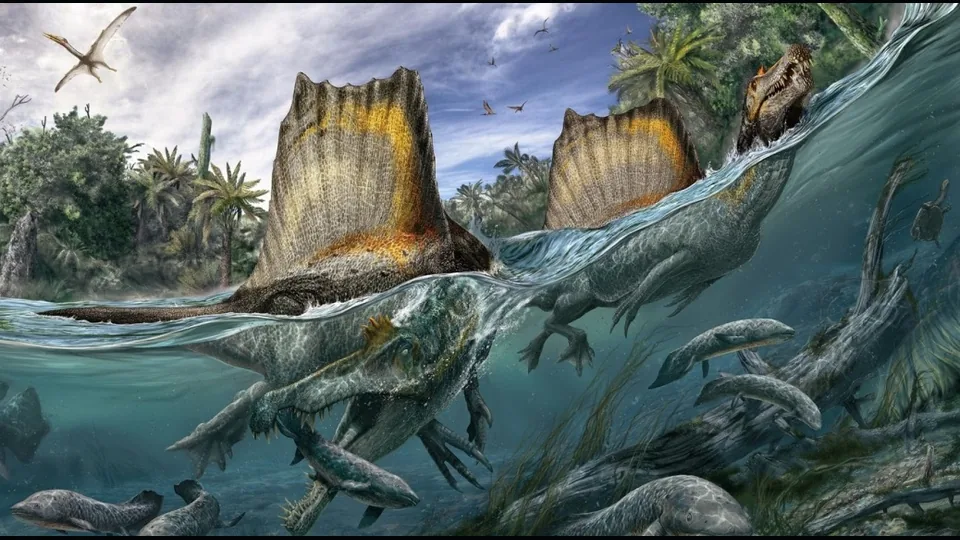
      
      

        

          SIZE / 体长
          

        

        

          WEIGHT / 体重
          

        

        

          POWER / 攻击
          

        

        

          HEALTH / 生命
          

        

      

    

  

  <!-- HYBRID PREVIEW SHOWCASE -->
  

    

      

        

          <!-- Preview image or fallback -->
          
          <canvas id="hybridCanvas" class="hybrid-canvas" width="640" height="480" hidden></canvas>
          

            <svg viewBox="0 0 100 100" style="width:50px; height:50px; fill:none; stroke:var(--pl-gold); stroke-width:1.5; opacity:0.65; animation: classFlicker 3s infinite;">
              <path d="M30,70 Q50,30 70,70 M30,30 Q50,70 70,30 M50,15 L50,85" stroke-dasharray="2 2" />
            </svg>
            UNKNOWN: NO_VISUAL
          

          HYBRID
          
AT C G   T T A C   C A T C   G A T C

        

        

      

    

    <!-- SPECIMEN SUMMARY & LIVE DETAILS -->
    

      

        LIVE PREVIEW · 表型预测
        <b id="pCardRarity" style="font-family: var(--font-mono); color: var(--pl-gold-light); font-size: 0.8rem;">ARCHIVE P5</b>
      

      

        
HYB-01

        <h2 class="spec-name" id="pCardName" style="font-family: var(--font-display); font-size: 2rem; color: var(--pl-text); letter-spacing: 2px; margin: 0 0 6px;">INDOMINUS REX</h2>
        
帝王暴龙

      

      

        
<b id="pCardEra" style="font-family: var(--font-ui); color: var(--pl-text-muted); font-size: 0.82rem; font-weight: 400;">Fictional Cretaceous Research Model</b>

      

      

        Recombinant DNA algorithm balances morphological dominance, musculoskeletal mass, and metabolic stability across simulated generations.
      

      <!-- Mobile preview fallback summary -->
      

        
        

          <b id="mobilePreviewName">INDOMINUS REX</b>
          12.3m / 8,400kg
        

      

    

  

  <!-- RESEARCH SPECIFICATION FORM -->
  

    
SPECIMEN GENOME SPECIFICATION / 基因规格录入

    <form id="synthesisForm" novalidate>
      

        <!-- 01: Identification -->
        

          <label class="pl-form-label" for="code">Research File Code / 档案编号</label>
          <input type="text" id="code" class="form-input" placeholder="e.g. HYB-01, RS-12..." value="HYB-01">
          
Code is required / 资产编号不能为空

        

        

          <label class="pl-form-label" for="name">Subject Name / 对象名称 (English)</label>
          <input type="text" id="name" class="form-input" placeholder="e.g. INDOMINUS REX" value="INDOMINUS REX">
          
Name is required / 属名不能为空

        

        

          <label class="pl-form-label" for="cnName">Chinese Name / 中文名</label>
          <input type="text" id="cnName" class="form-input" placeholder="e.g. 帝王暴龙" value="帝王暴龙">
          
Chinese name is required / 中文名称不能为空

        

        

          <label class="pl-form-label" for="classSelect">Classification / 分类归属</label>
          <select id="classSelect" class="form-select">
            <option value="hybrid" selected>HYBRIDS / 混种生物</option>
            <option value="carnivore">CARNIVORES / 肉食恐龙</option>
            <option value="herbivore">HERBIVORES / 草食恐龙</option>
            <option value="pterosaur">PTEROSAURS / 翼龙类</option>
            <option value="amphibian">EARLY TETRAPODS / 早期四足类与鳄形类</option>
            <option value="aquatic">AQUATIC LIFE / 水生与海生古生物</option>
            <option value="cenozoic">CENOZOIC FAUNA / 新生代动物</option>
          </select>
        

        <!-- 02: Priorities & Results -->
        

          <label class="pl-form-label" for="raritySelect">Archive Priority / 研究优先级</label>
          <select id="raritySelect" class="form-select">
            <option value="1">P1 / 基础记录</option>
            <option value="2">P2 / 扩展记录</option>
            <option value="3">P3 / 重点记录</option>
            <option value="4">P4 / 核心记录</option>
            <option value="5" selected>P5 / 代表记录</option>
          </select>
        

        

          <label class="pl-form-label" for="synthesisStatus">Synthesis Result / 合成结果</label>
          <select id="synthesisStatus" class="form-select">
            <option value="success" selected>SUCCESS / 成功</option>
            <option value="failure">FAILURE / 失败</option>
          </select>
        

        <!-- 03: Geologic Context -->
        

          <label class="pl-form-label" for="era">Research Context / 研究背景</label>
          <input type="text" id="era" class="form-input" placeholder="e.g. Fictional Cretaceous Research Model" value="Fictional Cretaceous Research Model">
          
Era is required / 生存年代不能为空

        

        

          <label class="pl-form-label" for="archiveStatus">Archive Status / 档案状态</label>
          <input type="text" id="archiveStatus" class="form-input" value="UNKNOWN VISUAL LOCKED" readonly>
        

        <!-- 04: Physical Metrics -->
        

          <label class="pl-form-label" for="length">Estimated Length / 预估体长</label>
          <input type="text" id="length" class="form-input" placeholder="e.g. 12.3m" value="12.3m">
          
Length is required / 体长不能为空

        

        

          <label class="pl-form-label" for="weight">Estimated Weight / 预估体重</label>
          <input type="text" id="weight" class="form-input" placeholder="e.g. 8,400kg" value="8,400kg">
          
Weight is required / 体重不能为空

        

        

          <label class="pl-form-label" for="atk">Behavioral Risk Index / 行为风险指数</label>
          <input type="number" id="atk" class="form-input" placeholder="e.g. 1200" value="2100">
          
Simulation attack index must be positive / 模拟攻击指数必须为正数

        

        

          <label class="pl-form-label" for="hp">Viability Index / 存活稳定指数</label>
          <input type="number" id="hp" class="form-input" placeholder="e.g. 3500" value="5200">
          
Simulation vitality must be positive / 模拟生命指数必须为正数

        

        

          <label class="pl-form-label" for="aggLevel">Research Hazard Level / 风险等级 (1-5)</label>
          <select id="aggLevel" class="form-select">
            <option value="1">★☆☆☆☆ (DOCILE / 温顺)</option>
            <option value="2">★★☆☆☆ (CAUTIOUS / 谨慎)</option>
            <option value="3">★★★☆☆ (UNPREDICTABLE / 难测)</option>
            <option value="4" selected>★★★★☆ (HIGHLY AGGRESSIVE / 高度狂暴)</option>
            <option value="5">★★★★★ (EXTREME HAZARD / 极度致命)</option>
          </select>
        

        

          <label class="pl-form-label" for="imgUrl">Image URL or Local Upload / 参考图或上传</label>
          <input type="text" id="imgUrl" class="form-input" placeholder="e.g. assets/images/originals/indominous_rex.jpg" value="assets/images/originals/indominous_rex.jpg">
          <label class="form-label image-upload-label" for="imgFile" style="font-size: 0.72rem; color: var(--pl-gold); margin-top: 4px; cursor: pointer;">Or Upload Local File / 或上传本地文件</label>
          <input type="file" id="imgFile" class="form-input image-file-input" accept="image/*" style="padding: 6px 12px !important; font-size: 0.78rem !important;">
        

        <!-- 05: Narrative Fields -->
        

          <label class="pl-form-label" for="description">Research Hypothesis / 研究假说</label>
          <textarea id="description" class="form-textarea" rows="3" placeholder="Describe the genome mix, observed behavior, and research purpose...">A classified hybrid research model comparing tyrannosaur mass, raptor reaction speed, and enhanced survival behavior under controlled simulation review.</textarea>
          
Summary is required / 物种概要不能为空

        

        

          <label class="pl-form-label" for="fact">Genome Research Note / 基因研究备注</label>
          <textarea id="fact" class="form-textarea" rows="2" placeholder="Add one genome, ethics, or safety note...">This file is a fictional research model and must stay separate from fossil evidence or verified paleobiology records.</textarea>
          
Paleobiology note is required / 古生物学要点不能为空

        

      

      

        <button type="submit" class="pl-btn-primary" style="padding: 14px 32px; font-family: var(--font-display); font-size: 0.95rem; font-weight: 700; letter-spacing: 2px;">CREATE HYBRID / 保存研究档案</button>
        <button type="button" id="resetLabBtn" class="pl-btn-secondary" style="padding: 14px 28px; font-family: var(--font-display); font-size: 0.95rem; letter-spacing: 2px;">RESET / 重置样本</button>
      

    </form>
  

</main>

<!-- SUCCESS DIALOG OVERLAY -->

  

    

      <svg width="28" height="28" viewBox="0 0 24 24" fill="none" stroke="currentColor" stroke-width="2.5" stroke-linecap="round" stroke-linejoin="round">
        <path d="M20 6L9 17l-5-5"/>
      </svg>
    

    
RESEARCH FILE SAVED / 研究档案已保存

    

      The hybrid research file and its preview image have been committed to the local <b>PALEOLOGIST</b> collection.  
      混种研究档案与预览图片已写入本地 <b>PALEOLOGIST</b> 标本库。您可以在物种图鉴中查看合成档案。
    

    <button class="pl-btn-primary" onclick="window.location.href='gallery.html';" style="padding: 12px 28px; font-family: var(--font-display); letter-spacing: 2px;">VIEW IN FIELD GUIDE / 返回图鉴查看</button>
  

<!-- RED CODE ALERT MODAL -->

  

    

      

        URGENT CALL TO ACTION
        <h2 class="pl-modal-title" id="modalAlertTitle">RED CODE ALERT / 红色警戒</h2>
      

      <button class="pl-modal-close js-close-alert" id="closeRedAlertModal" aria-label="Close modal">×</button>
    

    

      

        "Extinction is forever. What was once lost in deep time can teach us how to prevent the collapse of our modern biosphere."
      

      

        <button class="pl-alert-tab active" data-status="all">ALL ENDANGERED</button>
        <button class="pl-alert-tab" data-status="cr">CRITICALLY ENDANGERED</button>
        <button class="pl-alert-tab" data-status="en">ENDANGERED</button>
        <button class="pl-alert-tab" data-status="vu">VULNERABLE</button>
      

      

        

          

            Triceratops Prorsus / 普氏三角龙
          

          
Late Cretaceous herbivore vulnerable to abrupt thermal swings and floral collapse during the K-Pg boundary event.

        

        

          

            Mammuthus Primigenius / 真猛犸象
          

          
Pleistocene megafauna devastated by rapid Holocene warming, loss of mammoth steppe biome, and early human hunting pressures.

        

        

          

            Smilodon Fatalis / 毁灭剑齿虎
          

          
Specialized apex predator that faced steep decline as large herbivorous prey collapsed at the end of the Last Glacial Maximum.

        

        

          

            Raphus Cucullatus / 渡渡鸟
          

          
Flightless island endemic destroyed within decades of human arrival due to hunting and invasive nest predation.

        

      

      

        <h3 class="pl-what-title">WHAT CAN YOU DO? / 我们能做什么？</h3>
        

          Paleontological evidence reveals that Earth's five historical mass extinctions were driven by abrupt carbon emissions, ocean acidification, and habitat loss. Modern anthropogenic climate change is reproducing these same geobiological stresses at ten times the speed.
        

        

          

            
01

            

              
Support Habitat Sanctuaries

              
Preserve continuous ecological corridors to prevent genetic bottlenecks.

            

          

          

            
02

            

              
Decarbonize Energy

              
Halt runaway ocean acidification mirroring the end-Permian crisis.

            

          

          

            
03

            

              
Advance Bio-Archiving

              
Support cryogenic genetic banking and museum research collections.

            

          

        

      

    

  

<!-- FOOTER -->
<footer class="pl-footer">
  

    

      

        

          <svg class="pl-footer-logo-icon" viewBox="0 0 32 32" fill="none" xmlns="http://www.w3.org/2000/svg">
            <path d="M16 3C8.82 3 3 8.82 3 16s5.82 13 13 13 13-5.82 13-13S23.18 3 16 3zm0 24c-6.08 0-11-4.92-11-11s4.92-11 11-11 11 4.92 11 11-4.92 11-11 11z" fill="#c29b62"/>
            <circle cx="16" cy="16" r="3.5" fill="#e5b869"/>
          </svg>
          PALEOLOGIST
        

        

          An interactive deep-time digital museum and field expedition catalog dedicated to Earth's evolutionary heritage, prehistoric taxonomy, and biosphere conservation.
        

        

          
          SYSTEM OPERATIONAL · DATABASE V4.8.2
        

      

      

        
NAVIGATION / 快速导航

        

          <a href="index.html" class="pl-footer-link">Home / 博物馆主页</a>
          <a href="gallery.html" class="pl-footer-link">Field Guide / 物种图鉴</a>
          <a href="timescale.html" class="pl-footer-link">Geologic Timeline / 地质年代表</a>
          <a href="form.html" class="pl-footer-link">Hybrid Lab / 基因合成实验室</a>
          <a href="gallery.html#gallery-showcase" class="pl-footer-link">Exhibition Archive / 馆藏化石</a>
        

      

      

        

          <svg class="pl-fossil-svg" viewBox="0 0 160 120" fill="none" xmlns="http://www.w3.org/2000/svg">
            <path d="M20 60 Q 50 30, 80 45 T 140 35" stroke="#c29b62" stroke-width="2" stroke-linecap="round" fill="none"/>
            <path d="M35 55 Q 38 75, 42 90" stroke="#c29b62" stroke-width="1.5" stroke-linecap="round"/>
            <path d="M50 48 Q 55 78, 60 98" stroke="#c29b62" stroke-width="1.5" stroke-linecap="round"/>
            <path d="M68 44 Q 74 76, 80 102" stroke="#c29b62" stroke-width="1.5" stroke-linecap="round"/>
            <path d="M85 45 Q 92 74, 98 96" stroke="#c29b62" stroke-width="1.5" stroke-linecap="round"/>
            <path d="M102 44 Q 108 68, 114 85" stroke="#c29b62" stroke-width="1.5" stroke-linecap="round"/>
            <path d="M120 40 Q 124 58, 128 72" stroke="#c29b62" stroke-width="1.5" stroke-linecap="round"/>
            <path d="M135 36 Q 148 24, 155 35 Q 150 48, 138 42 Z" stroke="#c29b62" stroke-width="1.5" fill="rgba(194, 155, 98, 0.15)"/>
            <circle cx="148" cy="32" r="2.5" fill="#e5b869"/>
          </svg>
          
SPECIMEN #FSL-908 · VERTEBRATE OSTEOLOGY

        

      

    

    

      

        © 2026 PALEOLOGIST ARCHIVE · FUNDAMENTALS OF WEB PROGRAMMING
      

      

        LAT 37°14'06"N · LON 115°48'40"W · ELEV 1,360M
      

    

  

</footer>

</body>
</html>

`

## File: assets/js/species-data.js

`javascript
(function(global) {
  const SPECIES = [
    {
      key: 'indominus_rex',
      name: 'Indominus Rex',
      cn: '暴虐霸王龙',
      class: 'hybrid',
      rarity: 5,
      code: 'HYB-001',
      era: 'Holocene (Ingen Labs)',
      len: 15.2,
      lenUnit: 'm',
      wgt: 8500,
      wgtUnit: 'kg',
      atk: 2400,
      hp: 6800,
      agg: 5,
      fact: 'Can camouflage and regulate body temperature.',
      desc: 'The Untamable King.',
      region: 'isla_nublar',
      site: 'ISLA NUBLAR — CLASSIFIED',
      thumb: 'assets/images/thumbs/indominous_rex.webp',
      full: 'assets/images/originals/indominous_rex.jpg',
    },
    {
      key: 'indoraptor',
      name: 'Indoraptor',
      cn: '暴虐迅猛龙',
      class: 'hybrid',
      rarity: 5,
      code: 'HYB-002',
      era: 'Holocene (Ingen Labs)',
      len: 7.3,
      lenUnit: 'm',
      wgt: 1100,
      wgtUnit: 'kg',
      atk: 2800,
      hp: 5400,
      agg: 5,
      fact: 'Prototype bio-weapon with echolocation.',
      desc: 'The perfect weapon.',
      region: 'isla_nublar',
      site: 'ISLA NUBLAR — CLASSIFIED',
      thumb: 'assets/images/thumbs/indoraptor.webp',
      full: 'assets/images/originals/indoraptor.jpg',
    },
    {
      key: 'scorpios_rex',
      name: 'Scorpios Rex',
      cn: '蝎王龙',
      class: 'hybrid',
      rarity: 4,
      code: 'E750',
      era: 'Holocene (Ingen Labs)',
      len: 8,
      lenUnit: 'm',
      wgt: 1500,
      wgtUnit: 'kg',
      atk: 2100,
      hp: 5000,
      agg: 5,
      fact: 'The first hybrid, mentally unstable.',
      desc: 'Venomous quills.',
      region: 'isla_nublar',
      site: 'ISLA NUBLAR — CLASSIFIED',
      thumb: 'assets/images/thumbs/scorpios_rex.webp',
      full: 'assets/images/originals/scorpios_rex.jpg',
    },
    {
      key: 'diabolus_rex',
      name: 'Diabolus Rex',
      cn: '恶魔霸王龙',
      class: 'hybrid',
      rarity: 5,
      code: 'HYB-003',
      era: 'Holocene (Classified)',
      len: 16.5,
      lenUnit: 'm',
      wgt: 9500,
      wgtUnit: 'kg',
      atk: 3000,
      hp: 8000,
      agg: 5,
      fact: 'Pure genetic chaos monster.',
      desc: 'Experimental genetic chaos.',
      region: 'isla_nublar',
      site: 'ISLA NUBLAR — CLASSIFIED',
      thumb: 'assets/images/thumbs/drex.webp',
      full: 'assets/images/originals/drex.jpg',
    },
    {
      key: 'velocipterus',
      name: 'Velocipterus',
      cn: '迅翼龙',
      class: 'hybrid',
      rarity: 4,
      code: 'HYB-004',
      era: 'Holocene (Ingen Labs)',
      len: 3.5,
      lenUnit: 'm',
      wgt: 150,
      wgtUnit: 'kg',
      atk: 1900,
      hp: 3200,
      agg: 4,
      fact: 'Raptor intelligence combined with flight.',
      desc: 'Death from above.',
      region: 'isla_nublar',
      site: 'ISLA NUBLAR — CLASSIFIED',
      thumb: 'assets/images/thumbs/mutadon.webp',
      full: 'assets/images/originals/mutadon.jpg',
    },
    {
      key: 'tyrannosaurus_rex',
      name: 'Tyrannosaurus Rex',
      cn: '霸王龙',
      class: 'carnivore',
      rarity: 5,
      code: 'LEG-01',
      era: 'Late Cretaceous',
      len: 12.3,
      lenUnit: 'm',
      wgt: 8400,
      wgtUnit: 'kg',
      atk: 1800,
      hp: 4500,
      agg: 5,
      fact: 'Strongest bite force of any land animal.',
      desc: 'The Prize Asset.',
      region: 'north_america',
      site: 'Hell Creek Formation, Montana/Wyoming, USA',
      thumb: 'assets/images/thumbs/trex.webp',
      full: 'assets/images/originals/trex.jpg',
    },
    {
      key: 'mapusaurus',
      name: 'Mapusaurus',
      cn: '马普龙',
      class: 'carnivore',
      rarity: 5,
      code: 'LEG-11',
      era: 'Late Cretaceous',
      len: 11.5,
      lenUnit: 'm',
      wgt: 4000,
      wgtUnit: 'kg',
      atk: 1750,
      hp: 4100,
      agg: 5,
      fact: 'A Huincul Formation bonebed preserves several Mapusaurus individuals together.',
      desc: 'Earth Lizard.',
      region: 'south_america',
      site: 'Huincul Formation, Neuquén, Argentina',
      thumb: 'assets/images/thumbs/mapusaurus.webp',
      full: 'assets/images/originals/mapusaurus.jpg',
    },
    {
      key: 'spinosaurus',
      name: 'Spinosaurus',
      cn: '棘龙',
      class: 'carnivore',
      rarity: 4,
      code: 'LEG-02',
      era: 'Early Cretaceous',
      len: 15,
      lenUnit: 'm',
      wgt: 7500,
      wgtUnit: 'kg',
      atk: 1600,
      hp: 4200,
      agg: 5,
      fact: 'Among the longest known theropod dinosaurs; body proportions remain actively studied.',
      desc: 'Spine Lizard.',
      region: 'africa',
      site: 'Kem Kem Formation, Morocco/Egypt',
      thumb: 'assets/images/thumbs/spinosaurus.webp',
      full: 'assets/images/originals/spinosaurus.jpg',
    },
    {
      key: 'giganotosaurus',
      name: 'Giganotosaurus',
      cn: '南方巨兽龙',
      class: 'carnivore',
      rarity: 4,
      code: 'LEG-03',
      era: 'Late Cretaceous',
      len: 13,
      lenUnit: 'm',
      wgt: 8000,
      wgtUnit: 'kg',
      atk: 1700,
      hp: 4000,
      agg: 5,
      fact: 'Known from large-bodied carcharodontosaurid remains discovered in Patagonia.',
      desc: 'Giant Southern Lizard.',
      region: 'south_america',
      site: 'Candeleros Formation, Neuquén, Argentina',
      thumb: 'assets/images/thumbs/giganotosaurus.webp',
      full: 'assets/images/originals/giganotosaurus.jpg',
    },
    {
      key: 'carcharodontosaurus',
      name: 'Carcharodontosaurus',
      cn: '鲨齿龙',
      class: 'carnivore',
      rarity: 4,
      code: 'LEG-04',
      era: 'Mid Cretaceous',
      len: 12,
      lenUnit: 'm',
      wgt: 6000,
      wgtUnit: 'kg',
      atk: 1650,
      hp: 3900,
      agg: 5,
      fact: 'Teeth serrated like a shark.',
      desc: 'Shark-toothed lizard.',
      region: 'africa',
      site: 'Kem Kem Formation, North Africa',
      thumb: 'assets/images/thumbs/Carcharodontosaurus.webp',
      full: 'assets/images/originals/Carcharodontosaurus.jpg',
    },
    {
      key: 'tarbosaurus',
      name: 'Tarbosaurus',
      cn: '特暴龙',
      class: 'carnivore',
      rarity: 4,
      code: 'LEG-05',
      era: 'Late Cretaceous',
      len: 10,
      lenUnit: 'm',
      wgt: 5000,
      wgtUnit: 'kg',
      atk: 1400,
      hp: 3800,
      agg: 5,
      fact: 'Smallest arms of any tyrannosaur.',
      desc: 'Asian cousin of T-Rex.',
      region: 'asia',
      site: 'Nemegt Formation, Gobi Desert, Mongolia',
      thumb: 'assets/images/thumbs/Tarbosaurus.webp',
      full: 'assets/images/originals/Tarbosaurus.jpg',
    },
    {
      key: 'albertosaurus',
      name: 'Albertosaurus',
      cn: '艾伯塔龙',
      class: 'carnivore',
      rarity: 4,
      code: 'SPR-11',
      era: 'Late Cretaceous',
      len: 9,
      lenUnit: 'm',
      wgt: 2500,
      wgtUnit: 'kg',
      atk: 1250,
      hp: 2600,
      agg: 4,
      fact: 'Faster than T-Rex.',
      desc: 'Alberta fast tyrant.',
      region: 'north_america',
      site: 'Horseshoe Canyon, Alberta, Canada',
      thumb: 'assets/images/thumbs/albertosaurus.webp',
      full: 'assets/images/originals/albertosaurus.jpg',
    },
    {
      key: 'suchomimus',
      name: 'Suchomimus',
      cn: '似鳄龙',
      class: 'carnivore',
      rarity: 4,
      code: 'LEG-06',
      era: 'Early Cretaceous',
      len: 11,
      lenUnit: 'm',
      wgt: 3800,
      wgtUnit: 'kg',
      atk: 1200,
      hp: 3200,
      agg: 4,
      fact: 'Speared fish with its long claws.',
      desc: 'Crocodile mimic.',
      region: 'africa',
      site: 'Elrhaz Formation, Niger',
      thumb: 'assets/images/thumbs/Suchomimus.webp',
      full: 'assets/images/originals/Suchomimus.jpg',
    },
    {
      key: 'utahraptor',
      name: 'Utahraptor',
      cn: '犹他盗龙',
      class: 'carnivore',
      rarity: 4,
      code: 'SPR-12',
      era: 'Early Cretaceous',
      len: 7,
      lenUnit: 'm',
      wgt: 500,
      wgtUnit: 'kg',
      atk: 1300,
      hp: 2500,
      agg: 5,
      fact: 'Utahraptor is among the largest known dromaeosaurids and had an enlarged sickle claw on each foot.',
      desc: 'King of raptors.',
      region: 'north_america',
      site: 'Cedar Mountain Formation, Utah, USA',
      thumb: 'assets/images/thumbs/utahraptor.webp',
      full: 'assets/images/originals/utahraptor.jpg',
    },
    {
      key: 'blue',
      name: 'Blue',
      cn: '小蓝',
      class: 'carnivore',
      rarity: 3,
      code: 'VIP-01',
      era: 'Holocene',
      len: 4,
      lenUnit: 'm',
      wgt: 150,
      wgtUnit: 'kg',
      atk: 1500,
      hp: 3000,
      agg: 4,
      fact: 'Contains DNA from Monitor Lizard.',
      desc: 'Beta of Raptor Squad.',
      region: 'isla_nublar',
      site: 'ISLA NUBLAR — Raptor Pen B',
      thumb: 'assets/images/thumbs/blue.webp',
      full: 'assets/images/originals/blue.jpg',
    },
    {
      key: 'velociraptor',
      name: 'Velociraptor',
      cn: '迅猛龙',
      class: 'carnivore',
      rarity: 3,
      code: 'SPR-01',
      era: 'Late Cretaceous',
      len: 2,
      lenUnit: 'm',
      wgt: 15,
      wgtUnit: 'kg',
      atk: 900,
      hp: 1800,
      agg: 5,
      fact: 'Actually feathered in reality.',
      desc: 'Clever Girl.',
      region: 'asia',
      site: 'Djadochta Formation, Mongolia',
      thumb: 'assets/images/thumbs/raptor.webp',
      full: 'assets/images/originals/raptor.jpg',
    },
    {
      key: 'deinonychus',
      name: 'Deinonychus',
      cn: '恐爪龙',
      class: 'carnivore',
      rarity: 3,
      code: 'RAR-07',
      era: 'Early Cretaceous',
      len: 3.4,
      lenUnit: 'm',
      wgt: 73,
      wgtUnit: 'kg',
      atk: 800,
      hp: 1600,
      agg: 4,
      fact: 'Sparked the dino-bird theory.',
      desc: 'Terrible Claw.',
      region: 'north_america',
      site: 'Cloverly Formation, Montana, USA',
      thumb: 'assets/images/thumbs/deinonychus.webp',
      full: 'assets/images/originals/deinonychus.jpg',
    },
    {
      key: 'carnotaurus',
      name: 'Carnotaurus',
      cn: '食肉牛龙',
      class: 'carnivore',
      rarity: 3,
      code: 'SPR-02',
      era: 'Late Cretaceous',
      len: 8,
      lenUnit: 'm',
      wgt: 1350,
      wgtUnit: 'kg',
      atk: 850,
      hp: 1900,
      agg: 4,
      fact: 'Distinct horns and tiny arms.',
      desc: 'Meat-eating bull.',
      region: 'south_america',
      site: 'La Colonia Formation, Patagonia, Argentina',
      thumb: 'assets/images/thumbs/carno.webp',
      full: 'assets/images/originals/carno.jpg',
    },
    {
      key: 'majungasaurus',
      name: 'Majungasaurus',
      cn: '玛君龙',
      class: 'carnivore',
      rarity: 3,
      code: 'SPR-13',
      era: 'Late Cretaceous',
      len: 7,
      lenUnit: 'm',
      wgt: 1100,
      wgtUnit: 'kg',
      atk: 820,
      hp: 1850,
      agg: 4,
      fact: 'Known for cannibalism.',
      desc: 'Cannibal dinosaur.',
      region: 'africa',
      site: 'Maevarano Formation, Madagascar',
      thumb: 'assets/images/thumbs/majungasaurus.webp',
      full: 'assets/images/originals/majungasaurus.jpg',
    },
    {
      key: 'ceratosaurus',
      name: 'Ceratosaurus',
      cn: '角鼻龙',
      class: 'carnivore',
      rarity: 3,
      code: 'RAR-08',
      era: 'Late Jurassic',
      len: 6,
      lenUnit: 'm',
      wgt: 900,
      wgtUnit: 'kg',
      atk: 750,
      hp: 1500,
      agg: 3,
      fact: 'Large horn on its nose.',
      desc: 'Horned lizard.',
      region: 'north_america',
      site: 'Morrison Formation, Colorado, USA',
      thumb: 'assets/images/thumbs/cerato.webp',
      full: 'assets/images/originals/cerato.jpg',
    },
    {
      key: 'cryolophosaurus',
      name: 'Cryolophosaurus',
      cn: '冰脊龙',
      class: 'carnivore',
      rarity: 3,
      code: 'RAR-09',
      era: 'Early Jurassic',
      len: 6.5,
      lenUnit: 'm',
      wgt: 465,
      wgtUnit: 'kg',
      atk: 720,
      hp: 1450,
      agg: 3,
      fact: 'Pompadour-like crest.',
      desc: 'Elvis dinosaur.',
      region: 'antarctica',
      site: 'Hanson Formation, Antarctica',
      thumb: 'assets/images/thumbs/cryo.webp',
      full: 'assets/images/originals/cryo.jpg',
    },
    {
      key: 'inostrancevia',
      name: 'Inostrancevia',
      cn: '狼蜥兽',
      class: 'carnivore',
      rarity: 4,
      code: 'SPR-08',
      era: 'Late Permian',
      len: 3.5,
      lenUnit: 'm',
      wgt: 300,
      wgtUnit: 'kg',
      atk: 1100,
      hp: 2200,
      agg: 5,
      fact: 'Largest gorgonopsid.',
      desc: 'Saber-toothed synapsid.',
      region: 'europe',
      site: 'Late Permian, Russia',
      thumb: 'assets/images/thumbs/gorgo.webp',
      full: 'assets/images/originals/gorgo.jpg',
    },
    {
      key: 'dimetrodon',
      name: 'Dimetrodon',
      cn: '异齿龙',
      class: 'carnivore',
      rarity: 3,
      code: 'RAR-06',
      era: 'Early Permian',
      len: 3,
      lenUnit: 'm',
      wgt: 250,
      wgtUnit: 'kg',
      atk: 700,
      hp: 1800,
      agg: 3,
      fact: 'Closer to mammals than dinos.',
      desc: 'Sail-backed synapsid.',
      region: 'north_america',
      site: 'Red Beds, Texas/Oklahoma, USA',
      thumb: 'assets/images/thumbs/dimetrodon.webp',
      full: 'assets/images/originals/dimetrodon.jpg',
    },
    {
      key: 'yutyrannus',
      name: 'Yutyrannus',
      cn: '羽暴龙',
      class: 'carnivore',
      rarity: 3,
      code: 'SPR-09',
      era: 'Early Cretaceous',
      len: 9,
      lenUnit: 'm',
      wgt: 1400,
      wgtUnit: 'kg',
      atk: 950,
      hp: 2000,
      agg: 4,
      fact: 'Largest feathered dinosaur evidence.',
      desc: 'Feathered Tyrant.',
      region: 'asia',
      site: 'Yixian Formation, Liaoning, China',
      thumb: 'assets/images/thumbs/yutyrannus.webp',
      full: 'assets/images/originals/yutyrannus.jpg',
    },
    {
      key: 'troodon',
      name: 'Troodon',
      cn: '伤齿龙',
      class: 'carnivore',
      rarity: 3,
      code: 'SPR-10',
      era: 'Late Cretaceous',
      len: 2.4,
      lenUnit: 'm',
      wgt: 50,
      wgtUnit: 'kg',
      atk: 880,
      hp: 1700,
      agg: 3,
      fact: 'Troodon is taxonomically disputed; many referred remains are treated as other troodontids.',
      desc: 'Night hunter.',
      region: 'north_america',
      site: 'Two Medicine Formation, Montana, USA',
      thumb: 'assets/images/thumbs/troodon.webp',
      full: 'assets/images/originals/troodon.jpg',
    },
    {
      key: 'baryonyx',
      name: 'Baryonyx',
      cn: '重爪龙',
      class: 'carnivore',
      rarity: 2,
      code: 'RAR-02',
      era: 'Early Cretaceous',
      len: 9.5,
      lenUnit: 'm',
      wgt: 1700,
      wgtUnit: 'kg',
      atk: 650,
      hp: 1400,
      agg: 3,
      fact: 'First confirmed fish-eater.',
      desc: 'Heavy claw.',
      region: 'europe',
      site: 'Wealden Group, Surrey, England',
      thumb: 'assets/images/thumbs/bary.webp',
      full: 'assets/images/originals/bary.jpg',
    },
    {
      key: 'allosaurus',
      name: 'Allosaurus',
      cn: '异特龙',
      class: 'carnivore',
      rarity: 2,
      code: 'RAR-01',
      era: 'Late Jurassic',
      len: 8.5,
      lenUnit: 'm',
      wgt: 2300,
      wgtUnit: 'kg',
      atk: 600,
      hp: 1200,
      agg: 4,
      fact: 'Lion of the Jurassic.',
      desc: 'Common apex predator.',
      region: 'north_america',
      site: 'Morrison Formation, Colorado, USA',
      thumb: 'assets/images/thumbs/allosaurus.webp',
      full: 'assets/images/originals/allosaurus.jpg',
    },
    {
      key: 'herrerasaurus',
      name: 'Herrerasaurus',
      cn: '埃雷拉龙',
      class: 'carnivore',
      rarity: 2,
      code: 'COM-04',
      era: 'Late Triassic',
      len: 6,
      lenUnit: 'm',
      wgt: 350,
      wgtUnit: 'kg',
      atk: 350,
      hp: 900,
      agg: 3,
      fact: 'One of the first dinosaurs.',
      desc: 'Early predator.',
      region: 'south_america',
      site: 'Ischigualasto Formation, Argentina',
      thumb: 'assets/images/thumbs/herrerasaurus.webp',
      full: 'assets/images/originals/herrerasaurus.jpg',
    },
    {
      key: 'coelophysis',
      name: 'Coelophysis',
      cn: '腔骨龙',
      class: 'carnivore',
      rarity: 1,
      code: 'COM-05',
      era: 'Late Triassic',
      len: 3,
      lenUnit: 'm',
      wgt: 20,
      wgtUnit: 'kg',
      atk: 300,
      hp: 750,
      agg: 2,
      fact: 'Lived in massive packs.',
      desc: 'Hollow form.',
      region: 'north_america',
      site: 'Ghost Ranch, New Mexico, USA',
      thumb: 'assets/images/thumbs/coelophysis.webp',
      full: 'assets/images/originals/coelophysis.jpg',
    },
    {
      key: 'compsognathus',
      name: 'Compsognathus',
      cn: '美颌龙',
      class: 'carnivore',
      rarity: 1,
      code: 'COM-01',
      era: 'Late Jurassic',
      len: 1,
      lenUnit: 'm',
      wgt: 3,
      wgtUnit: 'kg',
      atk: 250,
      hp: 600,
      agg: 2,
      fact: 'Size of a chicken.',
      desc: 'Tiny but deadly.',
      region: 'europe',
      site: 'Solnhofen Limestone, Bavaria, Germany',
      thumb: 'assets/images/thumbs/compy.webp',
      full: 'assets/images/originals/compy.jpg',
    },
    {
      key: 'bumpy',
      name: 'Bumpy',
      cn: '笨笨 (小甲龙)',
      class: 'herbivore',
      rarity: 5,
      code: 'VIP-02',
      era: 'Holocene (Ingen)',
      len: 6,
      lenUnit: 'm',
      wgt: 4000,
      wgtUnit: 'kg',
      atk: 1800,
      hp: 6500,
      agg: 2,
      fact: 'Named for asymmetrical head bumps.',
      desc: 'Iconic Ankylosaur.',
      region: 'isla_nublar',
      site: 'ISLA NUBLAR — Camp Cretaceous',
      thumb: 'assets/images/thumbs/bumpy.webp',
      full: 'assets/images/originals/bumpy.jpg',
    },
    {
      key: 'therizinosaurus',
      name: 'Therizinosaurus',
      cn: '镰刀龙',
      class: 'herbivore',
      rarity: 4,
      code: 'LEG-07',
      era: 'Late Cretaceous',
      len: 10,
      lenUnit: 'm',
      wgt: 5000,
      wgtUnit: 'kg',
      atk: 1400,
      hp: 4800,
      agg: 5,
      fact: '1-meter long claws.',
      desc: 'Scythe lizard.',
      region: 'asia',
      site: 'Nemegt Formation, Mongolia',
      thumb: 'assets/images/thumbs/theri.webp',
      full: 'assets/images/originals/theri.jpg',
    },
    {
      key: 'brachiosaurus',
      name: 'Brachiosaurus',
      cn: '腕龙',
      class: 'herbivore',
      rarity: 4,
      code: 'LEG-12',
      era: 'Late Jurassic',
      len: 26,
      lenUnit: 'm',
      wgt: 50000,
      wgtUnit: 'kg',
      atk: 1300,
      hp: 5200,
      agg: 1,
      fact: 'Front legs longer than hind legs.',
      desc: 'Gentle giant.',
      region: 'north_america',
      site: 'Morrison Formation, Colorado, USA',
      thumb: 'assets/images/thumbs/brachio.webp',
      full: 'assets/images/originals/brachio.jpg',
    },
    {
      key: 'ankylosaurus',
      name: 'Ankylosaurus',
      cn: '甲龙',
      class: 'herbivore',
      rarity: 3,
      code: 'SPR-02',
      era: 'Late Cretaceous',
      len: 8,
      lenUnit: 'm',
      wgt: 6000,
      wgtUnit: 'kg',
      atk: 800,
      hp: 2800,
      agg: 4,
      fact: 'Tail club could shatter bone.',
      desc: 'Living tank.',
      region: 'north_america',
      site: 'Hell Creek Formation, Montana, USA',
      thumb: 'assets/images/thumbs/anky.webp',
      full: 'assets/images/originals/anky.jpg',
    },
    {
      key: 'stegosaurus',
      name: 'Stegosaurus',
      cn: '剑龙',
      class: 'herbivore',
      rarity: 3,
      code: 'SPR-03',
      era: 'Late Jurassic',
      len: 9,
      lenUnit: 'm',
      wgt: 5000,
      wgtUnit: 'kg',
      atk: 750,
      hp: 2600,
      agg: 3,
      fact: 'Brain size of a walnut.',
      desc: 'Roof lizard.',
      region: 'north_america',
      site: 'Morrison Formation, Colorado, USA',
      thumb: 'assets/images/thumbs/stegosaurus.webp',
      full: 'assets/images/originals/stegosaurus.jpg',
    },
    {
      key: 'brontosaurus',
      name: 'Brontosaurus',
      cn: '雷龙',
      class: 'herbivore',
      rarity: 3,
      code: 'SPR-14',
      era: 'Late Jurassic',
      len: 22,
      lenUnit: 'm',
      wgt: 15000,
      wgtUnit: 'kg',
      atk: 780,
      hp: 3100,
      agg: 2,
      fact: 'Thunder Lizard name origin.',
      desc: 'Iconic sauropod.',
      region: 'north_america',
      site: 'Morrison Formation, Wyoming, USA',
      thumb: 'assets/images/thumbs/bronto.webp',
      full: 'assets/images/originals/bronto.jpg',
    },
    {
      key: 'supersaurus',
      name: 'Supersaurus',
      cn: '超龙',
      class: 'herbivore',
      rarity: 3,
      code: 'SPR-05',
      era: 'Late Jurassic',
      len: 33,
      lenUnit: 'm',
      wgt: 35000,
      wgtUnit: 'kg',
      atk: 700,
      hp: 2500,
      agg: 2,
      fact: 'One of the longest dinosaurs.',
      desc: 'Giant herbivore.',
      region: 'north_america',
      site: 'Morrison Formation, Utah/Colorado, USA',
      thumb: 'assets/images/thumbs/Supersaurus.webp',
      full: 'assets/images/originals/Supersaurus.jpg',
    },
    {
      key: 'seismosaurus',
      name: 'Seismosaurus',
      cn: '地震龙',
      class: 'herbivore',
      rarity: 3,
      code: 'SPR-15',
      era: 'Late Jurassic',
      len: 30,
      lenUnit: 'm',
      wgt: 40000,
      wgtUnit: 'kg',
      atk: 820,
      hp: 2900,
      agg: 2,
      fact: 'Seismosaurus is generally treated as a large specimen or species of Diplodocus.',
      desc: 'Earth Shaker.',
      region: 'north_america',
      site: 'Morrison Formation, New Mexico, USA',
      thumb: 'assets/images/thumbs/seismosaurus.webp',
      full: 'assets/images/originals/seismosaurus.jpg',
    },
    {
      key: 'argentinosaurus',
      name: 'Argentinosaurus',
      cn: '阿根廷龙',
      class: 'herbivore',
      rarity: 3,
      code: 'RAR-03',
      era: 'Late Cretaceous',
      len: 35,
      lenUnit: 'm',
      wgt: 80000,
      wgtUnit: 'kg',
      atk: 500,
      hp: 3500,
      agg: 2,
      fact: 'Among the heaviest known land animals, based on incomplete fossil material.',
      desc: 'Colossal sauropod.',
      region: 'south_america',
      site: 'Huincul Formation, Neuquén, Argentina',
      thumb: 'assets/images/thumbs/argen_sauro.webp',
      full: 'assets/images/originals/argen_sauro.jpg',
    },
    {
      key: 'mamenchisaurus',
      name: 'Mamenchisaurus',
      cn: '马门溪龙',
      class: 'herbivore',
      rarity: 3,
      code: 'RAR-11',
      era: 'Late Jurassic',
      len: 26,
      lenUnit: 'm',
      wgt: 25000,
      wgtUnit: 'kg',
      atk: 550,
      hp: 3200,
      agg: 2,
      fact: 'Neck half total body length.',
      desc: 'Longest necked dino.',
      region: 'asia',
      site: 'Shaximiao Formation, Sichuan, China',
      thumb: 'assets/images/thumbs/mamenchi.webp',
      full: 'assets/images/originals/mamenchi.jpg',
    },
    {
      key: 'titanosaurus',
      name: 'Titanosaurus',
      cn: '泰坦龙',
      class: 'herbivore',
      rarity: 2,
      code: 'RAR-12',
      era: 'Late Cretaceous',
      len: 12,
      lenUnit: 'm',
      wgt: 13000,
      wgtUnit: 'kg',
      atk: 600,
      hp: 2400,
      agg: 2,
      fact: 'First named Titanosaur.',
      desc: 'Armored sauropod.',
      region: 'asia',
      site: 'Lameta Formation, India',
      thumb: 'assets/images/thumbs/titan.webp',
      full: 'assets/images/originals/titan.jpg',
    },
    {
      key: 'diplodocus',
      name: 'Diplodocus',
      cn: '梁龙',
      class: 'herbivore',
      rarity: 3,
      code: 'RAR-04',
      era: 'Late Jurassic',
      len: 25,
      lenUnit: 'm',
      wgt: 12000,
      wgtUnit: 'kg',
      atk: 600,
      hp: 2200,
      agg: 2,
      fact: 'Whip-like supersonic tail.',
      desc: 'Long tail sauropod.',
      region: 'north_america',
      site: 'Morrison Formation, Wyoming/Colorado, USA',
      thumb: 'assets/images/thumbs/diplo.webp',
      full: 'assets/images/originals/diplo.jpg',
    },
    {
      key: 'pachycephalosaurus',
      name: 'Pachycephalosaurus',
      cn: '肿头龙',
      class: 'herbivore',
      rarity: 3,
      code: 'RAR-13',
      era: 'Late Cretaceous',
      len: 4.5,
      lenUnit: 'm',
      wgt: 450,
      wgtUnit: 'kg',
      atk: 550,
      hp: 1400,
      agg: 3,
      fact: 'Skull dome 10 inches thick.',
      desc: 'Thick-headed lizard.',
      region: 'north_america',
      site: 'Lance/Hell Creek Formation, USA/Canada',
      thumb: 'assets/images/thumbs/pachy.webp',
      full: 'assets/images/originals/pachy.jpg',
    },
    {
      key: 'parasaurolophus',
      name: 'Parasaurolophus',
      cn: '副栉龙',
      class: 'herbivore',
      rarity: 2,
      code: 'RAR-14',
      era: 'Late Cretaceous',
      len: 10,
      lenUnit: 'm',
      wgt: 2500,
      wgtUnit: 'kg',
      atk: 450,
      hp: 1300,
      agg: 2,
      fact: 'Communicated via low frequencies.',
      desc: 'Near crested lizard.',
      region: 'north_america',
      site: 'Campanian, Alberta / New Mexico, USA',
      thumb: 'assets/images/thumbs/para.webp',
      full: 'assets/images/originals/para.jpg',
    },
    {
      key: 'iguanodon',
      name: 'Iguanodon',
      cn: '禽龙',
      class: 'herbivore',
      rarity: 2,
      code: 'RAR-15',
      era: 'Early Cretaceous',
      len: 10,
      lenUnit: 'm',
      wgt: 3000,
      wgtUnit: 'kg',
      atk: 500,
      hp: 1600,
      agg: 3,
      fact: 'One of first three dinos named.',
      desc: 'Thumb spike fighter.',
      region: 'europe',
      site: 'Wealden Group, Belgium / England',
      thumb: 'assets/images/thumbs/iguanodon.webp',
      full: 'assets/images/originals/iguanodon.jpg',
    },
    {
      key: 'triceratops',
      name: 'Triceratops',
      cn: '三角龙',
      class: 'herbivore',
      rarity: 1,
      code: 'COM-01',
      era: 'Late Cretaceous',
      len: 9,
      lenUnit: 'm',
      wgt: 10000,
      wgtUnit: 'kg',
      atk: 400,
      hp: 1500,
      agg: 4,
      fact: 'Fought T-Rex with its horns.',
      desc: 'Three-horned face.',
      region: 'north_america',
      site: 'Lance Formation, Wyoming/Montana, USA',
      thumb: 'assets/images/thumbs/triceratop.webp',
      full: 'assets/images/originals/triceratop.jpg',
    },
    {
      key: 'maiasaura',
      name: 'Maiasaura',
      cn: '慈母龙',
      class: 'herbivore',
      rarity: 1,
      code: 'COM-06',
      era: 'Late Cretaceous',
      len: 9,
      lenUnit: 'm',
      wgt: 4000,
      wgtUnit: 'kg',
      atk: 280,
      hp: 950,
      agg: 2,
      fact: 'First dino shown to care for young.',
      desc: 'Good mother lizard.',
      region: 'north_america',
      site: 'Two Medicine Formation, Montana, USA',
      thumb: 'assets/images/thumbs/maiasaura.webp',
      full: 'assets/images/originals/maiasaura.jpg',
    },
    {
      key: 'camarasaurus',
      name: 'Camarasaurus',
      cn: '圆顶龙',
      class: 'herbivore',
      rarity: 1,
      code: 'COM-07',
      era: 'Jurassic',
      len: 18,
      lenUnit: 'm',
      wgt: 18000,
      wgtUnit: 'kg',
      atk: 350,
      hp: 1200,
      agg: 2,
      fact: 'Common sauropod in North America.',
      desc: 'Chambered lizard.',
      region: 'north_america',
      site: 'Morrison Formation, USA',
      thumb: 'assets/images/thumbs/camarasaurus.webp',
      full: 'assets/images/originals/camarasaurus.jpg',
    },
    {
      key: 'plateosaurus',
      name: 'Plateosaurus',
      cn: '板龙',
      class: 'herbivore',
      rarity: 1,
      code: 'COM-08',
      era: 'Late Triassic',
      len: 8,
      lenUnit: 'm',
      wgt: 4000,
      wgtUnit: 'kg',
      atk: 300,
      hp: 1000,
      agg: 2,
      fact: 'Early sauropod ancestor.',
      desc: 'Triassic giant.',
      region: 'europe',
      site: 'Triassic, Germany / Switzerland',
      thumb: 'assets/images/thumbs/plateosaurus.webp',
      full: 'assets/images/originals/plateosaurus.jpg',
    },
    {
      key: 'psittacosaurus',
      name: 'Psittacosaurus',
      cn: '鹦鹉嘴龙',
      class: 'herbivore',
      rarity: 1,
      code: 'COM-09',
      era: 'Early Cretaceous',
      len: 2,
      lenUnit: 'm',
      wgt: 20,
      wgtUnit: 'kg',
      atk: 150,
      hp: 500,
      agg: 1,
      fact: 'Had quills on its tail.',
      desc: 'Parrot lizard.',
      region: 'asia',
      site: 'Yixian Formation, China / Mongolia',
      thumb: 'assets/images/thumbs/psittacosaurus.webp',
      full: 'assets/images/originals/psittacosaurus.jpg',
    },
    {
      key: 'dodo',
      name: 'Dodo',
      cn: '渡渡鸟',
      class: 'herbivore',
      rarity: 1,
      code: 'ARK-003',
      era: 'Holocene (Extinct)',
      len: 1,
      lenUnit: 'm',
      wgt: 15,
      wgtUnit: 'kg',
      atk: 100,
      hp: 300,
      agg: 1,
      fact: 'Extinct within 100 years of discovery.',
      desc: 'Loyal pet.',
      region: 'africa',
      site: 'Mauritius Island, Indian Ocean (Extinct 1662)',
      thumb: 'assets/images/thumbs/dodo.webp',
      full: 'assets/images/originals/dodo.jpg',
    },
    {
      key: 'quetzalcoatlus',
      name: 'Quetzalcoatlus',
      cn: '风神翼龙',
      class: 'pterosaur',
      rarity: 4,
      code: 'LEG-08',
      era: 'Late Cretaceous',
      len: 11,
      lenUnit: 'm WS',
      wgt: 250,
      wgtUnit: 'kg',
      atk: 1300,
      hp: 2800,
      agg: 4,
      fact: 'Tall as a giraffe on ground.',
      desc: 'Sky God.',
      region: 'north_america',
      site: 'Javelina Formation, Texas, USA',
      thumb: 'assets/images/thumbs/Quetzalcoatlus.webp',
      full: 'assets/images/originals/Quetzalcoatlus.jpg',
    },
    {
      key: 'pteranodon',
      name: 'Pteranodon',
      cn: '无齿翼龙',
      class: 'pterosaur',
      rarity: 3,
      code: 'RAR-10',
      era: 'Late Cretaceous',
      len: 7,
      lenUnit: 'm WS',
      wgt: 35,
      wgtUnit: 'kg',
      atk: 850,
      hp: 1900,
      agg: 3,
      fact: 'Males had larger crests.',
      desc: 'Toothless wing.',
      region: 'north_america',
      site: 'Niobrara Formation, Kansas, USA',
      thumb: 'assets/images/thumbs/pteranodon.webp',
      full: 'assets/images/originals/pteranodon.jpg',
    },
    {
      key: 'tapejara',
      name: 'Tapejara',
      cn: '古神翼龙',
      class: 'pterosaur',
      rarity: 3,
      code: 'RAR-03',
      era: 'Early Cretaceous',
      len: 3.5,
      lenUnit: 'm WS',
      wgt: 30,
      wgtUnit: 'kg',
      atk: 700,
      hp: 1400,
      agg: 2,
      fact: 'Massive sail-like head crest.',
      desc: 'Old Being.',
      region: 'south_america',
      site: 'Santana Formation, Ceará, Brazil',
      thumb: 'assets/images/thumbs/tapejara.webp',
      full: 'assets/images/originals/tapejara.jpg',
    },
    {
      key: 'dimorphodon',
      name: 'Dimorphodon',
      cn: '双型齿翼龙',
      class: 'pterosaur',
      rarity: 2,
      code: 'COM-02',
      era: 'Early Jurassic',
      len: 1.4,
      lenUnit: 'm WS',
      wgt: 2,
      wgtUnit: 'kg',
      atk: 300,
      hp: 800,
      agg: 3,
      fact: 'Had two types of teeth.',
      desc: 'Two-form tooth.',
      region: 'europe',
      site: 'Lower Jurassic, Dorset, England',
      thumb: 'assets/images/thumbs/dimorphodon.webp',
      full: 'assets/images/originals/dimorphodon.jpg',
    },
    {
      key: 'hatzegopteryx',
      name: 'Hatzegopteryx',
      cn: '哈特兹哥翼龙',
      class: 'pterosaur',
      rarity: 4,
      code: 'LEG-09',
      era: 'Late Cretaceous',
      len: 12,
      lenUnit: 'm WS',
      wgt: 220,
      wgtUnit: 'kg',
      atk: 1450,
      hp: 3100,
      agg: 5,
      fact: 'Ate dwarf dinosaurs on Hateg Island.',
      desc: 'Apex island flyer.',
      region: 'europe',
      site: 'Maastrichtian, Transylvania, Romania',
      thumb: 'assets/images/thumbs/hatzeg.webp',
      full: 'assets/images/originals/hatzeg.jpg',
    },
    {
      key: 'sarcosuchus',
      name: 'Sarcosuchus',
      cn: '帝鳄',
      class: 'amphibian',
      rarity: 4,
      code: 'LEG-07',
      era: 'Early Cretaceous',
      len: 12,
      lenUnit: 'm',
      wgt: 8000,
      wgtUnit: 'kg',
      atk: 1500,
      hp: 4000,
      agg: 5,
      fact: 'Snout ended in a bulla.',
      desc: 'Super Croc.',
      region: 'africa',
      site: 'Elrhaz Formation, Niger',
      thumb: 'assets/images/thumbs/sarco.webp',
      full: 'assets/images/originals/sarco.webp',
    },
    {
      key: 'purussaurus',
      name: 'Purussaurus',
      cn: '普鲁斯鳄',
      class: 'amphibian',
      rarity: 4,
      code: 'LEG-08',
      era: 'Miocene',
      len: 11,
      lenUnit: 'm',
      wgt: 8400,
      wgtUnit: 'kg',
      atk: 1750,
      hp: 4200,
      agg: 5,
      fact: 'Bite force exceeded 7 tons.',
      desc: 'King of Caimans.',
      region: 'south_america',
      site: 'Solimões Formation, Amazon Basin',
      thumb: 'assets/images/thumbs/purussaurus.webp',
      full: 'assets/images/originals/purussaurus.jpg',
    },
    {
      key: 'mastodonsaurus',
      name: 'Mastodonsaurus',
      cn: '乳突龙',
      class: 'amphibian',
      rarity: 4,
      code: 'LEG-09',
      era: 'Mid Triassic',
      len: 6,
      lenUnit: 'm',
      wgt: 2000,
      wgtUnit: 'kg',
      atk: 1450,
      hp: 3800,
      agg: 4,
      fact: 'Giant head prehistoric amphibian.',
      desc: 'Tadpole monster.',
      region: 'europe',
      site: 'Triassic, Germany / Russia',
      thumb: 'assets/images/thumbs/mastodonsaurus.webp',
      full: 'assets/images/originals/mastodonsaurus.jpg',
    },
    {
      key: 'deinosuchus',
      name: 'Deinosuchus',
      cn: '恐鳄',
      class: 'amphibian',
      rarity: 4,
      code: 'LEG-10',
      era: 'Late Cretaceous',
      len: 10,
      lenUnit: 'm',
      wgt: 5000,
      wgtUnit: 'kg',
      atk: 1600,
      hp: 4200,
      agg: 5,
      fact: 'Preyed on large dinosaurs.',
      desc: 'Terrible Crocodile.',
      region: 'north_america',
      site: 'Aguja Formation, Texas / Montana, USA',
      thumb: 'assets/images/thumbs/deinosuchus.webp',
      full: 'assets/images/originals/deinosuchus.jpg',
    },
    {
      key: 'prestosuchus',
      name: 'Prestosuchus',
      cn: '迅猛鳄',
      class: 'amphibian',
      rarity: 5,
      code: 'LEG-13',
      era: 'Mid Triassic',
      len: 7,
      lenUnit: 'm',
      wgt: 2500,
      wgtUnit: 'kg',
      atk: 1550,
      hp: 3400,
      agg: 5,
      fact: 'Walked upright on all fours.',
      desc: 'Fast Triassic predator.',
      region: 'south_america',
      site: 'Santa Maria Formation, Rio Grande do Sul, Brazil',
      thumb: 'assets/images/thumbs/prestosuchus.webp',
      full: 'assets/images/originals/prestosuchus.webp',
    },
    {
      key: 'baurusuchus',
      name: 'Baurusuchus',
      cn: '波罗鳄',
      class: 'amphibian',
      rarity: 3,
      code: 'SPR-04',
      era: 'Late Cretaceous',
      len: 4,
      lenUnit: 'm',
      wgt: 400,
      wgtUnit: 'kg',
      atk: 1150,
      hp: 2600,
      agg: 4,
      fact: 'Land-dwelling crocodile.',
      desc: 'Terrestrial hunter.',
      region: 'south_america',
      site: 'Bauru Group, São Paulo, Brazil',
      thumb: 'assets/images/thumbs/baurusuchus.webp',
      full: 'assets/images/originals/baurusuchus.webp',
    },
    {
      key: 'kaprosuchus',
      name: 'Kaprosuchus',
      cn: '猪鳄',
      class: 'amphibian',
      rarity: 3,
      code: 'SPR-06',
      era: 'Late Cretaceous',
      len: 6,
      lenUnit: 'm',
      wgt: 1000,
      wgtUnit: 'kg',
      atk: 1100,
      hp: 2500,
      agg: 4,
      fact: 'Named for boar-like tusks.',
      desc: 'Boar Croc.',
      region: 'africa',
      site: 'Kem Kem Formation, Saharan Africa',
      thumb: 'assets/images/thumbs/kapro.webp',
      full: 'assets/images/originals/kapro.webp',
    },
    {
      key: 'metoposaurus',
      name: 'Metoposaurus',
      cn: '宽额螈',
      class: 'amphibian',
      rarity: 3,
      code: 'SPR-07',
      era: 'Late Triassic',
      len: 3,
      lenUnit: 'm',
      wgt: 450,
      wgtUnit: 'kg',
      atk: 1050,
      hp: 2400,
      agg: 3,
      fact: 'Poor movement on land.',
      desc: 'Ambush predator.',
      region: 'europe',
      site: 'Triassic, Portugal / Poland',
      thumb: 'assets/images/thumbs/metoposaurus.webp',
      full: 'assets/images/originals/metoposaurus.jpg',
    },
    {
      key: 'rutiodon',
      name: 'Rutiodon',
      cn: '狂齿鳄',
      class: 'amphibian',
      rarity: 2,
      code: 'RAR-06',
      era: 'Late Triassic',
      len: 8,
      lenUnit: 'm',
      wgt: 1500,
      wgtUnit: 'kg',
      atk: 750,
      hp: 1800,
      agg: 3,
      fact: 'Nostrils near its eyes.',
      desc: 'Phytosaur.',
      region: 'north_america',
      site: 'Triassic, Eastern North America',
      thumb: 'assets/images/thumbs/rutiodon.webp',
      full: 'assets/images/originals/rutiodon.webp',
    },
    {
      key: 'diplocaulus',
      name: 'Diplocaulus',
      cn: '笠头螈',
      class: 'amphibian',
      rarity: 2,
      code: 'RAR-16',
      era: 'Permian',
      len: 1,
      lenUnit: 'm',
      wgt: 15,
      wgtUnit: 'kg',
      atk: 600,
      hp: 1500,
      agg: 1,
      fact: 'Head shape provided lift.',
      desc: 'Boomerang head.',
      region: 'north_america',
      site: 'Permian, Texas, USA',
      thumb: 'assets/images/thumbs/diplocaulus.webp',
      full: 'assets/images/originals/diplocaulus.webp',
    },
    {
      key: 'crassigyrinus',
      name: 'Crassigyrinus',
      cn: '粗吉螈',
      class: 'amphibian',
      rarity: 2,
      code: 'RAR-17',
      era: 'Carboniferous',
      len: 2,
      lenUnit: 'm',
      wgt: 80,
      wgtUnit: 'kg',
      atk: 680,
      hp: 1600,
      agg: 3,
      fact: 'Massive jaws, tiny limbs.',
      desc: 'Primitive tadpole monster.',
      region: 'europe',
      site: 'Carboniferous, Scotland',
      thumb: 'assets/images/thumbs/crassigyrinus.webp',
      full: 'assets/images/originals/crassigyrinus.jpg',
    },
    {
      key: 'ichthyostega',
      name: 'Ichthyostega',
      cn: '鱼石螈',
      class: 'amphibian',
      rarity: 2,
      code: 'RAR-18',
      era: 'Devonian',
      len: 1.5,
      lenUnit: 'm',
      wgt: 50,
      wgtUnit: 'kg',
      atk: 500,
      hp: 1300,
      agg: 2,
      fact: 'First vertebrate on land.',
      desc: 'First tetrapod.',
      region: 'greenland',
      site: 'Devonian, Greenland',
      thumb: 'assets/images/thumbs/Ichthyostega.webp',
      full: 'assets/images/originals/Ichthyostega.webp',
    },
    {
      key: 'tiktaalik',
      name: 'Tiktaalik',
      cn: '提塔利克鱼',
      class: 'amphibian',
      rarity: 2,
      code: 'RAR-19',
      era: 'Devonian',
      len: 2.5,
      lenUnit: 'm',
      wgt: 40,
      wgtUnit: 'kg',
      atk: 450,
      hp: 1200,
      agg: 2,
      fact: 'Missing link fish-pod.',
      desc: 'Evolutionary step.',
      region: 'north_america',
      site: 'Ellesmere Island, Nunavut, Canada',
      thumb: 'assets/images/thumbs/tiktaalik.webp',
      full: 'assets/images/originals/tiktaalik.jpg',
    },
    {
      key: 'acanthostega',
      name: 'Acanthostega',
      cn: '棘螈',
      class: 'amphibian',
      rarity: 1,
      code: 'COM-10',
      era: 'Devonian',
      len: 0.6,
      lenUnit: 'm',
      wgt: 5,
      wgtUnit: 'kg',
      atk: 300,
      hp: 800,
      agg: 1,
      fact: 'Eight-fingered hand.',
      desc: 'Primitive amphibian.',
      region: 'greenland',
      site: 'Late Devonian, Greenland',
      thumb: 'assets/images/thumbs/acanthostega.webp',
      full: 'assets/images/originals/acanthostega.jpg',
    },
    {
      key: 'panderichthys',
      name: 'Panderichthys',
      cn: '潘氏鱼',
      class: 'amphibian',
      rarity: 1,
      code: 'COM-11',
      era: 'Devonian',
      len: 1,
      lenUnit: 'm',
      wgt: 20,
      wgtUnit: 'kg',
      atk: 280,
      hp: 750,
      agg: 1,
      fact: 'Breathing air in shallow waters.',
      desc: 'Fish to tetrapod.',
      region: 'europe',
      site: 'Devonian, Latvia',
      thumb: 'assets/images/thumbs/panderichthys.webp',
      full: 'assets/images/originals/panderichthys.webp',
    },
    {
      key: 'postosuchus',
      name: 'Postosuchus',
      cn: '波斯特鳄',
      class: 'amphibian',
      rarity: 4,
      code: 'SPR-05',
      era: 'Late Triassic',
      len: 4,
      lenUnit: 'm',
      wgt: 300,
      wgtUnit: 'kg',
      atk: 1000,
      hp: 2400,
      agg: 4,
      fact: 'Dominant Triassic predator.',
      desc: 'Walking Crocodile.',
      region: 'north_america',
      site: 'Dockum Formation, Texas, USA',
      thumb: 'assets/images/thumbs/posto.webp',
      full: 'assets/images/originals/posto.jpg',
    },
    {
      key: 'mosasaurus',
      name: 'Mosasaurus',
      cn: '沧龙',
      class: 'aquatic',
      rarity: 5,
      code: 'AQU-LEG',
      era: 'Late Cretaceous',
      len: 17,
      lenUnit: 'm',
      wgt: 15000,
      wgtUnit: 'kg',
      atk: 2200,
      hp: 5500,
      agg: 5,
      fact: 'Second row of teeth on palate.',
      desc: 'Apex of the deep.',
      region: 'europe',
      site: 'Maastricht Formation, Limburg, Netherlands',
      thumb: 'assets/images/thumbs/mosasaurus.webp',
      full: 'assets/images/originals/mosasaurus.jpg',
    },
    {
      key: 'megalodon',
      name: 'Megalodon',
      cn: '巨齿鲨',
      class: 'aquatic',
      rarity: 5,
      code: 'AQU-LEG7',
      era: 'Miocene',
      len: 18,
      lenUnit: 'm',
      wgt: 60000,
      wgtUnit: 'kg',
      atk: 2150,
      hp: 5300,
      agg: 5,
      fact: 'Bite force stronger than T-Rex.',
      desc: 'Largest shark ever.',
      region: 'global_ocean',
      site: 'Global Ocean — Miocene / Pliocene',
      thumb: 'assets/images/thumbs/megalodon.webp',
      full: 'assets/images/originals/megalodon.jpg',
    },
    {
      key: 'tylosaurus',
      name: 'Tylosaurus',
      cn: '泰洛龙',
      class: 'aquatic',
      rarity: 5,
      code: 'AQU-LEG10',
      era: 'Late Cretaceous',
      len: 14,
      lenUnit: 'm',
      wgt: 9000,
      wgtUnit: 'kg',
      atk: 2100,
      hp: 5200,
      agg: 5,
      fact: 'Used bony snout to ram enemies.',
      desc: 'Ramming predator.',
      region: 'north_america',
      site: 'Western Interior Seaway, Kansas, USA',
      thumb: 'assets/images/thumbs/tylosaurus.webp',
      full: 'assets/images/originals/tylosaurus.jpg',
    },
    {
      key: 'shonisaurus',
      name: 'Shonisaurus',
      cn: '秀尼鱼龙',
      class: 'aquatic',
      rarity: 5,
      code: 'AQU-LEG11',
      era: 'Late Triassic',
      len: 15,
      lenUnit: 'm',
      wgt: 30000,
      wgtUnit: 'kg',
      atk: 2050,
      hp: 5400,
      agg: 3,
      fact: 'Deep, whale-like body.',
      desc: 'Triassic Giant.',
      region: 'north_america',
      site: 'Luning Formation, Nevada, USA',
      thumb: 'assets/images/thumbs/shonisaurus.webp',
      full: 'assets/images/originals/shonisaurus.jpg',
    },
    {
      key: 'pliosaurus',
      name: 'Pliosaurus',
      cn: '上龙',
      class: 'aquatic',
      rarity: 5,
      code: 'AQU-LEG8',
      era: 'Late Jurassic',
      len: 12,
      lenUnit: 'm',
      wgt: 45000,
      wgtUnit: 'kg',
      atk: 2000,
      hp: 5100,
      agg: 5,
      fact: 'Known as Predator X.',
      desc: 'Giant sea predator.',
      region: 'europe',
      site: 'Late Jurassic, Norway / England',
      thumb: 'assets/images/thumbs/pilosaurus.webp',
      full: 'assets/images/originals/pilosaurus.jpg',
    },
    {
      key: 'archelon',
      name: 'Archelon',
      cn: '古巨龟',
      class: 'aquatic',
      rarity: 5,
      code: 'AQU-LEG12',
      era: 'Late Cretaceous',
      len: 4,
      lenUnit: 'm',
      wgt: 2200,
      wgtUnit: 'kg',
      atk: 1800,
      hp: 5800,
      agg: 2,
      fact: 'Had a leathery shell.',
      desc: 'Largest sea turtle.',
      region: 'north_america',
      site: 'Pierre Shale, South Dakota, USA',
      thumb: 'assets/images/thumbs/archelon.webp',
      full: 'assets/images/originals/archelon.jpg',
    },
    {
      key: 'anomalocaris',
      name: 'Anomalocaris',
      cn: '奇虾',
      class: 'aquatic',
      rarity: 5,
      code: 'AQU-LEG9',
      era: 'Cambrian',
      len: 1,
      lenUnit: 'm',
      wgt: 20,
      wgtUnit: 'kg',
      atk: 1900,
      hp: 4800,
      agg: 4,
      fact: 'First super-predator.',
      desc: 'Cambrian anomaly.',
      region: 'north_america',
      site: 'Burgess Shale, British Columbia, Canada',
      thumb: 'assets/images/thumbs/anomalocaris.webp',
      full: 'assets/images/originals/anomalocaris.webp',
    },
    {
      key: 'livyatan',
      name: 'Livyatan',
      cn: '利维坦鲸',
      class: 'aquatic',
      rarity: 5,
      code: 'AQU-LEG4',
      era: 'Miocene',
      len: 17,
      lenUnit: 'm',
      wgt: 50000,
      wgtUnit: 'kg',
      atk: 1800,
      hp: 5000,
      agg: 5,
      fact: 'Named after biblical monster.',
      desc: 'Whale Killer.',
      region: 'south_america',
      site: 'Pisco Formation, Ica, Peru',
      thumb: 'assets/images/thumbs/livyatan.webp',
      full: 'assets/images/originals/livyatan.jpg',
    },
    {
      key: 'shastasaurus',
      name: 'Shastasaurus',
      cn: '萨斯特鱼龙',
      class: 'aquatic',
      rarity: 5,
      code: 'AQU-LEG6',
      era: 'Late Triassic',
      len: 21,
      lenUnit: 'm',
      wgt: 75000,
      wgtUnit: 'kg',
      atk: 2100,
      hp: 5200,
      agg: 3,
      fact: 'Primary suction feeder.',
      desc: 'Largest marine reptile.',
      region: 'global_ocean',
      site: 'Late Triassic Pacific (Canada / China)',
      thumb: 'assets/images/thumbs/shasta.webp',
      full: 'assets/images/originals/shasta.jpg',
    },
    {
      key: 'dunkleosteus',
      name: 'Dunkleosteus',
      cn: '邓氏鱼',
      class: 'aquatic',
      rarity: 4,
      code: 'AQU-LEG2',
      era: 'Late Devonian',
      len: 8.8,
      lenUnit: 'm',
      wgt: 4000,
      wgtUnit: 'kg',
      atk: 1400,
      hp: 4800,
      agg: 5,
      fact: 'Mouth opens in 1/50th second.',
      desc: 'Armored Fish.',
      region: 'north_america',
      site: 'Cleveland Shale, Ohio, USA',
      thumb: 'assets/images/thumbs/dunk.webp',
      full: 'assets/images/originals/dunk.jpg',
    },
    {
      key: 'liopleurodon',
      name: 'Liopleurodon',
      cn: '滑齿龙',
      class: 'aquatic',
      rarity: 4,
      code: 'AQU-LEG3',
      era: 'Middle Jurassic',
      len: 7,
      lenUnit: 'm',
      wgt: 1500,
      wgtUnit: 'kg',
      atk: 1600,
      hp: 3800,
      agg: 4,
      fact: 'Four powerful flippers.',
      desc: 'Magical giant.',
      region: 'europe',
      site: 'Callovian, France / England',
      thumb: 'assets/images/thumbs/liopleurodon.webp',
      full: 'assets/images/originals/liopleurodon.webp',
    },
    {
      key: 'basilosaurus',
      name: 'Basilosaurus',
      cn: '龙王鲸',
      class: 'aquatic',
      rarity: 4,
      code: 'AQU-LEG5',
      era: 'Late Eocene',
      len: 18,
      lenUnit: 'm',
      wgt: 60000,
      wgtUnit: 'kg',
      atk: 1750,
      hp: 4800,
      agg: 4,
      fact: 'Mistaken for a reptile initially.',
      desc: 'King Lizard Whale.',
      region: 'africa',
      site: 'Wadi Al-Hitan, Fayum, Egypt',
      thumb: 'assets/images/thumbs/basilo.webp',
      full: 'assets/images/originals/basilo.jpg',
    },
    {
      key: 'stethacanthus',
      name: 'Stethacanthus',
      cn: '胸脊鲨',
      class: 'aquatic',
      rarity: 4,
      code: 'AQU-SPR6',
      era: 'Late Devonian',
      len: 0.7,
      lenUnit: 'm',
      wgt: 20,
      wgtUnit: 'kg',
      atk: 1050,
      hp: 2300,
      agg: 2,
      fact: 'Anvil-shaped dorsal fin.',
      desc: 'Anvil Shark.',
      region: 'europe',
      site: 'Late Devonian, Scotland / North America',
      thumb: 'assets/images/thumbs/stethacanthus.webp',
      full: 'assets/images/originals/stethacanthus.webp',
    },
    {
      key: 'ophthalmosaurus',
      name: 'Ophthalmosaurus',
      cn: '大眼鱼龙',
      class: 'aquatic',
      rarity: 4,
      code: 'AQU-SPR7',
      era: 'Middle Jurassic',
      len: 6,
      lenUnit: 'm',
      wgt: 3000,
      wgtUnit: 'kg',
      atk: 1100,
      hp: 2200,
      agg: 2,
      fact: 'Largest eyes relative to size.',
      desc: 'Deep sea hunter.',
      region: 'europe',
      site: 'Oxford Clay, England',
      thumb: 'assets/images/thumbs/ophthalmosaurus.webp',
      full: 'assets/images/originals/ophthalmosaurus.jpg',
    },
    {
      key: 'metriorhynchus',
      name: 'Metriorhynchus',
      cn: '地蜥鳄',
      class: 'aquatic',
      rarity: 4,
      code: 'AQU-SPR8',
      era: 'Late Jurassic',
      len: 3,
      lenUnit: 'm',
      wgt: 250,
      wgtUnit: 'kg',
      atk: 1150,
      hp: 2400,
      agg: 3,
      fact: 'Strictly marine crocodile.',
      desc: 'Sea Croc.',
      region: 'europe',
      site: 'Callovian, France / England',
      thumb: 'assets/images/thumbs/metriorhynchus.webp',
      full: 'assets/images/originals/metriorhynchus.jpg',
    },
    {
      key: 'orthoceras',
      name: 'Orthoceras',
      cn: '直角石',
      class: 'aquatic',
      rarity: 4,
      code: 'AQU-SPR4',
      era: 'Ordovician',
      len: 6,
      lenUnit: 'm',
      wgt: 100,
      wgtUnit: 'kg',
      atk: 1100,
      hp: 2400,
      agg: 3,
      fact: 'Ancestor to squids.',
      desc: 'Straight horn.',
      region: 'global_ocean',
      site: 'Global Ordovician oceans',
      thumb: 'assets/images/thumbs/orthoceras.webp',
      full: 'assets/images/originals/orthoceras.jpg',
    },
    {
      key: 'leedsichthys',
      name: 'Leedsichthys',
      cn: '利兹鱼',
      class: 'aquatic',
      rarity: 4,
      code: 'AQU-SPR5',
      era: 'Middle Jurassic',
      len: 16,
      lenUnit: 'm',
      wgt: 45000,
      wgtUnit: 'kg',
      atk: 950,
      hp: 4500,
      agg: 1,
      fact: 'Largest bony fish ever.',
      desc: 'Filter-feeding giant.',
      region: 'europe',
      site: 'Oxford Clay, England',
      thumb: 'assets/images/thumbs/leedsichthys.webp',
      full: 'assets/images/originals/leedsichthys.jpg',
    },
    {
      key: 'xiphactinus',
      name: 'Xiphactinus',
      cn: '剑射鱼',
      class: 'aquatic',
      rarity: 3,
      code: 'AQU-SPR',
      era: 'Late Cretaceous',
      len: 6,
      lenUnit: 'm',
      wgt: 1000,
      wgtUnit: 'kg',
      atk: 1200,
      hp: 2500,
      agg: 4,
      fact: 'Swallowed prey whole.',
      desc: 'Bulldog Fish.',
      region: 'north_america',
      site: 'Niobrara Formation, Kansas, USA',
      thumb: 'assets/images/thumbs/xiphactinus.webp',
      full: 'assets/images/originals/xiphactinus.jpg',
    },
    {
      key: 'helicoprion',
      name: 'Helicoprion',
      cn: '旋齿鲨',
      class: 'aquatic',
      rarity: 3,
      code: 'AQU-SPR2',
      era: 'Permian',
      len: 7.5,
      lenUnit: 'm',
      wgt: 400,
      wgtUnit: 'kg',
      atk: 1100,
      hp: 2400,
      agg: 3,
      fact: 'Unique spiral tooth whorl.',
      desc: 'Buzzsaw Shark.',
      region: 'global_ocean',
      site: 'Global Permian oceans',
      thumb: 'assets/images/thumbs/helicoprion.webp',
      full: 'assets/images/originals/helicoprion.webp',
    },
    {
      key: 'tusoteuthis',
      name: 'Tusoteuthis',
      cn: '托斯特巨鱿',
      class: 'aquatic',
      rarity: 4,
      code: 'AQU-SPR3',
      era: 'Late Cretaceous',
      len: 11,
      lenUnit: 'm',
      wgt: 300,
      wgtUnit: 'kg',
      atk: 1000,
      hp: 2000,
      agg: 3,
      fact: 'Prey of mosasaurs.',
      desc: 'Giant Cretaceous squid.',
      region: 'north_america',
      site: 'Niobrara Formation, Kansas, USA',
      thumb: 'assets/images/thumbs/tuso.webp',
      full: 'assets/images/originals/tuso.jpg',
    },
    {
      key: 'opabinia',
      name: 'Opabinia',
      cn: '欧巴宾海蝎',
      class: 'aquatic',
      rarity: 3,
      code: 'AQU-RAR4',
      era: 'Cambrian',
      len: 0.07,
      lenUnit: 'm',
      wgt: 0.1,
      wgtUnit: 'kg',
      atk: 850,
      hp: 1400,
      agg: 1,
      fact: 'Five eyes and proboscis.',
      desc: 'Cambrian oddity.',
      region: 'north_america',
      site: 'Burgess Shale, British Columbia, Canada',
      thumb: 'assets/images/thumbs/opabinia.webp',
      full: 'assets/images/originals/opabinia.jpg',
    },
    {
      key: 'cladoselache',
      name: 'Cladoselache',
      cn: '裂口鲨',
      class: 'aquatic',
      rarity: 3,
      code: 'AQU-RAR5',
      era: 'Late Devonian',
      len: 1.8,
      lenUnit: 'm',
      wgt: 50,
      wgtUnit: 'kg',
      atk: 800,
      hp: 1500,
      agg: 3,
      fact: 'Lacked modern shark scales.',
      desc: 'Early fast shark.',
      region: 'north_america',
      site: 'Cleveland Shale, Ohio, USA',
      thumb: 'assets/images/thumbs/cladoselache.webp',
      full: 'assets/images/originals/cladoselache.webp',
    },
    {
      key: 'nothosaurus',
      name: 'Nothosaurus',
      cn: '幻龙',
      class: 'aquatic',
      rarity: 3,
      code: 'AQU-RAR2',
      era: 'Triassic',
      len: 4,
      lenUnit: 'm',
      wgt: 150,
      wgtUnit: 'kg',
      atk: 800,
      hp: 1600,
      agg: 3,
      fact: 'Behaved like prehistoric seal.',
      desc: 'Semi-aquatic reptile.',
      region: 'europe',
      site: 'Triassic, Europe / China',
      thumb: 'assets/images/thumbs/nothosaurus.webp',
      full: 'assets/images/originals/nothosaurus.jpg',
    },
    {
      key: 'pterygotus',
      name: 'Pterygotus',
      cn: '翼肢鲎',
      class: 'aquatic',
      rarity: 3,
      code: 'AQU-RAR3',
      era: 'Silurian',
      len: 1.75,
      lenUnit: 'm',
      wgt: 40,
      wgtUnit: 'kg',
      atk: 850,
      hp: 1500,
      agg: 3,
      fact: 'Largest arthropod to live.',
      desc: 'Giant sea scorpion.',
      region: 'global_ocean',
      site: 'Silurian oceans, globally distributed',
      thumb: 'assets/images/thumbs/pterygotus.webp',
      full: 'assets/images/originals/pterygotus.webp',
    },
    {
      key: 'elasmosaurus',
      name: 'Elasmosaurus',
      cn: '薄片龙',
      class: 'aquatic',
      rarity: 3,
      code: 'AQU-RAR',
      era: 'Late Cretaceous',
      len: 14,
      lenUnit: 'm',
      wgt: 2000,
      wgtUnit: 'kg',
      atk: 900,
      hp: 1800,
      agg: 2,
      fact: 'Neck had 72 vertebrae.',
      desc: 'Long-necked plesiosaur.',
      region: 'north_america',
      site: 'Pierre Shale, Kansas, USA',
      thumb: 'assets/images/thumbs/elasmo.webp',
      full: 'assets/images/originals/elasmo.jpg',
    },
    {
      key: 'mixosaurus',
      name: 'Mixosaurus',
      cn: '混鱼龙',
      class: 'aquatic',
      rarity: 2,
      code: 'AQU-COM4',
      era: 'Mid Triassic',
      len: 1,
      lenUnit: 'm',
      wgt: 10,
      wgtUnit: 'kg',
      atk: 400,
      hp: 900,
      agg: 2,
      fact: 'Transitional early Ichthyosaur.',
      desc: 'Small primitive sea reptile.',
      region: 'europe',
      site: 'Triassic, Switzerland / Italy',
      thumb: 'assets/images/thumbs/mixosaurus.webp',
      full: 'assets/images/originals/mixosaurus.jpg',
    },
    {
      key: 'ichthyosaurus',
      name: 'Ichthyosaurus',
      cn: '鱼龙',
      class: 'aquatic',
      rarity: 2,
      code: 'JUR-SEA2',
      era: 'Early Jurassic',
      len: 3.3,
      lenUnit: 'm',
      wgt: 100,
      wgtUnit: 'kg',
      atk: 450,
      hp: 1000,
      agg: 2,
      fact: 'Gave birth to live young.',
      desc: 'Dolphin-like reptile.',
      region: 'europe',
      site: 'Lower Jurassic, Dorset, England',
      thumb: 'assets/images/thumbs/ichthyo.webp',
      full: 'assets/images/originals/ichthyo.jpg',
    },
    {
      key: 'bothriolepis',
      name: 'Bothriolepis',
      cn: '沟鳞鱼',
      class: 'aquatic',
      rarity: 1,
      code: 'AQU-COM1',
      era: 'Late Devonian',
      len: 0.3,
      lenUnit: 'm',
      wgt: 1,
      wgtUnit: 'kg',
      atk: 300,
      hp: 800,
      agg: 1,
      fact: 'Widespread Devonian placoderm.',
      desc: 'Armored bottom feeder.',
      region: 'global',
      site: 'Global — Late Devonian (All Continents)',
      thumb: 'assets/images/thumbs/bothriolepis.webp',
      full: 'assets/images/originals/bothriolepis.jpg',
    },
    {
      key: 'coelacanth',
      name: 'Coelacanth',
      cn: '腔棘鱼',
      class: 'aquatic',
      rarity: 1,
      code: 'DEV-02',
      era: 'Devonian - Present',
      len: 2,
      lenUnit: 'm',
      wgt: 90,
      wgtUnit: 'kg',
      atk: 250,
      hp: 700,
      agg: 1,
      fact: 'A living coelacanth species was recognized by science in 1938.',
      desc: 'Ancient survivor.',
      region: 'africa',
      site: 'Indian Ocean, Comoros Islands — Still Alive Today',
      thumb: 'assets/images/thumbs/coela.webp',
      full: 'assets/images/originals/coela.jpg',
    },
    {
      key: 'ammonite',
      name: 'Ammonite',
      cn: '菊石',
      class: 'aquatic',
      rarity: 1,
      code: 'DEV-03',
      era: 'Devonian - Cretaceous',
      len: 0.5,
      lenUnit: 'm',
      wgt: 3,
      wgtUnit: 'kg',
      atk: 200,
      hp: 600,
      agg: 1,
      fact: 'Used as index fossils.',
      desc: 'Spiral shelled mollusk.',
      region: 'global_ocean',
      site: 'Global Ocean — Devonian to Cretaceous',
      thumb: 'assets/images/thumbs/ammonite.webp',
      full: 'assets/images/originals/ammonite.jpg',
    },
    {
      key: 'trilobite',
      name: 'Trilobite',
      cn: '三叶虫',
      class: 'aquatic',
      rarity: 1,
      code: 'AQU-COM2',
      era: 'Cambrian - Permian',
      len: 0.1,
      lenUnit: 'm',
      wgt: 0.1,
      wgtUnit: 'kg',
      atk: 150,
      hp: 500,
      agg: 1,
      fact: 'Survived for 270 million years.',
      desc: 'Arthropod scavenger.',
      region: 'global_ocean',
      site: 'Global — Cambrian to Permian (All Continents)',
      thumb: 'assets/images/thumbs/trilobite.webp',
      full: 'assets/images/originals/trilobite.jpg',
    },
    {
      key: 'pikaia',
      name: 'Pikaia',
      cn: '皮卡虫',
      class: 'aquatic',
      rarity: 1,
      code: 'AQU-COM3',
      era: 'Cambrian',
      len: 0.05,
      lenUnit: 'm',
      wgt: 0.01,
      wgtUnit: 'kg',
      atk: 100,
      hp: 300,
      agg: 1,
      fact: 'An early chordate from the Burgess Shale, not a confirmed direct vertebrate ancestor.',
      desc: 'Early chordate.',
      region: 'north_america',
      site: 'Burgess Shale, British Columbia, Canada',
      thumb: 'assets/images/thumbs/pikaia.webp',
      full: 'assets/images/originals/pikaia.jpg',
    },
    {
      key: 'deinotherium',
      name: 'Deinotherium',
      cn: '恐象',
      class: 'cenozoic',
      rarity: 5,
      code: 'CEN-LEG9',
      era: 'Miocene',
      len: 4,
      lenUnit: 'm H',
      wgt: 12000,
      wgtUnit: 'kg',
      atk: 1300,
      hp: 5500,
      agg: 4,
      fact: 'Tusks curved downwards from chin.',
      desc: 'Downward tusks elephant.',
      region: 'africa',
      site: 'Miocene Africa / Southern Eurasia',
      thumb: 'assets/images/thumbs/Dinotherium.webp',
      full: 'assets/images/originals/Dinotherium.jpg',
    },
    {
      key: 'megacerops',
      name: 'Megacerops',
      cn: '巨雷兽',
      class: 'cenozoic',
      rarity: 5,
      code: 'CEN-LEG10',
      era: 'Eocene',
      len: 5,
      lenUnit: 'm',
      wgt: 3300,
      wgtUnit: 'kg',
      atk: 1100,
      hp: 4800,
      agg: 4,
      fact: 'Related to horses and rhinos.',
      desc: 'Thunder Beast.',
      region: 'north_america',
      site: 'White River Formation, South Dakota, USA',
      thumb: 'assets/images/thumbs/megacerops.webp',
      full: 'assets/images/originals/megacerops.jpg',
    },
    {
      key: 'panthera_atrox',
      name: 'Panthera Atrox',
      cn: '美洲拟狮',
      class: 'cenozoic',
      rarity: 5,
      code: 'CEN-LEG11',
      era: 'Pleistocene',
      len: 2.5,
      lenUnit: 'm',
      wgt: 400,
      wgtUnit: 'kg',
      atk: 1850,
      hp: 2400,
      agg: 5,
      fact: 'Among the largest known cats of Pleistocene North America.',
      desc: 'American Lion.',
      region: 'north_america',
      site: 'Pleistocene North America',
      thumb: 'assets/images/thumbs/panthera.webp',
      full: 'assets/images/originals/panthera.jpg',
    },
    {
      key: 'doedicurus',
      name: 'Doedicurus',
      cn: '星尾兽',
      class: 'cenozoic',
      rarity: 5,
      code: 'CEN-LEG12',
      era: 'Pleistocene',
      len: 4,
      lenUnit: 'm',
      wgt: 2300,
      wgtUnit: 'kg',
      atk: 1000,
      hp: 6000,
      agg: 3,
      fact: 'Spiked tail club for defense.',
      desc: 'Giant glyptodont.',
      region: 'south_america',
      site: 'Pleistocene, Argentina / Uruguay',
      thumb: 'assets/images/thumbs/doedicurus.webp',
      full: 'assets/images/originals/doedicurus.webp',
    },
    {
      key: 'mammoth',
      name: 'Mammoth',
      cn: '猛犸象',
      class: 'cenozoic',
      rarity: 4,
      code: 'CEN-LEG',
      era: 'Pleistocene',
      len: 3.4,
      lenUnit: 'm H',
      wgt: 6000,
      wgtUnit: 'kg',
      atk: 1200,
      hp: 5000,
      agg: 3,
      fact: 'Some lived during pyramid building.',
      desc: 'Woolly Elephant.',
      region: 'global',
      site: 'Global — Eurasia / North America (Pleistocene)',
      thumb: 'assets/images/thumbs/mammoth.webp',
      full: 'assets/images/originals/mammoth.jpg',
    },
    {
      key: 'smilodon',
      name: 'Smilodon',
      cn: '剑齿虎',
      class: 'cenozoic',
      rarity: 4,
      code: 'CEN-LEG2',
      era: 'Pleistocene',
      len: 2.2,
      lenUnit: 'm',
      wgt: 400,
      wgtUnit: 'kg',
      atk: 1900,
      hp: 2500,
      agg: 5,
      fact: '11-inch long canines.',
      desc: 'Saber-Toothed Cat.',
      region: 'north_america',
      site: 'La Brea Tar Pits, California / South America',
      thumb: 'assets/images/thumbs/smilodon.webp',
      full: 'assets/images/originals/smilodon.jpg',
    },
    {
      key: 'amphicyon',
      name: 'Amphicyon',
      cn: '熊犬',
      class: 'cenozoic',
      rarity: 4,
      code: 'CEN-SPR7',
      era: 'Miocene',
      len: 2.5,
      lenUnit: 'm',
      wgt: 600,
      wgtUnit: 'kg',
      atk: 1400,
      hp: 2600,
      agg: 5,
      fact: 'Combined bear and dog features.',
      desc: 'Bear Dog.',
      region: 'europe',
      site: 'Miocene, Europe / Asia / North America',
      thumb: 'assets/images/thumbs/amphicyon.webp',
      full: 'assets/images/originals/amphicyon.jpg',
    },
    {
      key: 'gastornis',
      name: 'Gastornis',
      cn: '冠恐鸟',
      class: 'cenozoic',
      rarity: 4,
      code: 'CEN-SPR8',
      era: 'Paleocene',
      len: 2,
      lenUnit: 'm',
      wgt: 100,
      wgtUnit: 'kg',
      atk: 1250,
      hp: 2300,
      agg: 4,
      fact: 'Likely herbivorous giant bird.',
      desc: 'Terror Bird ancestor.',
      region: 'europe',
      site: 'Paleocene–Eocene, France / Germany',
      thumb: 'assets/images/thumbs/gastornis.webp',
      full: 'assets/images/originals/gastornis.webp',
    },
    {
      key: 'chalicotherium',
      name: 'Chalicotherium',
      cn: '爪兽',
      class: 'cenozoic',
      rarity: 4,
      code: 'CEN-SPR10',
      era: 'Miocene',
      len: 2.6,
      lenUnit: 'm H',
      wgt: 1500,
      wgtUnit: 'kg',
      atk: 1100,
      hp: 3100,
      agg: 3,
      fact: 'Knuckle-walking herbivore.',
      desc: 'Gorilla-like ungulate.',
      region: 'asia',
      site: 'Miocene, Eurasia',
      thumb: 'assets/images/thumbs/chalicotherium.webp',
      full: 'assets/images/originals/chalicotherium.jpg',
    },
    {
      key: 'titanoboa',
      name: 'Titanoboa',
      cn: '泰坦蟒',
      class: 'cenozoic',
      rarity: 3,
      code: 'CEN-SPR',
      era: 'Paleocene',
      len: 13,
      lenUnit: 'm',
      wgt: 1135,
      wgtUnit: 'kg',
      atk: 1400,
      hp: 3000,
      agg: 5,
      fact: 'Lived in Colombian swamps.',
      desc: 'Monster Snake.',
      region: 'south_america',
      site: 'Cerrejón Formation, Colombia',
      thumb: 'assets/images/thumbs/titanoboa.webp',
      full: 'assets/images/originals/titanoboa.webp',
    },
    {
      key: 'terror_bird',
      name: 'Terror Bird',
      cn: '骇鸟',
      class: 'cenozoic',
      rarity: 3,
      code: 'CEN-SPR2',
      era: 'Miocene',
      len: 2.5,
      lenUnit: 'm',
      wgt: 130,
      wgtUnit: 'kg',
      atk: 1300,
      hp: 2200,
      agg: 5,
      fact: 'Strike faster than a blink.',
      desc: 'Apex avian predator.',
      region: 'south_america',
      site: 'Santa Cruz Formation, Patagonia, Argentina',
      thumb: 'assets/images/thumbs/terrorbird.webp',
      full: 'assets/images/originals/terrorbird.jpg',
    },
    {
      key: 'woolly_rhino',
      name: 'Woolly Rhino',
      cn: '披毛犀',
      class: 'cenozoic',
      rarity: 3,
      code: 'CEN-SPR3',
      era: 'Pleistocene',
      len: 3.8,
      lenUnit: 'm',
      wgt: 2700,
      wgtUnit: 'kg',
      atk: 1100,
      hp: 3500,
      agg: 4,
      fact: 'Thick fur and fat for cold.',
      desc: 'Coelodonta.',
      region: 'asia',
      site: 'Pleistocene, Siberia / Europe',
      thumb: 'assets/images/thumbs/rhino.webp',
      full: 'assets/images/originals/rhino.jpg',
    },
    {
      key: 'megatherium',
      name: 'Megatherium',
      cn: '大地赖',
      class: 'cenozoic',
      rarity: 3,
      code: 'CEN-SPR4',
      era: 'Pleistocene',
      len: 6,
      lenUnit: 'm',
      wgt: 4000,
      wgtUnit: 'kg',
      atk: 900,
      hp: 3200,
      agg: 3,
      fact: 'Stood on hind legs for food.',
      desc: 'Giant Sloth.',
      region: 'south_america',
      site: 'Pleistocene, Argentina / South America',
      thumb: 'assets/images/thumbs/megatherium.webp',
      full: 'assets/images/originals/megatherium.jpg',
    },
    {
      key: 'paraceratherium',
      name: 'Paraceratherium',
      cn: '巨犀',
      class: 'cenozoic',
      rarity: 3,
      code: 'CEN-SPR5',
      era: 'Oligocene',
      len: 7.4,
      lenUnit: 'm',
      wgt: 17000,
      wgtUnit: 'kg',
      atk: 800,
      hp: 3400,
      agg: 2,
      fact: 'Largest land mammal ever.',
      desc: 'Tallest mammal.',
      region: 'asia',
      site: 'Oligocene, Kazakhstan / Pakistan / China',
      thumb: 'assets/images/thumbs/paracer.webp',
      full: 'assets/images/originals/paracer.jpg',
    },
    {
      key: 'diprotodon',
      name: 'Diprotodon',
      cn: '双门齿兽',
      class: 'cenozoic',
      rarity: 3,
      code: 'CEN-SPR9',
      era: 'Pleistocene',
      len: 3,
      lenUnit: 'm',
      wgt: 2700,
      wgtUnit: 'kg',
      atk: 950,
      hp: 3600,
      agg: 3,
      fact: 'Largest marsupial ever.',
      desc: 'Giant Wombat.',
      region: 'australia',
      site: 'Pleistocene, Australia',
      thumb: 'assets/images/thumbs/diprotodon.webp',
      full: 'assets/images/originals/diprotodon.jpg',
    },
    {
      key: 'glyptodon',
      name: 'Glyptodon',
      cn: '雕齿兽',
      class: 'cenozoic',
      rarity: 3,
      code: 'CEN-RAR7',
      era: 'Pleistocene',
      len: 3.3,
      lenUnit: 'm',
      wgt: 2000,
      wgtUnit: 'kg',
      atk: 800,
      hp: 3000,
      agg: 2,
      fact: 'Tail armored with ring deposits.',
      desc: 'Giant Armadillo.',
      region: 'south_america',
      site: 'Pleistocene, South America',
      thumb: 'assets/images/thumbs/glyptodon.webp',
      full: 'assets/images/originals/glyptodon.jpg',
    },
    {
      key: 'dire_wolf',
      name: 'Dire Wolf',
      cn: '恐狼',
      class: 'cenozoic',
      rarity: 4,
      code: 'CEN-LEG3',
      era: 'Pleistocene',
      len: 1.5,
      lenUnit: 'm',
      wgt: 68,
      wgtUnit: 'kg',
      atk: 1600,
      hp: 2800,
      agg: 5,
      fact: 'Competed with Sabertooth Cats.',
      desc: 'Pack hunter.',
      region: 'north_america',
      site: 'La Brea Tar Pits, California, USA',
      thumb: 'assets/images/thumbs/direwolf.webp',
      full: 'assets/images/originals/direwolf.jpg',
    },
    {
      key: 'dire_bear',
      name: 'Dire Bear',
      cn: '恐熊',
      class: 'cenozoic',
      rarity: 4,
      code: 'CEN-LEG4',
      era: 'Pleistocene',
      len: 3.7,
      lenUnit: 'm',
      wgt: 1000,
      wgtUnit: 'kg',
      atk: 1700,
      hp: 3000,
      agg: 5,
      fact: 'Its long limbs suggest different locomotor proportions from living bears.',
      desc: 'Short-faced bear.',
      region: 'north_america',
      site: 'Pleistocene, North America',
      thumb: 'assets/images/thumbs/direbear.webp',
      full: 'assets/images/originals/direbear.jpg',
    },
    {
      key: 'thylacoleo',
      name: 'Thylacoleo',
      cn: '袋狮',
      class: 'cenozoic',
      rarity: 4,
      code: 'CEN-LEG5',
      era: 'Pleistocene',
      len: 1.5,
      lenUnit: 'm',
      wgt: 130,
      wgtUnit: 'kg',
      atk: 1800,
      hp: 2600,
      agg: 5,
      fact: 'Strongest bite of mammal its size.',
      desc: 'Marsupial lion.',
      region: 'australia',
      site: 'Pleistocene, Australia',
      thumb: 'assets/images/thumbs/thylacoleo.webp',
      full: 'assets/images/originals/thylacoleo.jpg',
    },
    {
      key: 'andrewsarchus',
      name: 'Andrewsarchus',
      cn: '安氏中兽',
      class: 'cenozoic',
      rarity: 4,
      code: 'CEN-LEG6',
      era: 'Eocene',
      len: 3.4,
      lenUnit: 'm',
      wgt: 1000,
      wgtUnit: 'kg',
      atk: 1650,
      hp: 3100,
      agg: 5,
      fact: 'Related to hippos and whales.',
      desc: 'Mammalian carnivore.',
      region: 'asia',
      site: 'Irdin Manha Formation, Mongolia',
      thumb: 'assets/images/thumbs/andrew.webp',
      full: 'assets/images/originals/andrew.jpg',
    },
    {
      key: 'hyaenodon',
      name: 'Hyaenodon',
      cn: '凶齿兽',
      class: 'cenozoic',
      rarity: 4,
      code: 'CEN-LEG7',
      era: 'Eocene',
      len: 3,
      lenUnit: 'm',
      wgt: 500,
      wgtUnit: 'kg',
      atk: 1550,
      hp: 2900,
      agg: 5,
      fact: 'Jaws designed to shear bone.',
      desc: 'Bone crushing mammal.',
      region: 'asia',
      site: 'Eocene–Miocene, Europe / Asia / Africa',
      thumb: 'assets/images/thumbs/hyaenodon.webp',
      full: 'assets/images/originals/hyaenodon.jpg',
    },
    {
      key: 'megalania',
      name: 'Megalania',
      cn: '古巨蜥',
      class: 'cenozoic',
      rarity: 3,
      code: 'CEN-SPR6',
      era: 'Pleistocene',
      len: 7,
      lenUnit: 'm',
      wgt: 1900,
      wgtUnit: 'kg',
      atk: 1150,
      hp: 2700,
      agg: 5,
      fact: 'Venomous monitor lizard.',
      desc: 'Giant monitor lizard.',
      region: 'australia',
      site: 'Pleistocene, Australia',
      thumb: 'assets/images/thumbs/megalania.webp',
      full: 'assets/images/originals/megalania.jpg',
    },
    {
      key: 'argentavis',
      name: 'Argentavis',
      cn: '阿根廷巨鹰',
      class: 'cenozoic',
      rarity: 4,
      code: 'CEN-LEG8',
      era: 'Miocene',
      len: 7,
      lenUnit: 'm WS',
      wgt: 72,
      wgtUnit: 'kg',
      atk: 1500,
      hp: 2800,
      agg: 4,
      fact: 'Relied on updrafts for flight.',
      desc: 'Largest flying bird.',
      region: 'south_america',
      site: 'Huayquerian Formation, Argentina',
      thumb: 'assets/images/thumbs/argent_real.webp',
      full: 'assets/images/originals/argent_real.jpg',
    },
    {
      key: 'procoptodon',
      name: 'Procoptodon',
      cn: '短面袋鼠',
      class: 'cenozoic',
      rarity: 2,
      code: 'CEN-RAR8',
      era: 'Pleistocene',
      len: 3,
      lenUnit: 'm',
      wgt: 230,
      wgtUnit: 'kg',
      atk: 900,
      hp: 1900,
      agg: 2,
      fact: 'Walked instead of hopping.',
      desc: 'Giant Kangaroo.',
      region: 'australia',
      site: 'Pleistocene, Australia',
      thumb: 'assets/images/thumbs/procoptodon.webp',
      full: 'assets/images/originals/procoptodon.jpg',
    },
    {
      key: 'borophagus',
      name: 'Borophagus',
      cn: '碎骨犬',
      class: 'cenozoic',
      rarity: 2,
      code: 'CEN-RAR9',
      era: 'Miocene',
      len: 1.5,
      lenUnit: 'm',
      wgt: 45,
      wgtUnit: 'kg',
      atk: 850,
      hp: 1700,
      agg: 4,
      fact: 'Known as the \'hyena-dog\'.',
      desc: 'Bone eating dog.',
      region: 'north_america',
      site: 'Miocene, North America',
      thumb: 'assets/images/thumbs/borophagus.webp',
      full: 'assets/images/originals/borophagus.jpg',
    },
  ];
  const SPECIES_BY_KEY = Object.fromEntries(SPECIES.map(species => [species.key, species]));
  global.PALEO_SPECIES = SPECIES;
  global.PALEO_SPECIES_BY_KEY = SPECIES_BY_KEY;
})(window);

`

## File: assets/js/site.js

`javascript
(function () {
  const page = document.documentElement.dataset.page;
  const UNKNOWN_HYBRID_IMAGE = 'assets/images/generated/unknown-hybrid.webp';

  if (page === 'gallery' || page === 'timescale') {
    (function() {
                const theme = localStorage.getItem('ingen_theme') || 'green';
                const root = document.documentElement;
                if (theme === 'amber') {
                    root.style.setProperty('--ingen-green', '#ffb300');
                    root.style.setProperty('--ingen-green-dim', '#805900');
                    root.style.setProperty('--ingen-green-glow', 'rgba(255,179,0,0.15)');
                    root.style.setProperty('--ingen-text', '#ffe082');
                    root.style.setProperty('--ingen-text-dim', '#806000');
                } else if (theme === 'red') {
                    root.style.setProperty('--ingen-green', '#ff3333');
                    root.style.setProperty('--ingen-green-dim', '#800000');
                    root.style.setProperty('--ingen-green-glow', 'rgba(255,51,51,0.15)');
                    root.style.setProperty('--ingen-text', '#ff9999');
                    root.style.setProperty('--ingen-text-dim', '#801a1a');
                }
            })();
  }

  function setupRedCodeModal() {
    const alertModal = document.getElementById('redCodeModal') || document.querySelector('.pl-modal-backdrop');
    if (!alertModal) return;

    function openRedAlert(e) {
      if (e) e.preventDefault();
      alertModal.classList.add('active');
      document.body.style.overflow = 'hidden';
    }

    function closeRedAlert(e) {
      if (e) e.preventDefault();
      alertModal.classList.remove('active');
      document.body.style.overflow = '';
    }

    document.querySelectorAll('.js-open-alert, #openRedAlertBtn').forEach(btn => {
      btn.addEventListener('click', openRedAlert);
    });
    document.querySelectorAll('.js-close-alert, #closeRedAlertModal, #closeRedAlertBtn, .pl-modal-close').forEach(btn => {
      btn.addEventListener('click', closeRedAlert);
    });

    alertModal.addEventListener('click', function(e) {
      if (e.target === alertModal) closeRedAlert();
    });

    document.addEventListener('keydown', function(e) {
      if (e.key === 'Escape' && alertModal.classList.contains('active')) closeRedAlert();
    });

    const alertTabs = alertModal.querySelectorAll('.pl-alert-tab');
    const cards = alertModal.querySelectorAll('.pl-threat-card');
    alertTabs.forEach(tab => {
      tab.addEventListener('click', function() {
        alertTabs.forEach(t => t.classList.remove('active'));
        this.classList.add('active');
        const filter = (this.getAttribute('data-status') || 'all').toLowerCase();
        cards.forEach(card => {
          const cardStatus = (card.getAttribute('data-status') || '').toLowerCase();
          card.style.display = (filter === 'all' || cardStatus === filter) ? 'block' : 'none';
        });
      });
    });

    window.openRedAlert = openRedAlert;
    window.closeRedAlert = closeRedAlert;
  }

  function init_index() {
// Theme Tint changer
    function changeThemeTint(tint) {
        const body = document.body;
        const container = document.getElementById('portalContainer');
        const overlay = document.getElementById('accessOverlay');
        
        body.classList.remove('theme-amber', 'theme-red');
        if (container) container.className = 'portal-container';
        if (overlay) overlay.className = 'access-overlay';
        
        if (tint === 'amber') {
            body.classList.add('theme-amber');
            if (container) container.classList.add('theme-amber');
            if (overlay) overlay.classList.add('theme-amber');
        } else if (tint === 'red') {
            body.classList.add('theme-red');
            if (container) container.classList.add('theme-red');
            if (overlay) overlay.classList.add('theme-red');
        }
    }

    // Form Handling
    const form = document.getElementById('loginForm');
    const usernameInput = document.getElementById('username');
    const accessKeyInput = document.getElementById('accessKey');
    const clearanceSelect = document.getElementById('clearance');
    const themeSelect = document.getElementById('themeSelect');

    const usernameError = document.getElementById('usernameError');
    const keyError = document.getElementById('keyError');

    function resetIndexIntroState() {
        const overlay = document.getElementById('accessOverlay');
        const consoleEl = document.getElementById('bootConsole');
        const cursor = document.getElementById('bootCursor');
        
        if (overlay) {
            overlay.classList.remove('active', 'theme-amber', 'theme-red');
        }
        if (consoleEl && cursor) {
            consoleEl.querySelectorAll('.boot-row').forEach(row => row.remove());
            if (!consoleEl.contains(cursor)) {
                consoleEl.appendChild(cursor);
            }
        }
    }

    window.addEventListener('pageshow', function(event) {
        const navEntry = performance.getEntriesByType('navigation')[0];
        const referrerFile = document.referrer.split('/').pop().split('?')[0].split('#')[0].toLowerCase();
        const returnedFromOtherHtml = referrerFile.endsWith('.html') && referrerFile !== 'index.html';
        const returnedFromHistory = event.persisted || (navEntry && navEntry.type === 'back_forward');
        const skipIntro = sessionStorage.getItem('skip_index_intro') === 'true';
        
        if (returnedFromOtherHtml || returnedFromHistory || skipIntro) {
            resetIndexIntroState();
            sessionStorage.removeItem('skip_index_intro');
        }
    });

    form.addEventListener('submit', function(e) {
        e.preventDefault();
        
        let isValid = true;
        
        // Reset errors
        usernameInput.classList.remove('input-error');
        usernameError.style.display = 'none';
        accessKeyInput.classList.remove('input-error');
        keyError.style.display = 'none';

        // Username validation
        const usernameVal = usernameInput.value.trim();
        if (usernameVal.length < 3) {
            usernameInput.classList.add('input-error');
            usernameError.style.display = 'block';
            isValid = false;
        }

        // Access Key validation: must start with INGEN- followed by at least 4 alphanumeric chars
        const keyVal = accessKeyInput.value.trim();
        const keyPattern = /^INGEN-[A-Za-z0-9]{4,}$/;
        if (!keyPattern.test(keyVal)) {
            accessKeyInput.classList.add('input-error');
            keyError.style.display = 'block';
            isValid = false;
        }

        if (isValid) {
            // Save state to localStorage
            localStorage.setItem('ingen_username', usernameVal);
            localStorage.setItem('ingen_clearance', clearanceSelect.value);
            localStorage.setItem('ingen_theme', themeSelect.value);

            // Display loading boot screen
            document.getElementById('accessOverlay').classList.add('active');
            
            // Re-tint overlay to match selection
            changeThemeTint(themeSelect.value);

            // Run boot display
            runBootLines();
        }
    });

    // Boot lines animations
    const bootSequence = [
        'ESTABLISHING SECURE CONNECTION ... DONE / 正在建立安全连接 ... 完成',
        'NEGOTIATING RSA KEY HANDSHAKE ... OK / 正在进行RSA密钥握手 ... 成功',
        'CHECKING ACCOUNT STATUS ......... ACTIVE / 正在检查账户状态 ... 激活',
        'UPLOADING CLEARANCE TO NODE ..... LEVEL DETECTED: / 正在上传许可凭证 ... 检测到级别: ', // will append clearance level
        'COMPILING ARCHIVE DIRECTORY ..... OK / 正在编译归档目录 ... 完成',
        'REDIRECTING TO PALEO_ARCHIVE .... NOW / 正在重定向到古生物图鉴 ... 即刻'
    ];

    function runBootLines() {
        const consoleEl = document.getElementById('bootConsole');
        const cursor = document.getElementById('bootCursor');
        const clearanceVal = clearanceSelect.value.toUpperCase();
        
        let seqIndex = 0;

        function addLine() {
            if (seqIndex < bootSequence.length) {
                let lineText = bootSequence[seqIndex];
                if (seqIndex === 3) {
                    lineText += clearanceVal;
                }
                
                const span = document.createElement('span');
                span.className = 'boot-row';
                span.textContent = lineText;
                consoleEl.insertBefore(span, cursor);
                
                seqIndex++;
                setTimeout(addLine, 350);
            } else {
                setTimeout(() => {
                    window.location.href = 'gallery.html';
                }, 600);
            }
        }

        setTimeout(addLine, 200);
    }

    // ── PALEOLOGIST RED CODE ALERT & NAVIGATION ──
    setupRedCodeModal();

    // Mobile menu toggle
    const menuToggle = document.getElementById('menuToggle');
    const mainNav = document.getElementById('mainNav');
    if (menuToggle && mainNav) {
      menuToggle.addEventListener('click', function() {
        mainNav.classList.toggle('mobile-open');
      });
    }

Object.assign(window, { changeThemeTint, openRedAlert, closeRedAlert });
}

  function init_gallery() {
    const speciesData = Array.isArray(window.PALEO_SPECIES) ? window.PALEO_SPECIES : [];
// ── BOOT ──────────────────────────────
    const bootLines = [
      'PALEO ARCHIVE SYSTEMS v4.2 .......... OK / 正在启动古生物档案系统 ... 成功',
      'LOADING FIELD INDEX PROTOCOLS ....... OK / 正在加载标本索引协议 ... 成功',
      'VERIFYING TERMINAL CLEARANCE ........ GRANTED / 正在验证终端许可权限 ... 已获授权',
      'INITIALIZING ASSET DATABASE ......... OK / 正在初始化资产数据库 ... 成功',
      'FOSSIL ERA INDEXING ................. DONE / 正在编制地质年代索引 ... 完成',
      'FIELD STATUS NETWORK ................ ONLINE / 标本状态监控网络 ... 在线',
      '> WELCOME — LEVEL 4 CLEARANCE ACTIVE / 欢迎 — 4级系统许可已激活',
      '> SYSTEM READY / 终端准备就绪',
    ];
    let bIdx = 0;
    const bTextEl = document.getElementById('boot-text');
    const bOverlay = document.getElementById('boot-overlay');

    const hasBooted = sessionStorage.getItem('ingen_booted');
    if (hasBooted && bOverlay) {
      bOverlay.style.display = 'none';
    }

    function addBootLine() {
      if (hasBooted) return;
      if (bIdx < bootLines.length) {
        const s = document.createElement('span');
        s.className = 'boot-line'; s.textContent = bootLines[bIdx];
        bTextEl.insertBefore(s, document.getElementById('boot-cursor'));
        bIdx++;
        setTimeout(addBootLine, bIdx < 6 ? 260 : 380);
      } else {
        sessionStorage.setItem('ingen_booted', 'true');
        setTimeout(() => {
          bOverlay.classList.add('fade-out');
          setTimeout(() => bOverlay.style.display='none', 900);
        }, 500);
      }
    }
    if (!hasBooted) {
      setTimeout(addBootLine, 300);
    }

    // ── CLOCK ─────────────────────────────
    function updateClock() {
      const el = document.getElementById('sysClock');
      if (el) el.textContent = new Date().toTimeString().slice(0,8);
    }
    setInterval(updateClock, 1000); updateClock();

    // ── CONTAINMENT LOGIC ──────────────────
    const CT = {
      labels: { open:'SIMULATION: OPEN HABITAT / 模拟：开放栖息地', fence:'SIMULATION: MONITORED RANGE / 模拟：监控区域', bunker:'SIMULATION: REINFORCED PADDOCK / 模拟：加固园区', class:'FICTIONAL OR CUSTOM RECORD / 虚构或自定义记录' },
      badgeLabels: { open:'SIM: OPEN RANGE / 模拟开放区', fence:'SIM: MONITORED / 模拟监控', bunker:'SIM: REINFORCED / 模拟加固', class:'FICTIONAL FILE / 虚构档案' },
    };
    function getContainment(cls, rarity, agg) {
      if (cls==='hybrid') return 'class';
      if (agg<=2 && (cls==='herbivore'||cls==='cenozoic')) return 'open';
      if (rarity>=4 || agg>=4) return 'bunker';
      if (agg>=3) return 'fence';
      return 'open';
    }
    function getPaddock(cls, name) {
      if (cls==='hybrid') return 'indominus';
      if (cls==='aquatic') return 'mosasaur';
      if (cls==='pterosaur') return 'aviary';
      if (cls==='herbivore') return 'gyrosphere';
      if (cls==='cenozoic') return 'cenozoic';
      if (cls==='amphibian') return 'sector5';
      const small = ['Velociraptor','Blue','Deinonychus','Troodon','Coelophysis','Compsognathus'];
      return small.includes(name) ? 'raptor' : 'trex';
    }
    function formatSpeciesLength(species) {
      if (species.len === null || species.len === undefined || species.len === '') return 'N/A';
      return `${species.len}${species.lenUnit || ''}`;
    }
    function formatSpeciesWeight(species) {
      if (species.wgt === null || species.wgt === undefined || species.wgt === '') return 'N/A';
      return `${Number(species.wgt).toLocaleString()}${species.wgtUnit || ''}`;
    }
    function shortEraLabel(era) {
      const value = String(era || '');
      if (value.includes('Cretaceous')) return value.includes('Late') ? 'Late Cret' : value.includes('Early') ? 'Early Cret' : 'Mid Cret';
      if (value.includes('Jurassic')) return value.includes('Late') ? 'Late Jur' : value.includes('Early') ? 'Early Jur' : 'Jurassic';
      if (value.includes('Pleistocene')) return 'Pleisto.';
      if (value.includes('Paleocene')) return 'Paleoc.';
      if (value.includes('Oligocene')) return 'Oligoc.';
      return value || 'Unknown';
    }
    function createSpeciesCard(species) {
      const card = document.createElement('div');
      card.className = 'card';
      card.setAttribute('data-class', species.class);
      card.setAttribute('data-rarity', species.rarity);
      card.setAttribute('data-name', species.name);
      card.setAttribute('data-cn', species.cn);

      const vis = document.createElement('div');
      vis.className = 'card-vis';

      const img = document.createElement('img');
      img.src = species.thumb;
      img.setAttribute('data-full-src', species.full);
      img.className = 'card-img';
      img.loading = 'lazy';
      img.decoding = 'async';
      img.alt = `${species.name} reconstruction`;

      const icon = document.createElement('span');
      icon.className = 'class-icon';
      icon.textContent = species.class.toUpperCase();

      const r = parseInt(species.rarity) || 3;
      const statusKey = r >= 5 ? 'cr' : r === 4 ? 'en' : r === 3 ? 'vu' : 'lc';
      card.setAttribute('data-iucn', statusKey);
      card.setAttribute('data-diet', (species.diet || '').toLowerCase());

      const iucnBadge = document.createElement('span');
      iucnBadge.className = `pl-card-badge ${statusKey}`;
      iucnBadge.textContent = statusKey.toUpperCase();

      vis.append(img, icon, iucnBadge);

      const cardData = document.createElement('div');
      cardData.className = 'card-data';

      const mainData = document.createElement('div');
      const code = document.createElement('div');
      code.className = 'spec-code';
      code.textContent = species.code;

      const name = document.createElement('h3');
      name.className = 'spec-name';
      name.textContent = species.name.toUpperCase();

      const cn = document.createElement('div');
      cn.className = 'spec-cn';
      cn.textContent = species.cn;

      mainData.append(code, name, cn);

      const stats = document.createElement('div');
      stats.className = 'spec-stats';
      const eraStat = document.createElement('div');
      const eraText = document.createElement('b');
      eraText.textContent = shortEraLabel(species.era);
      eraStat.appendChild(eraText);

      const rarityStat = document.createElement('div');
      const rarityText = document.createElement('b');
      rarityText.textContent = `ARCHIVE P${species.rarity}`;
      rarityStat.appendChild(rarityText);
      stats.append(eraStat, rarityStat);

      const actionLink = document.createElement('div');
      actionLink.className = 'pl-card-action';
      actionLink.innerHTML = 'View Profile &nbsp;›';

      cardData.append(mainData, stats, actionLink);

      const hidden = document.createElement('div');
      hidden.className = 'hidden-data';
      hidden.setAttribute('data-atk', species.atk);
      hidden.setAttribute('data-hp', species.hp);
      hidden.setAttribute('data-era', species.era);
      hidden.setAttribute('data-len', formatSpeciesLength(species));
      hidden.setAttribute('data-wgt', formatSpeciesWeight(species));
      hidden.setAttribute('data-agg', species.agg);
      hidden.setAttribute('data-fact', species.fact);
      hidden.setAttribute('data-desc', species.desc);

      card.append(vis, cardData, hidden);
      return card;
    }
    function renderSpeciesGallery() {
      document.querySelectorAll('.grid[data-species-class]').forEach(grid => {
        grid.textContent = '';
      });
      speciesData.forEach(species => {
        const grid = document.querySelector(`#sec-${species.class} .grid`);
        if (grid) grid.appendChild(createSpeciesCard(species));
      });
    }

    // ── SPECIMEN RECORD LOOKUP ─────────────
    function findSpeciesRecord(name) {
      const normalizedName = String(name || '').toLowerCase();
      return speciesData.find(species => species.name.toLowerCase() === normalizedName) || null;
    }

    function getSpecimenRecord(name, card) {
      const region = card ? card.getAttribute('data-region') : '';
      const site = card ? card.getAttribute('data-site') : '';
      if (card && card.getAttribute('data-custom-record') === 'true' && region && site) {
        return { region, site };
      }

      const species = findSpeciesRecord(name);
      if (species && species.region && species.site) return species;

      return region && site ? { region, site } : null;
    }

    const fossilSiteLookup = [
      { test:/isla nublar/i, lat:9.8, lon:-84.7 },
      { test:/cedar mountain/i, lat:38.7, lon:-110.4 },
      { test:/hell creek/i, lat:46.7, lon:-104.5 },
      { test:/lance formation/i, lat:43.2, lon:-106.5 },
      { test:/morrison formation/i, lat:39.0, lon:-108.0 },
      { test:/djadochta/i, lat:43.5, lon:103.5 },
      { test:/la colonia/i, lat:-43.0, lon:-68.0 },
      { test:/kem kem/i, lat:30.5, lon:-4.5 },
      { test:/candeleros|huincul|neuqu[eé]n/i, lat:-39.1, lon:-69.0 },
      { test:/nemegt/i, lat:43.5, lon:101.0 },
      { test:/horseshoe canyon/i, lat:51.0, lon:-112.0 },
      { test:/elrhaz/i, lat:17.5, lon:9.5 },
      { test:/maevarano/i, lat:-16.3, lon:46.5 },
      { test:/yixian|liaoning/i, lat:41.3, lon:120.8 },
      { test:/hanson formation/i, lat:-84.4, lon:164.7 },
      { test:/wealden|surrey/i, lat:51.0, lon:-0.4 },
      { test:/ischigualasto/i, lat:-30.0, lon:-68.0 },
      { test:/ghost ranch/i, lat:36.3, lon:-106.5 },
      { test:/solnhofen/i, lat:48.9, lon:11.0 },
      { test:/red beds|texas\/oklahoma/i, lat:34.0, lon:-99.0 },
      { test:/two medicine/i, lat:48.0, lon:-112.8 },
      { test:/lameta formation/i, lat:21.1, lon:79.0 },
      { test:/shaximiao|sichuan/i, lat:29.5, lon:104.0 },
      { test:/javelina/i, lat:29.2, lon:-103.2 },
      { test:/niobrara|kansas/i, lat:39.1, lon:-99.2 },
      { test:/santana formation|cear[aá]/i, lat:-7.2, lon:-39.6 },
      { test:/dorset/i, lat:50.7, lon:-2.5 },
      { test:/transylvania/i, lat:46.0, lon:24.0 },
      { test:/solim[oõ]es|amazon basin/i, lat:-7.5, lon:-70.0 },
      { test:/santa maria formation|rio grande do sul/i, lat:-29.7, lon:-53.5 },
      { test:/bauru group|s[aã]o paulo/i, lat:-21.5, lon:-49.0 },
      { test:/ellesmere island/i, lat:79.0, lon:-80.0 },
      { test:/greenland/i, lat:72.0, lon:-40.0 },
      { test:/latvia/i, lat:57.0, lon:25.0 },
      { test:/dockum formation/i, lat:34.0, lon:-102.0 },
      { test:/maastricht formation|limburg/i, lat:50.85, lon:5.69 },
      { test:/pisco formation|ica, peru/i, lat:-14.3, lon:-75.7 },
      { test:/wadi al-hitan|fayum/i, lat:29.3, lon:30.1 },
      { test:/oxford clay/i, lat:52.2, lon:-0.7 },
      { test:/cleveland shale|ohio/i, lat:41.5, lon:-81.7 },
      { test:/burgess shale/i, lat:51.43, lon:-116.47 },
      { test:/cerrej[oó]n/i, lat:10.8, lon:-72.7 },
      { test:/la brea tar pits/i, lat:34.06, lon:-118.36 },
      { test:/white river formation/i, lat:43.8, lon:-102.3 },
      { test:/irdin manha/i, lat:43.8, lon:112.3 },
      { test:/mauritius/i, lat:-20.2, lon:57.5 },
      { test:/luning formation/i, lat:38.5, lon:-118.4 },
      { test:/pierre shale/i, lat:44.5, lon:-100.2 },
      { test:/ceratopsian.*alberta|campanian, alberta/i, lat:50.8, lon:-112.5 },
      { test:/siberia/i, lat:61.0, lon:90.0 },
      { test:/australia/i, lat:-25.0, lon:134.0 },
      { test:/kazakhstan/i, lat:44.0, lon:68.0 },
      { test:/patagonia|santa cruz formation/i, lat:-47.0, lon:-70.0 },
      { test:/argentina|uruguay/i, lat:-34.0, lon:-64.0 },
      { test:/mongolia|gobi desert/i, lat:45.0, lon:104.0 },
      { test:/china/i, lat:35.0, lon:104.0 },
      { test:/england|france|germany|switzerland|italy|portugal|poland/i, lat:50.0, lon:10.0 },
      { test:/north america/i, lat:40.0, lon:-100.0 },
      { test:/south america/i, lat:-20.0, lon:-60.0 },
      { test:/africa/i, lat:4.0, lon:22.0 },
      { test:/eurasia|europe \/ asia/i, lat:48.0, lon:60.0 },
      { test:/global ocean|global permian oceans|ordovician oceans|silurian oceans/i, lat:0.0, lon:-30.0 },
      { test:/global|all continents/i, lat:0.0, lon:0.0 }
    ];

    const fossilRegionFallback = {
      north_america:{lat:40,lon:-100},
      south_america:{lat:-20,lon:-60},
      europe:{lat:50,lon:10},
      africa:{lat:4,lon:22},
      asia:{lat:42,lon:95},
      australia:{lat:-25,lon:134},
      antarctica:{lat:-78,lon:20},
      greenland:{lat:72,lon:-40},
      isla_nublar:{lat:9.8,lon:-84.7},
      global_ocean:{lat:0,lon:-30},
      global:{lat:0,lon:0}
    };

    function resolveFossilSite(data) {
      const location = data.site || '';
      const matchedSite = fossilSiteLookup.find(site => site.test.test(location));
      if (matchedSite) return matchedSite;
      return fossilRegionFallback[data.region] || fossilRegionFallback.global;
    }

    function projectFossilSite(lat, lon) {
      return {
        x: ((lon + 180) / 360) * 800,
        y: ((90 - lat) / 180) * 400
      };
    }

    function formatFossilCoordinates(lat, lon) {
      const latLabel = `${Math.abs(lat).toFixed(1)}°${lat >= 0 ? 'N' : 'S'}`;
      const lonLabel = `${Math.abs(lon).toFixed(1)}°${lon >= 0 ? 'E' : 'W'}`;
      return `${latLabel}  /  ${lonLabel}`;
    }

    function formatFossilSiteLabel(location) {
      const primaryName = location.split(',')[0].split('—')[0].trim();
      return primaryName.toUpperCase().slice(0, 28);
    }

    function highlightMap(name, classified, card) {
      document.querySelectorAll('.map-region').forEach(r=>r.classList.remove('active','classified-zone'));
      const d = getSpecimenRecord(name, card);
      const cap = document.getElementById('mapCaption');
      const lt = document.getElementById('mapLocText');
      const coordsText = document.getElementById('mapCoordsText');
      const sectionLabel = document.getElementById('mapSectionLabel');
      const siteKicker = document.getElementById('mapSiteKicker');
      const mapSvg = document.getElementById('modalMap');
      const marker = document.getElementById('fossilMarker');
      const markerLeader = document.getElementById('mapMarkerLeader');
      const markerLabel = document.getElementById('mapMarkerLabel');
      const markerText = document.getElementById('mapMarkerText');
      if (!d || !d.region || !d.site) {
        lt.textContent='DATA UNAVAILABLE / 暂无地点数据';
        coordsText.textContent='—';
        marker.className.baseVal='fossil-marker';
        markerLeader.className.baseVal='map-marker-leader';
        markerLabel.className.baseVal='map-marker-label';
        cap.className='map-site-card';
        return;
      }
      const reg = d.region;
      const regEl = document.getElementById('reg-'+reg);
      const isOrigin = classified || reg === 'isla_nublar';
      const isRange = reg === 'global' || reg === 'global_ocean' || /^global/i.test(d.site);
      sectionLabel.textContent = isOrigin
        ? 'RECORD ORIGIN / 记录起源地'
        : isRange
          ? 'KNOWN DISTRIBUTION / 已知分布范围'
          : 'PRIMARY FOSSIL LOCALITY / 主要化石出土地点';
      siteKicker.textContent = isOrigin
        ? 'ORIGIN RECORD / 起源记录'
        : isRange
          ? 'DISTRIBUTION RANGE / 分布范围'
          : 'FOSSIL SITE / 化石地点';
      mapSvg.setAttribute('aria-label', isOrigin
        ? 'World map showing the fictional or custom record origin'
        : isRange
          ? 'World map showing the known distribution range'
          : 'World map showing the selected fossil locality');
      if (isRange) {
        document.querySelectorAll('.map-region:not(#reg-isla_nublar)').forEach(region => region.classList.add('active'));
        marker.className.baseVal='fossil-marker';
        markerLeader.className.baseVal='map-marker-leader';
        markerLabel.className.baseVal='map-marker-label';
        cap.className='map-site-card';
        lt.textContent=d.site;
        coordsText.textContent='MULTIPLE REGIONS / 多区域分布';
        return;
      }
      const site = resolveFossilSite(d);
      const point = projectFossilSite(site.lat, site.lon);
      const isClassified = isOrigin;
      if (isOrigin) {
        if (regEl) regEl.classList.add('classified-zone');
        cap.className='map-site-card cls-cap';
      } else {
        if (regEl) regEl.classList.add('active');
        cap.className='map-site-card';
      }
      marker.setAttribute('transform',`translate(${point.x.toFixed(1)} ${point.y.toFixed(1)})`);
      marker.className.baseVal = `fossil-marker active${isClassified ? ' classified' : ''}`;
      const placeLabelLeft = point.x > 590;
      const labelX = placeLabelLeft ? point.x - 190 : point.x + 16;
      const labelY = Math.max(8, Math.min(368, point.y - 30));
      markerLeader.setAttribute('x1',point.x.toFixed(1));
      markerLeader.setAttribute('y1',point.y.toFixed(1));
      markerLeader.setAttribute('x2',(placeLabelLeft ? labelX + 174 : labelX).toFixed(1));
      markerLeader.setAttribute('y2',(labelY + 11).toFixed(1));
      markerLeader.className.baseVal='map-marker-leader active';
      markerLabel.setAttribute('transform',`translate(${labelX.toFixed(1)} ${labelY.toFixed(1)})`);
      markerLabel.className.baseVal=`map-marker-label active${isClassified ? ' classified' : ''}`;
      markerText.textContent=isOrigin ? 'ORIGIN SITE' : formatFossilSiteLabel(d.site);
      lt.textContent = d.site;
      coordsText.textContent = formatFossilCoordinates(site.lat, site.lon);
    }

    // ── OPERATOR DISPLAY ──────────────────
    (function() {
      const user = localStorage.getItem('ingen_username') || 'GUEST';
      const clearance = localStorage.getItem('ingen_clearance') || 'LEVEL 1';
      const displayEl = document.getElementById('userClearanceDisplay');
      if (displayEl) {
        displayEl.textContent = `OPERATOR / 操作员: ${user.toUpperCase()} | CLR / 权限: ${clearance.toUpperCase()}`;
      }
    })();

    renderSpeciesGallery();

    // ── LOAD CUSTOM ASSETS ────────────────
    function escapeHtml(value) {
      return String(value ?? '').replace(/[&<>"']/g, char => ({
        '&': '&amp;',
        '<': '&lt;',
        '>': '&gt;',
        '"': '&quot;',
        "'": '&#39;'
      }[char]));
    }

    (function loadCustomAssets() {
      const customAssets = JSON.parse(localStorage.getItem('ingen_custom_assets') || '[]');
      customAssets.forEach((asset, index) => {
        const grid = document.querySelector(`#sec-${asset.class} .grid`);
        if (!grid) return;

        const card = document.createElement('div');
        card.className = 'card';
        card.setAttribute('data-class', asset.class);
        card.setAttribute('data-rarity', asset.rarity);
        card.setAttribute('data-name', asset.name);
        card.setAttribute('data-cn', asset.cn);
        card.setAttribute('data-custom-record', 'true');
        card.setAttribute('data-custom-index', String(index));
        card.setAttribute('data-status', asset.status || 'success');
        card.setAttribute('data-region', 'isla_nublar');
        card.setAttribute('data-site', 'ISLA NUBLAR — Sector 4/Lab Custom Gen');

        const rarityMap = {
          '1': 'ARCHIVE P1',
          '2': 'ARCHIVE P2',
          '3': 'ARCHIVE P3',
          '4': 'ARCHIVE P4',
          '5': 'ARCHIVE P5'
        };
        const rarityText = rarityMap[asset.rarity] || asset.rarity || 'Common';
        const classUpper = asset.class.toUpperCase();
        const status = asset.status === 'failure' ? 'failure' : 'success';
        const statusLabel = status === 'failure' ? 'SYNTHESIS FAILURE' : 'SYNTHESIS SUCCESS';
        const isAlertUnknown = parseInt(asset.agg, 10) >= 4;
        card.classList.toggle('synthesis-alert', isAlertUnknown);
        const safe = {
          img: escapeHtml(asset.img || UNKNOWN_HYBRID_IMAGE),
          name: escapeHtml(asset.name || ''),
          code: escapeHtml(asset.code || ''),
          cn: escapeHtml(asset.cn || ''),
          era: escapeHtml(asset.era || ''),
          atk: escapeHtml(asset.atk || ''),
          hp: escapeHtml(asset.hp || ''),
          len: escapeHtml(asset.len || ''),
          wgt: escapeHtml(asset.wgt || ''),
          agg: escapeHtml(asset.agg || ''),
          fact: escapeHtml(asset.fact || ''),
          desc: escapeHtml(asset.desc || ''),
          classUpper: escapeHtml(classUpper),
          rarityText: escapeHtml(rarityText),
          status: escapeHtml(status),
          statusLabel: escapeHtml(statusLabel),
          alertLabel: escapeHtml(isAlertUnknown ? 'ALERT: UNKNOWN' : 'UNKNOWN')
        };

        card.innerHTML = `
          

            
            

              <svg viewBox="0 0 100 100" style="width:50px; height:50px; fill:none; stroke:var(--ingen-green); stroke-width:1.5; opacity:0.65; animation: classFlicker 3s infinite;">
                <path d="M30,70 Q50,30 70,70 M30,30 Q50,70 70,30 M50,15 L50,85" stroke-dasharray="2 2" />
              </svg>
              UNKNOWN: NO_VISUAL
            

            ${safe.classUpper}
            ${safe.alertLabel}
          

          

            

              
${safe.code}

              <h3 class="spec-name">${safe.name}</h3>
              
${safe.cn}

            

            

              
<b>${safe.era}</b>

              
<b>${safe.rarityText}</b>

            

            
${safe.statusLabel}

            <button type="button" class="delete-custom-btn" aria-label="Delete custom archive">DELETE FILE</button>
          

          

        `;
        grid.insertBefore(card, grid.firstChild);
        const deleteBtn = card.querySelector('.delete-custom-btn');
        if (deleteBtn) {
          deleteBtn.addEventListener('click', event => {
            event.preventDefault();
            event.stopPropagation();
            if (!confirm('Delete this custom archive file?')) return;
            const savedAssets = JSON.parse(localStorage.getItem('ingen_custom_assets') || '[]');
            savedAssets.splice(index, 1);
            localStorage.setItem('ingen_custom_assets', JSON.stringify(savedAssets));
            window.location.reload();
          });
        }

      });
    })();

    (function syncSpeciesData() {
      if (!Array.isArray(window.PALEO_SPECIES)) return;
      const speciesByName = new Map(window.PALEO_SPECIES.map(species => [species.name.toLowerCase(), species]));
      document.querySelectorAll('.card').forEach(card => {
        if (card.getAttribute('data-custom-record') === 'true') return;
        const species = speciesByName.get((card.getAttribute('data-name') || '').toLowerCase());
        if (!species) return;

        card.setAttribute('data-class', species.class);
        card.setAttribute('data-rarity', species.rarity);
        card.setAttribute('data-cn', species.cn);
        const img = card.querySelector('.card-img');
        if (img) {
          img.src = species.thumb;
          img.setAttribute('data-full-src', species.full);
        }
        const hiddenData = card.querySelector('.hidden-data');
        if (hiddenData) {
          hiddenData.setAttribute('data-atk', species.atk);
          hiddenData.setAttribute('data-hp', species.hp);
          hiddenData.setAttribute('data-era', species.era);
          hiddenData.setAttribute('data-len', `${species.len}${species.lenUnit}`);
          hiddenData.setAttribute('data-wgt', `${Number(species.wgt).toLocaleString()}${species.wgtUnit}`);
          hiddenData.setAttribute('data-agg', species.agg);
          hiddenData.setAttribute('data-fact', species.fact);
          hiddenData.setAttribute('data-desc', species.desc);
        }
      });
    })();
    // ── IMAGE ERROR FALLBACK REGISTRATION ──
    document.querySelectorAll('.card').forEach(card => {
      const img = card.querySelector('.card-img');
      if (img) {
        img.addEventListener('error', function() {
          this.style.display = 'none';
          let fallback = this.nextElementSibling;
          if (!fallback || !fallback.classList.contains('img-fallback')) {
            fallback = document.createElement('div');
            fallback.className = 'img-fallback';
            fallback.style.cssText = "display:flex; width:100%; height:100%; flex-direction:column; align-items:center; justify-content:center; background:linear-gradient(135deg, #050708, #101518); border-bottom:2px solid var(--ingen-green-dim); position:relative;";
            fallback.innerHTML = `
              <svg viewBox="0 0 100 100" style="width:50px; height:50px; fill:none; stroke:var(--ingen-green); stroke-width:1.5; opacity:0.65; animation: classFlicker 3s infinite;">
                <path d="M30,70 Q50,30 70,70 M30,30 Q50,70 70,30 M50,15 L50,85" stroke-dasharray="2 2" />
              </svg>
              UNKNOWN: NO_VISUAL
            `;
            this.parentNode.insertBefore(fallback, this.nextSibling);
          } else {
            fallback.style.display = 'flex';
          }
        });
        if (!img.getAttribute('src') || img.getAttribute('src') === '') {
          img.dispatchEvent(new Event('error'));
        }
      }
    });

    // ── APPLY CONTAINMENT TO CARDS ──────────
    document.querySelectorAll('.card').forEach(card => {
      const cls = card.getAttribute('data-class');
      const rarity = parseInt(card.getAttribute('data-rarity'));
      const hd = card.querySelector('.hidden-data');
      const agg = hd ? parseInt(hd.getAttribute('data-agg')) : 3;
      const ct = getContainment(cls, rarity, agg);
      card.setAttribute('data-containment', ct);
      card.setAttribute('role', 'button');
      card.setAttribute('tabindex', '0');
      card.setAttribute('aria-label', `Open ${card.getAttribute('data-name')} specimen dossier`);
      const statValues = card.querySelectorAll('.spec-stats b');
      if (statValues[0] && hd) statValues[0].textContent = hd.getAttribute('data-era');
      if (statValues[1]) statValues[1].textContent = `ARCHIVE P${rarity}`;
      const commonDisplayNames = new Set(['Blue','Bumpy','Mammoth','Ammonite','Trilobite','Coelacanth','Terror Bird','Woolly Rhino','Dire Wolf','Dire Bear']);
      const specName = card.querySelector('.spec-name');
      if (specName && cls !== 'hybrid' && !commonDisplayNames.has(card.getAttribute('data-name'))) {
        specName.classList.add('taxonomic-name');
      }
      // Add DNA overlay
      const vis = card.querySelector('.card-vis');
      if (vis && !vis.querySelector('.dna-overlay')) {
        const dna = document.createElement('div');
        dna.className = 'dna-overlay';
        const bases='ATCG'; let seq='';
        for(let i=0;i<36;i++) seq+=(i>0&&i%4===0?' ':'')+bases[Math.floor(Math.random()*4)];
        dna.textContent = seq;
        vis.appendChild(dna);
      }
      // Add badge
      const cd = card.querySelector('.card-data > div');
      if (cd && !cd.querySelector('.containment-badge')) {
        const b = document.createElement('div');
        b.className='containment-badge ct-'+ct;
        b.textContent = CT.badgeLabels[ct];
        cd.appendChild(b);
      }
    });

    // ── MODAL ────────────────────────────────
    let currentPaddock = null, currentCT = null, lastFocusedCard = null;
    function buildFieldSummary(name, cls, hd, location) {
      const existing = hd.getAttribute('data-desc') || '';
      if (existing.length >= 72) return existing;
      const era = hd.getAttribute('data-era') || 'an unspecified geological interval';
      const length = hd.getAttribute('data-len') || 'unrecorded length';
      const weight = hd.getAttribute('data-wgt') || 'unrecorded mass';
      if (cls === 'hybrid' || location.includes('ISLA NUBLAR')) {
        return `${name} is catalogued as a fictional or custom archive record. Its simulation profile lists ${length} in length and ${weight} in mass, with origin data linked to ${location}.`;
      }
      return `${name} is archived from the ${era}. Current reconstruction data lists ${length} in body length or wingspan and an estimated mass of ${weight}; the primary record locality is ${location}.`;
    }
    function openModal(card) {
      const hd = card.querySelector('.hidden-data');
      const name = card.getAttribute('data-name');
      const cls = card.getAttribute('data-class');
      const rarity = parseInt(card.getAttribute('data-rarity'));
      const agg = parseInt(hd.getAttribute('data-agg'));
      const ct = getContainment(cls, rarity, agg);
      currentCT = ct; currentPaddock = getPaddock(cls, name);
      const classCnMap = {
        'hybrid': 'HYBRIDS / 混种生物',
        'carnivore': 'CARNIVORES / 肉食恐龙',
        'herbivore': 'HERBIVORES / 草食恐龙',
        'pterosaur': 'PTEROSAURS / 翼龙类',
        'amphibian': 'EARLY TETRAPODS & CROC-LINE ARCHOSAURS / 早期四足类与鳄形类',
        'aquatic': 'AQUATIC LIFE / 水生与海生古生物',
        'cenozoic': 'CENOZOIC FAUNA / 新生代动物'
      };
      const cardImage = card.querySelector('.card-img');
      lastFocusedCard = card;
      const modalImg = document.getElementById('mImg');
      const fullSrc = cardImage.getAttribute('data-full-src') || cardImage.src;
      modalImg.src = cardImage.src;
      modalImg.alt = `${name} specimen reconstruction`;
      if (fullSrc && fullSrc !== cardImage.src) {
        const hiRes = new Image();
        hiRes.onload = () => {
          if (modalImg && lastFocusedCard === card) {
            modalImg.src = fullSrc;
          }
        };
        hiRes.src = fullSrc;
      }
      document.getElementById('mName').innerText = name;
      document.getElementById('mCn').innerText = card.getAttribute('data-cn');
      document.getElementById('mPlateName').innerText = name;
      document.getElementById('mClass').innerText = classCnMap[cls] || cls.toUpperCase();
      document.getElementById('mCode').innerText = card.querySelector('.spec-code').innerText;
      document.getElementById('mAtk').innerText = hd.getAttribute('data-atk');
      document.getElementById('mHp').innerText = hd.getAttribute('data-hp');
      document.getElementById('mEra').innerText = hd.getAttribute('data-era');
      document.getElementById('mPlateEra').innerText = hd.getAttribute('data-era');
      document.getElementById('mLen').innerText = hd.getAttribute('data-len');
      document.getElementById('mWgt').innerText = hd.getAttribute('data-wgt');
      const specimenRecord = getSpecimenRecord(name, card);
      const recordLocation = specimenRecord ? specimenRecord.site : 'DATA UNAVAILABLE';
      document.getElementById('mDesc').innerText = buildFieldSummary(name, cls, hd, recordLocation);
      document.getElementById('mFact').innerText = hd.getAttribute('data-fact');
      document.getElementById('mPlateLocation').innerText = recordLocation;
      const synthStatus = hd.getAttribute('data-status') || card.getAttribute('data-status') || 'verified';
      const synthStatusEl = document.getElementById('mSynthStatus');
      if (synthStatusEl) {
        synthStatusEl.innerText = synthStatus === 'failure' ? 'SYNTHESIS FAILURE' : synthStatus === 'success' ? 'SYNTHESIS SUCCESS' : 'VERIFIED RECORD';
      }
      let stars=''; for(let i=0;i<5;i++) stars+=(i<agg)?'★':'☆';
      document.getElementById('mAgg').innerText=stars;
      // Protocol
      const proto=document.getElementById('mProtocol');
      if(proto){proto.className='mi-protocol proto-'+ct;document.getElementById('mProtoLabel').innerText=CT.labels[ct];}
      // Border
      const clrMap={hybrid:'#e84393',carnivore:'#e74c3c',herbivore:'#27ae60',pterosaur:'#f1c40f',amphibian:'#00d2d3',aquatic:'#0984e3',cenozoic:'#a29bfe'};
      document.querySelector('.modal-window').style.borderColor=clrMap[cls]||'#444';
      const btn=document.querySelector('.deploy-btn');
      if(btn&&ct==='class'){btn.style.borderColor='#d63031';btn.style.color='#ff7675';btn.textContent='SIMULATION RESTRICTED / 模拟受限';}
      else if(btn){btn.style.borderColor='';btn.style.color='';btn.textContent='RUN PADDOCK SIMULATION / 运行园区模拟';}
      // Map
      highlightMap(name, ct==='class', card);
      document.getElementById('modal').classList.add('active');
      document.getElementById('modal').setAttribute('aria-hidden','false');
      document.body.style.overflow='hidden';
      setTimeout(() => document.querySelector('.close-btn').focus(), 0);
    }
    function closeModal(){
      document.getElementById('modal').classList.remove('active');
      document.getElementById('modal').setAttribute('aria-hidden','true');
      document.body.style.overflow='';
      if (lastFocusedCard) lastFocusedCard.focus();
    }
    function deployAsset(){
      const paddockNames={trex:'T-REX KINGDOM / 霸王龙王国',raptor:'RAPTOR PEN B / 迅猛龙收容区B',mosasaur:'MOSASAUR LAGOON / 沧龙潟湖',aviary:'JW AVIARY / 翼龙馆',gyrosphere:'GYROSPHERE VALLEY / 陀螺谷',sector5:'SECTOR 5 CROC BAY / 5区鳄湾',cenozoic:'CENOZOIC SECTOR 7 / 新生代7区',indominus:'INDOMINUS ENCLOSURE / 暴虐霸王龙收容区'};
      if(currentCT==='class'){
        const b=document.getElementById('ingen-breach');
        document.getElementById('breachSub').textContent='ASSET TOO DANGEROUS — DEPLOYMENT DENIED / 资产极度危险 — 拒绝部署';
        document.getElementById('breachPad').textContent='PADDOCK / 对应园区: '+paddockNames[currentPaddock];
        closeModal(); b.classList.add('active');
        const pe=document.getElementById('pad-'+currentPaddock),se=document.getElementById('ps-'+currentPaddock);
        if(pe){pe.classList.add('breach');if(se)se.textContent='● BREACH / 突破收容';}
        setTimeout(()=>{b.classList.remove('active');setTimeout(()=>{if(pe)pe.classList.remove('breach');if(se)se.textContent='● SECURE / 安全';},2000);},3500);
      } else {
        const now=new Date().toTimeString().slice(0,5);
        const pe=document.getElementById('pad-'+currentPaddock),te=document.getElementById('pt-'+currentPaddock);
        if(te){te.textContent='ASSET INBOUND... / 资产运送中...';setTimeout(()=>{te.textContent='LAST CHK / 末检: '+now;},2500);}
        closeModal();
      }
    }
    document.querySelectorAll('.card').forEach(c=>{
      c.addEventListener('click',()=>openModal(c));
      c.addEventListener('keydown',event=>{
        if(event.key==='Enter'||event.key===' '){
          event.preventDefault();
          openModal(c);
        }
      });
    });
    document.getElementById('modal').addEventListener('click',e=>{if(e.target.id==='modal')closeModal();});
    document.addEventListener('keydown',e=>{if(e.key==='Escape')closeModal();});
    const requestedSpecimen = new URLSearchParams(window.location.search).get('specimen');
    if (requestedSpecimen) {
      setTimeout(() => {
        const requestedCard = Array.from(document.querySelectorAll('.card')).find(card =>
          card.getAttribute('data-name').toLowerCase() === requestedSpecimen.toLowerCase()
        );
        if (requestedCard) openModal(requestedCard);
      }, 100);
    }
    // Periodic paddock check-in flicker
    const pads=['trex','raptor','mosasaur','aviary','gyrosphere','sector5','cenozoic'];
    setInterval(()=>{
      if(Math.random()<0.18){
        const id=pads[Math.floor(Math.random()*pads.length)];
        const te=document.getElementById('pt-'+id);
        const pe=document.getElementById('pad-'+id);
        if(te&&!pe.classList.contains('breach'))te.textContent='LAST CHK: '+new Date().toTimeString().slice(0,5);
      }
    },10000);

        // ── LEGACY FILTER/SEARCH/SORT (kept for compatibility) ──
        const pageStep = window.matchMedia('(max-width: 760px)').matches ? 18 : 36;
        let visibleLimit = pageStep;
        function applyVisibilityWindow() {
            const matchingCards = Array.from(document.querySelectorAll('.card:not(.hidden)'));
            matchingCards.forEach((card, index) => card.classList.toggle('page-hidden', index >= visibleLimit));
            document.querySelectorAll('.section-wrapper').forEach(sec => {
                const visible = sec.querySelectorAll('.card:not(.hidden):not(.page-hidden)').length > 0;
                sec.classList.toggle('hidden-section', !visible);
            });
            const shown = Math.min(visibleLimit, matchingCards.length);
            document.getElementById('resultsCount').textContent = `${shown} / ${matchingCards.length} RECORDS / 已显示 ${shown} / ${matchingCards.length} 条`;
            document.getElementById('resultsHint').textContent = matchingCards.length
              ? 'SCIENTIFIC RECORDS + MARKED SIMULATION DATA / 科学档案与明确标注的模拟数据'
              : 'NO MATCHING RECORDS / 没有匹配记录';
            document.getElementById('loadMoreWrap').hidden = shown >= matchingCards.length;
        }
        function filterSelection(c) {
            visibleLimit = pageStep;
            document.querySelectorAll('.filter-btn').forEach(btn => { btn.classList.remove('active'); if(btn.getAttribute('data-val')===c) btn.classList.add('active'); });
            document.querySelectorAll('.card').forEach(card => {
                const cls=card.getAttribute('data-class');
                card.classList.toggle('hidden', c!=='all'&&cls!==c);
            });
            applyVisibilityWindow();
        }
        function runSearch(val) {
            visibleLimit = pageStep;
            const valLower = val.toLowerCase().trim();
            document.querySelectorAll('.card').forEach(card=>{
                const name = card.getAttribute('data-name').toLowerCase();
                const cn = card.getAttribute('data-cn')||'';
                const cls = card.getAttribute('data-class')||'';
                const hd = card.querySelector('.hidden-data');
                const era = hd ? (hd.getAttribute('data-era')||'').toLowerCase() : '';
                
                if (name.includes(valLower) || cn.toLowerCase().includes(valLower) || cls.includes(valLower) || era.includes(valLower)) {
                    card.classList.remove('hidden');
                } else {
                    card.classList.add('hidden');
                }
            });
            applyVisibilityWindow();
        }

        document.getElementById('searchInput').addEventListener('keyup', function(){
            runSearch(this.value);
        });

        (function() {
            const urlParams = new URLSearchParams(window.location.search);
            const searchVal = urlParams.get('search');
            if (searchVal) {
                const searchInput = document.getElementById('searchInput');
                if (searchInput) {
                    searchInput.value = searchVal;
                    setTimeout(() => runSearch(searchVal), 50);
                }
            }
        })();
        function sortCards(){
            const type=document.getElementById('sortSelect').value;
            document.querySelectorAll('.grid').forEach(grid=>{
                const cards=Array.from(grid.children);
                cards.sort((a,b)=>{
                    if(type==='rarity')return b.getAttribute('data-rarity')-a.getAttribute('data-rarity');
                    if(type==='name')return a.getAttribute('data-name').localeCompare(b.getAttribute('data-name'));
                    if(type==='era'){
                      const eraOrder = ['Precambrian','Cambrian','Ordovician','Silurian','Devonian','Carboniferous','Permian','Triassic','Jurassic','Cretaceous','Paleocene','Eocene','Oligocene','Miocene','Pliocene','Pleistocene','Holocene'];
                      const eraIndex = card => {
                        const value = card.querySelector('.hidden-data')?.getAttribute('data-era') || '';
                        const index = eraOrder.findIndex(era => value.includes(era));
                        return index === -1 ? eraOrder.length : index;
                      };
                      return eraIndex(a)-eraIndex(b);
                    }
                    return 0;
                });
                cards.forEach(card=>grid.appendChild(card));
            });
            applyVisibilityWindow();
        }
        document.getElementById('loadMoreBtn').addEventListener('click', () => {
            visibleLimit += pageStep;
            applyVisibilityWindow();
        });
        applyVisibilityWindow();

        // ── PALEOLOGIST ADVANCED FILTERS ──
        const eraSelect = document.getElementById('eraFilterSelect');
        const dietSelect = document.getElementById('dietFilterSelect');
        const classSelect = document.getElementById('classFilterSelect');
        const statusSelect = document.getElementById('statusFilterSelect');

        function applyAdvancedFilters() {
            const eraVal = eraSelect ? eraSelect.value.toLowerCase() : 'all';
            const dietVal = dietSelect ? dietSelect.value.toLowerCase() : 'all';
            const classVal = classSelect ? classSelect.value.toLowerCase() : 'all';
            const statusVal = statusSelect ? statusSelect.value.toLowerCase() : 'all';

            document.querySelectorAll('.card').forEach(card => {
                const cClass = card.getAttribute('data-class') || '';
                const cEra = (card.querySelector('.hidden-data')?.getAttribute('data-era') || '').toLowerCase();
                const cDiet = (card.getAttribute('data-diet') || '').toLowerCase();
                const cIucn = (card.getAttribute('data-iucn') || '').toLowerCase();

                let match = true;
                if (eraVal !== 'all' && !cEra.includes(eraVal)) match = false;
                if (dietVal !== 'all' && !cDiet.includes(dietVal)) match = false;
                if (classVal !== 'all' && cClass !== classVal) match = false;
                if (statusVal !== 'all' && cIucn !== statusVal) match = false;

                if (match) {
                    card.classList.remove('hidden');
                } else {
                    card.classList.add('hidden');
                }
            });
            applyVisibilityWindow();
        }

        [eraSelect, dietSelect, classSelect, statusSelect].forEach(sel => {
            if (sel) sel.addEventListener('change', applyAdvancedFilters);
        });

        // Gallery Showcase Category Tabs
        document.querySelectorAll('.pl-gallery-tab').forEach(tab => {
            tab.addEventListener('click', function() {
                document.querySelectorAll('.pl-gallery-tab').forEach(t => t.classList.remove('active'));
                this.classList.add('active');
                const cat = this.getAttribute('data-cat');
                document.querySelectorAll('.pl-showcase-item').forEach(item => {
                    if (cat === 'all' || item.getAttribute('data-cat') === cat) {
                        item.style.display = 'block';
                    } else {
                        item.style.display = 'none';
                    }
                });
            });
        });

        // Red Code Alert Modal handlers in gallery
        setupRedCodeModal();

Object.assign(window, { closeModal, deployAsset, filterSelection, sortCards });
}

  function init_timescale() {
// Theme Tint Applier
    (function() {
        const theme = localStorage.getItem('ingen_theme') || 'green';
        if (theme === 'amber') {
            document.body.classList.add('theme-amber');
        } else if (theme === 'red') {
            document.body.classList.add('theme-red');
        }

        // Set Operator Label
        const user = localStorage.getItem('ingen_username') || 'GUEST';
        const clearance = localStorage.getItem('ingen_clearance') || 'LEVEL 1';
        document.getElementById('operatorLabel').textContent = `OPERATOR / 操作员: ${user.toUpperCase()} | CLR / 权限: ${clearance.toUpperCase()}`;
    })();

    // Timescale Data
    const timescaleData = [
        {
            id: 'cambrian',
            name: 'Cambrian Period / 寒武纪',
            era: 'Paleozoic Era / 古生代',
            span: '541.0 - 485.4 million years ago / 5.41亿 - 4.85亿年前',
            image: 'assets/images/timeline/hanwuji.jpg',
            imageAlt: 'Cambrian ocean reconstruction artwork',
            o2: '12.5% (Low / 较低)',
            co2: '6000 ppm (20x modern / 现代水平的20倍)',
            temp: '21°C (Warm greenhouse / 温暖温室气候)',
            sea: '+30m to +90m',
            tectonic: 'Supercontinent Pannotia disintegrates. Shallow seas flood continental shields. / 潘诺西亚超大陆分裂。浅海淹没大陆地盾。',
            extinction: 'Minor Cambrian-Ordovician extinction events. / 轻微的寒武纪-奥陶纪灭绝事件。',
            bio: 'The Cambrian Explosion rapidly diversifies marine animal body plans. Hard shells, eyes, and active predation appear. / 寒武纪大爆发让海洋动物体型结构快速多样化。硬壳、眼睛和主动捕食出现。',
            archetypes: 'Anomalocaris, Trilobites, Pikaia / 奇虾、三叶虫、皮卡虫',
            events: ['Cambrian Explosion begins / 寒武纪大爆发开始', 'First complex eyes spread / 复杂眼睛扩散', 'Anomalocaris becomes an apex predator / 奇虾成为顶级捕食者'],
            search: 'Cambrian'
        },
        {
            id: 'ordovician',
            name: 'Ordovician Period / 奥陶纪',
            era: 'Paleozoic Era / 古生代',
            span: '485.4 - 443.8 million years ago / 4.85亿 - 4.43亿年前',
            image: 'assets/images/timeline/aotaoji.jpg',
            imageAlt: 'Ordovician sea reconstruction artwork',
            o2: '13.5% (Low / 较低)',
            co2: '5600 ppm (18x modern / 现代水平的18倍)',
            temp: '16°C (Late glaciation / 晚期冰川化)',
            sea: '+150m to +220m',
            tectonic: 'Gondwana moves toward the South Pole, setting up late-period cooling and glaciation. / 冈瓦纳大陆移向南极，为晚期降温与冰川化创造条件。',
            extinction: 'Ordovician-Silurian Extinction: about 85% of species lost after glaciation and sea level collapse. / 奥陶纪-志留纪大灭绝：冰川化与海平面骤降导致约85%物种消失。',
            bio: 'Marine ecosystems expand with giant cephalopods, trilobites, brachiopods, and early reef systems. / 海洋生态扩张，巨型头足类、三叶虫、腕足动物和早期礁系统繁盛。',
            archetypes: 'Orthoceras, Trilobites, Brachiopods / 直角石、三叶虫、腕足动物',
            events: ['Great Ordovician biodiversification / 奥陶纪生物大辐射', 'First simple land plants emerge / 简单陆生植物出现', 'End-period glaciation begins / 末期冰川化开始'],
            search: 'Ordovician'
        },
        {
            id: 'silurian',
            name: 'Silurian Period / 志留纪',
            era: 'Paleozoic Era / 古生代',
            span: '443.8 - 419.2 million years ago / 4.43亿 - 4.19亿年前',
            image: 'assets/images/timeline/zhiliuji.jpg',
            imageAlt: 'Silurian coastal ecosystem artwork',
            o2: '14% (Low / 较低)',
            co2: '4500 ppm (15x modern / 现代水平的15倍)',
            temp: '17°C (Warm / 温暖)',
            sea: '+50m to +100m',
            tectonic: 'Laurentia and Baltica collide while seas stabilize after the Ordovician crisis. / 劳伦大陆与波罗的大陆碰撞，海洋环境在奥陶纪危机后趋于稳定。',
            extinction: 'Lau event: a smaller marine extinction pulse. / 劳氏事件：一次较小规模的海洋灭绝脉冲。',
            bio: 'Vascular plants establish on land. Coral reefs expand, and giant sea scorpions become major predators. / 维管束植物登陆。珊瑚礁扩张，巨型海蝎成为重要捕食者。',
            archetypes: 'Pterygotus, early jawed fish, Cooksonia / 翼肢鲎、早期有颌鱼类、库克逊蕨',
            events: ['First vascular plants root on shorelines / 最早维管植物扎根海岸', 'Jawed fish diversify / 有颌鱼类多样化', 'Reefs recover and expand / 礁系统恢复并扩张'],
            search: 'Silurian'
        },
        {
            id: 'devonian',
            name: 'Devonian Period / 泥盆纪',
            era: 'Paleozoic Era / 古生代',
            span: '419.2 - 358.9 million years ago / 4.19亿 - 3.58亿年前',
            image: 'assets/images/timeline/nipenji.jpg',
            imageAlt: 'Devonian fish age reconstruction artwork',
            o2: '15% (Low / 较低)',
            co2: '2200 ppm (7x modern / 现代水平的7倍)',
            temp: '20°C (Warm / 温暖)',
            sea: '+100m to +150m',
            tectonic: 'Laurussia and Gondwana move closer as mountain belts rise in North America and Europe. / 劳亚古陆与冈瓦纳古陆靠拢，北美与欧洲山脉带隆起。',
            extinction: 'Late Devonian Extinction: tropical reef networks are severely damaged. / 泥盆纪晚期大灭绝：热带礁网络遭到严重破坏。',
            bio: 'The Age of Fish. Armored placoderms dominate oceans, while lobe-finned fish begin the transition toward land. / 鱼类时代。盾皮鱼统治海洋，肉鳍鱼开始迈向陆地。',
            archetypes: 'Dunkleosteus, Tiktaalik, Acanthostega / 邓氏鱼、提塔利克鱼、棘螈',
            events: ['First forests develop / 最早森林形成', 'Tetrapod ancestors move into shallows / 四足动物祖先进入浅水', 'Armored fish dominate seas / 甲胄鱼类统治海洋'],
            search: 'Devonian'
        },
        {
            id: 'carboniferous',
            name: 'Carboniferous Period / 石炭纪',
            era: 'Paleozoic Era / 古生代',
            span: '358.9 - 298.9 million years ago / 3.58亿 - 2.98亿年前',
            image: 'assets/images/timeline/shitanji.jpg',
            imageAlt: 'Carboniferous swamp forest artwork',
            o2: '32% (Oxygen peak / 氧气峰值)',
            co2: '800 ppm (Moderate / 适中)',
            temp: '14°C (Cool and mild / 凉爽温和)',
            sea: '+10m (Variable / 波动)',
            tectonic: 'Equatorial coal swamps spread as continents collide and mountain belts rise. / 大陆碰撞与山脉隆起期间，赤道煤沼广泛扩张。',
            extinction: 'Carboniferous rainforest collapse fragments humid habitats. / 石炭纪雨林崩溃使潮湿生境破碎化。',
            bio: 'High oxygen supports giant arthropods and large amphibians. Early reptiles evolve in the swamp margins. / 高氧环境支持巨型节肢动物和大型两栖动物。早期爬行动物在沼泽边缘演化。',
            archetypes: 'Arthropleura, Meganeura, giant amphibians / 节胸、巨脉蜻蜓、巨型两栖动物',
            events: ['Coal forests cover lowlands / 煤炭森林覆盖低地', 'Giant insects take flight / 巨型昆虫飞行', 'Amniotic eggs reshape land life / 羊膜卵改变陆地生命'],
            search: 'Carboniferous'
        },
        {
            id: 'permian',
            name: 'Permian Period / 二叠纪',
            era: 'Paleozoic Era / 古生代',
            span: '298.9 - 252.2 million years ago / 2.98亿 - 2.52亿年前',
            image: 'assets/images/timeline/erdieji.jpg',
            imageAlt: 'Permian continental ecosystem artwork',
            o2: '23% (Stable / 稳定)',
            co2: '900 ppm (3x modern / 现代水平的3倍)',
            temp: '16°C (Arid continental / 干旱大陆气候)',
            sea: '-50m to 0m (Low / 较低)',
            tectonic: 'Pangaea completes assembly, creating vast dry continental interiors. / 盘古超大陆拼合完成，形成辽阔干燥的大陆内陆。',
            extinction: 'Permian-Triassic Extinction: the largest known mass extinction in Earth history. / 二叠纪-三叠纪大灭绝：地球历史上已知最大规模的生物灭绝。',
            bio: 'Synapsids dominate many land ecosystems while conifers and seed plants spread through dry climates. / 合弓类统治许多陆地生态，松柏类和种子植物在干旱气候中扩张。',
            archetypes: 'Dimetrodon, Inostrancevia, Helicoprion / 异齿龙、狼蜥兽、旋齿鲨',
            events: ['Pangaea becomes a supercontinent / 盘古超大陆形成', 'Synapsids dominate land / 合弓类统治陆地', 'The Great Dying closes the era / 大死亡终结古生代'],
            search: 'Permian'
        },
        {
            id: 'triassic',
            name: 'Triassic Period / 三叠纪',
            era: 'Mesozoic Era / 中生代',
            span: '252.2 - 201.3 million years ago / 2.52亿 - 2.01亿年前',
            image: 'assets/images/timeline/sandieji.jpg',
            imageAlt: 'Triassic arid Pangaea ecosystem artwork',
            o2: '16% (Very low / 极低)',
            co2: '1500 ppm (5x modern / 现代水平的5倍)',
            temp: '22°C (Arid greenhouse / 干旱温室气候)',
            sea: '0m to +50m',
            tectonic: 'Pangaea remains assembled, with large desert interiors and seasonal coastal zones. / 盘古超大陆保持拼合，内陆沙漠广阔，沿海季节性环境明显。',
            extinction: 'Triassic-Jurassic Extinction removes many competitors and opens space for dinosaurs. / 三叠纪-侏罗纪灭绝事件清除许多竞争者，为恐龙扩张打开空间。',
            bio: 'First dinosaurs, pterosaurs, and mammals evolve among crocodile-line archosaurs and large amphibians. / 最早的恐龙、翼龙和哺乳动物在鳄类主龙与大型两栖动物之间演化。',
            archetypes: 'Herrerasaurus, Coelophysis, Plateosaurus, Postosuchus / 埃雷拉龙、腔骨龙、板龙、波斯特鳄',
            events: ['Dinosaurs appear / 恐龙出现', 'Pterosaurs enter the skies / 翼龙进入天空', 'First mammals emerge / 最早哺乳动物出现'],
            search: 'Triassic'
        },
        {
            id: 'jurassic',
            name: 'Jurassic Period / 侏罗纪',
            era: 'Mesozoic Era / 中生代',
            span: '201.3 - 145.0 million years ago / 2.01亿 - 1.45亿年前',
            image: 'assets/images/timeline/zhuluoji.jpg',
            imageAlt: 'Jurassic dinosaur landscape artwork',
            o2: '26% (Elevated / 较高)',
            co2: '1200 ppm (4x modern / 现代水平的4倍)',
            temp: '16.5°C (Warm and humid / 温暖潮湿)',
            sea: '+50m to +100m',
            tectonic: 'Pangaea splits into northern and southern landmasses as the Atlantic begins opening. / 盘古超大陆分裂为南北大陆，大西洋开始打开。',
            extinction: 'Minor turnover at the Jurassic-Cretaceous boundary. / 侏罗纪-白垩纪边界出现轻微生物更替。',
            bio: 'Sauropods reach giant proportions, large theropods rule land, and early birds appear. / 蜥脚类达到巨型体型，大型兽脚类统治陆地，早期鸟类出现。',
            archetypes: 'Allosaurus, Stegosaurus, Brachiosaurus, Archaeopteryx / 异特龙、剑龙、腕龙、始祖鸟',
            events: ['Sauropods become giants / 蜥脚类巨型化', 'First birds appear / 最早鸟类出现', 'Ocean reptiles dominate seas / 海生爬行动物统治海洋'],
            search: 'Jurassic'
        },
        {
            id: 'cretaceous',
            name: 'Cretaceous Period / 白垩纪',
            era: 'Mesozoic Era / 中生代',
            span: '145.0 - 66.0 million years ago / 1.45亿 - 6600万年前',
            image: 'assets/images/timeline/baieji.jpg',
            imageAlt: 'Cretaceous dinosaur ecosystem artwork',
            o2: '30% (High / 高)',
            co2: '900 ppm (3x modern / 现代水平的3倍)',
            temp: '18°C (Hot greenhouse / 炎热温室气候)',
            sea: '+100m to +250m',
            tectonic: 'Continents separate into recognizable forms while high seas flood large continental interiors. / 大陆逐渐分离成可辨认形态，高海平面淹没大片大陆内陆。',
            extinction: 'K-Pg Extinction: about 75% of species are lost, including non-avian dinosaurs. / 白垩纪-古近纪灭绝事件：约75%物种消失，包括非鸟类恐龙。',
            bio: 'Tyrannosaurs, ceratopsians, hadrosaurs, giant pterosaurs, and flowering plants reach peak prominence. / 霸王龙类、角龙类、鸭嘴龙类、巨型翼龙和被子植物达到显著繁盛。',
            archetypes: 'T-Rex, Triceratops, Velociraptor, Mosasaurus / 霸王龙、三角龙、迅猛龙、沧龙',
            events: ['Flowering plants spread / 被子植物扩张', 'Giant pterosaurs soar / 巨型翼龙翱翔', 'Asteroid impact ends the period / 小行星撞击终结该时期'],
            search: 'Cretaceous'
        },
        {
            id: 'paleogene',
            name: 'Paleogene Period / 古近纪',
            era: 'Cenozoic Era / 新生代',
            span: '66.0 - 23.03 million years ago / 6600万 - 2303万年前',
            image: 'assets/images/timeline/gujinji.jpg',
            imageAlt: 'Paleogene recovery ecosystem artwork',
            o2: '23% to 26% (Elevated / 较高)',
            co2: '500 ppm (Warm early phase / 早期温暖阶段)',
            temp: '18°C (Warm recovery / 温暖恢复期)',
            sea: '+50m to +150m',
            tectonic: 'India collides with Asia, initiating Himalayan uplift, while Australia separates from Antarctica. / 印度板块与亚洲碰撞，喜马拉雅山脉开始隆起，澳大利亚与南极洲分离。',
            extinction: 'Post-impact recovery after the K-Pg extinction, followed by smaller turnover events. / 白垩纪-古近纪灭绝后的生态恢复，随后出现较小规模的生物更替。',
            bio: 'Mammals diversify into empty niches, forests expand, and large birds and early whales emerge. / 哺乳动物填补空缺生态位，森林扩张，大型鸟类和早期鲸类出现。',
            archetypes: 'Titanoboa, Gastornis, Andrewsarchus, Basilosaurus / 泰坦蟒、冠恐鸟、安氏中兽、龙王鲸',
            events: ['Mammals radiate after dinosaurs / 哺乳动物在恐龙之后辐射演化', 'Warm forests spread widely / 温暖森林广泛扩张', 'Early whales enter marine ecosystems / 早期鲸类进入海洋生态'],
            search: 'Paleogene'
        },
        {
            id: 'neogene',
            name: 'Neogene Period / 新近纪',
            era: 'Cenozoic Era / 新生代',
            span: '23.03 - 2.58 million years ago / 2303万 - 258万年前',
            image: 'assets/images/timeline/xinjinji.jpg',
            imageAlt: 'Neogene grassland and mammal ecosystem artwork',
            o2: '21.5% (Near modern / 接近现代)',
            co2: '350 ppm (Low / 较低)',
            temp: '16°C (Cooling trend / 逐渐变冷)',
            sea: '+10m to +30m',
            tectonic: 'The Isthmus of Panama forms, linking the Americas and changing global ocean circulation. / 巴拿马地峡形成，连接南北美洲并改变全球洋流循环。',
            extinction: 'No single global mass extinction, but cooling climates drive regional turnovers. / 无单一全球大灭绝，但气候变冷推动区域性生物更替。',
            bio: 'Grasslands expand, grazing mammals diversify, apes evolve, and Megalodon dominates many marine food webs. / 草原扩张，食草哺乳动物多样化，猿类演化，巨齿鲨统治许多海洋食物网。',
            archetypes: 'Megalodon, Paraceratherium, early horses, apes / 巨齿鲨、巨犀、早期马类、猿类',
            events: ['Grasslands reshape continents / 草原重塑大陆生态', 'Grazing mammals diversify / 食草哺乳动物多样化', 'Panama land bridge alters oceans / 巴拿马陆桥改变海洋'],
            search: 'Neogene'
        },
        {
            id: 'quaternary',
            name: 'Quaternary Period / 第四纪',
            era: 'Cenozoic Era / 新生代',
            span: '2.58 million - 11,700 years ago / 258万 - 1.17万年前',
            image: 'assets/images/timeline/bingheshidai.jpg',
            imageAlt: 'Quaternary ice age megafauna landscape artwork',
            o2: '21% (Modern level / 现代水平)',
            co2: '180-280 ppm (Glacial cycle / 冰期循环)',
            temp: '10°C to 14°C (Glacial swings / 冰期波动)',
            sea: '0m to -120m (Low during glaciation / 冰期下降)',
            tectonic: 'Continents sit near modern positions while ice sheets repeatedly expand and retreat. / 大陆接近现代位置，冰盖反复扩张与退缩。',
            extinction: 'Late Pleistocene megafaunal extinctions affect mammoths, saber-toothed cats, and many giant mammals. / 更新世晚期大型动物灭绝影响猛犸象、剑齿虎和许多巨型哺乳动物。',
            bio: 'Human populations expand globally as mammoths, Smilodons, woolly rhinos, and other megafauna occupy cold steppe ecosystems. / 人类族群全球扩张，猛犸象、剑齿虎、披毛犀等大型动物占据寒冷草原生态。',
            archetypes: 'Mammoths, Smilodons, Woolly Rhinos, Early Humans / 猛犸象、剑齿虎、披毛犀、早期人类',
            events: ['Ice sheets reach continental scale / 冰盖达到大陆尺度', 'Humans spread across continents / 人类扩散至各大陆', 'Megafauna decline near the end / 大型动物在末期衰退'],
            search: 'Quaternary'
        }
    ];

    const periodNodeColors = {
        cambrian: '#6c9a91',
        ordovician: '#80a774',
        silurian: '#b0a36c',
        devonian: '#b9874f',
        carboniferous: '#7f9867',
        permian: '#a96b42',
        triassic: '#b84b3e',
        jurassic: '#c0a16d',
        cretaceous: '#a93a2c',
        paleocene: '#c8915b',
        paleogene: '#c8915b',
        neogene: '#b9874f',
        quaternary: '#97a6a8'
    };

    let currentSelectedSearch = 'Cretaceous';
    let isPrecambrian = false;
    const timescaleSpecies = Array.isArray(window.PALEO_SPECIES) ? window.PALEO_SPECIES : [];
    const archetypeAliases = {
        'T-Rex': 'Tyrannosaurus Rex',
        'Mammoths': 'Mammoth',
        'Smilodons': 'Smilodon',
        'Woolly Rhinos': 'Woolly Rhino',
        'Trilobites': 'Trilobite',
        'giant amphibians': 'Mastodonsaurus'
    };

    function findArchetypeSpecimen(label) {
        const clean = label.trim();
        const targetName = archetypeAliases[clean] || clean;
        return timescaleSpecies.find(species => species.name.toLowerCase() === targetName.toLowerCase());
    }

    function renderArchetypeLinks(textValue) {
        const archetypesEl = document.getElementById('detArchetypes');
        archetypesEl.textContent = '';
        textValue.split(/(,\s*|\s\/\s)/).forEach(part => {
            const specimen = findArchetypeSpecimen(part);
            if (!specimen) {
                archetypesEl.appendChild(document.createTextNode(part));
                return;
            }
            const link = document.createElement('a');
            link.href = `gallery.html?specimen=${encodeURIComponent(specimen.name)}`;
            link.textContent = part;
            link.className = 'archetype-link';
            archetypesEl.appendChild(link);
        });
    }

    // Populate timeline list
    function initTimeline() {
        const listEl = document.getElementById('timelineList');
        timescaleData.forEach((data, index) => {
            const node = document.createElement('div');
            node.className = `timeline-node ${index === 0 ? 'active' : ''}`;
            node.dataset.period = data.id;
            node.dataset.index = String(index + 1).padStart(2, '0');
            node.style.setProperty('--node-left-color', periodNodeColors[data.id] || 'rgba(184, 170, 134, 0.44)');
            node.innerHTML = `
                

                    
                

                

                    
${data.era}

                    
${data.name}

                    
${data.span}

                

            `;
            
            node.addEventListener('click', () => {
                document.querySelectorAll('.timeline-node').forEach(n => n.classList.remove('active'));
                node.classList.add('active');
                displayDetails(data);
            });
            
            listEl.appendChild(node);
        });
        
        // Show first node details initially
        displayDetails(timescaleData[0]);
    }

    // Display details of selected period
    function displayDetails(data) {
        document.getElementById('detEra').textContent = data.era.toUpperCase();
        document.getElementById('detTitle').textContent = data.name.toUpperCase();
        document.getElementById('detSpan').textContent = data.span;
        document.getElementById('detO2').textContent = data.o2;
        document.getElementById('detCO2').textContent = data.co2;
        document.getElementById('detTemp').textContent = data.temp;
        document.getElementById('detSeaLevel').textContent = data.sea;
        document.getElementById('detTectonic').textContent = data.tectonic;
        document.getElementById('detBio').textContent = data.bio;
        renderArchetypeLinks(data.archetypes);

        const image = document.getElementById('detImage');
        const imagePending = document.getElementById('detImagePending');
        const visualFrame = document.getElementById('eraVisualFrame');
        if (data.image) {
            image.src = data.image;
            image.alt = data.imageAlt || data.name;
            image.style.display = 'block';
            imagePending.style.display = 'none';
            visualFrame.classList.remove('is-pending');
        } else {
            image.removeAttribute('src');
            image.alt = data.imageAlt || 'Image pending';
            image.style.display = 'none';
            imagePending.style.display = 'grid';
            visualFrame.classList.add('is-pending');
        }

        const eventsEl = document.getElementById('detEvents');
        if (eventsEl) {
            eventsEl.textContent = '';
            (data.events || []).forEach((eventText, index) => {
                const eventNode = document.createElement('div');
                eventNode.className = 'major-event-item';
                const numSpan = document.createElement('span');
                numSpan.textContent = String(index + 1).padStart(2, '0');
                const textP = document.createElement('p');
                textP.textContent = eventText;
                eventNode.appendChild(numSpan);
                eventNode.appendChild(textP);
                eventsEl.appendChild(eventNode);
            });
        }

        // Extinction Event warning handler
        const extTitle = document.getElementById('detExtinctionTitle');
        const extBox = document.getElementById('detExtinction');
        if (data.extinction && !data.extinction.startsWith('None')) {
            extTitle.style.display = 'block';
            extBox.style.display = 'block';
            extBox.textContent = data.extinction;
        } else {
            extTitle.style.display = 'none';
            extBox.style.display = 'none';
        }
        
        const btn = document.getElementById('queryBtn');
        if (data.noQuery) {
            btn.style.display = 'none';
            isPrecambrian = true;
        } else {
            btn.style.display = 'block';
            btn.textContent = `QUERY ${data.name.toUpperCase()} ARCHIVES / 查询 ${data.name.toUpperCase()} 档案`;
            currentSelectedSearch = data.search;
            isPrecambrian = false;
        }
    }

    function queryArchive() {
        if (!isPrecambrian) {
            window.location.href = `gallery.html?search=${currentSelectedSearch}`;
        }
    }

    // Initialize timescale nodes
    initTimeline();

    // Timeline scope strip interaction
    document.querySelectorAll('.timeline-scope-strip span').forEach(span => {
        span.addEventListener('click', function() {
            document.querySelectorAll('.timeline-scope-strip span').forEach(s => s.classList.remove('active'));
            this.classList.add('active');
        });
    });

    // Red Code Alert Modal handlers in timescale
    setupRedCodeModal();

    // Mobile menu toggle
    const menuToggle = document.getElementById('plMenuToggle') || document.getElementById('menuToggle');
    const mainNav = document.getElementById('plNav') || document.getElementById('mainNav');
    if (menuToggle && mainNav) {
        menuToggle.addEventListener('click', function() {
            mainNav.classList.toggle('mobile-open');
        });
    }

Object.assign(window, { queryArchive });
}

  function init_form() {
// Theme Tint Applier
    (function() {
        const theme = localStorage.getItem('ingen_theme') || 'green';
        if (theme === 'amber') {
            document.body.classList.add('theme-amber');
        } else if (theme === 'red') {
            document.body.classList.add('theme-red');
        }

        // Set Operator Label
        const user = localStorage.getItem('ingen_username') || 'GUEST';
        const clearance = localStorage.getItem('ingen_clearance') || 'LEVEL 1';
        document.getElementById('operatorLabel').textContent = `OPERATOR / 操作员: ${user.toUpperCase()} | CLR / 权限: ${clearance.toUpperCase()}`;
    })();

    // ── LIVE PREVIEW CONTROLLER ────────────────
    const pCard = document.getElementById('previewCard');
    const pCardImg = document.getElementById('pCardImg');
    const pCardFallback = document.getElementById('pCardFallback');
    const pCardIcon = document.getElementById('pCardIcon');
    const pCardDna = document.getElementById('pCardDna');
    const pCardCode = document.getElementById('pCardCode');
    const pCardName = document.getElementById('pCardName');
    const pCardCn = document.getElementById('pCardCn');
    const pCardEra = document.getElementById('pCardEra');
    const pCardRarity = document.getElementById('pCardRarity');
    const pCardInnerData = document.getElementById('pCardInnerData');
    const imgFileInput = document.getElementById('imgFile');
    const parentASelect = document.getElementById('parentASelect');
    const parentBSelect = document.getElementById('parentBSelect');
    const blendRatio = document.getElementById('blendRatio');
    const blendReadout = document.getElementById('blendReadout');
    const hybridCanvas = document.getElementById('hybridCanvas');
    const dnaHelix = document.getElementById('dnaHelix');
    const mobilePreviewImg = document.getElementById('mobilePreviewImg');
    const mobilePreviewName = document.getElementById('mobilePreviewName');
    const mobilePreviewStats = document.getElementById('mobilePreviewStats');
    const speciesData = Array.isArray(window.PALEO_SPECIES) ? window.PALEO_SPECIES : [];
    let uploadedImageData = '';

    // Star Aggression and Containment calculations
    function getContainment(cls, rarityVal, agg) {
        if (cls === 'hybrid') return 'class';
        if (agg <= 2 && (cls === 'herbivore' || cls === 'cenozoic')) return 'open';
        if (rarityVal >= 4 || agg >= 4) return 'bunker';
        if (agg >= 3) return 'fence';
        return 'open';
    }

    const badgeLabels = { open:'SIM: OPEN RANGE / 模拟开放区', fence:'SIM: MONITORED / 模拟监控', bunker:'SIM: REINFORCED / 模拟加固', class:'FICTIONAL FILE / 虚构档案' };

    const classColors = {
        hybrid: '#e84393',
        carnivore: '#e74c3c',
        herbivore: '#27ae60',
        pterosaur: '#f1c40f',
        amphibian: '#00d2d3',
        aquatic: '#0984e3',
        cenozoic: '#a29bfe'
    };

    function formatWeight(value) {
        return `${Math.round(value).toLocaleString()}kg`;
    }

    function getSelectedSpecies(selectEl) {
        return speciesData.find(species => species.key === selectEl?.value);
    }

    function lerp(a, b, t) {
        return a + (b - a) * t;
    }

    function blendStats(speciesA, speciesB, t) {
        return {
            len: Number(lerp(speciesA.len || 0, speciesB.len || 0, t).toFixed(1)),
            wgt: Math.round(lerp(speciesA.wgt || 0, speciesB.wgt || 0, t)),
            atk: Math.round(lerp(speciesA.atk || 0, speciesB.atk || 0, t)),
            hp: Math.round(lerp(speciesA.hp || 0, speciesB.hp || 0, t))
        };
    }

    function renderHelix(container, colorA, colorB, rungCount = 24) {
        if (!container) return;
        container.style.setProperty('--strand-a', colorA);
        container.style.setProperty('--strand-b', colorB);
        container.textContent = '';
        for (let i = 0; i < rungCount; i++) {
            const rung = document.createElement('div');
            rung.className = 'dna-rung';
            const depth = i / rungCount;
            rung.style.top = `${depth * 100}%`;
            rung.style.animationDelay = `${depth * 3}s`;
            container.appendChild(rung);
        }
    }

    function renderCompositeSplice(canvas, imgAUrl, imgBUrl, blendRatioValue) {
        if (!canvas || !imgAUrl || !imgBUrl) return;
        const ctx = canvas.getContext('2d');
        const imgA = new Image();
        const imgB = new Image();
        let loaded = 0;

        function draw() {
            const width = canvas.width;
            const height = canvas.height;
            const splitX = Math.max(1, Math.min(width - 1, Math.round(width * blendRatioValue)));
            ctx.clearRect(0, 0, width, height);
            ctx.fillStyle = '#050708';
            ctx.fillRect(0, 0, width, height);
            ctx.drawImage(imgA, 0, 0, splitX, height, 0, 0, splitX, height);
            ctx.drawImage(imgB, splitX, 0, width - splitX, height, splitX, 0, width - splitX, height);
            ctx.fillStyle = 'rgba(0, 255, 150, 0.035)';
            for (let y = 0; y < height; y += 5) ctx.fillRect(0, y, width, 1);
            ctx.fillStyle = 'rgba(232, 67, 147, 0.16)';
            ctx.fillRect(splitX - 2, 0, 4, height);
        }

        imgA.onload = () => { if (++loaded === 2) draw(); };
        imgB.onload = () => { if (++loaded === 2) draw(); };
        imgA.onerror = imgB.onerror = () => {
            ctx.clearRect(0, 0, canvas.width, canvas.height);
            ctx.fillStyle = '#050708';
            ctx.fillRect(0, 0, canvas.width, canvas.height);
        };
        imgA.src = imgAUrl;
        imgB.src = imgBUrl;
    }

    function getHybridImagePath(keyA, keyB) {
        const [first, second] = [keyA, keyB].sort();
        return `assets/images/hybrids/${first}_${second}.jpg`;
    }

    function imageExists(url) {
        return new Promise(resolve => {
            const img = new Image();
            img.onload = () => resolve(true);
            img.onerror = () => resolve(false);
            img.src = url;
        });
    }

    let hybridVisualRequest = 0;
    async function resolveHybridImage(speciesA, speciesB, blendRatioValue, canvasEl) {
        if (!speciesA || !speciesB || !canvasEl) return;
        const requestId = ++hybridVisualRequest;
        const presetPath = getHybridImagePath(speciesA.key, speciesB.key);

        if (await imageExists(presetPath)) {
            if (requestId !== hybridVisualRequest) return;
            pCardImg.src = presetPath;
            pCardImg.alt = `${speciesA.name} and ${speciesB.name} hybrid reconstruction`;
            pCardImg.style.display = 'block';
            canvasEl.hidden = true;
            if (mobilePreviewImg) mobilePreviewImg.src = presetPath;
            return;
        }

        if (requestId !== hybridVisualRequest) return;
        renderCompositeSplice(canvasEl, speciesA.thumb, speciesB.thumb, blendRatioValue);
        canvasEl.hidden = false;
        pCardImg.style.display = 'none';
        if (mobilePreviewImg) {
            mobilePreviewImg.src = UNKNOWN_HYBRID_IMAGE;
        }
    }

    function populateParentSelectors() {
        if (!parentASelect || !parentBSelect || !speciesData.length) return;
        const selectable = speciesData.filter(species => species.class !== 'hybrid' && species.len !== null && species.wgt !== null);
        selectable.forEach(species => {
            const label = `${species.name} / ${species.cn}`;
            parentASelect.add(new Option(label, species.key));
            parentBSelect.add(new Option(label, species.key));
        });
        parentASelect.value = selectable.find(species => species.key === 'tyrannosaurus_rex')?.key || selectable[0]?.key || '';
        parentBSelect.value = selectable.find(species => species.key === 'spinosaurus')?.key || selectable[1]?.key || parentASelect.value;
    }

    function applyHybridBlend() {
        const speciesA = getSelectedSpecies(parentASelect);
        const speciesB = getSelectedSpecies(parentBSelect);
        if (!speciesA || !speciesB) return;

        const t = Number(blendRatio?.value || 50) / 100;
        const stats = blendStats(speciesA, speciesB, t);
        const nameBlend = `${speciesA.name.split(' ')[0]}-${speciesB.name.split(' ')[0]} Hybrid`;
        const cnBlend = `${speciesA.cn}${speciesB.cn}混种`;

        document.getElementById('classSelect').value = 'hybrid';
        document.getElementById('name').value = nameBlend.toUpperCase();
        document.getElementById('cnName').value = cnBlend;
        document.getElementById('era').value = 'Fictional Hybrid Research Model';
        document.getElementById('length').value = `${stats.len}m`;
        document.getElementById('weight').value = formatWeight(stats.wgt);
        document.getElementById('atk').value = stats.atk;
        document.getElementById('hp').value = stats.hp;
        document.getElementById('aggLevel').value = String(Math.max(speciesA.agg || 3, speciesB.agg || 3));
        document.getElementById('description').value = `Hybrid simulation blending ${speciesA.name} mass and field traits with ${speciesB.name} morphology under controlled archive review.`;
        document.getElementById('fact').value = `Genome dominance: ${Math.round(t * 100)}% ${speciesB.name}. This remains a fictional research model.`;
        document.getElementById('imgUrl').value = '';
        uploadedImageData = '';
        if (imgFileInput) imgFileInput.value = '';
        if (blendReadout) blendReadout.textContent = `${Math.round(t * 100)}% Parent B / 亲本 B 显性`;

        // Update Parent 1 and 2 cards in workbench
        const parentAImg = document.getElementById('parentAImg');
        const parentBImg = document.getElementById('parentBImg');
        if (parentAImg && speciesA) {
            parentAImg.src = speciesA.thumb || speciesA.full;
            parentAImg.alt = speciesA.name;
        }
        if (parentBImg && speciesB) {
            parentBImg.src = speciesB.thumb || speciesB.full;
            parentBImg.alt = speciesB.name;
        }
        const pALen = document.getElementById('pALen');
        const pAWgt = document.getElementById('pAWgt');
        const pAAtk = document.getElementById('pAAtk');
        const pAHp = document.getElementById('pAHp');
        if (speciesA) {
            if (pALen) pALen.style.width = `${Math.min(100, Math.max(15, ((speciesA.len || 5) / 25) * 100))}%`;
            if (pAWgt) pAWgt.style.width = `${Math.min(100, Math.max(15, ((speciesA.wgt || 1000) / 20000) * 100))}%`;
            if (pAAtk) pAAtk.style.width = `${Math.min(100, Math.max(15, ((speciesA.atk || 1000) / 3000) * 100))}%`;
            if (pAHp) pAHp.style.width = `${Math.min(100, Math.max(15, ((speciesA.hp || 2000) / 8000) * 100))}%`;
        }
        const pBLen = document.getElementById('pBLen');
        const pBWgt = document.getElementById('pBWgt');
        const pBAtk = document.getElementById('pBAtk');
        const pBHp = document.getElementById('pBHp');
        if (speciesB) {
            if (pBLen) pBLen.style.width = `${Math.min(100, Math.max(15, ((speciesB.len || 5) / 25) * 100))}%`;
            if (pBWgt) pBWgt.style.width = `${Math.min(100, Math.max(15, ((speciesB.wgt || 1000) / 20000) * 100))}%`;
            if (pBAtk) pBAtk.style.width = `${Math.min(100, Math.max(15, ((speciesB.atk || 1000) / 3000) * 100))}%`;
            if (pBHp) pBHp.style.width = `${Math.min(100, Math.max(15, ((speciesB.hp || 2000) / 8000) * 100))}%`;
        }

        updatePreview();
    }

    function updatePreview() {
        const code = document.getElementById('code').value.toUpperCase();
        const name = document.getElementById('name').value.toUpperCase();
        const cn = document.getElementById('cnName').value;
        const cls = document.getElementById('classSelect').value;
        const rarity = parseInt(document.getElementById('raritySelect').value);
        const era = document.getElementById('era').value;
        const synthesisStatus = document.getElementById('synthesisStatus')?.value || 'success';
        const agg = parseInt(document.getElementById('aggLevel').value);
        const len = document.getElementById('length').value;
        const wgt = document.getElementById('weight').value;
        const speciesA = getSelectedSpecies(parentASelect);
        const speciesB = getSelectedSpecies(parentBSelect);
        const isAlertUnknown = agg >= 4;

        // Update basic values
        pCard.setAttribute('data-class', cls);
        pCardIcon.textContent = cls.toUpperCase();
        pCardCode.textContent = code || 'REF-XXX';
        pCardName.textContent = name || 'SPECIES_NAME';
        pCardCn.textContent = cn || '中文名';
        pCardEra.textContent = era || 'PERIOD_ERA';

        const priorities = { '1': 'ARCHIVE P1', '2': 'ARCHIVE P2', '3': 'ARCHIVE P3', '4': 'ARCHIVE P4', '5': 'ARCHIVE P5' };
        pCardRarity.textContent = priorities[rarity] || 'ARCHIVE P1';

        const blendT = Number(blendRatio?.value || 50) / 100;
        const shouldResolveHybridVisual = cls === 'hybrid' && speciesA && speciesB;
        if (!shouldResolveHybridVisual) hybridVisualRequest++;
        if (hybridCanvas) hybridCanvas.hidden = true;
        pCardImg.src = UNKNOWN_HYBRID_IMAGE;
        pCardImg.alt = isAlertUnknown ? 'Alert unknown hybrid specimen visual locked' : 'Unknown hybrid specimen visual locked';
        pCardImg.style.display = 'block';
        pCardFallback.style.display = 'none';
        pCardFallback.classList.toggle('alert-unknown', isAlertUnknown);
        pCard.classList.toggle('synthesis-alert', isAlertUnknown);
        pCard.classList.toggle('synthesis-success', synthesisStatus === 'success');
        pCard.classList.toggle('synthesis-failure', synthesisStatus === 'failure');
        const unknownStatus = pCardFallback.querySelector('.unknown-status') || pCardFallback.querySelector('span');
        if (unknownStatus) {
            unknownStatus.textContent = isAlertUnknown
                ? 'ALERT: UNKNOWN / 警报：未知影像'
                : 'UNKNOWN: NO_VISUAL / 未知图像信号';
        }

        // Update DNA sequence text mock
        const bases = 'ATCG'; let seq = '';
        for (let i = 0; i < 24; i++) seq += (i > 0 && i % 4 === 0 ? ' ' : '') + bases[Math.floor(Math.random() * 4)];
        pCardDna.textContent = seq;

        // Update containment and badge
        const ct = getContainment(cls, rarity, agg);
        pCard.setAttribute('data-containment', ct);

        // Remove old badge if exists, and insert new
        let badge = pCardInnerData.querySelector('.containment-badge');
        if (badge) badge.remove();
        badge = document.createElement('div');
        badge.className = 'containment-badge ct-' + ct;
        badge.textContent = badgeLabels[ct];
        pCardInnerData.appendChild(badge);

        if (speciesA && speciesB) {
            renderHelix(dnaHelix, classColors[speciesA.class] || classColors.hybrid, classColors[speciesB.class] || classColors.hybrid);
            if (shouldResolveHybridVisual) {
                resolveHybridImage(speciesA, speciesB, blendT, hybridCanvas);
            }
        }
        if (mobilePreviewName) mobilePreviewName.textContent = name || 'SPECIES_NAME';
        if (mobilePreviewStats) {
            const resultState = synthesisStatus === 'failure' ? 'FAILURE' : 'SUCCESS';
            const visualState = isAlertUnknown ? `ALERT: UNKNOWN / ${resultState}` : `UNKNOWN / ${resultState}`;
            mobilePreviewStats.textContent = `${visualState} / ${len || '0m'} / ${wgt || '0kg'}`;
        }
        if (mobilePreviewImg) {
            mobilePreviewImg.src = UNKNOWN_HYBRID_IMAGE;
            mobilePreviewImg.alt = isAlertUnknown ? 'Alert unknown hybrid specimen visual locked' : 'Unknown hybrid specimen visual locked';
            mobilePreviewImg.style.display = 'block';
        }
    }

    // Bind real-time input fields
    const inputs = ['code', 'name', 'cnName', 'classSelect', 'raritySelect', 'synthesisStatus', 'era', 'length', 'weight', 'atk', 'hp', 'imgUrl', 'aggLevel'];
    inputs.forEach(id => {
        const el = document.getElementById(id);
        el.addEventListener('input', updatePreview);
        el.addEventListener('change', updatePreview);
    });

    const imgUrlInput = document.getElementById('imgUrl');
    if (imgUrlInput) {
        imgUrlInput.addEventListener('input', function() {
            uploadedImageData = '';
            if (imgFileInput) imgFileInput.value = '';
            updatePreview();
        });
    }

    if (imgFileInput) {
        imgFileInput.addEventListener('change', function() {
            const file = imgFileInput.files && imgFileInput.files[0];
            if (!file) {
                uploadedImageData = '';
                updatePreview();
                return;
            }

            const reader = new FileReader();
            reader.onload = function(event) {
                uploadedImageData = event.target.result;
                updatePreview();
            };
            reader.readAsDataURL(file);
        });
    }

    // Run preview once on load
    populateParentSelectors();
    if (parentASelect) parentASelect.addEventListener('change', applyHybridBlend);
    if (parentBSelect) parentBSelect.addEventListener('change', applyHybridBlend);
    if (blendRatio) blendRatio.addEventListener('input', applyHybridBlend);
    if (speciesData.length) applyHybridBlend();
    else updatePreview();

    // ── FORM VALIDATION & SAVE ────────────────
    const form = document.getElementById('synthesisForm');
    form.addEventListener('submit', function(e) {
        e.preventDefault();
        
        let isValid = true;
        const requiredFields = [
            { id: 'code', errId: 'codeErr' },
            { id: 'name', errId: 'nameErr' },
            { id: 'cnName', errId: 'cnNameErr' },
            { id: 'era', errId: 'eraErr' },
            { id: 'length', errId: 'lengthErr' },
            { id: 'weight', errId: 'weightErr' },
            { id: 'description', errId: 'descErr' },
            { id: 'fact', errId: 'factErr' }
        ];

        requiredFields.forEach(f => {
            const el = document.getElementById(f.id);
            const err = document.getElementById(f.errId);
            el.classList.remove('input-error');
            err.style.display = 'none';

            if (el.value.trim() === '') {
                el.classList.add('input-error');
                err.style.display = 'block';
                isValid = false;
            }
        });

        // Numeric stats validation
        const atkEl = document.getElementById('atk');
        const atkErr = document.getElementById('atkErr');
        atkEl.classList.remove('input-error');
        atkErr.style.display = 'none';
        if (atkEl.value.trim() === '' || isNaN(atkEl.value) || parseFloat(atkEl.value) <= 0) {
            atkEl.classList.add('input-error');
            atkErr.style.display = 'block';
            isValid = false;
        }

        const hpEl = document.getElementById('hp');
        const hpErr = document.getElementById('hpErr');
        hpEl.classList.remove('input-error');
        hpErr.style.display = 'none';
        if (hpEl.value.trim() === '' || isNaN(hpEl.value) || parseFloat(hpEl.value) <= 0) {
            hpEl.classList.add('input-error');
            hpErr.style.display = 'block';
            isValid = false;
        }

        if (isValid) {
            // Compile asset payload
            const newAsset = {
                code: document.getElementById('code').value.toUpperCase(),
                name: document.getElementById('name').value.toUpperCase().trim(),
                cn: document.getElementById('cnName').value.trim(),
                class: document.getElementById('classSelect').value,
                rarity: document.getElementById('raritySelect').value,
                era: document.getElementById('era').value.trim(),
                len: document.getElementById('length').value.trim(),
                wgt: document.getElementById('weight').value.trim(),
                atk: document.getElementById('atk').value.trim(),
                hp: document.getElementById('hp').value.trim(),
                agg: parseInt(document.getElementById('aggLevel').value),
                status: document.getElementById('synthesisStatus').value,
                img: uploadedImageData || document.getElementById('imgUrl').value.trim() || UNKNOWN_HYBRID_IMAGE,
                desc: document.getElementById('description').value.trim(),
                fact: document.getElementById('fact').value.trim()
            };

            // Read existing custom assets, append, and save
            const customAssets = JSON.parse(localStorage.getItem('ingen_custom_assets') || '[]');
            customAssets.push(newAsset);
            localStorage.setItem('ingen_custom_assets', JSON.stringify(customAssets));

            // Display success modal
            document.getElementById('successOverlay').classList.add('active');
        }
    });

    // Ratio presets
    document.querySelectorAll('.pl-ratio-btn').forEach(btn => {
        btn.addEventListener('click', function() {
            document.querySelectorAll('.pl-ratio-btn').forEach(b => b.classList.remove('active'));
            this.classList.add('active');
            const ratio = this.getAttribute('data-ratio');
            if (blendRatio) {
                blendRatio.value = ratio;
                applyHybridBlend();
            }
        });
    });

    // Reset button
    const resetBtn = document.getElementById('resetLabBtn');
    if (resetBtn) {
        resetBtn.addEventListener('click', function() {
            form.reset();
            uploadedImageData = '';
            if (parentASelect && parentBSelect) {
                parentASelect.selectedIndex = 0;
                parentBSelect.selectedIndex = Math.min(1, parentBSelect.options.length - 1);
                if (blendRatio) blendRatio.value = 50;
                document.querySelectorAll('.pl-ratio-btn').forEach(b => {
                    b.classList.toggle('active', b.getAttribute('data-ratio') === '50');
                });
                applyHybridBlend();
            }
        });
    }

    // Red Code Alert Modal handlers in form
    setupRedCodeModal();

    // Mobile menu toggle
    const menuToggle = document.getElementById('plMenuToggle') || document.getElementById('menuToggle');
    const mainNav = document.getElementById('plNav') || document.getElementById('mainNav');
    if (menuToggle && mainNav) {
        menuToggle.addEventListener('click', function() {
            mainNav.classList.toggle('mobile-open');
        });
    }

}

  const initializers = { index: init_index, gallery: init_gallery, timescale: init_timescale, form: init_form };
  const initialize = () => { if (initializers[page]) initializers[page](); };
  if (document.readyState === 'loading') document.addEventListener('DOMContentLoaded', initialize, { once: true });
  else initialize();
})();

`

## File: assets/css/site.css

`css
@import url('https://fonts.googleapis.com/css2?family=Cinzel:wght@400;600;700;900&family=Outfit:wght@300;400;500;600;700&family=Share+Tech+Mono&family=Orbitron:wght@400;700;900&display=swap');

:root{
  --cls-carnivore: #e74c3c;
  --cls-herbivore: #27ae60;
  --cls-pterosaur: #f1c40f;
  --cls-amphibian: #00d2d3;
  --cls-aquatic: #0984e3;
  --cls-cenozoic: #a29bfe;
  --cls-hybrid: #e84393;
}

html, body {
  overflow-x: hidden;
  max-width: 100vw;
}

/* ===== INDEX PAGE ===== */
html[data-page="index"]{
            --bg-deep: #11100d;
            --grid-line: rgba(216, 188, 134, 0.04);
            --ingen-green: #c8a36a;
            --ingen-green-dim: #5a4428;
            --ingen-green-glow: rgba(200, 163, 106, 0.18);
            --ingen-panel: rgba(25, 22, 17, 0.84);
            --ingen-text: #d9c8a0;
            --text-main: #efe7d4;
            --error-red: #a93a2c;
            --error-glow: rgba(169, 58, 44, 0.28);
            --amber: #b9874f;
            --blood: #a13a2d;
            --sage: #71906f;
            --line-soft: rgba(199, 168, 112, 0.18);
        }

        html[data-page="index"] *{ box-sizing: border-box; }
        html[data-page="index"] body{
            margin: 0;
            padding: 0;
            min-height: 100vh;
            color: var(--text-main);
            font-family: 'Share Tech Mono', 'Courier New', monospace;
            overflow-x: hidden;
            background:
                radial-gradient(circle at 72% 12%, rgba(200, 163, 106, 0.13), transparent 24%),
                radial-gradient(circle at 18% 76%, rgba(91, 47, 31, 0.24), transparent 28%),
                linear-gradient(180deg, rgba(17, 16, 13, 0.48), rgba(12, 11, 9, 0.94)),
                #11100d;
        }

        /* CRT scanlines */
        html[data-page="index"] body::after{
            content:''; position:fixed; inset:0; z-index:9999; pointer-events:none;
            background:repeating-linear-gradient(0deg,rgba(0,0,0,0.16) 0,rgba(0,0,0,0.16) 1px,transparent 1px,transparent 3px);
        }
        html[data-page="index"] body::before{
            content:''; position:fixed; inset:0; z-index:9998; pointer-events:none;
            background:
                linear-gradient(var(--grid-line) 1px, transparent 1px),
                linear-gradient(90deg, var(--grid-line) 1px, transparent 1px),
                radial-gradient(ellipse at center, transparent 52%, rgba(0,0,0,0.58) 100%);
            background-size: 42px 42px, 42px 42px, auto;
        }

        html[data-page="index"] .site-shell{
            min-height: 100vh;
            position: relative;
            z-index: 10;
        }
        html[data-page="index"] .site-shell::before{
            content: '';
            position: absolute;
            inset: 0 0 auto 0;
            height: 92vh;
            pointer-events: none;
            background:
                linear-gradient(90deg, rgba(17, 15, 12, 0.96) 0%, rgba(17, 15, 12, 0.66) 38%, rgba(17, 15, 12, 0.3) 64%, rgba(17, 15, 12, 0.9) 100%),
                linear-gradient(180deg, rgba(61, 44, 28, 0.16) 0%, #11100d 100%),
                url("../../assets/images/originals/trex.jpg");
            background-size: cover;
            background-position: center 26%;
            filter: sepia(0.18) saturate(0.88) contrast(1.08) brightness(0.86);
        }
        html[data-page="index"] .site-shell::after{
            content: '';
            position: absolute;
            top: 0;
            right: 28%;
            width: 1px;
            height: 100vh;
            background: linear-gradient(transparent, rgba(200, 163, 106, 0.34), transparent);
            opacity: 0.7;
        }

        html[data-page="index"] .topbar{
            display: flex;
            justify-content: space-between;
            align-items: center;
            gap: 20px;
            width: min(1440px, calc(100vw - 48px));
            margin: 0 auto;
            padding: 24px 0 18px;
            position: relative;
            z-index: 4;
            border-bottom: 1px solid rgba(199, 168, 112, 0.18);
        }
        html[data-page="index"] .brand-mark{
            color: #efe7d4;
            font-family: 'Orbitron', sans-serif;
            font-size: 0.95rem;
            font-weight: 900;
            letter-spacing: 3px;
            text-decoration: none;
            text-transform: uppercase;
        }
        html[data-page="index"] .brand-mark span{ color: var(--ingen-green); }
        html[data-page="index"] .top-links{
            display: flex;
            gap: 10px;
            flex-wrap: wrap;
            justify-content: flex-end;
        }
        html[data-page="index"] .top-links a,
        html[data-page="index"] .ghost-btn,
        html[data-page="index"] .inline-link{
            color: var(--ingen-text);
            border: 1px solid rgba(199, 168, 112, 0.25);
            text-decoration: none;
            padding: 10px 14px;
            font-size: 0.7rem;
            letter-spacing: 2px;
            text-transform: uppercase;
            background: rgba(20, 17, 13, 0.5);
            transition: border-color 0.25s, background 0.25s, color 0.25s, transform 0.25s;
        }
        html[data-page="index"] .top-links a:hover,
        html[data-page="index"] .ghost-btn:hover,
        html[data-page="index"] .inline-link:hover{
            border-color: var(--ingen-green);
            color: #fff6df;
            background: var(--ingen-green-glow);
            transform: translateY(-1px);
        }

        html[data-page="index"] main{
            position: relative;
            z-index: 3;
        }
        html[data-page="index"] .hero-grid{
            width: min(1440px, calc(100vw - 48px));
            min-height: calc(100vh - 86px);
            margin: 0 auto;
            padding: 64px 0 50px;
            display: grid;
            grid-template-columns: minmax(0, 1fr) 420px;
            gap: 44px;
            align-items: center;
            position: relative;
        }
        html[data-page="index"] .hero-copy{
            max-width: 720px;
            padding-top: 22px;
        }
        html[data-page="index"] .eyebrow,
        html[data-page="index"] .section-kicker{
            color: var(--ingen-green);
            font-size: 0.7rem;
            letter-spacing: 3px;
            text-transform: uppercase;
        }
        html[data-page="index"] .hero-title{
            margin: 14px 0 0;
            color: #efe6d0;
            font-family: 'Orbitron', sans-serif;
            font-size: clamp(4.5rem, 10vw, 10.5rem);
            line-height: 0.82;
            letter-spacing: 0;
            text-transform: uppercase;
            text-shadow: 0 0 24px rgba(200, 163, 106, 0.13), 0 12px 50px #000;
        }
        html[data-page="index"] .hero-deck{
            max-width: 560px;
            color: #d3c6aa;
            font-size: 0.98rem;
            line-height: 1.8;
            margin: 24px 0 0;
        }
        html[data-page="index"] .hero-actions{
            display: flex;
            flex-wrap: wrap;
            gap: 12px;
            margin-top: 30px;
        }
        html[data-page="index"] .primary-btn{
            color: #ead9b7;
            background: rgba(20, 17, 13, 0.58);
            border: 1px solid rgba(200, 163, 106, 0.78);
            text-decoration: none;
            padding: 14px 22px;
            font-size: 0.82rem;
            font-weight: bold;
            letter-spacing: 2px;
            text-transform: uppercase;
            box-shadow: inset 0 1px 0 rgba(255, 244, 213, 0.08), 0 0 26px rgba(200, 163, 106, 0.12);
            transition: filter 0.25s, transform 0.25s;
        }
        html[data-page="index"] .hero-actions .primary-btn,
        html[data-page="index"] .hero-actions .ghost-btn{
            flex: 0 1 430px;
            min-height: 72px;
            display: inline-flex;
            align-items: center;
            justify-content: center;
            padding: 0 28px;
            font-size: 0.82rem;
            line-height: 1.2;
            text-align: center;
        }
        html[data-page="index"] .primary-btn:hover,
        html[data-page="index"] .submit-btn:hover{
            filter: brightness(1.08);
            transform: translateY(-1px);
        }
        html[data-page="index"] .hero-feed{
            position: absolute;
            right: 468px;
            bottom: 82px;
            display: grid;
            gap: 10px;
            width: 200px;
            color: rgba(217, 200, 160, 0.84);
            font-size: 0.7rem;
            letter-spacing: 1px;
            text-transform: uppercase;
        }
        html[data-page="index"] .hero-feed span{
            border-left: 1px solid var(--ingen-green);
            padding-left: 12px;
            background: linear-gradient(90deg, rgba(200, 163, 106, 0.08), transparent);
        }

        html[data-page="index"] .archive-strip{
            width: min(1440px, calc(100vw - 48px));
            margin: -22px auto 34px;
            display: grid;
            grid-template-columns: repeat(4, minmax(0, 1fr));
            gap: 10px;
            position: relative;
            z-index: 3;
        }
        html[data-page="index"] .archive-stat{
            min-height: 104px;
            padding: 18px;
            border: 1px solid rgba(199, 168, 112, 0.18);
            background: linear-gradient(135deg, rgba(200, 163, 106, 0.09), rgba(0, 0, 0, 0.24)), rgba(27, 23, 18, 0.86);
        }
        html[data-page="index"] .archive-stat strong{
            display: block;
            color: var(--ingen-green);
            font-family: 'Orbitron', sans-serif;
            font-size: 1.5rem;
            line-height: 1;
            margin-bottom: 12px;
        }
        html[data-page="index"] .archive-stat span{
            color: #b8a985;
            font-size: 0.7rem;
            letter-spacing: 1px;
            text-transform: uppercase;
        }

        html[data-page="index"] .portal-container{
            width: 100%;
            background:
                linear-gradient(135deg, rgba(200, 163, 106, 0.09), transparent 34%),
                rgba(25, 22, 17, 0.9);
            border: 1px solid rgba(200, 163, 106, 0.44);
            box-shadow: 0 0 0 1px rgba(200, 163, 106, 0.05), 0 28px 80px rgba(0, 0, 0, 0.54);
            padding: 30px;
            position: relative;
            z-index: 10;
            transition: all 0.3s;
            backdrop-filter: blur(16px);
        }
        html[data-page="index"] .portal-container::before,
        html[data-page="index"] .portal-container::after{
            content: '';
            position: absolute;
            width: 54px;
            height: 54px;
            pointer-events: none;
        }
        html[data-page="index"] .portal-container::before{
            top: 10px;
            left: 10px;
            border-top: 1px solid var(--ingen-green);
            border-left: 1px solid var(--ingen-green);
        }
        html[data-page="index"] .portal-container::after{
            right: 10px;
            bottom: 10px;
            border-right: 1px solid var(--ingen-green);
            border-bottom: 1px solid var(--ingen-green);
        }
        html[data-page="index"] .portal-header{
            text-align: left;
            margin-bottom: 24px;
            border-bottom: 1px solid rgba(200, 163, 106, 0.24);
            padding-bottom: 18px;
        }
        html[data-page="index"] .portal-logo{
            color: #efe7d4;
            font-family: 'Orbitron', sans-serif;
            font-size: 2rem;
            font-weight: 900;
            letter-spacing: 4px;
            margin-bottom: 7px;
            text-shadow: 0 0 15px var(--ingen-green-glow);
        }
        html[data-page="index"] .portal-logo span{ color: var(--ingen-green); }
        html[data-page="index"] .portal-subtitle{
            color: var(--ingen-text);
            font-size: 0.7rem;
            letter-spacing: 2px;
            line-height: 1.6;
            text-transform: uppercase;
            opacity: 0.78;
        }
        html[data-page="index"] .form-group{
            margin-bottom: 19px;
            position: relative;
        }
        html[data-page="index"] .compact-field{
            margin-bottom: 14px;
        }
        html[data-page="index"] .form-label{
            display: block;
            color: var(--ingen-text);
            font-size: 0.72rem;
            letter-spacing: 1px;
            margin-bottom: 8px;
            text-transform: uppercase;
        }
        html[data-page="index"] .form-input,
        html[data-page="index"] .form-select{
            width: 100%;
            min-height: 46px;
            background: rgba(12, 10, 8, 0.58);
            border: 1px solid rgba(199, 168, 112, 0.22);
            color: #fff6df;
            padding: 12px 14px;
            font-family: inherit;
            font-size: 0.88rem;
            letter-spacing: 1px;
            outline: none;
            transition: border-color 0.3s, box-shadow 0.3s, background 0.3s;
        }
        html[data-page="index"] .form-input:focus,
        html[data-page="index"] .form-select:focus{
            border-color: var(--ingen-green);
            background: rgba(12, 10, 8, 0.76);
            box-shadow: 0 0 16px var(--ingen-green-glow);
        }
        html[data-page="index"] .form-input.input-error{
            border-color: var(--error-red);
            box-shadow: 0 0 12px var(--error-glow);
        }
        html[data-page="index"] .error-message{
            color: var(--error-red);
            display: none;
            font-size: 0.7rem;
            letter-spacing: 1px;
            margin-top: 6px;
            text-transform: uppercase;
        }
        html[data-page="index"] .submit-btn{
            width: 100%;
            margin-top: 12px;
            padding: 16px;
            color: #fff1cc;
            background: linear-gradient(180deg, rgba(61, 42, 27, 0.92), rgba(35, 26, 19, 0.92));
            border: 1px solid rgba(200, 163, 106, 0.78);
            box-shadow: inset 0 1px 0 rgba(255, 244, 213, 0.08), 0 0 24px rgba(200, 163, 106, 0.14);
            cursor: pointer;
            font-family: inherit;
            font-size: 0.95rem;
            font-weight: bold;
            letter-spacing: 3px;
            text-transform: uppercase;
            transition: filter 0.25s, transform 0.25s;
        }

        /* Banner strip */
        html[data-page="index"] .caution-strip{
            background: repeating-linear-gradient(45deg, rgba(84, 57, 26, 0.36), rgba(84, 57, 26, 0.36) 10px, rgba(32, 26, 18, 0.34) 10px, rgba(32, 26, 18, 0.34) 20px);
            border: 1px solid rgba(215, 168, 92, 0.46);
            color: #e7c784;
            padding: 8px 15px;
            font-size: 0.7rem;
            letter-spacing: 2px;
            text-align: center;
            margin-bottom: 24px;
            text-transform: uppercase;
        }

        html[data-page="index"] .specimen-index,
        html[data-page="index"] .era-console,
        html[data-page="index"] .field-panels,
        html[data-page="index"] .closing-cta{
            width: min(1440px, calc(100vw - 48px));
            margin: 0 auto;
            position: relative;
            z-index: 3;
        }
        html[data-page="index"] .section-heading{
            display: flex;
            align-items: end;
            justify-content: space-between;
            gap: 24px;
            margin: 14px 0 22px;
        }
        html[data-page="index"] h2{
            margin: 0;
            color: #efe7d4;
            font-family: 'Orbitron', sans-serif;
            font-size: clamp(2rem, 4.5vw, 5.6rem);
            line-height: 0.95;
            letter-spacing: 0;
            text-transform: uppercase;
        }
        html[data-page="index"] .specimen-index{
            padding: 70px 0 46px;
        }
        html[data-page="index"] .specimen-stage{
            display: grid;
            grid-template-columns: minmax(0, 1.35fr) repeat(2, minmax(0, 0.82fr));
            grid-auto-rows: 270px;
            gap: 12px;
        }
        html[data-page="index"] .specimen-tile{
            border: 1px solid rgba(199, 168, 112, 0.18);
            background: #17130f;
            overflow: hidden;
            position: relative;
        }
        html[data-page="index"] .specimen-tile.large{
            grid-row: span 2;
        }
        html[data-page="index"] .specimen-tile img{
            width: 100%;
            height: 100%;
            object-fit: cover;
            display: block;
            opacity: 0.88;
            filter: sepia(0.16) saturate(0.9) contrast(1.08) brightness(0.88);
            transition: transform 0.5s, opacity 0.5s;
        }
        html[data-page="index"] .specimen-tile.marine img{
            object-fit: contain;
            background: #071018;
        }
        html[data-page="index"] .specimen-tile.marine:hover img{
            transform: none;
        }
        html[data-page="index"] .specimen-tile:hover img{
            transform: scale(1.035);
            opacity: 1;
        }
        html[data-page="index"] .specimen-tile::after{
            content: '';
            position: absolute;
            inset: 0;
            background: linear-gradient(180deg, transparent 42%, rgba(0, 0, 0, 0.86));
            pointer-events: none;
        }
        html[data-page="index"] .specimen-caption{
            position: absolute;
            left: 16px;
            right: 16px;
            bottom: 14px;
            z-index: 2;
            color: #fff3d8;
            text-shadow: 0 2px 12px #000;
            text-transform: uppercase;
        }
        html[data-page="index"] .specimen-caption b{
            display: block;
            font-family: 'Orbitron', sans-serif;
            font-size: 0.96rem;
            letter-spacing: 1px;
            margin-bottom: 5px;
        }
        html[data-page="index"] .specimen-caption span{
            color: #c3b491;
            font-size: 0.7rem;
            letter-spacing: 1px;
        }

        html[data-page="index"] .era-console{
            padding: 56px 0;
        }
        html[data-page="index"] .era-panel{
            min-height: 430px;
            padding: 34px;
            display: grid;
            grid-template-columns: 0.72fr 1fr;
            gap: 34px;
            align-items: center;
            border: 1px solid rgba(199, 168, 112, 0.18);
            background:
                linear-gradient(90deg, rgba(20, 17, 13, 0.94), rgba(20, 17, 13, 0.38)),
                url("../images/generated/timeline-jurassic-v2.webp");
            background-size: cover;
            background-position: center;
        }
        html[data-page="index"] .era-panel p{
            max-width: 430px;
            color: #c9bb99;
            line-height: 1.8;
            margin: 18px 0 26px;
        }
        html[data-page="index"] .era-track{
            display: grid;
            grid-template-columns: repeat(4, minmax(0, 1fr));
            gap: 12px;
        }
        html[data-page="index"] .era-card{
            min-height: 260px;
            display: flex;
            flex-direction: column;
            justify-content: end;
            padding: 18px;
            border: 1px solid rgba(199, 168, 112, 0.18);
            background:
                linear-gradient(180deg, rgba(0, 0, 0, 0.1), rgba(0, 0, 0, 0.82)),
                rgba(28, 23, 17, 0.8);
        }
        html[data-page="index"] .era-card span{
            color: var(--ingen-green);
            font-size: 0.7rem;
            letter-spacing: 1px;
            text-transform: uppercase;
        }
        html[data-page="index"] .era-card b{
            color: #fff3d8;
            font-family: 'Orbitron', sans-serif;
            font-size: 0.9rem;
            line-height: 1.35;
            margin-top: 8px;
            text-transform: uppercase;
        }
        html[data-page="index"] .era-card.active{
            border-color: var(--amber);
            box-shadow: 0 0 28px rgba(185, 135, 79, 0.24);
        }
        html[data-page="index"] .triassic{ background-image: linear-gradient(180deg, rgba(0,0,0,0.18), rgba(0,0,0,0.84)), url("../images/generated/timeline-triassic-v2.webp"); background-size: cover; background-position: center; }
        html[data-page="index"] .jurassic{ background-image: linear-gradient(180deg, rgba(0,0,0,0.18), rgba(0,0,0,0.84)), url("../images/generated/timeline-jurassic-v2.webp"); background-size: cover; background-position: center; }
        html[data-page="index"] .cretaceous{ background-image: linear-gradient(180deg, rgba(0,0,0,0.18), rgba(0,0,0,0.84)), url("../images/generated/timeline-cretaceous-v2.webp"); background-size: cover; background-position: center; }
        html[data-page="index"] .cenozoic{ background-image: linear-gradient(180deg, rgba(0,0,0,0.18), rgba(0,0,0,0.84)), url("../images/generated/timeline-cenozoic-v2.webp"); background-size: cover; background-position: center; }
        html[data-page="index"] .triassic,
        html[data-page="index"] .jurassic,
        html[data-page="index"] .cretaceous,
        html[data-page="index"] .cenozoic{
            background-size: cover, contain;
            background-position: center, center top;
            background-repeat: no-repeat;
            background-color: #15110d;
        }

        html[data-page="index"] .field-panels{
            padding: 50px 0;
            display: grid;
            grid-template-columns: repeat(3, 1fr);
            gap: 14px;
        }
        html[data-page="index"] .field-panel{
            min-height: 180px;
            padding: 22px;
            border: 1px solid rgba(199, 168, 112, 0.18);
            background: linear-gradient(135deg, rgba(200, 163, 106, 0.09), rgba(0, 0, 0, 0.24)), rgba(29, 24, 18, 0.9);
        }
        html[data-page="index"] .field-panel b{
            display: block;
            color: #fff3d8;
            font-family: 'Orbitron', sans-serif;
            font-size: 0.9rem;
            letter-spacing: 1px;
            margin-bottom: 12px;
            text-transform: uppercase;
        }
        html[data-page="index"] .field-panel span{
            color: #bcae8d;
            font-size: 0.78rem;
            line-height: 1.7;
        }
        html[data-page="index"] .accent-panel{
            border-color: rgba(169, 58, 44, 0.48);
            background: linear-gradient(135deg, rgba(169, 58, 44, 0.16), rgba(0, 0, 0, 0.22)), rgba(31, 18, 14, 0.92);
        }

        html[data-page="index"] .closing-cta{
            margin-bottom: 44px;
            min-height: 430px;
            padding: 48px;
            display: flex;
            flex-direction: column;
            justify-content: end;
            border: 1px solid rgba(199, 168, 112, 0.18);
            background:
                linear-gradient(90deg, rgba(20, 17, 13, 0.94), rgba(20, 17, 13, 0.28)),
                url("../../assets/images/originals/mosasaurus.jpg");
            background-size: cover, auto 100%;
            background-position: center, right center;
            background-repeat: no-repeat;
            background-color: #071018;
        }
        html[data-page="index"] .closing-cta h2{
            max-width: 980px;
            margin-top: 14px;
        }

        /* Success screen overlay */
        html[data-page="index"] .access-overlay{
            position: fixed;
            inset: 0;
            background:
                radial-gradient(circle at 24% 32%, rgba(200, 163, 106, 0.14), transparent 30%),
                #000;
            z-index: 2000;
            display: none;
            flex-direction: column;
            justify-content: center;
            align-items: flex-start;
            padding: 80px;
        }
        html[data-page="index"] .access-overlay.active{
            display: flex;
        }
        html[data-page="index"] .access-title{
            font-family: 'Orbitron', sans-serif;
            font-size: 2.5rem;
            font-weight: 900;
            color: var(--ingen-green);
            letter-spacing: 4px;
            margin-bottom: 30px;
            text-shadow: 0 0 30px var(--ingen-green-glow);
            animation: index-textFlicker 1.5s infinite;
        }
        @keyframes index-textFlicker {
            0%, 93%, 100% { opacity: 1; }
            95%, 98% { opacity: 0.45; }
        }
        html[data-page="index"] .boot-console{
            color: var(--ingen-green);
            font-size: 0.85rem;
            line-height: 2.2;
            max-width: 600px;
        }
        html[data-page="index"] .boot-row{
            display: block;
            opacity: 0;
            animation: index-rowFade 0.1s forwards;
        }
        @keyframes index-rowFade { to { opacity: 1; } }
        html[data-page="index"] .cursor{
            display: inline-block;
            width: 8px;
            height: 1.1em;
            background: var(--ingen-green);
            vertical-align: middle;
            margin-left: 5px;
            animation: index-cursorBlink 0.6s infinite;
        }
        @keyframes index-cursorBlink {
            0%, 49% { opacity: 1; }
            50%, 100% { opacity: 0; }
        }

        /* Theme Tint Modifications */
        html[data-page="index"] .theme-amber{
            --ingen-green: #ffb300;
            --ingen-green-dim: #805900;
            --ingen-green-glow: rgba(255,179,0,0.18);
            --ingen-text: #ffe082;
        }
        html[data-page="index"] .theme-red{
            --ingen-green: #ff3333;
            --ingen-green-dim: #800000;
            --ingen-green-glow: rgba(255,51,51,0.18);
            --ingen-text: #ff9999;
        }

        /* Paleo archive redesign */
        @media (max-width: 1100px){
            html[data-page="index"] .hero-grid,
            html[data-page="index"] .era-panel{
                grid-template-columns: 1fr;
            }
            html[data-page="index"] .hero-feed{
                display: none;
            }
            html[data-page="index"] .portal-container{
                max-width: 620px;
            }
            html[data-page="index"] .specimen-stage{
                grid-template-columns: repeat(2, minmax(0, 1fr));
            }
        }
        @media (max-width: 760px){
            html[data-page="index"] .topbar,
            html[data-page="index"] .hero-grid,
            html[data-page="index"] .archive-strip,
            html[data-page="index"] .specimen-index,
            html[data-page="index"] .era-console,
            html[data-page="index"] .field-panels,
            html[data-page="index"] .closing-cta{
                width: min(100vw - 32px, 1440px);
            }
            html[data-page="index"] .topbar{
                align-items: flex-start;
                flex-direction: column;
            }
            html[data-page="index"] .top-links{
                width: 100%;
                justify-content: flex-start;
            }
            html[data-page="index"] .top-links a{
                flex: 1 1 100%;
                text-align: center;
            }
            html[data-page="index"] .hero-grid{
                min-height: auto;
                padding: 44px 0 34px;
            }
            html[data-page="index"] .hero-title{
                font-size: clamp(3.1rem, 17vw, 5.2rem);
            }
            html[data-page="index"] .hero-actions,
            html[data-page="index"] .section-heading{
                align-items: stretch;
                flex-direction: column;
            }
            html[data-page="index"] .primary-btn,
            html[data-page="index"] .ghost-btn,
            html[data-page="index"] .inline-link{
                width: 100%;
                text-align: center;
            }
            html[data-page="index"] .portal-container,
            html[data-page="index"] .era-panel,
            html[data-page="index"] .closing-cta{
                padding: 22px;
            }
            html[data-page="index"] .specimen-stage,
            html[data-page="index"] .era-track,
            html[data-page="index"] .field-panels,
            html[data-page="index"] .archive-strip{
                grid-template-columns: 1fr;
            }
            html[data-page="index"] .specimen-stage{
                grid-auto-rows: 220px;
            }
            html[data-page="index"] .specimen-tile.large{
                grid-row: span 1;
            }
            html[data-page="index"] .era-card{
                min-height: 160px;
            }
            html[data-page="index"] .access-overlay{
                padding: 28px;
            }
            html[data-page="index"] .access-title{
                font-size: 1.6rem;
            }
        }
        @media (prefers-reduced-motion: reduce){
            html[data-page="index"] *, html[data-page="index"] *::before, html[data-page="index"] *::after{
                animation-duration: 0.01ms !important;
                animation-iteration-count: 1 !important;
                transition-duration: 0.01ms !important;
                scroll-behavior: auto !important;
            }
        }

/* ===== GALLERY PAGE ===== */
html[data-page="gallery"]{
            --bg-deep: #101215;
            --grid-line: rgba(255, 255, 255, 0.03);
            --text-main: #dfe6e9; --card-bg: rgba(20, 22, 26, 0.9); --star-gold: #f1c40f;
        }

        html[data-page="gallery"] *{ box-sizing: border-box; }
        html[data-page="gallery"] body{
            margin: 0; padding: 0; background-color: var(--bg-deep); color: var(--text-main);
            font-family: 'Share Tech Mono', 'Courier New', monospace;
            min-height: 100vh; overflow-x: hidden;
            background-image: linear-gradient(var(--grid-line) 1px, transparent 1px), linear-gradient(90deg, var(--grid-line) 1px, transparent 1px);
            background-size: 40px 40px;
        }

        /* --- Header --- */
        html[data-page="gallery"] .console-header{ position: sticky; top: 0; z-index: 100; background: rgba(16, 18, 21, 0.98); border-bottom: 2px solid var(--cls-hybrid); padding: 15px 30px; box-shadow: 0 10px 30px rgba(0,0,0,0.8); }
        html[data-page="gallery"] .back-nav{ margin-bottom: 10px; }
        html[data-page="gallery"] .back-btn{ text-decoration: none; color: #666; font-size: 0.8rem; letter-spacing: 2px; border: 1px solid #333; padding: 6px 15px; transition: all 0.3s; display: inline-block; text-transform: uppercase; }
        html[data-page="gallery"] .back-btn:hover{ color: #fff; border-color: var(--cls-hybrid); background: rgba(214, 48, 49, 0.1); }
        html[data-page="gallery"] .sys-title{ font-size: 1.6rem; letter-spacing: 2px; color: #fff; margin-bottom: 15px;}
        html[data-page="gallery"] .sys-title span{ color: var(--cls-hybrid); font-weight: bold; }

        html[data-page="gallery"] .tools-row{ display: flex; gap: 15px; margin-bottom: 15px; }
        html[data-page="gallery"] .search-box{ flex: 1; background: rgba(0,0,0,0.5); border: 1px solid #444; color: #fff; padding: 10px 15px; font-family: inherit; font-size: 1rem; }
        html[data-page="gallery"] .sort-select{ background: #000; color: #fff; border: 1px solid #444; padding: 0 15px; font-family: inherit; cursor: pointer; }
        
        html[data-page="gallery"] .filter-group{ display: flex; gap: 8px; flex-wrap: wrap; }
        html[data-page="gallery"] .filter-btn{ background: rgba(255,255,255,0.05); border: 1px solid #444; color: #aaa; padding: 6px 14px; font-size: 0.85rem; cursor: pointer; border-radius: 4px; transition: 0.2s; }
        html[data-page="gallery"] .filter-btn.active{ color: #fff; border-color: #fff; box-shadow: 0 0 15px rgba(255,255,255,0.2); background: #333; }

        /* --- Sections --- */
        html[data-page="gallery"] .section-wrapper{ padding: 0 30px 40px 30px; }
        html[data-page="gallery"] .section-wrapper.hidden-section{ display: none; }
        html[data-page="gallery"] .section-title{ font-size: 1.4rem; border-left: 5px solid #fff; padding: 10px 15px; margin: 30px 0 20px 0; text-transform: uppercase; background: linear-gradient(90deg, rgba(255,255,255,0.05), transparent); }
        html[data-page="gallery"] .grid{ display: grid; grid-template-columns: repeat(auto-fill, minmax(260px, 1fr)); gap: 20px; }

        /* --- Card Styles --- */
        html[data-page="gallery"] .card{ background: var(--card-bg); border: 1px solid #333; height: 360px; display: flex; flex-direction: column; cursor: pointer; overflow: hidden; transition: 0.2s; position: relative; }
        html[data-page="gallery"] .card:hover{ transform: translateY(-5px); border-color: #777; box-shadow: 0 10px 30px rgba(0,0,0,0.5); }
        html[data-page="gallery"] .card.hidden{ display: none; }
        html[data-page="gallery"] .card-vis{ height: 60%; background: #000; display: flex; align-items: center; justify-content: center; border-bottom: 4px solid #333; position: relative; }
        html[data-page="gallery"] .card-img{ width: 100%; height: 100%; object-fit: contain; }
        html[data-page="gallery"] .class-icon{ position: absolute; top: 0; left: 0; padding: 5px 10px; font-size: 0.8rem; font-weight: bold; border-bottom: 1px solid #fff; border-right: 1px solid #fff; z-index: 2; }
        html[data-page="gallery"] .card-data{ padding: 15px; flex-grow: 1; display: flex; flex-direction: column; justify-content: space-between; }
        html[data-page="gallery"] .spec-code{ font-size: 0.7rem; color: #666; }
        html[data-page="gallery"] .spec-name{ font-size: 1.4rem; color: #fff; font-weight: bold; text-transform: uppercase; line-height: 1; margin: 5px 0; }
        html[data-page="gallery"] .spec-cn{ font-size: 0.85rem; color: #999; }
        html[data-page="gallery"] .spec-stats{ display: flex; justify-content: space-between; border-top: 1px solid rgba(255,255,255,0.1); padding-top: 10px; font-size: 0.7rem; color: #aaa; }

        /* --- Footer (Page Number) --- */
        html[data-page="gallery"] .page-footer{ position: fixed; bottom: 20px; right: 30px; font-size: 0.85rem; color: #444; letter-spacing: 2px; z-index: 50; pointer-events: none; text-transform: uppercase; }
        html[data-page="gallery"] .page-footer span{ color: #888; font-weight: bold; margin-left: 8px; }

        /* --- Modal & Alert --- */
        html[data-page="gallery"] .modal-overlay{ position: fixed; top: 0; left: 0; width: 100%; height: 100%; background: rgba(0,0,0,0.92); z-index: 1000; display: none; justify-content: center; align-items: center; backdrop-filter: blur(10px); }
        html[data-page="gallery"] .modal-overlay.active{ display: flex; }
        html[data-page="gallery"] .modal-window{ width: 1000px; max-height: 90vh; background: #0a0a0a; border: 1px solid #444; display: flex; overflow: hidden; position: relative; }
        html[data-page="gallery"] .modal-vis{ flex: 4; background: #000; display: flex; align-items: center; justify-content: center; border-right: 1px solid #333; }
        html[data-page="gallery"] .modal-img{ width: 100%; height: 100%; object-fit: contain; }
        html[data-page="gallery"] .modal-info{ flex: 3; padding: 40px; overflow-y: auto; }
        html[data-page="gallery"] .alert-screen{ position: fixed; top: 0; left: 0; width: 100%; height: 100%; background: rgba(214, 48, 49, 0.95); z-index: 2000; display: none; flex-direction: column; justify-content: center; align-items: center; text-align: center; animation: gallery-flashRed 1s infinite; }
        @keyframes gallery-flashRed { 0%, 100% { background: rgba(214, 48, 49, 0.9); } 50% { background: rgba(100, 0, 0, 0.9); } }

        /* Class Colors Application */
        html[data-page="gallery"] .card[data-class="hybrid"]{ border-top: 3px solid var(--cls-hybrid); } html[data-page="gallery"] .card[data-class="hybrid"] .class-icon{ background: var(--cls-hybrid); color: #fff; }
        html[data-page="gallery"] .card[data-class="carnivore"]{ border-top: 3px solid var(--cls-carnivore); } html[data-page="gallery"] .card[data-class="carnivore"] .class-icon{ background: var(--cls-carnivore); color: #fff; }
        html[data-page="gallery"] .card[data-class="herbivore"]{ border-top: 3px solid var(--cls-herbivore); } html[data-page="gallery"] .card[data-class="herbivore"] .class-icon{ background: var(--cls-herbivore); color: #fff; }
        html[data-page="gallery"] .card[data-class="pterosaur"]{ border-top: 3px solid var(--cls-pterosaur); } html[data-page="gallery"] .card[data-class="pterosaur"] .class-icon{ background: var(--cls-pterosaur); color: #000; }
        html[data-page="gallery"] .card[data-class="amphibian"]{ border-top: 3px solid var(--cls-amphibian); } html[data-page="gallery"] .card[data-class="amphibian"] .class-icon{ background: var(--cls-amphibian); color: #000; }
        html[data-page="gallery"] .card[data-class="aquatic"]{ border-top: 3px solid var(--cls-aquatic); } html[data-page="gallery"] .card[data-class="aquatic"] .class-icon{ background: var(--cls-aquatic); color: #fff; }
        html[data-page="gallery"] .card[data-class="cenozoic"]{ border-top: 3px solid var(--cls-cenozoic); } html[data-page="gallery"] .card[data-class="cenozoic"] .class-icon{ background: var(--cls-cenozoic); color: #000; }

    /* ── INGEN TERMINAL REDESIGN ──────────────────── */
    html[data-page="gallery"]{
      --ingen-green: var(--ingen-green);
      --ingen-green-dim: var(--ingen-green-dim);
      --ingen-green-glow: var(--ingen-green-glow);
      --ingen-panel: #080b0d;
      --ingen-text: #a8d5a8;
      --ingen-text-dim: #3a5a3a;
      --ct-open:   #27ae60;
      --ct-fence:  #f1c40f;
      --ct-bunker: #e67e22;
      --ct-class:  #d63031;
    }

    /* CRT scanlines */
    html[data-page="gallery"] body::after{
      content:''; position:fixed; inset:0; z-index:9999; pointer-events:none;
      background:repeating-linear-gradient(0deg,rgba(0,0,0,0.15) 0,rgba(0,0,0,0.15) 1px,transparent 1px,transparent 3px);
    }
    html[data-page="gallery"] body::before{
      content:''; position:fixed; inset:0; z-index:9998; pointer-events:none;
      background:radial-gradient(ellipse at center, transparent 55%, rgba(0,0,0,0.55) 100%);
    }

    /* Boot overlay */
    html[data-page="gallery"] #boot-overlay{
      position:fixed; inset:0; z-index:8000; background:#000;
      display:flex; flex-direction:column; justify-content:center; align-items:flex-start;
      padding:80px; transition:opacity 0.8s;
    }
    html[data-page="gallery"] #boot-overlay.fade-out{ opacity:0; pointer-events:none; }
    html[data-page="gallery"] .boot-logo{
      font-family:'Orbitron',sans-serif; font-size:2.4rem; font-weight:900;
      color:var(--ingen-green); letter-spacing:4px; margin-bottom:36px;
      text-shadow:0 0 30px var(--ingen-green-glow);
    }
    html[data-page="gallery"] .boot-logo span{ color:#fff; }
    html[data-page="gallery"] #boot-text{ font-size:0.85rem; color:var(--ingen-green); line-height:2.2; max-width:600px; }
    html[data-page="gallery"] .boot-line{ display:block; opacity:0; animation:gallery-bootFade 0.1s forwards; }
    @keyframes gallery-bootFade { to { opacity:1; } }
    html[data-page="gallery"] #boot-cursor{
      display:inline-block; width:9px; height:1em; background:var(--ingen-green);
      vertical-align:middle; margin-left:4px; animation:gallery-cursorBlink 0.6s infinite;
    }
    @keyframes gallery-cursorBlink { 0%,49%{opacity:1} 50%,100%{opacity:0} }

    /* CLEARANCE BANNER */
    html[data-page="gallery"] .clearance-banner{
      background:repeating-linear-gradient(45deg,#1a0000 0,#1a0000 8px,#2a0000 8px,#2a0000 16px);
      border-bottom:2px solid #d63031; padding:6px 30px;
      display:flex; align-items:center; justify-content:space-between;
    }
    html[data-page="gallery"] .clearance-text{ font-size:0.7rem; letter-spacing:3px; color:#d63031; font-weight:bold; }
    html[data-page="gallery"] .clearance-id{ font-size:0.7rem; color:#7a2222; letter-spacing:2px; }

    /* PADDOCK STATUS SIDEBAR */
    html[data-page="gallery"] #paddock-board{
      position:fixed; right:0; top:0; width:220px; height:100vh;
      background:rgba(5,7,8,0.98); border-left:1px solid #0d1f0d;
      z-index:400; display:flex; flex-direction:column; overflow:hidden;
    }
    html[data-page="gallery"] .paddock-header{
      background:var(--ingen-green-glow); border-bottom:1px solid var(--ingen-green-dim);
      padding:12px 14px; font-family:'Orbitron',sans-serif;
      font-size: 0.7rem; font-weight:700; color:var(--ingen-green); letter-spacing:2px;
    }
    html[data-page="gallery"] .paddock-header .ph-sub{ font-size:0.7rem; color:#3a5a3a; margin-top:3px; }
    html[data-page="gallery"] .paddock-list{ flex:1; overflow-y:auto; padding:6px 0; }
    html[data-page="gallery"] .paddock-list::-webkit-scrollbar{ width:3px; }
    html[data-page="gallery"] .paddock-list::-webkit-scrollbar-thumb{ background:var(--ingen-green-dim); }
    html[data-page="gallery"] .paddock-item{
      padding:9px 14px; border-bottom:1px solid var(--ingen-green-glow); transition:background 0.3s;
    }
    html[data-page="gallery"] .paddock-item.breach{ animation:gallery-breachPulse 1s infinite; }
    @keyframes gallery-breachPulse { 0%,100%{background:rgba(214,48,49,0.08)} 50%{background:rgba(214,48,49,0.2)} }
    html[data-page="gallery"] .pi-top{ display:flex; align-items:center; gap:8px; margin-bottom:3px; }
    html[data-page="gallery"] .pi-led{
      width:7px; height:7px; border-radius:50%;
      background:var(--ingen-green); box-shadow:0 0 6px var(--ingen-green); flex-shrink:0;
      transition:all 0.3s;
    }
    html[data-page="gallery"] .paddock-item.breach .pi-led{
      background:#d63031; box-shadow:0 0 8px #d63031;
      animation:gallery-ledFlash 0.5s infinite;
    }
    @keyframes gallery-ledFlash { 0%,100%{opacity:1} 50%{opacity:0.2} }
    html[data-page="gallery"] .pi-name{ font-size:0.7rem; color:#a8d5a8; letter-spacing:1px; line-height:1.3; }
    html[data-page="gallery"] .pi-status{ font-size:0.7rem; letter-spacing:2px; color:var(--ingen-green); padding-left:15px; }
    html[data-page="gallery"] .paddock-item.breach .pi-status{ color:#d63031; font-weight:bold; }
    html[data-page="gallery"] .paddock-time{ font-size: 0.7rem; color:#3a5a3a; letter-spacing:1px; padding-left:15px; margin-top:2px; }
    html[data-page="gallery"] .paddock-footer{ border-top:1px solid var(--ingen-green-dim); padding:10px 14px; }
    html[data-page="gallery"] .system-clock{ font-size:0.7rem; color:#3a5a3a; letter-spacing:1px; text-align:center; }
    html[data-page="gallery"] .system-clock span{ color:var(--ingen-green); }

    /* PAGE WRAP */
    html[data-page="gallery"] .page-wrap{ margin-right:220px; }
    @media(max-width:1100px){ html[data-page="gallery"] #paddock-board{display:none;} html[data-page="gallery"] .page-wrap{margin-right:0;} }

    /* CONTAINMENT BADGES on cards */
    html[data-page="gallery"] .containment-badge{
      display:inline-block; font-size: 0.7rem; letter-spacing:1px;
      padding:2px 7px; border:1px solid; margin-top:5px; border-radius:2px;
    }
    html[data-page="gallery"] .ct-open{ color:#27ae60; border-color:#27ae60; background:rgba(39,174,96,0.07); }
    html[data-page="gallery"] .ct-fence{ color:#f1c40f; border-color:#f1c40f; background:rgba(241,196,15,0.07); }
    html[data-page="gallery"] .ct-bunker{ color:#e67e22; border-color:#e67e22; background:rgba(230,126,34,0.07); }
    html[data-page="gallery"] .ct-class{ color:#d63031; border-color:#d63031; background:rgba(214,48,49,0.07); animation:gallery-classFlicker 3s infinite; }
    @keyframes gallery-classFlicker { 0%,93%,100%{opacity:1} 95%,99%{opacity:0.5} }

    /* DNA scan hover */
    html[data-page="gallery"] .dna-overlay{
      position:absolute; bottom:0; left:0; right:0; padding:5px 8px;
      font-size: 0.7rem; color:var(--ingen-green-glow); letter-spacing:1px; line-height:1.8;
      background:linear-gradient(to top,rgba(0,0,0,0.85),transparent);
      opacity:0; transition:opacity 0.35s; pointer-events:none; word-break:break-all;
    }
    html[data-page="gallery"] .card:hover .dna-overlay{ opacity:1; }

    /* CARD enhancements */
    html[data-page="gallery"] .card[data-containment="open"]{ border-top-color:#27ae60; }
    html[data-page="gallery"] .card[data-containment="fence"]{ border-top-color:#f1c40f; }
    html[data-page="gallery"] .card[data-containment="bunker"]{ border-top-color:#e67e22; }
    html[data-page="gallery"] .card[data-containment="class"]{ border-top-color:#d63031; animation:gallery-cardThreat 4s infinite; }
    @keyframes gallery-cardThreat { 0%,100%{box-shadow:none} 50%{box-shadow:0 0 15px rgba(214,48,49,0.18)} }
    html[data-page="gallery"] .card:hover[data-containment="open"]{ box-shadow:0 8px 25px rgba(39,174,96,0.12); }
    html[data-page="gallery"] .card:hover[data-containment="fence"]{ box-shadow:0 8px 25px rgba(241,196,15,0.12); }
    html[data-page="gallery"] .card:hover[data-containment="bunker"]{ box-shadow:0 8px 25px rgba(230,126,34,0.12); }
    html[data-page="gallery"] .card:hover[data-containment="class"]{ box-shadow:0 8px 25px rgba(214,48,49,0.22); }

    /* Modal scan beam */
    html[data-page="gallery"] .modal-window::before{
      content:''; position:absolute; top:0; left:-100%; right:100%; height:2px;
      background:linear-gradient(90deg,transparent,var(--ingen-green),transparent);
      animation:gallery-scanBeam 3s linear infinite; z-index:5;
    }
    @keyframes gallery-scanBeam { 0%{left:-100%;right:100%} 100%{left:100%;right:-100%} }

    /* Modal containment protocol strip */
    html[data-page="gallery"] .mi-protocol{
      border:1px solid; padding:8px 14px; margin-bottom:18px;
      display:flex; align-items:center; gap:12px;
    }
    html[data-page="gallery"] .mi-protocol-dot{ width:10px; height:10px; border-radius:50%; flex-shrink:0; animation:gallery-ledFlash 1.5s infinite; }
    html[data-page="gallery"] .mi-protocol-label{ font-size:0.7rem; font-weight:700; letter-spacing:2px; }
    html[data-page="gallery"] .proto-open{ border-color:#27ae60; color:#27ae60; }
    html[data-page="gallery"] .proto-open   .mi-protocol-dot{ background:#27ae60; box-shadow:0 0 8px #27ae60; }
    html[data-page="gallery"] .proto-fence{ border-color:#f1c40f; color:#f1c40f; }
    html[data-page="gallery"] .proto-fence  .mi-protocol-dot{ background:#f1c40f; box-shadow:0 0 8px #f1c40f; }
    html[data-page="gallery"] .proto-bunker{ border-color:#e67e22; color:#e67e22; }
    html[data-page="gallery"] .proto-bunker .mi-protocol-dot{ background:#e67e22; box-shadow:0 0 8px #e67e22; }
    html[data-page="gallery"] .proto-class{ border-color:#d63031; color:#d63031; animation:gallery-classFlicker 2s infinite; }
    html[data-page="gallery"] .proto-class  .mi-protocol-dot{ background:#d63031; box-shadow:0 0 8px #d63031; }

    /* Habitat map */
    html[data-page="gallery"] .mi-map-section{ margin-bottom:16px; }
    html[data-page="gallery"] .mi-map-label{ font-size:0.7rem; color:#3a5a3a; letter-spacing:2px; margin-bottom:6px; }
    html[data-page="gallery"] .map-container{ background:#000d0d; border:1px solid var(--ingen-green-dim); padding:6px; position:relative; }
    html[data-page="gallery"] #modalMap{ width:100%; height:auto; display:block; }
    html[data-page="gallery"] .map-ocean{ fill:#020e0e; }
    html[data-page="gallery"] .map-region{ fill:#091a09; stroke:#0d2a0d; stroke-width:0.8; transition:fill 0.5s,stroke 0.5s; }
    html[data-page="gallery"] .map-region.active{ fill:var(--ingen-green-glow); stroke:var(--ingen-green); }
    html[data-page="gallery"] .map-region.classified-zone{ fill:rgba(214,48,49,0.32); stroke:#d63031; animation:gallery-classFlicker 2s infinite; }
    html[data-page="gallery"] .map-grid{ stroke:var(--ingen-green-glow); stroke-width:0.5; fill:none; }
    html[data-page="gallery"] .map-dot{ fill:var(--ingen-green); opacity:0; transition:opacity 0.5s; }
    html[data-page="gallery"] .map-dot.active{ opacity:1; animation:gallery-dotPulse 2s infinite; }
    html[data-page="gallery"] .map-dot.classified{ fill:#d63031; }
    @keyframes gallery-dotPulse { 0%,100%{r:3;opacity:1} 50%{r:6;opacity:0.5} }
    html[data-page="gallery"] .map-caption{ font-size:0.7rem; color:#3a5a3a; letter-spacing:1px; margin-top:5px; text-align:center; }
    html[data-page="gallery"] .map-caption span{ color:var(--ingen-green); }
    html[data-page="gallery"] .map-caption.cls-cap span{ color:#d63031; animation:gallery-classFlicker 2s infinite; }

    /* Breach alert */
    html[data-page="gallery"] #ingen-breach{
      position:fixed; inset:0; z-index:5000;
      background:rgba(80,0,0,0.96);
      display:none; flex-direction:column;
      justify-content:center; align-items:center; text-align:center;
      animation:gallery-breachFlash 0.8s infinite;
    }
    html[data-page="gallery"] #ingen-breach.active{ display:flex; }
    @keyframes gallery-breachFlash { 0%,100%{background:rgba(80,0,0,0.96)} 50%{background:rgba(20,0,0,0.96)} }
    html[data-page="gallery"] .breach-title{
      font-family:'Orbitron',sans-serif; font-size:3rem; font-weight:900;
      color:#d63031; letter-spacing:4px; text-shadow:0 0 30px #d63031; margin-bottom:14px;
    }
    html[data-page="gallery"] .breach-sub{ font-size:0.95rem; color:#ff7070; letter-spacing:3px; margin-bottom:8px; }
    html[data-page="gallery"] .breach-pad{ font-size:0.75rem; color:#888; letter-spacing:2px; }

    /* Paleo full-site redesign */
    html[data-page="gallery"] body{
      background:
        radial-gradient(circle at 20% 0%, rgba(0, 200, 83, 0.09), transparent 34%),
        linear-gradient(135deg, #07090a 0%, #101412 48%, #050606 100%);
    }
    html[data-page="gallery"] #paddock-board{
      display: none;
    }
    html[data-page="gallery"] .page-wrap{
      margin-right: 0;
    }
    html[data-page="gallery"] #boot-overlay{
      background:
        radial-gradient(circle at 25% 30%, rgba(0, 200, 83, 0.12), transparent 32%),
        #020303;
    }
    html[data-page="gallery"] .boot-logo{
      color: #fff;
      letter-spacing: 3px;
    }
    html[data-page="gallery"] .boot-logo span{
      color: var(--ingen-green);
    }
    html[data-page="gallery"] .clearance-banner{
      max-width: 1360px;
      margin: 18px auto 0 auto;
      border: 1px solid rgba(168, 213, 168, 0.16);
      border-bottom: 1px solid rgba(168, 213, 168, 0.16);
      background: rgba(0, 0, 0, 0.32);
      padding: 10px 18px;
    }
    html[data-page="gallery"] .clearance-text{
      color: var(--ingen-green);
    }
    html[data-page="gallery"] .clearance-id{
      color: #73867b;
    }
    html[data-page="gallery"] .console-header{
      max-width: 1360px;
      margin: 18px auto 24px auto;
      border: 1px solid rgba(168, 213, 168, 0.18);
      border-bottom: 1px solid rgba(168, 213, 168, 0.18);
      background: rgba(8, 11, 12, 0.9);
      backdrop-filter: blur(12px);
      box-shadow: 0 18px 48px rgba(0, 0, 0, 0.35);
    }
    html[data-page="gallery"] .back-btn{
      color: var(--ingen-text);
      border-color: rgba(168, 213, 168, 0.22);
      background: rgba(0, 0, 0, 0.28);
    }
    html[data-page="gallery"] .back-btn:hover{
      border-color: var(--ingen-green);
      background: var(--ingen-green-glow);
    }
    html[data-page="gallery"] .sys-title{
      font-size: 1.25rem !important;
      color: #fff !important;
    }
    html[data-page="gallery"] .tools-row{
      gap: 10px;
    }
    html[data-page="gallery"] .search-box,
    html[data-page="gallery"] .sort-select{
      border-color: rgba(168, 213, 168, 0.2);
      background: rgba(0, 0, 0, 0.38);
    }
    html[data-page="gallery"] .filter-btn{
      border-color: rgba(168, 213, 168, 0.18);
      background: rgba(0, 0, 0, 0.25);
    }
    html[data-page="gallery"] .filter-btn.active{
      border-color: var(--ingen-green);
      background: var(--ingen-green-glow);
      box-shadow: 0 0 18px var(--ingen-green-glow);
    }
    html[data-page="gallery"] .section-wrapper{
      max-width: 1360px;
      margin: 0 auto;
      padding: 0 18px 34px 18px;
    }
    html[data-page="gallery"] .section-title{
      border-left-width: 3px;
      background: rgba(255, 255, 255, 0.035);
      font-family: 'Orbitron', sans-serif;
      letter-spacing: 1px;
    }
    html[data-page="gallery"] .grid{
      grid-template-columns: repeat(auto-fill, minmax(230px, 1fr));
      gap: 16px;
      align-items: start;
    }
    html[data-page="gallery"] .card{
      height: auto;
      min-height: 0;
      align-self: start;
      border-radius: 6px;
      background: rgba(8, 11, 12, 0.88);
      border-color: rgba(168, 213, 168, 0.14);
    }
    html[data-page="gallery"] .card:hover{
      transform: translateY(-4px);
      border-color: var(--ingen-green);
      box-shadow: 0 18px 36px rgba(0, 0, 0, 0.42);
    }
    html[data-page="gallery"] .card-vis{
      width: 100%;
      height: auto;
      aspect-ratio: 16 / 9;
      flex: 0 0 auto;
      overflow: hidden;
      border-bottom: 1px solid rgba(168, 213, 168, 0.15);
    }
    html[data-page="gallery"] .card-img{
      display: block;
      width: 100%;
      height: 100%;
      object-fit: contain;
      object-position: center;
      filter: saturate(0.92) contrast(1.05);
    }
    html[data-page="gallery"] .card-data{
      height: 150px;
      min-height: 150px;
      flex: 0 0 150px;
    }
    html[data-page="gallery"] .spec-name{
      font-family: 'Orbitron', sans-serif;
      font-size: 1.05rem;
      letter-spacing: 0;
      overflow-wrap: anywhere;
    }
    html[data-page="gallery"] .spec-name.taxonomic-name{
      font-style: italic;
    }
    html[data-page="gallery"] .sr-only{
      position: absolute;
      width: 1px;
      height: 1px;
      padding: 0;
      margin: -1px;
      overflow: hidden;
      clip: rect(0, 0, 0, 0);
      white-space: nowrap;
      border: 0;
    }
    html[data-page="gallery"] .results-status{
      display: flex;
      align-items: center;
      justify-content: space-between;
      gap: 14px;
      max-width: 1360px;
      margin: -8px auto 22px;
      padding: 0 18px;
      color: var(--ingen-text);
      font-size: 0.78rem;
      letter-spacing: 1px;
    }
    html[data-page="gallery"] .results-status[hidden],
    html[data-page="gallery"] .load-more-wrap[hidden]{
      display: none;
    }
    html[data-page="gallery"] .load-more-wrap{
      max-width: 1360px;
      margin: 0 auto 38px;
      padding: 0 18px;
      text-align: center;
    }
    html[data-page="gallery"] .load-more-btn{
      min-width: 240px;
      padding: 12px 18px;
      border: 1px solid var(--ingen-green);
      border-radius: 4px;
      background: var(--ingen-green-glow);
      color: var(--ingen-green);
      font: inherit;
      letter-spacing: 1px;
      cursor: pointer;
    }
    html[data-page="gallery"] .load-more-btn:active{
      transform: translateY(1px);
    }
    html[data-page="gallery"] .card.page-hidden{
      display: none;
    }
    html[data-page="gallery"] .card:focus-visible,
    html[data-page="gallery"] .filter-btn:focus-visible,
    html[data-page="gallery"] .load-more-btn:focus-visible,
    html[data-page="gallery"] .close-btn:focus-visible,
    html[data-page="gallery"] .deploy-btn:focus-visible{
      outline: 2px solid var(--ingen-green);
      outline-offset: 3px;
    }
    html[data-page="gallery"] .modal-window{
      width: min(1100px, calc(100vw - 32px));
      border-radius: 6px;
      border-color: rgba(168, 213, 168, 0.22);
    }
    html[data-page="gallery"] .page-footer{
      display: none;
    }
    @media (max-width: 760px){
      html[data-page="gallery"] .clearance-banner,
      html[data-page="gallery"] .console-header{
        margin-left: 12px;
        margin-right: 12px;
      }
      html[data-page="gallery"] .tools-row{
        flex-direction: column;
      }
      html[data-page="gallery"] .sort-select{
        min-height: 42px;
      }
      html[data-page="gallery"] .modal-window{
        flex-direction: column;
        max-height: 92vh;
      }
      html[data-page="gallery"] .modal-info{
        padding: 24px;
      }
    }
    @media (max-width: 680px){
      html[data-page="gallery"] .back-nav{
        flex-direction: column !important;
        align-items: stretch !important;
      }
      html[data-page="gallery"] .back-nav > div{
        width: 100%;
      }
      html[data-page="gallery"] .back-nav > div:last-child{
        flex-direction: column;
      }
      html[data-page="gallery"] .back-btn{
        width: 100%;
        text-align: center;
        white-space: normal;
        line-height: 1.4;
        box-sizing: border-box;
      }
      html[data-page="gallery"] #userClearanceDisplay{
        display: block !important;
        margin: 10px 0 0 0 !important;
        padding-left: 0 !important;
        border-left: 0 !important;
        white-space: normal;
      }
      html[data-page="gallery"] .clearance-id{
        display: none;
      }
      html[data-page="gallery"] .sys-title{
        font-size: 1.25rem !important;
        line-height: 1.35;
        overflow-wrap: anywhere;
      }
      html[data-page="gallery"] .filter-group{
        display: flex;
        flex-wrap: nowrap;
        overflow-x: auto;
        overscroll-behavior-inline: contain;
        scrollbar-width: thin;
        padding-bottom: 6px;
      }
      html[data-page="gallery"] .filter-btn{
        width: auto;
        min-width: max-content;
        white-space: nowrap;
      }
      html[data-page="gallery"] .section-title{
        font-size: 0.95rem;
        line-height: 1.4;
        word-break: break-word;
        overflow-wrap: anywhere;
      }
      html[data-page="gallery"] .clearance-banner,
      html[data-page="gallery"] .console-header,
      html[data-page="gallery"] .section-wrapper{
        width: calc(100vw - 24px);
        max-width: calc(100vw - 24px);
        margin-left: 12px;
        margin-right: 12px;
        box-sizing: border-box;
        overflow: hidden;
      }
      html[data-page="gallery"] .section-wrapper{
        width: auto;
        max-width: none;
        padding: 0 0 34px;
      }
      html[data-page="gallery"] .sys-title span{
        display: block;
      }
      html[data-page="gallery"] .grid{
        grid-template-columns: 1fr;
        gap: 10px;
      }
      html[data-page="gallery"] .card-img{
        object-fit: contain;
      }
      html[data-page="gallery"] .card{
        min-height: 0;
      }
      html[data-page="gallery"] .card-data{
        height: 146px;
        min-height: 146px;
        flex-basis: 146px;
        padding: 12px 10px;
      }
      html[data-page="gallery"] .spec-name{
        font-size: 0.82rem;
        line-height: 1.2;
      }
      html[data-page="gallery"] .spec-cn,
      html[data-page="gallery"] .spec-stats{
        font-size: 0.72rem;
      }
      html[data-page="gallery"] .results-status{
        flex-direction: column;
        align-items: flex-start;
        margin-top: 0;
        padding: 0 12px;
      }
      html[data-page="gallery"] #resultsHint{
        display: none;
      }
      html[data-page="gallery"] #sec-hybrid .section-title{
        font-size: 0.78rem;
      }
    }

    /* Detailed specimen dossier modal */
    html[data-page="gallery"] .modal-window::before{
      display: none;
    }
    html[data-page="gallery"] .modal-window{
      width: min(1240px, calc(100vw - 36px));
      max-height: 92vh;
      border-radius: 8px;
      border: 1px solid rgba(120, 164, 139, 0.34);
      background: #070b0b;
      box-shadow: 0 28px 90px rgba(0, 0, 0, 0.72);
    }
    html[data-page="gallery"] .modal-vis{
      flex: 0 0 42%;
      align-self: stretch;
      min-width: 0;
      padding: 22px;
      display: flex;
      flex-direction: column;
      align-items: stretch;
      justify-content: flex-start;
      position: relative;
      overflow: hidden;
      background:
        linear-gradient(180deg, rgba(0, 200, 83, 0.04), transparent 38%),
        repeating-linear-gradient(0deg, rgba(255,255,255,0.018) 0, rgba(255,255,255,0.018) 1px, transparent 1px, transparent 4px),
        #020404;
      border-right: 1px solid rgba(120, 164, 139, 0.2);
    }
    html[data-page="gallery"] .modal-vis::after{
      content: 'PALEO ARCHIVE  /  SPECIMEN PLATE 01';
      position: absolute;
      left: 22px;
      bottom: 15px;
      color: rgba(168, 213, 168, 0.58);
      font-size: 0.7rem;
      letter-spacing: 2px;
      pointer-events: none;
    }
    html[data-page="gallery"] .modal-image-frame{
      width: 100%;
      aspect-ratio: 4 / 3;
      display: flex;
      align-items: center;
      justify-content: center;
      overflow: hidden;
      border: 1px solid rgba(120, 164, 139, 0.18);
      background: #010303;
    }
    html[data-page="gallery"] .modal-img{
      width: 100%;
      height: 100%;
      max-height: none;
      object-fit: contain;
      object-position: center;
      filter: saturate(0.92) contrast(1.04);
    }
    html[data-page="gallery"] .plate-meta{
      margin-top: 14px;
      display: grid;
      grid-template-columns: 1fr 1fr;
      border-top: 1px solid rgba(120, 164, 139, 0.16);
      border-left: 1px solid rgba(120, 164, 139, 0.16);
    }
    html[data-page="gallery"] .plate-meta-item{
      min-width: 0;
      padding: 11px 12px;
      border-right: 1px solid rgba(120, 164, 139, 0.16);
      border-bottom: 1px solid rgba(120, 164, 139, 0.16);
      background: rgba(0, 0, 0, 0.22);
    }
    html[data-page="gallery"] .plate-meta-item.wide{
      grid-column: 1 / -1;
    }
    html[data-page="gallery"] .plate-meta-item span{
      display: block;
      margin-bottom: 5px;
      color: #53685c;
      font-size: 0.7rem;
      letter-spacing: 1.5px;
      text-transform: uppercase;
    }
    html[data-page="gallery"] .plate-meta-item strong{
      display: block;
      color: #b8c8bf;
      font-size: 0.7rem;
      font-weight: 400;
      line-height: 1.45;
      overflow-wrap: anywhere;
    }
    html[data-page="gallery"] .modal-info{
      flex: 1;
      min-width: 0;
      padding: 30px 34px 38px;
      position: relative;
      background:
        linear-gradient(180deg, rgba(0, 200, 83, 0.025), transparent 28%),
        #080c0c;
      scrollbar-color: var(--ingen-green-dim) transparent;
    }
    html[data-page="gallery"] .close-btn{
      width: 38px;
      height: 38px;
      top: 14px !important;
      right: 14px !important;
      display: grid;
      place-items: center;
      border: 1px solid rgba(168, 213, 168, 0.25) !important;
      background: rgba(4, 8, 8, 0.86) !important;
      color: #dfe6e9 !important;
      font-size: 1.4rem !important;
      line-height: 1;
      z-index: 50 !important;
    }
    html[data-page="gallery"] .modal-heading{
      padding-right: 46px;
      margin-bottom: 18px;
    }
    html[data-page="gallery"] .file-kicker{
      color: var(--ingen-green);
      font-size: 0.7rem;
      letter-spacing: 3px;
      text-transform: uppercase;
      margin-bottom: 7px;
    }
    html[data-page="gallery"] .file-title{
      font-family: 'Orbitron', sans-serif;
      color: #f4f7f5;
      font-size: clamp(1.7rem, 2.6vw, 2.65rem);
      line-height: 1.05;
      letter-spacing: 0;
      text-transform: uppercase;
      overflow-wrap: anywhere;
    }
    html[data-page="gallery"] .file-subtitle{
      margin-top: 6px;
      color: #9aaba1;
      font-size: 1.05rem;
      letter-spacing: 1px;
    }
    html[data-page="gallery"] .mi-protocol{
      margin-bottom: 18px;
      padding: 10px 13px;
      background: rgba(255, 255, 255, 0.025);
      border-left-width: 3px;
    }
    html[data-page="gallery"] .mi-protocol-label{
      line-height: 1.45;
    }
    html[data-page="gallery"] .data-grid{
      display: grid;
      grid-template-columns: repeat(4, minmax(0, 1fr));
      gap: 9px;
      margin-bottom: 20px;
    }
    html[data-page="gallery"] .data-point{
      min-width: 0;
      min-height: 76px;
      padding: 11px 12px;
      display: flex;
      flex-direction: column;
      justify-content: space-between;
      gap: 9px;
      border: 1px solid rgba(120, 164, 139, 0.16);
      background: rgba(0, 0, 0, 0.24);
    }
    html[data-page="gallery"] .data-point.wide{
      grid-column: span 2;
    }
    html[data-page="gallery"] .data-point label{
      color: #61766a;
      font-size: 0.7rem;
      letter-spacing: 1.6px;
      text-transform: uppercase;
    }
    html[data-page="gallery"] .data-point span{
      color: #edf3ef;
      font-family: 'Share Tech Mono', monospace;
      font-size: 0.86rem;
      line-height: 1.25;
      overflow-wrap: anywhere;
    }
    html[data-page="gallery"] .data-point .metric-alert{
      color: #f06a62;
    }
    html[data-page="gallery"] .data-point .metric-positive{
      color: #53d98a;
    }
    html[data-page="gallery"] .star-rating{
      color: #f2c94c !important;
      letter-spacing: 2px;
      white-space: nowrap;
    }
    html[data-page="gallery"] .dossier-section-label{
      color: #61766a;
      font-size: 0.7rem;
      letter-spacing: 2px;
      text-transform: uppercase;
      margin-bottom: 7px;
    }
    html[data-page="gallery"] .species-summary{
      margin: 0 0 16px;
      padding: 14px 15px;
      color: #c8d2cc;
      line-height: 1.65;
      background: rgba(255,255,255,0.025);
      border-left: 2px solid var(--ingen-green-dim);
    }
    html[data-page="gallery"] .fact-box{
      margin: 0 0 20px;
      padding: 14px 15px 14px 40px;
      position: relative;
      color: #e7eee9;
      line-height: 1.55;
      border: 1px solid rgba(120, 164, 139, 0.18);
      background: rgba(0, 200, 83, 0.035);
    }
    html[data-page="gallery"] .fact-box::before{
      content: 'i';
      position: absolute;
      left: 14px;
      top: 14px;
      width: 16px;
      height: 16px;
      display: grid;
      place-items: center;
      color: var(--ingen-green);
      border: 1px solid var(--ingen-green-dim);
      font-size: 0.7rem;
    }
    html[data-page="gallery"] .mi-map-section{
      margin: 0 0 18px;
    }
    html[data-page="gallery"] .mi-map-label{
      color: #8fa399;
      font-size: 0.7rem;
      margin-bottom: 8px;
    }
    html[data-page="gallery"] .map-container{
      padding: 0;
      overflow: hidden;
      border: 1px solid rgba(120, 164, 139, 0.24);
      background: #020909;
    }
    html[data-page="gallery"] #modalMap{
      width: 100%;
      aspect-ratio: 2 / 1;
      display: block;
      background: #020909;
    }
    html[data-page="gallery"] .map-ocean{
      fill: #020909;
    }
    html[data-page="gallery"] .map-grid{
      stroke: rgba(94, 134, 113, 0.14);
      stroke-width: 0.7;
      fill: none;
      vector-effect: non-scaling-stroke;
    }
    html[data-page="gallery"] .map-region{
      fill: #0b1b16;
      stroke: #285142;
      stroke-width: 0.9;
      transition: fill 0.35s, stroke 0.35s;
      vector-effect: non-scaling-stroke;
    }
    html[data-page="gallery"] .map-region.active{
      fill: rgba(0, 200, 83, 0.11);
      stroke: #4fa979;
    }
    html[data-page="gallery"] .map-region.classified-zone{
      fill: rgba(214, 48, 49, 0.18);
      stroke: #d65a54;
    }
    html[data-page="gallery"] .map-border{
      fill: none;
      stroke: rgba(111, 151, 131, 0.2);
      stroke-width: 0.55;
      vector-effect: non-scaling-stroke;
    }
    html[data-page="gallery"] .map-water-label,
    html[data-page="gallery"] .map-land-label{
      fill: rgba(133, 165, 148, 0.33);
      font-family: 'Share Tech Mono', monospace;
      font-size: 8px;
      letter-spacing: 2px;
      text-anchor: middle;
      pointer-events: none;
    }
    html[data-page="gallery"] .map-land-label{
      fill: rgba(168, 198, 181, 0.44);
      font-size: 7px;
    }
    html[data-page="gallery"] .fossil-marker{
      opacity: 0;
      transition: opacity 0.25s;
      filter: drop-shadow(0 0 5px rgba(0, 200, 83, 0.75));
    }
    html[data-page="gallery"] .fossil-marker.active{
      opacity: 1;
    }
    html[data-page="gallery"] .fossil-marker.classified{
      filter: drop-shadow(0 0 5px rgba(214, 48, 49, 0.8));
    }
    html[data-page="gallery"] .marker-ring{
      fill: rgba(0, 200, 83, 0.08);
      stroke: var(--ingen-green);
      stroke-width: 1.4;
      vector-effect: non-scaling-stroke;
      animation: gallery-fossilPulse 2s ease-out infinite;
    }
    html[data-page="gallery"] .classified .marker-ring{
      fill: rgba(214, 48, 49, 0.1);
      stroke: #e65d57;
    }
    html[data-page="gallery"] .marker-core{
      fill: #dfffea;
      stroke: var(--ingen-green);
      stroke-width: 1.5;
      vector-effect: non-scaling-stroke;
    }
    html[data-page="gallery"] .classified .marker-core{
      stroke: #e65d57;
    }
    html[data-page="gallery"] .marker-cross{
      stroke: rgba(146, 255, 190, 0.72);
      stroke-width: 0.8;
      vector-effect: non-scaling-stroke;
    }
    html[data-page="gallery"] .classified .marker-cross{
      stroke: rgba(255, 143, 136, 0.82);
    }
    html[data-page="gallery"] .map-marker-leader{
      opacity: 0;
      stroke: rgba(120, 224, 163, 0.64);
      stroke-width: 0.8;
      vector-effect: non-scaling-stroke;
      transition: opacity 0.25s;
    }
    html[data-page="gallery"] .map-marker-leader.active{
      opacity: 1;
    }
    html[data-page="gallery"] .map-marker-label{
      opacity: 0;
      transition: opacity 0.25s;
    }
    html[data-page="gallery"] .map-marker-label.active{
      opacity: 1;
    }
    html[data-page="gallery"] .map-marker-label rect{
      fill: rgba(2, 12, 9, 0.94);
      stroke: rgba(120, 224, 163, 0.48);
      stroke-width: 0.8;
      vector-effect: non-scaling-stroke;
    }
    html[data-page="gallery"] .map-marker-label text{
      fill: #bce8cd;
      font-family: 'Share Tech Mono', monospace;
      font-size: 7px;
      letter-spacing: 0.8px;
    }
    html[data-page="gallery"] .map-marker-label.classified rect{
      stroke: rgba(230, 93, 87, 0.7);
    }
    html[data-page="gallery"] .map-marker-label.classified text{
      fill: #ffaaa5;
    }
    @keyframes gallery-fossilPulse {
      0% { r: 8; opacity: 0.9; }
      70%, 100% { r: 18; opacity: 0; }
    }
    html[data-page="gallery"] .map-site-card{
      padding: 12px 14px 13px;
      display: grid;
      grid-template-columns: minmax(0, 1fr) auto;
      gap: 5px 16px;
      border-top: 1px solid rgba(120, 164, 139, 0.18);
      background: #06100d;
    }
    html[data-page="gallery"] .map-site-kicker{
      grid-column: 1 / -1;
      color: #61766a;
      font-size: 0.7rem;
      letter-spacing: 1.8px;
      text-transform: uppercase;
    }
    html[data-page="gallery"] #mapLocText{
      color: #dce8e0;
      font-size: 0.74rem;
      line-height: 1.45;
    }
    html[data-page="gallery"] #mapCoordsText{
      color: var(--ingen-green);
      font-size: 0.7rem;
      white-space: nowrap;
      align-self: center;
    }
    html[data-page="gallery"] .deploy-btn{
      margin-top: 4px !important;
      border-color: rgba(120, 164, 139, 0.34) !important;
      background: rgba(0, 200, 83, 0.045) !important;
      color: #dce8e0 !important;
    }
    @media (max-width: 860px){
      html[data-page="gallery"] .modal-window{
        width: calc(100vw - 24px);
        max-width: calc(100vw - 24px);
        flex-direction: column;
        max-height: 94vh;
      }
      html[data-page="gallery"] .modal-vis{
        flex: 0 0 auto;
        width: 100%;
        min-height: 0;
        padding: 18px;
        border-right: 0;
        border-bottom: 1px solid rgba(120, 164, 139, 0.2);
      }
      html[data-page="gallery"] .modal-vis::after{
        left: 18px;
        bottom: 12px;
      }
      html[data-page="gallery"] .modal-img{
        max-height: none;
      }
      html[data-page="gallery"] .plate-meta{
        margin-bottom: 14px;
      }
      html[data-page="gallery"] .modal-info{
        padding: 23px 20px 28px;
      }
      html[data-page="gallery"] .data-grid{
        grid-template-columns: repeat(2, minmax(0, 1fr));
      }
      html[data-page="gallery"] .map-site-card{
        grid-template-columns: 1fr;
      }
      html[data-page="gallery"] #mapCoordsText{
        white-space: normal;
      }
    }
    @media (prefers-reduced-motion: reduce){
      html[data-page="gallery"] *, html[data-page="gallery"] *::before, html[data-page="gallery"] *::after{
        animation-duration: 0.01ms !important;
        animation-iteration-count: 1 !important;
        transition-duration: 0.01ms !important;
        scroll-behavior: auto !important;
      }
      html[data-page="gallery"] .marker-ring,
      html[data-page="gallery"] .mi-protocol-dot,
      html[data-page="gallery"] .proto-class,
      html[data-page="gallery"] .modal-window{
        animation: none !important;
      }
    }

/* ===== TIMESCALE PAGE ===== */
html[data-page="timescale"]{
            --bg-deep: #101215;
            --grid-line: rgba(255, 255, 255, 0.03);
            --text-main: #dfe6e9; --card-bg: rgba(20, 22, 26, 0.9);
            --ingen-green: #00c853;
            --ingen-green-dim: #004d20;
            --ingen-green-glow: rgba(0,200,83,0.15);
            --ingen-text: #a8d5a8;
            --ingen-text-dim: #3a5a3a;
            --error-red: #d63031;
            --error-glow: rgba(214, 48, 49, 0.25);
        }

        html[data-page="timescale"] *{ box-sizing: border-box; }
        html[data-page="timescale"] body{
            margin: 0; padding: 0; background-color: var(--bg-deep); color: var(--text-main);
            font-family: 'Share Tech Mono', 'Courier New', monospace;
            min-height: 100vh; overflow-x: hidden;
            background-image: linear-gradient(var(--grid-line) 1px, transparent 1px), linear-gradient(90deg, var(--grid-line) 1px, transparent 1px);
            background-size: 40px 40px;
        }

        /* CRT scanlines */
        html[data-page="timescale"] body::after{
            content:''; position:fixed; inset:0; z-index:9999; pointer-events:none;
            background:repeating-linear-gradient(0deg,rgba(0,0,0,0.15) 0,rgba(0,0,0,0.15) 1px,transparent 1px,transparent 3px);
        }
        html[data-page="timescale"] body::before{
            content:''; position:fixed; inset:0; z-index:9998; pointer-events:none;
            background:radial-gradient(ellipse at center, transparent 55%, rgba(0,0,0,0.55) 100%);
        }

        /* Theme Tint Modifications */
        html[data-page="timescale"] .theme-amber{
            --ingen-green: #ffb300;
            --ingen-green-dim: #805900;
            --ingen-green-glow: rgba(255,179,0,0.15);
            --ingen-text: #ffe082;
            --ingen-text-dim: #806000;
        }
        html[data-page="timescale"] .theme-red{
            --ingen-green: #ff3333;
            --ingen-green-dim: #800000;
            --ingen-green-glow: rgba(255,51,51,0.15);
            --ingen-text: #ff9999;
            --ingen-text-dim: #801a1a;
        }

        /* --- Header --- */
        html[data-page="timescale"] .console-header{ position: sticky; top: 0; z-index: 100; background: rgba(16, 18, 21, 0.98); border-bottom: 2px solid var(--ingen-green); padding: 15px 30px; box-shadow: 0 10px 30px rgba(0,0,0,0.8); }
        html[data-page="timescale"] .back-nav{ display: flex; justify-content: space-between; align-items: center; flex-wrap: wrap; gap: 10px; margin-bottom: 10px; }
        html[data-page="timescale"] .back-btn{ text-decoration: none; color: #666; font-size: 0.8rem; letter-spacing: 2px; border: 1px solid #333; padding: 6px 15px; transition: all 0.3s; display: inline-block; text-transform: uppercase; }
        html[data-page="timescale"] .back-btn:hover{ color: #fff; border-color: var(--ingen-green); background: var(--ingen-green-glow); }
        html[data-page="timescale"] .sys-title{ font-size: 1.4rem; letter-spacing: 2px; color: var(--ingen-green); font-family: 'Orbitron', sans-serif; text-shadow: 0 0 12px var(--ingen-green-glow); margin: 5px 0; }
        html[data-page="timescale"] .sys-title span{ color: #fff; font-weight: normal; }

        /* Timeline Layout */
        html[data-page="timescale"] .timeline-container{
            display: grid;
            grid-template-columns: 350px 1fr;
            gap: 40px;
            padding: 30px 40px;
            max-width: 1200px;
            margin: 0 auto;
        }
        @media (max-width: 850px){
            html[data-page="timescale"] .timeline-container{ grid-template-columns: 1fr; gap: 30px; padding: 15px; }
            html[data-page="timescale"] .details-sticky{ position: static !important; }
        }

        /* Timeline list styling */
        html[data-page="timescale"] .timeline-list{
            display: flex;
            flex-direction: column;
            gap: 16px;
            max-height: 80vh;
            overflow-y: auto;
            padding-right: 10px;
            padding-left: 20px;
            position: relative;
        }
        html[data-page="timescale"] .timeline-list::-webkit-scrollbar{ width: 4px; }
        html[data-page="timescale"] .timeline-list::-webkit-scrollbar-thumb{ background: var(--ingen-green-dim); }
        html[data-page="timescale"] .timeline-list::before{
            content: '';
            position: absolute;
            left: 6px;
            top: 0;
            bottom: 0;
            width: 2px;
            background: var(--ingen-green-dim);
            z-index: 1;
        }

        html[data-page="timescale"] .node-era{
            font-size: 0.7rem;
            color: #666;
            letter-spacing: 1px;
        }
        html[data-page="timescale"] .node-name{
            font-family: 'Orbitron', sans-serif;
            font-size: 1.1rem;
            font-weight: 700;
            color: #fff;
            margin: 4px 0;
            letter-spacing: 1px;
            text-transform: uppercase;
        }
        html[data-page="timescale"] .node-span{
            font-size: 0.7rem;
            color: #aaa;
            letter-spacing: 1px;
        }

        /* Details Pane styling */
        html[data-page="timescale"] .details-sticky{
            position: sticky;
            top: 120px;
        }
        html[data-page="timescale"] .details-panel{
            background: rgba(10, 12, 15, 0.95);
            border: 1px solid var(--ingen-green-dim);
            padding: 40px;
            box-shadow: 0 0 35px var(--ingen-green-glow);
            position: relative;
        }
        html[data-page="timescale"] .details-panel::before{
            content:''; position:absolute; top:0; left:0; width:100%; height:2px;
            background:linear-gradient(90deg,transparent,var(--ingen-green),transparent);
            animation:timescale-scanBeam 3s linear infinite; z-index:5;
        }
        @keyframes timescale-scanBeam { 0%{left:-100%} 100%{left:100%} }

        html[data-page="timescale"] .details-era{
            font-size: 0.7rem;
            color: var(--ingen-green);
            letter-spacing: 3px;
            text-transform: uppercase;
            margin-bottom: 5px;
        }
        html[data-page="timescale"] .details-title{
            font-family: 'Orbitron', sans-serif;
            font-size: 2rem;
            font-weight: 900;
            color: #fff;
            margin: 5px 0 10px 0;
            letter-spacing: 2px;
            text-shadow: 0 0 10px var(--ingen-green-glow);
            text-transform: uppercase;
        }
        html[data-page="timescale"] .details-span{
            font-size: 0.85rem;
            color: #888;
            letter-spacing: 1px;
            margin-bottom: 25px;
            border-bottom: 1px solid var(--ingen-green-dim);
            padding-bottom: 12px;
        }

        html[data-page="timescale"] .stat-grid{
            display: grid;
            grid-template-columns: 1fr 1fr;
            gap: 15px;
            margin-bottom: 25px;
        }
        html[data-page="timescale"] .stat-box{
            background: rgba(0,0,0,0.5);
            border: 1px solid #222;
            padding: 10px 15px;
        }
        html[data-page="timescale"] .stat-lbl{
            font-size: 0.7rem;
            color: var(--ingen-text-dim);
            letter-spacing: 1px;
            text-transform: uppercase;
            margin-bottom: 4px;
        }
        html[data-page="timescale"] .stat-val{
            font-size: 0.9rem;
            color: #fff;
            font-weight: bold;
        }

        html[data-page="timescale"] .desc-title{
            font-size: 0.75rem;
            color: var(--ingen-text);
            letter-spacing: 2px;
            text-transform: uppercase;
            margin: 20px 0 8px 0;
            font-weight: bold;
        }
        html[data-page="timescale"] .desc-text{
            font-size: 0.85rem;
            line-height: 1.7;
            color: #ccc;
            margin-bottom: 25px;
        }

        html[data-page="timescale"] .action-btn{
            width: 100%;
            background: transparent;
            border: 1px solid var(--ingen-green);
            color: var(--ingen-green);
            padding: 15px;
            font-family: inherit;
            font-size: 0.9rem;
            font-weight: bold;
            letter-spacing: 2px;
            text-transform: uppercase;
            cursor: pointer;
            transition: all 0.3s;
            box-shadow: 0 0 10px var(--ingen-green-glow);
        }
        html[data-page="timescale"] .action-btn:hover{
            background: var(--ingen-green-glow);
            color: #fff;
            box-shadow: 0 0 20px rgba(0, 200, 83, 0.3);
        }
        /* Paleo full-site redesign */
        html[data-page="timescale"] body{
            background:
                radial-gradient(circle at 18% 0%, rgba(0, 200, 83, 0.09), transparent 34%),
                linear-gradient(135deg, #07090a 0%, #101412 48%, #050606 100%);
        }
        html[data-page="timescale"] .console-header{
            max-width: 1180px;
            margin: 18px auto 24px auto;
            border: 1px solid rgba(168, 213, 168, 0.18);
            border-bottom: 1px solid rgba(168, 213, 168, 0.18);
            background: rgba(8, 11, 12, 0.9);
            backdrop-filter: blur(12px);
            box-shadow: 0 18px 48px rgba(0, 0, 0, 0.35);
        }
        html[data-page="timescale"] .back-btn{
            color: var(--ingen-text);
            border-color: rgba(168, 213, 168, 0.22);
            background: rgba(0, 0, 0, 0.28);
        }
        html[data-page="timescale"] .back-btn:hover{
            border-color: var(--ingen-green);
            background: var(--ingen-green-glow);
        }
        html[data-page="timescale"] .sys-title{
            color: #fff;
            letter-spacing: 1px;
        }
        html[data-page="timescale"] .sys-title span{
            color: var(--ingen-green);
        }
        html[data-page="timescale"] .timeline-container{
            max-width: 1180px;
            grid-template-columns: 330px minmax(0, 1fr);
            gap: 28px;
            padding: 0 18px 40px 18px;
        }
        html[data-page="timescale"] .timeline-list{
            gap: 12px;
            max-height: calc(100vh - 190px);
        }
        html[data-page="timescale"] .details-panel{
            border-radius: 6px;
            border-color: rgba(168, 213, 168, 0.22);
            background: rgba(8, 11, 12, 0.92);
            box-shadow: 0 18px 48px rgba(0, 0, 0, 0.35);
        }
        html[data-page="timescale"] .details-title{
            letter-spacing: 0;
        }
        html[data-page="timescale"] .stat-box{
            border-color: rgba(168, 213, 168, 0.14);
            background: rgba(0, 0, 0, 0.28);
        }
        html[data-page="timescale"] .action-btn{
            border-radius: 0;
            border-color: var(--ingen-green);
            background: var(--ingen-green-glow);
        }
        @media (max-width: 850px){
            html[data-page="timescale"] .console-header{
                margin-left: 12px;
                margin-right: 12px;
            }
            html[data-page="timescale"] .timeline-container{
                grid-template-columns: 1fr;
                padding: 0 12px 32px 12px;
            }
            html[data-page="timescale"] .timeline-list{
                max-height: none;
            }
            html[data-page="timescale"] .details-panel{
                padding: 24px;
            }
            html[data-page="timescale"] .stat-grid{
                grid-template-columns: 1fr;
            }
        }
        @media (max-width: 680px){
            html[data-page="timescale"] .back-nav{
                flex-direction: column !important;
                align-items: stretch !important;
            }
            html[data-page="timescale"] .back-nav > div{
                width: 100%;
            }
            html[data-page="timescale"] .back-btn{
                width: 100%;
                text-align: center;
                white-space: normal;
                line-height: 1.4;
                box-sizing: border-box;
            }
            html[data-page="timescale"] #operatorLabel{
                display: block !important;
                margin: 10px 0 0 0 !important;
                padding-left: 0 !important;
                border-left: 0 !important;
                white-space: normal;
            }
            html[data-page="timescale"] .sys-title{
                font-size: 1rem;
                line-height: 1.35;
                overflow-wrap: anywhere;
            }
            html[data-page="timescale"] .sys-title span{
                display: block;
            }
            html[data-page="timescale"] .console-header,
            html[data-page="timescale"] .timeline-container{
                width: calc(100vw - 24px);
                max-width: calc(100vw - 24px);
                margin-left: 12px;
                margin-right: 12px;
                box-sizing: border-box;
                overflow: hidden;
            }
            html[data-page="timescale"] .node-name{
                font-size: 1rem;
                line-height: 1.35;
                overflow-wrap: anywhere;
            }
            html[data-page="timescale"] .node-span{
                display: block;
                max-width: 260px;
                white-space: normal;
                overflow-wrap: anywhere;
            }
        }
        @media (prefers-reduced-motion: reduce){
            html[data-page="timescale"] *, html[data-page="timescale"] *::before, html[data-page="timescale"] *::after{
                animation-duration: 0.01ms !important;
                animation-iteration-count: 1 !important;
                transition-duration: 0.01ms !important;
                scroll-behavior: auto !important;
            }
        }

/* ===== FORM PAGE ===== */
html[data-page="form"]{
            --bg-deep: #101215;
            --grid-line: rgba(255, 255, 255, 0.03);
            --text-main: #dfe6e9; --card-bg: rgba(20, 22, 26, 0.9); --star-gold: #f1c40f;
            --ingen-green: #00c853;
            --ingen-green-dim: #004d20;
            --ingen-green-glow: rgba(0,200,83,0.15);
            --ingen-text: #a8d5a8;
            --ingen-text-dim: #3a5a3a;
            --error-red: #d63031;
            --error-glow: rgba(214, 48, 49, 0.25);
        }

        html[data-page="form"] *{ box-sizing: border-box; }
        html[data-page="form"] body{
            margin: 0; padding: 0; background-color: var(--bg-deep); color: var(--text-main);
            font-family: 'Share Tech Mono', 'Courier New', monospace;
            min-height: 100vh; overflow-x: hidden;
            background-image: linear-gradient(var(--grid-line) 1px, transparent 1px), linear-gradient(90deg, var(--grid-line) 1px, transparent 1px);
            background-size: 40px 40px;
        }

        /* CRT scanlines */
        html[data-page="form"] body::after{
            content:''; position:fixed; inset:0; z-index:9999; pointer-events:none;
            background:repeating-linear-gradient(0deg,rgba(0,0,0,0.15) 0,rgba(0,0,0,0.15) 1px,transparent 1px,transparent 3px);
        }
        html[data-page="form"] body::before{
            content:''; position:fixed; inset:0; z-index:9998; pointer-events:none;
            background:radial-gradient(ellipse at center, transparent 55%, rgba(0,0,0,0.55) 100%);
        }

        /* Theme Tint Modifications */
        html[data-page="form"] .theme-amber{
            --ingen-green: #ffb300;
            --ingen-green-dim: #805900;
            --ingen-green-glow: rgba(255,179,0,0.15);
            --ingen-text: #ffe082;
            --ingen-text-dim: #806000;
        }
        html[data-page="form"] .theme-red{
            --ingen-green: #ff3333;
            --ingen-green-dim: #800000;
            --ingen-green-glow: rgba(255,51,51,0.15);
            --ingen-text: #ff9999;
            --ingen-text-dim: #801a1a;
        }

        /* --- Header --- */
        html[data-page="form"] .console-header{ position: sticky; top: 0; z-index: 100; background: rgba(16, 18, 21, 0.98); border-bottom: 2px solid var(--ingen-green); padding: 15px 30px; box-shadow: 0 10px 30px rgba(0,0,0,0.8); }
        html[data-page="form"] .back-nav{ display: flex; justify-content: space-between; align-items: center; flex-wrap: wrap; gap: 10px; margin-bottom: 10px; }
        html[data-page="form"] .back-btn{ text-decoration: none; color: #666; font-size: 0.8rem; letter-spacing: 2px; border: 1px solid #333; padding: 6px 15px; transition: all 0.3s; display: inline-block; text-transform: uppercase; }
        html[data-page="form"] .back-btn:hover{ color: #fff; border-color: var(--ingen-green); background: var(--ingen-green-glow); }
        html[data-page="form"] .sys-title{ font-size: 1.4rem; letter-spacing: 2px; color: var(--ingen-green); font-family: 'Orbitron', sans-serif; text-shadow: 0 0 12px var(--ingen-green-glow); margin: 5px 0; }
        html[data-page="form"] .sys-title span{ color: #fff; font-weight: normal; }

        /* Layout */
        /* Form styling */
        html[data-page="form"] .synthesis-card{
            background: rgba(20, 22, 26, 0.85);
            border: 1px solid #333;
            border-top: 3px solid var(--ingen-green);
            padding: 30px;
            box-shadow: 0 10px 30px rgba(0,0,0,0.5);
        }
        html[data-page="form"] .form-section-title{
            font-size: 1rem;
            letter-spacing: 2px;
            color: #fff;
            border-bottom: 1px solid var(--ingen-green-dim);
            padding-bottom: 10px;
            margin-bottom: 25px;
            text-transform: uppercase;
        }

        html[data-page="form"] .form-row{
            display: grid;
            grid-template-columns: 1fr 1fr;
            gap: 20px;
        }
        @media (max-width: 600px){
            html[data-page="form"] .form-row{ grid-template-columns: 1fr; gap: 0; }
        }

        html[data-page="form"] .form-group{
            margin-bottom: 20px;
        }
        html[data-page="form"] .form-label{
            display: block;
            font-size: 0.7rem;
            color: var(--ingen-text);
            letter-spacing: 1px;
            margin-bottom: 8px;
            text-transform: uppercase;
        }
        html[data-page="form"] .form-input{
            width: 100%;
            background: rgba(0,0,0,0.4);
            border: 1px solid #444;
            color: #fff;
            padding: 10px 14px;
            font-family: inherit;
            font-size: 0.9rem;
            outline: none;
            transition: 0.2s;
        }
        html[data-page="form"] .form-input:focus{
            border-color: var(--ingen-green);
            box-shadow: 0 0 10px var(--ingen-green-glow);
        }
        html[data-page="form"] .form-select{
            width: 100%;
            background: #000;
            color: #fff;
            border: 1px solid #444;
            padding: 10px 14px;
            font-family: inherit;
            font-size: 0.9rem;
            outline: none;
            cursor: pointer;
            transition: 0.2s;
        }
        html[data-page="form"] .form-select:focus{ border-color: var(--ingen-green); }
        html[data-page="form"] .form-textarea{
            width: 100%;
            background: rgba(0,0,0,0.4);
            border: 1px solid #444;
            color: #fff;
            padding: 10px 14px;
            font-family: inherit;
            font-size: 0.9rem;
            min-height: 70px;
            resize: vertical;
            outline: none;
            transition: 0.2s;
        }
        html[data-page="form"] .form-textarea:focus{ border-color: var(--ingen-green); }

        html[data-page="form"] .form-input.input-error, html[data-page="form"] .form-select.input-error, html[data-page="form"] .form-textarea.input-error{
            border-color: var(--error-red) !important;
            box-shadow: 0 0 10px var(--error-glow) !important;
        }
        html[data-page="form"] .error-lbl{
            color: var(--error-red);
            font-size: 0.7rem;
            letter-spacing: 1px;
            margin-top: 5px;
            display: none;
            text-transform: uppercase;
        }

        /* Button */
        html[data-page="form"] .action-btn{
            width: 100%;
            background: transparent;
            border: 1px solid var(--ingen-green);
            color: var(--ingen-green);
            padding: 15px;
            font-family: inherit;
            font-weight: bold;
            letter-spacing: 2px;
            text-transform: uppercase;
            cursor: pointer;
            transition: 0.2s;
            margin-top: 15px;
            box-shadow: 0 0 10px var(--ingen-green-glow);
        }
        html[data-page="form"] .action-btn:hover{
            background: var(--ingen-green-glow);
            color: #fff;
            box-shadow: 0 0 20px rgba(0, 200, 83, 0.25);
        }

        /* Sticky Preview Card container */
        html[data-page="form"] .preview-sticky{
            position: sticky;
            top: 120px;
            display: flex;
            flex-direction: column;
            align-items: center;
        }
        html[data-page="form"] .preview-title{
            font-size: 0.75rem;
            color: var(--ingen-text);
            letter-spacing: 2px;
            text-transform: uppercase;
            margin-bottom: 15px;
            text-align: center;
            opacity: 0.8;
            border-bottom: 1px solid var(--ingen-green-dim);
            padding-bottom: 5px;
            width: 100%;
        }

        /* --- Grid Card Copy --- */
        html[data-page="form"] .card{ 
            background: var(--card-bg); border: 1px solid #333; height: auto; 
            display: flex; flex-direction: column; overflow: hidden; position: relative; 
            width: 100%; transition: all 0.3s;
        }
        html[data-page="form"] .card-vis{ width: 100%; height: auto; aspect-ratio: 16 / 9; flex: 0 0 auto; overflow: hidden; background: #000; display: flex; align-items: center; justify-content: center; border-bottom: 4px solid #333; position: relative; }
        html[data-page="form"] .card-img{ display: block; width: 100%; height: 100%; object-fit: contain; }
        html[data-page="form"] .class-icon{ position: absolute; top: 0; left: 0; padding: 5px 10px; font-size: 0.8rem; font-weight: bold; border-bottom: 1px solid #fff; border-right: 1px solid #fff; z-index: 2; }
        html[data-page="form"] .card-data{ padding: 15px; flex-grow: 1; display: flex; flex-direction: column; justify-content: space-between; }
        html[data-page="form"] .spec-code{ font-size: 0.7rem; color: #666; }
        html[data-page="form"] .spec-name{ font-size: 1.3rem; color: #fff; font-weight: bold; text-transform: uppercase; line-height: 1; margin: 5px 0; overflow: hidden; text-overflow: ellipsis; white-space: nowrap; }
        html[data-page="form"] .spec-cn{ font-size: 0.85rem; color: #999; }
        html[data-page="form"] .spec-stats{ display: flex; justify-content: space-between; border-top: 1px solid rgba(255,255,255,0.1); padding-top: 10px; font-size: 0.7rem; color: #aaa; }

        html[data-page="form"] .containment-badge{
            display:inline-block; font-size: 0.7rem; letter-spacing:1px;
            padding:2px 7px; border:1px solid; margin-top:5px; border-radius:2px;
            text-transform: uppercase; width: fit-content;
        }
        html[data-page="form"] .ct-open{ color:#27ae60; border-color:#27ae60; background:rgba(39,174,96,0.07); }
        html[data-page="form"] .ct-fence{ color:#f1c40f; border-color:#f1c40f; background:rgba(241,196,15,0.07); }
        html[data-page="form"] .ct-bunker{ color:#e67e22; border-color:#e67e22; background:rgba(230,126,34,0.07); }
        html[data-page="form"] .ct-class{ color:#d63031; border-color:#d63031; background:rgba(214,48,49,0.07); animation:form-classFlicker 3s infinite; }
        @keyframes form-classFlicker { 0%,93%,100%{opacity:1} 95%,99%{opacity:0.5} }

        /* DNA scan hover mock */
        html[data-page="form"] .dna-overlay{
            position:absolute; bottom:0; left:0; right:0; padding:5px 8px;
            font-size: 0.7rem; color:rgba(0,200,83,0.45); letter-spacing:1px; line-height:1.8;
            background:linear-gradient(to top,rgba(0,0,0,0.85),transparent);
            pointer-events:none; word-break:break-all;
        }

        /* Class Colors Application */
        html[data-page="form"] .card[data-class="hybrid"]{ border-top: 3px solid var(--cls-hybrid); } html[data-page="form"] .card[data-class="hybrid"] .class-icon{ background: var(--cls-hybrid); color: #fff; }
        html[data-page="form"] .card[data-class="carnivore"]{ border-top: 3px solid var(--cls-carnivore); } html[data-page="form"] .card[data-class="carnivore"] .class-icon{ background: var(--cls-carnivore); color: #fff; }
        html[data-page="form"] .card[data-class="herbivore"]{ border-top: 3px solid var(--cls-herbivore); } html[data-page="form"] .card[data-class="herbivore"] .class-icon{ background: var(--cls-herbivore); color: #fff; }
        html[data-page="form"] .card[data-class="pterosaur"]{ border-top: 3px solid var(--cls-pterosaur); } html[data-page="form"] .card[data-class="pterosaur"] .class-icon{ background: var(--cls-pterosaur); color: #000; }
        html[data-page="form"] .card[data-class="amphibian"]{ border-top: 3px solid var(--cls-amphibian); } html[data-page="form"] .card[data-class="amphibian"] .class-icon{ background: var(--cls-amphibian); color: #000; }
        html[data-page="form"] .card[data-class="aquatic"]{ border-top: 3px solid var(--cls-aquatic); } html[data-page="form"] .card[data-class="aquatic"] .class-icon{ background: var(--cls-aquatic); color: #fff; }
        html[data-page="form"] .card[data-class="cenozoic"]{ border-top: 3px solid var(--cls-cenozoic); } html[data-page="form"] .card[data-class="cenozoic"] .class-icon{ background: var(--cls-cenozoic); color: #000; }

        html[data-page="form"] .card[data-containment="class"]{ animation:form-cardThreat 4s infinite; }
        @keyframes form-cardThreat { 0%,100%{box-shadow:none} 50%{box-shadow:0 0 15px rgba(214,48,49,0.18)} }

        /* Image fallbacks */
        html[data-page="form"] .img-fallback{
            width:100%; height:100%; display:flex; flex-direction:column; align-items:center;
            justify-content:center; background:linear-gradient(135deg, #050708, #101518);
            border-bottom:2px solid var(--ingen-green-dim); position:relative;
        }

        /* Success Overlay */
        html[data-page="form"] .success-overlay{
            position: fixed; inset: 0; background: rgba(0,0,0,0.92); z-index: 2000;
            display: none; flex-direction: column; justify-content: center; align-items: center;
            text-align: center; backdrop-filter: blur(10px);
        }
        html[data-page="form"] .success-overlay.active{ display: flex; }
        html[data-page="form"] .success-box{
            background: #0a0c0e; border: 1px solid var(--ingen-green);
            padding: 40px; max-width: 500px; width: 90%;
            box-shadow: 0 0 30px var(--ingen-green-glow);
        }
        html[data-page="form"] .success-title{ font-family: 'Orbitron', sans-serif; font-size: 1.8rem; color: var(--ingen-green); letter-spacing: 3px; margin-bottom: 20px; text-shadow: 0 0 15px var(--ingen-green-glow); }
        html[data-page="form"] .success-text{ font-size: 0.9rem; line-height: 1.8; color: #fff; margin-bottom: 25px; }
        /* Paleo full-site redesign */
        html[data-page="form"] body{
            background:
                radial-gradient(circle at 18% 0%, rgba(0, 200, 83, 0.09), transparent 34%),
                linear-gradient(135deg, #07090a 0%, #101412 48%, #050606 100%);
        }
        html[data-page="form"] .console-header{
            max-width: 1220px;
            margin: 18px auto 24px auto;
            border: 1px solid rgba(168, 213, 168, 0.18);
            border-bottom: 1px solid rgba(168, 213, 168, 0.18);
            background: rgba(8, 11, 12, 0.9);
            backdrop-filter: blur(12px);
            box-shadow: 0 18px 48px rgba(0, 0, 0, 0.35);
        }
        html[data-page="form"] .back-btn{
            color: var(--ingen-text);
            border-color: rgba(168, 213, 168, 0.22);
            background: rgba(0, 0, 0, 0.28);
        }
        html[data-page="form"] .back-btn:hover{
            border-color: var(--ingen-green);
            background: var(--ingen-green-glow);
        }
        html[data-page="form"] .sys-title{
            color: #fff;
            letter-spacing: 1px;
        }
        html[data-page="form"] .sys-title span{
            color: var(--ingen-green);
        }
        html[data-page="form"] .synthesis-card,
        html[data-page="form"] .preview-sticky{
            border-radius: 6px;
            border-color: rgba(168, 213, 168, 0.18);
            background: rgba(8, 11, 12, 0.92);
            box-shadow: 0 18px 48px rgba(0, 0, 0, 0.35);
        }
        html[data-page="form"] .form-section-title,
        html[data-page="form"] .preview-title{
            font-family: 'Orbitron', sans-serif;
            color: #fff;
            letter-spacing: 1px;
        }
        html[data-page="form"] .form-input,
        html[data-page="form"] .form-select,
        html[data-page="form"] .form-textarea{
            border-color: rgba(168, 213, 168, 0.18);
            background: rgba(0, 0, 0, 0.3);
        }
        html[data-page="form"] .form-input:focus,
        html[data-page="form"] .form-select:focus,
        html[data-page="form"] .form-textarea:focus{
            border-color: var(--ingen-green);
            box-shadow: 0 0 14px var(--ingen-green-glow);
        }
        html[data-page="form"] .action-btn{
            border-radius: 0;
            border-color: var(--ingen-green);
            background: var(--ingen-green-glow);
        }
        html[data-page="form"] .card{
            border-radius: 6px;
            border-color: rgba(168, 213, 168, 0.18);
            background: rgba(0, 0, 0, 0.28);
        }
        html[data-page="form"] .card-img{
            object-fit: contain;
        }
        html[data-page="form"] .spec-name{
            font-family: 'Orbitron', sans-serif;
            letter-spacing: 0;
        }
        @media (max-width: 950px){
            html[data-page="form"] .console-header{
                margin-left: 12px;
                margin-right: 12px;
            }
        }
        @media (max-width: 680px){
            html[data-page="form"] .form-row{
                grid-template-columns: 1fr;
            }
        }
        @media (max-width: 680px){
            html[data-page="form"] .back-nav{
                flex-direction: column !important;
                align-items: stretch !important;
            }
            html[data-page="form"] .back-nav > div{
                width: 100%;
            }
            html[data-page="form"] .back-btn{
                width: 100%;
                text-align: center;
                white-space: normal;
                line-height: 1.4;
                box-sizing: border-box;
            }
            html[data-page="form"] #operatorLabel{
                display: block !important;
                margin: 10px 0 0 0 !important;
                padding-left: 0 !important;
                border-left: 0 !important;
                white-space: normal;
            }
            html[data-page="form"] .sys-title{
                font-size: 1rem;
                line-height: 1.35;
                overflow-wrap: anywhere;
            }
            html[data-page="form"] .sys-title span{
                display: block;
            }
            html[data-page="form"] .console-header,
            html[data-page="form"] .workspace-grid{
                width: calc(100vw - 24px);
                max-width: calc(100vw - 24px);
                margin-left: 12px;
                margin-right: 12px;
                box-sizing: border-box;
                overflow: hidden;
            }
            html[data-page="form"] .form-section-title,
            html[data-page="form"] .preview-title{
                font-size: 1rem;
                line-height: 1.35;
                word-break: break-word;
                overflow-wrap: anywhere;
            }
        }
        @media (prefers-reduced-motion: reduce){
            html[data-page="form"] *, html[data-page="form"] *::before, html[data-page="form"] *::after{
                animation-duration: 0.01ms !important;
                animation-iteration-count: 1 !important;
                transition-duration: 0.01ms !important;
                scroll-behavior: auto !important;
            }
        }

/* ===== PALEO ARCHIVE VISUAL REWORK ===== */
html[data-page="gallery"],
html[data-page="timescale"],
html[data-page="form"]{
  --pa-bg: #050806;
  --pa-bg-2: #09110d;
  --pa-panel: rgba(13, 18, 15, 0.82);
  --pa-panel-solid: #0d1410;
  --pa-line: rgba(141, 190, 158, 0.2);
  --pa-line-soft: rgba(141, 190, 158, 0.1);
  --pa-text: #ecf0ea;
  --pa-muted: #9aa79d;
  --pa-faint: #647168;
  --pa-green: #79c893;
  --pa-green-strong: #a8e3bb;
  --pa-amber: #c9a15d;
  --pa-red: #c94f45;
  --pa-shadow: 0 24px 70px rgba(0, 0, 0, 0.52);
  --ingen-green: var(--pa-green);
  --ingen-green-dim: rgba(121, 200, 147, 0.28);
  --ingen-green-glow: rgba(121, 200, 147, 0.18);
  --ingen-text: var(--pa-green-strong);
}

html[data-page="gallery"] body,
html[data-page="timescale"] body,
html[data-page="form"] body{
  color: var(--pa-text);
  font-family: 'Share Tech Mono', 'Segoe UI', sans-serif;
  background:
    radial-gradient(circle at 22% 8%, rgba(121, 200, 147, 0.12), transparent 31rem),
    radial-gradient(circle at 76% 18%, rgba(201, 161, 93, 0.09), transparent 24rem),
    linear-gradient(135deg, rgba(255,255,255,0.025) 0 1px, transparent 1px 18px),
    linear-gradient(180deg, #040605 0%, #07100b 46%, #040605 100%) !important;
  background-attachment: fixed;
}

html[data-page="gallery"] body::after,
html[data-page="timescale"] body::after,
html[data-page="form"] body::after{
  opacity: 0.18;
}

html[data-page="gallery"] body::before,
html[data-page="timescale"] body::before,
html[data-page="form"] body::before{
  background:
    linear-gradient(90deg, rgba(255,255,255,0.025), transparent 12%, transparent 88%, rgba(255,255,255,0.025)),
    radial-gradient(ellipse at center, transparent 54%, rgba(0,0,0,0.6) 100%);
}

html[data-page="gallery"] #boot-overlay,
html[data-page="gallery"] #paddock-board{
  display: none !important;
}

html[data-page="gallery"] .page-wrap{
  margin-right: 0 !important;
}

html[data-page="gallery"] a,
html[data-page="timescale"] a,
html[data-page="form"] a,
html[data-page="gallery"] button,
html[data-page="timescale"] button,
html[data-page="form"] button,
html[data-page="gallery"] input,
html[data-page="timescale"] input,
html[data-page="form"] input,
html[data-page="gallery"] select,
html[data-page="timescale"] select,
html[data-page="form"] select,
html[data-page="form"] textarea{
  border-radius: 4px;
  transition: border-color 180ms ease, background 180ms ease, color 180ms ease, box-shadow 180ms ease, transform 180ms ease;
}

html[data-page="gallery"] a:focus-visible,
html[data-page="timescale"] a:focus-visible,
html[data-page="form"] a:focus-visible,
html[data-page="gallery"] button:focus-visible,
html[data-page="timescale"] button:focus-visible,
html[data-page="form"] button:focus-visible,
html[data-page="gallery"] input:focus-visible,
html[data-page="timescale"] input:focus-visible,
html[data-page="form"] input:focus-visible,
html[data-page="gallery"] select:focus-visible,
html[data-page="timescale"] select:focus-visible,
html[data-page="form"] select:focus-visible,
html[data-page="form"] textarea:focus-visible{
  outline: 2px solid rgba(168, 227, 187, 0.8);
  outline-offset: 3px;
}

html[data-page="gallery"] .console-header,
html[data-page="timescale"] .console-header,
html[data-page="form"] .console-header{
  width: min(1440px, calc(100vw - 32px));
  margin: 18px auto 24px !important;
  padding: 14px 18px !important;
  border: 1px solid var(--pa-line) !important;
  border-bottom: 1px solid var(--pa-line) !important;
  background: linear-gradient(180deg, rgba(22, 27, 23, 0.88), rgba(10, 15, 12, 0.74)) !important;
  box-shadow: 0 18px 44px rgba(0, 0, 0, 0.34) !important;
  backdrop-filter: blur(16px);
}

html[data-page="gallery"] .sys-title,
html[data-page="timescale"] .sys-title,
html[data-page="form"] .sys-title{
  color: var(--pa-text) !important;
  font-family: 'Orbitron', 'Share Tech Mono', sans-serif !important;
  letter-spacing: 1.5px !important;
  text-shadow: none !important;
}

html[data-page="gallery"] .sys-title,
html[data-page="timescale"] .sys-title,
html[data-page="form"] .sys-title{
  font-size: clamp(1.05rem, 2vw, 1.45rem) !important;
}

html[data-page="gallery"] .sys-title span,
html[data-page="timescale"] .sys-title span,
html[data-page="form"] .sys-title span{
  color: var(--pa-green-strong) !important;
}

html[data-page="gallery"] .back-btn,
html[data-page="timescale"] .back-btn,
html[data-page="form"] .back-btn,
html[data-page="form"] .ghost-btn{
  color: var(--pa-muted, #a99a7e) !important;
  border-color: var(--pa-line-soft) !important;
  background: rgba(255,255,255,0.025) !important;
  box-shadow: none !important;
}

html[data-page="gallery"] .back-btn:hover,
html[data-page="timescale"] .back-btn:hover,
html[data-page="form"] .back-btn:hover,
html[data-page="form"] .ghost-btn:hover{
  color: var(--pa-text) !important;
  border-color: rgba(168, 227, 187, 0.45) !important;
  background: rgba(121, 200, 147, 0.1) !important;
}

html[data-page="gallery"] .file-kicker,
html[data-page="gallery"] .dossier-section-label,
html[data-page="timescale"] .details-era,
html[data-page="form"] .form-section-title,
html[data-page="form"] .preview-title{
  color: var(--pa-green-strong) !important;
  letter-spacing: 2.4px !important;
}

html[data-page="form"] .action-btn,
html[data-page="timescale"] .action-btn,
html[data-page="gallery"] .load-more-btn,
html[data-page="gallery"] .deploy-btn{
  background: linear-gradient(180deg, rgba(168, 227, 187, 0.92), rgba(97, 171, 122, 0.92)) !important;
  border-color: rgba(168, 227, 187, 0.62) !important;
  color: #06110a !important;
  box-shadow: 0 12px 30px rgba(78, 150, 101, 0.18) !important;
}

html[data-page="form"] .action-btn:hover,
html[data-page="timescale"] .action-btn:hover,
html[data-page="gallery"] .load-more-btn:hover,
html[data-page="gallery"] .deploy-btn:hover{
  transform: translateY(-1px);
  box-shadow: 0 16px 36px rgba(78, 150, 101, 0.28) !important;
}

html[data-page="gallery"] .card,
html[data-page="gallery"] .results-status,
html[data-page="gallery"] .modal-window,
html[data-page="timescale"] .details-panel,
html[data-page="form"] .synthesis-card,
html[data-page="form"] .preview-sticky,
html[data-page="form"] .card{
  border: 1px solid var(--pa-line) !important;
  border-radius: 8px !important;
  background: linear-gradient(180deg, rgba(20, 27, 22, 0.86), rgba(9, 14, 11, 0.86)) !important;
  box-shadow: 0 18px 46px rgba(0, 0, 0, 0.26);
}

html[data-page="gallery"] .card-img,
html[data-page="form"] .card-img{
  object-fit: cover !important;
  filter: saturate(0.88) contrast(1.08) brightness(0.82);
}
html[data-page="gallery"] .search-box,
html[data-page="gallery"] .sort-select,
html[data-page="form"] .form-input,
html[data-page="form"] .form-select,
html[data-page="form"] .form-textarea{
  color: var(--pa-text) !important;
  border-color: rgba(141, 190, 158, 0.18) !important;
  background: rgba(0, 0, 0, 0.28) !important;
  box-shadow: inset 0 1px 0 rgba(255,255,255,0.035);
}

html[data-page="gallery"] .search-box:focus,
html[data-page="gallery"] .sort-select:focus,
html[data-page="form"] .form-input:focus,
html[data-page="form"] .form-select:focus,
html[data-page="form"] .form-textarea:focus{
  border-color: rgba(168, 227, 187, 0.56) !important;
  box-shadow: 0 0 0 3px rgba(121, 200, 147, 0.1) !important;
}

html[data-page="gallery"] .clearance-banner{
  display: none !important;
}

html[data-page="gallery"] .tools-row{
  align-items: stretch;
}

html[data-page="gallery"] .filter-group{
  gap: 8px;
}

html[data-page="gallery"] .filter-btn{
  border-radius: 4px !important;
  border-color: rgba(141, 190, 158, 0.18) !important;
  background: rgba(255,255,255,0.025) !important;
  color: var(--pa-muted, #a99a7e) !important;
}

html[data-page="gallery"] .filter-btn.active,
html[data-page="gallery"] .filter-btn:hover{
  color: #06110a !important;
  border-color: rgba(168, 227, 187, 0.55) !important;
  background: rgba(168, 227, 187, 0.86) !important;
  box-shadow: none !important;
}

html[data-page="gallery"] .section-wrapper{
  width: min(1440px, calc(100vw - 32px));
  max-width: none;
  padding: 0 0 26px !important;
}

html[data-page="gallery"] .section-title{
  margin: 24px 0 14px !important;
  padding: 0 0 10px 0 !important;
  border-left: 0 !important;
  border-bottom: 1px solid var(--pa-line-soft) !important;
  background: transparent !important;
  color: var(--pa-text) !important;
  font-family: 'Orbitron', sans-serif;
  font-size: 1rem !important;
  letter-spacing: 1.2px;
}

html[data-page="gallery"] .grid{
  grid-template-columns: repeat(auto-fill, minmax(220px, 1fr)) !important;
  gap: 14px !important;
}

html[data-page="gallery"] .card{
  overflow: hidden;
  min-height: 346px !important;
  transform: translateZ(0);
  content-visibility: auto;
  contain-intrinsic-size: 300px 360px;
}

html[data-page="gallery"] .card:hover,
html[data-page="form"] .card:hover{
  transform: translateY(-4px);
  border-color: rgba(168, 227, 187, 0.48) !important;
}

html[data-page="gallery"] .card-vis{
  border-bottom: 1px solid rgba(141, 190, 158, 0.16) !important;
  aspect-ratio: 4 / 3;
}

html[data-page="gallery"] .card-data{
  height: auto !important;
  min-height: 136px !important;
  padding: 14px !important;
}

html[data-page="gallery"] .class-icon,
html[data-page="form"] .class-icon{
  top: 10px !important;
  left: 10px !important;
  border: 1px solid rgba(255,255,255,0.22) !important;
  border-radius: 3px;
  background: rgba(5, 8, 6, 0.78) !important;
  color: var(--pa-text) !important;
  backdrop-filter: blur(8px);
}

html[data-page="gallery"] .spec-name,
html[data-page="form"] .spec-name{
  color: var(--pa-text) !important;
  font-family: 'Orbitron', sans-serif;
  font-size: 1.04rem !important;
  letter-spacing: 0.6px;
}

html[data-page="gallery"] .spec-code,
html[data-page="form"] .spec-code{
  color: var(--pa-green-strong) !important;
}

html[data-page="gallery"] .spec-cn,
html[data-page="gallery"] .spec-stats,
html[data-page="form"] .spec-cn,
html[data-page="form"] .spec-stats{
  color: var(--pa-muted, #a99a7e) !important;
}

html[data-page="gallery"] .containment-badge,
html[data-page="form"] .containment-badge{
  border-radius: 3px !important;
  color: #d8e4dc !important;
  border-color: rgba(141, 190, 158, 0.22) !important;
  background: rgba(255,255,255,0.035) !important;
}

html[data-page="gallery"] .modal-overlay{
  background: rgba(1, 4, 3, 0.86) !important;
}

html[data-page="gallery"] .modal-window{
  border-color: rgba(168, 227, 187, 0.28) !important;
  background: #07100b !important;
}

html[data-page="gallery"] .modal-vis,
html[data-page="gallery"] .modal-info,
html[data-page="gallery"] .map-container,
html[data-page="gallery"] .map-site-card,
html[data-page="gallery"] .data-point,
html[data-page="gallery"] .species-summary,
html[data-page="gallery"] .fact-box{
  background-color: rgba(4, 8, 6, 0.72) !important;
}

html[data-page="timescale"] .timeline-container{
  width: min(1320px, calc(100vw - 32px));
  max-width: none !important;
  grid-template-columns: minmax(260px, 0.34fr) minmax(0, 1fr) !important;
  gap: 22px !important;
}

html[data-page="timescale"] .timeline-list{
  max-height: calc(100vh - 172px) !important;
  padding-left: 0 !important;
}

html[data-page="timescale"] .timeline-list::before{
  display: none !important;
}

html[data-page="timescale"] .node-era{
  color: var(--pa-green-strong) !important;
}

html[data-page="timescale"] .node-name{
  color: var(--pa-text) !important;
  font-family: 'Orbitron', sans-serif;
  font-size: 1.02rem !important;
  line-height: 1.25 !important;
}

html[data-page="timescale"] .node-span{
  color: var(--pa-muted, #a99a7e) !important;
}

html[data-page="timescale"] .details-panel{
  padding: clamp(22px, 3vw, 38px) !important;
  overflow: hidden;
}

html[data-page="timescale"] .details-panel::before{
  display: none !important;
}

html[data-page="timescale"] .details-title{
  max-width: 900px;
  color: var(--pa-text) !important;
  font-size: clamp(2.1rem, 5vw, 4.8rem) !important;
  line-height: 0.96 !important;
  letter-spacing: 0 !important;
  text-shadow: none !important;
}

html[data-page="timescale"] .details-span{
  color: var(--pa-amber) !important;
}

html[data-page="timescale"] .era-visual-placeholder{
  width: 100%;
  min-height: clamp(190px, 30vw, 360px);
  margin: 22px 0;
  position: relative;
  overflow: hidden;
  border: 1px solid rgba(141, 190, 158, 0.22);
  border-radius: 8px;
  background:
    linear-gradient(135deg, rgba(255,255,255,0.045) 0 1px, transparent 1px 16px),
    radial-gradient(circle at 50% 50%, rgba(121, 200, 147, 0.09), transparent 15rem),
    rgba(0, 0, 0, 0.24);
}

html[data-page="timescale"] .era-visual-placeholder::before,
html[data-page="timescale"] .era-visual-placeholder::after{
  content: '';
  position: absolute;
  inset: 14px;
  border: 1px solid rgba(141, 190, 158, 0.16);
  pointer-events: none;
}

html[data-page="timescale"] .era-visual-placeholder::after{
  inset: auto 20px 20px auto;
  width: 96px;
  height: 1px;
  border: 0;
  background: rgba(168, 227, 187, 0.38);
  box-shadow: -22px -18px 0 rgba(168, 227, 187, 0.14), -54px -18px 0 rgba(168, 227, 187, 0.14);
}

html[data-page="timescale"] .stat-grid{
  grid-template-columns: repeat(4, minmax(0, 1fr)) !important;
}

html[data-page="timescale"] .stat-box,
html[data-page="timescale"] .desc-text{
  border-color: rgba(141, 190, 158, 0.16) !important;
  background: rgba(0,0,0,0.22) !important;
}

html[data-page="timescale"] .desc-title,
html[data-page="timescale"] .stat-val{
  color: var(--pa-green-strong) !important;
}

html[data-page="form"] .synthesis-card,
html[data-page="form"] .preview-sticky{
  padding: clamp(20px, 3vw, 34px) !important;
}

html[data-page="form"] .form-row{
  gap: 16px !important;
}

html[data-page="form"] .card{
  overflow: hidden;
}

html[data-page="form"] .card-vis{
  border-bottom: 1px solid rgba(141, 190, 158, 0.16) !important;
}

html[data-page="form"] .img-fallback{
  background:
    linear-gradient(135deg, rgba(255,255,255,0.035) 0 1px, transparent 1px 14px),
    radial-gradient(circle at 50% 50%, rgba(121, 200, 147, 0.1), transparent 9rem),
    rgba(0,0,0,0.22) !important;
}

html[data-page="form"] .img-fallback span,
html[data-page="form"] #pCardDna{
  opacity: 0.18 !important;
}

@media (max-width: 980px){
  html[data-page="timescale"] .timeline-container{
    grid-template-columns: 1fr !important;
  }
  html[data-page="timescale"] .details-sticky{
    position: static !important;
  }
  html[data-page="timescale"] .stat-grid{
    grid-template-columns: repeat(2, minmax(0, 1fr)) !important;
  }
}

@media (max-width: 680px){
  html[data-page="gallery"] .console-header,
  html[data-page="timescale"] .console-header,
  html[data-page="form"] .console-header,
  html[data-page="gallery"] .section-wrapper,
  html[data-page="timescale"] .timeline-container,
  html[data-page="form"] .workspace-grid{
    width: calc(100vw - 24px) !important;
  }
  html[data-page="gallery"] .grid{
    grid-template-columns: 1fr !important;
  }
  html[data-page="gallery"] .tools-row{
    flex-direction: column !important;
  }
  html[data-page="gallery"] .filter-group{
    display: grid !important;
    grid-template-columns: repeat(2, minmax(0, 1fr));
  }
  html[data-page="gallery"] .filter-btn{
    width: 100%;
    min-width: 0;
    padding: 9px 8px !important;
    font-size: 0.7rem !important;
    white-space: normal;
    line-height: 1.35;
  }
  html[data-page="gallery"] .spec-stats,
  html[data-page="form"] .spec-stats{
    flex-wrap: wrap;
    gap: 6px;
    line-height: 1.45;
  }
  html[data-page="timescale"] .stat-grid{
    grid-template-columns: 1fr !important;
  }
}

/* ===== TIMESCALE PROTOTYPE IMAGE ATLAS ===== */
html[data-page="timescale"] .console-header{
  position: relative !important;
}

html[data-page="timescale"] .timeline-scope-strip{
  display: flex;
  gap: 28px;
  margin-top: 18px;
  border-top: 1px solid var(--pa-line-soft);
  padding-top: 13px;
  color: var(--pa-muted, #a99a7e);
  font-family: 'Share Tech Mono', monospace;
  font-size: 0.7rem;
  letter-spacing: 1.8px;
  text-transform: uppercase;
}

html[data-page="timescale"] .timeline-scope-strip span{
  position: relative;
  padding-bottom: 8px;
}

html[data-page="timescale"] .timeline-scope-strip span.active{
  color: var(--pa-green-strong);
}

html[data-page="timescale"] .timeline-scope-strip span.active::after{
  content: '';
  position: absolute;
  left: 0;
  right: 0;
  bottom: 0;
  height: 1px;
  background: var(--pa-green-strong);
}

html[data-page="timescale"] .timeline-container{
  width: min(1440px, calc(100vw - 32px)) !important;
  grid-template-columns: minmax(250px, 0.28fr) minmax(0, 1fr) !important;
  align-items: start;
  gap: 18px !important;
  padding: 0 0 54px !important;
}

html[data-page="timescale"] .timeline-list{
  gap: 0 !important;
  max-height: calc(100vh - 164px) !important;
  overflow-y: auto;
  border: 1px solid var(--pa-line-soft);
  border-radius: 8px;
  background: rgba(18, 15, 11, 0.58);
  box-shadow: inset 0 1px 0 rgba(255, 244, 213, 0.04);
}

html[data-page="timescale"] .node-era{
  color: var(--pa-muted, #a99a7e) !important;
  font-size: 0.7rem !important;
  letter-spacing: 1.4px;
  text-transform: uppercase;
}

html[data-page="timescale"] .node-name{
  font-size: 0.96rem !important;
}

html[data-page="timescale"] .node-span{
  max-width: 23ch;
  color: var(--pa-faint) !important;
  font-size: 0.7rem !important;
  line-height: 1.35;
}

html[data-page="timescale"] .details-sticky{
  top: 18px !important;
}

html[data-page="timescale"] .details-panel{
  padding: 0 !important;
  overflow: hidden;
  border-radius: 8px !important;
  background: rgba(19, 16, 12, 0.82) !important;
}

html[data-page="timescale"] .era-visual-frame{
  min-height: clamp(360px, 45vw, 560px);
  position: relative;
  overflow: hidden;
  border-bottom: 1px solid var(--pa-line-soft);
  background:
    linear-gradient(135deg, rgba(255, 244, 213, 0.045) 0 1px, transparent 1px 18px),
    radial-gradient(circle at 36% 40%, rgba(200, 163, 106, 0.16), transparent 20rem),
    #15110d;
}

html[data-page="timescale"] .era-visual-frame::before{
  content: '';
  position: absolute;
  inset: 0;
  z-index: 2;
  background:
    linear-gradient(90deg, rgba(17, 14, 10, 0.88) 0%, rgba(17, 14, 10, 0.48) 38%, rgba(17, 14, 10, 0.12) 70%),
    linear-gradient(180deg, rgba(0, 0, 0, 0.08), rgba(17, 14, 10, 0.72));
  pointer-events: none;
}

html[data-page="timescale"] .era-visual-frame::after{
  content: '';
  position: absolute;
  inset: 16px;
  z-index: 3;
  border: 1px solid rgba(239, 231, 212, 0.12);
  pointer-events: none;
}

html[data-page="timescale"] .era-visual-image{
  width: 100%;
  height: 100%;
  min-height: inherit;
  display: block;
  object-fit: cover;
  object-position: center;
  filter: sepia(0.12) saturate(0.88) brightness(0.86) contrast(1.08);
  transform: scale(1.01);
}

html[data-page="timescale"] .era-image-pending{
  min-height: inherit;
  display: none;
  place-items: center;
  color: var(--pa-green-strong);
  font-size: 0.82rem;
  letter-spacing: 2px;
  text-transform: uppercase;
  background:
    linear-gradient(135deg, rgba(255, 244, 213, 0.045) 0 1px, transparent 1px 18px),
    radial-gradient(circle at 50% 48%, rgba(200, 163, 106, 0.18), transparent 18rem),
    rgba(18, 15, 11, 0.94);
}

html[data-page="timescale"] .era-visual-frame.is-pending .era-image-pending{
  display: grid;
}

html[data-page="timescale"] .era-visual-copy{
  position: absolute;
  z-index: 4;
  left: clamp(22px, 4vw, 54px);
  bottom: clamp(24px, 4vw, 58px);
  max-width: min(760px, calc(100% - 44px));
}

html[data-page="timescale"] .details-era{
  margin-bottom: 12px !important;
  color: var(--pa-green-strong) !important;
  font-size: 0.7rem !important;
  letter-spacing: 3px;
}

html[data-page="timescale"] .details-title{
  max-width: 780px !important;
  margin: 0 0 16px !important;
  color: #f2ead7 !important;
  font-family: 'Orbitron', sans-serif;
  font-size: clamp(2.5rem, 5vw, 5.8rem) !important;
  line-height: 0.92 !important;
  text-shadow: 0 22px 70px rgba(0, 0, 0, 0.78) !important;
}

html[data-page="timescale"] .details-span{
  max-width: 560px;
  margin: 0 !important;
  padding: 10px 0 0 !important;
  border-top: 1px solid rgba(227, 195, 126, 0.4);
  border-bottom: 0 !important;
  color: #d8c69b !important;
}

html[data-page="timescale"] .timeline-detail-grid{
  display: grid;
  grid-template-columns: minmax(0, 1fr) minmax(280px, 0.42fr);
  gap: 0;
}

html[data-page="timescale"] .timeline-copy-stack,
html[data-page="timescale"] .timeline-fact-stack{
  padding: clamp(22px, 3vw, 34px);
}

html[data-page="timescale"] .timeline-fact-stack{
  border-left: 1px solid var(--pa-line-soft);
  background: rgba(12, 10, 8, 0.28);
}

html[data-page="timescale"] .stat-grid{
  display: grid !important;
  grid-template-columns: 1fr 1fr !important;
  gap: 10px !important;
  margin-bottom: 20px !important;
}

html[data-page="timescale"] .stat-box{
  min-height: 94px;
  padding: 14px !important;
}

html[data-page="timescale"] .stat-lbl{
  color: var(--pa-faint) !important;
  font-size: 0.7rem !important;
  line-height: 1.4;
}

html[data-page="timescale"] .stat-val{
  color: #f0d8a1 !important;
  font-size: 0.86rem !important;
  line-height: 1.35;
}

html[data-page="timescale"] .desc-title{
  margin-top: 0 !important;
  color: var(--pa-green-strong) !important;
  font-size: 0.72rem !important;
}

html[data-page="timescale"] .desc-text{
  margin-bottom: 20px !important;
  color: #d4c7aa !important;
  font-size: 0.92rem !important;
  line-height: 1.75 !important;
}

html[data-page="timescale"] .major-events{
  border: 1px solid var(--pa-line-soft);
  border-radius: 8px;
  background: rgba(24, 20, 15, 0.46);
}

html[data-page="timescale"] .major-events-title{
  padding: 14px 16px;
  border-bottom: 1px solid var(--pa-line-soft);
  color: var(--pa-green-strong);
  font-family: 'Orbitron', sans-serif;
  font-size: 0.72rem;
  letter-spacing: 1.4px;
  text-transform: uppercase;
}

html[data-page="timescale"] .major-events-list{
  display: grid;
}

html[data-page="timescale"] .major-event-item{
  display: grid;
  grid-template-columns: 38px minmax(0, 1fr);
  gap: 12px;
  align-items: start;
  padding: 14px 16px;
  border-bottom: 1px solid rgba(207, 174, 112, 0.09);
}

html[data-page="timescale"] .major-event-item:last-child{
  border-bottom: 0;
}

html[data-page="timescale"] .major-event-item span{
  width: 28px;
  height: 28px;
  display: grid;
  place-items: center;
  border: 1px solid rgba(227, 195, 126, 0.4);
  border-radius: 50%;
  color: var(--pa-green-strong);
  font-size: 0.7rem;
}

html[data-page="timescale"] .major-event-item p{
  margin: 0;
  color: var(--pa-text);
  font-size: 0.82rem;
  line-height: 1.55;
}

html[data-page="timescale"] .action-btn{
  width: calc(100% - clamp(44px, 6vw, 68px)) !important;
  margin: 0 clamp(22px, 3vw, 34px) clamp(22px, 3vw, 34px) !important;
  min-height: 48px;
  letter-spacing: 1.5px !important;
}

@media (max-width: 980px){
  html[data-page="timescale"] .timeline-container{
    grid-template-columns: 1fr !important;
  }

  html[data-page="timescale"] .timeline-list{
    max-height: none !important;
  }

  html[data-page="timescale"] .details-sticky{
    position: static !important;
  }

  html[data-page="timescale"] .timeline-detail-grid{
    grid-template-columns: 1fr;
  }

  html[data-page="timescale"] .timeline-fact-stack{
    border-left: 0;
    border-top: 1px solid var(--pa-line-soft);
  }
}

@media (max-width: 680px){
  html[data-page="timescale"] .timeline-scope-strip{
    gap: 14px;
    overflow-x: auto;
    white-space: nowrap;
  }

  html[data-page="timescale"] .era-visual-frame{
    min-height: 440px;
  }

  html[data-page="timescale"] .details-title{
    font-size: clamp(2.1rem, 13vw, 4rem) !important;
  }

  html[data-page="timescale"] .stat-grid{
    grid-template-columns: 1fr !important;
  }
}

/* ===== PROTOTYPE PALETTE UNIFICATION ===== */
html[data-page="gallery"],
html[data-page="timescale"],
html[data-page="form"]{
  --pa-bg: #11100d;
  --pa-bg-2: #1a1712;
  --pa-panel: rgba(33, 28, 20, 0.88);
  --pa-panel-solid: #1b1711;
  --pa-line: rgba(207, 174, 112, 0.24);
  --pa-line-soft: rgba(207, 174, 112, 0.13);
  --pa-text: #efe7d4;
  --pa-muted: #b8aa86;
  --pa-faint: #8d7b5c;
  --pa-green: #c8a36a;
  --pa-green-strong: #e3c37e;
  --pa-amber: #b9874f;
  --pa-red: #a93a2c;
  --pa-shadow: 0 24px 70px rgba(0, 0, 0, 0.54);
  --ingen-green: var(--pa-green);
  --ingen-green-dim: rgba(200, 163, 106, 0.28);
  --ingen-green-glow: rgba(200, 163, 106, 0.18);
  --ingen-text: var(--pa-green-strong);
  --error-red: var(--pa-red);
  --error-glow: rgba(169, 58, 44, 0.28);
}

html[data-page="gallery"] body,
html[data-page="timescale"] body,
html[data-page="form"] body{
  color: var(--pa-text) !important;
  background:
    radial-gradient(circle at 18% 6%, rgba(200, 163, 106, 0.13), transparent 31rem),
    radial-gradient(circle at 78% 14%, rgba(169, 58, 44, 0.10), transparent 25rem),
    linear-gradient(135deg, rgba(255, 244, 213, 0.025) 0 1px, transparent 1px 18px),
    linear-gradient(180deg, #11100d 0%, #19150f 48%, #100e0b 100%) !important;
  background-attachment: fixed;
}

html[data-page="gallery"] body::before,
html[data-page="timescale"] body::before,
html[data-page="form"] body::before{
  background:
    linear-gradient(90deg, rgba(207, 174, 112, 0.06) 1px, transparent 1px),
    linear-gradient(180deg, rgba(207, 174, 112, 0.045) 1px, transparent 1px) !important;
  background-size: 52px 52px;
  opacity: 0.16 !important;
}

html[data-page="gallery"] body::after,
html[data-page="timescale"] body::after,
html[data-page="form"] body::after{
  opacity: 0.12 !important;
}

html[data-page="gallery"] .console-header,
html[data-page="timescale"] .console-header,
html[data-page="form"] .console-header{
  width: min(1440px, calc(100vw - 32px));
  margin: 18px auto 24px !important;
  padding: 14px 18px !important;
  border: 1px solid var(--pa-line) !important;
  border-bottom: 1px solid var(--pa-line) !important;
  border-radius: 8px !important;
  background: linear-gradient(180deg, rgba(42, 35, 25, 0.92), rgba(22, 18, 13, 0.82)) !important;
  box-shadow: var(--pa-shadow) !important;
  backdrop-filter: blur(16px);
}

html[data-page="gallery"] .clearance-banner{
  border-color: rgba(169, 58, 44, 0.36) !important;
  background: linear-gradient(90deg, rgba(169, 58, 44, 0.26), rgba(28, 20, 14, 0.78)) !important;
  color: #f2d5aa !important;
  box-shadow: 0 16px 40px rgba(0, 0, 0, 0.35) !important;
}

html[data-page="gallery"] .back-btn,
html[data-page="timescale"] .back-btn,
html[data-page="form"] .back-btn{
  border-color: var(--pa-line) !important;
  border-radius: 6px !important;
  background: rgba(18, 14, 10, 0.62) !important;
  color: var(--pa-green-strong) !important;
  box-shadow: inset 0 0 0 1px rgba(255, 244, 213, 0.035) !important;
}

html[data-page="gallery"] .back-btn:hover,
html[data-page="timescale"] .back-btn:hover,
html[data-page="form"] .back-btn:hover{
  background: rgba(200, 163, 106, 0.12) !important;
  border-color: rgba(227, 195, 126, 0.5) !important;
  color: #fff1c8 !important;
}

html[data-page="gallery"] .sys-title,
html[data-page="timescale"] .sys-title,
html[data-page="form"] .sys-title,
html[data-page="gallery"] .section-title,
html[data-page="form"] .form-section-title,
html[data-page="form"] .preview-title{
  color: var(--pa-green-strong) !important;
  text-shadow: 0 0 18px rgba(200, 163, 106, 0.18) !important;
}

html[data-page="gallery"] .section-title{
  width: 100% !important;
  max-width: 100% !important;
  margin: 34px 0 16px !important;
  box-sizing: border-box !important;
}

html[data-page="gallery"] .tools-row{
  gap: 12px !important;
}

html[data-page="gallery"] .search-box,
html[data-page="gallery"] .sort-select,
html[data-page="timescale"] .search-box,
html[data-page="timescale"] .sort-select,
html[data-page="form"] .form-input,
html[data-page="form"] .form-select,
html[data-page="form"] .form-textarea{
  border-color: var(--pa-line) !important;
  border-radius: 6px !important;
  background: rgba(12, 10, 8, 0.58) !important;
  color: var(--pa-text) !important;
  box-shadow: inset 0 0 0 1px rgba(255, 244, 213, 0.025) !important;
}

html[data-page="gallery"] .search-box:focus,
html[data-page="gallery"] .sort-select:focus,
html[data-page="form"] .form-input:focus,
html[data-page="form"] .form-select:focus,
html[data-page="form"] .form-textarea:focus{
  border-color: rgba(227, 195, 126, 0.58) !important;
  box-shadow: 0 0 0 3px rgba(200, 163, 106, 0.12) !important;
}

html[data-page="gallery"] .filter-btn{
  border-color: var(--pa-line-soft) !important;
  border-radius: 999px !important;
  background: rgba(18, 14, 10, 0.56) !important;
  color: var(--pa-muted, #a99a7e) !important;
}

html[data-page="gallery"] .filter-btn:hover,
html[data-page="gallery"] .filter-btn.active{
  border-color: rgba(227, 195, 126, 0.54) !important;
  background: rgba(200, 163, 106, 0.14) !important;
  color: #fff1c8 !important;
}

html[data-page="gallery"] .section-wrapper{
  width: min(1440px, calc(100vw - 32px));
}

html[data-page="gallery"] .grid{
  gap: 18px !important;
}

html[data-page="gallery"] .card,
html[data-page="form"] .card,
html[data-page="timescale"] .details-panel,
html[data-page="timescale"] .stat-box,
html[data-page="timescale"] .desc-text,
html[data-page="form"] .synthesis-card,
html[data-page="form"] .preview-sticky,
html[data-page="gallery"] .results-status,
html[data-page="gallery"] .modal-window,
html[data-page="gallery"] .modal-vis,
html[data-page="gallery"] .modal-info,
html[data-page="gallery"] .map-container,
html[data-page="gallery"] .map-site-card,
html[data-page="gallery"] .data-point,
html[data-page="gallery"] .species-summary,
html[data-page="gallery"] .fact-box{
  border: 1px solid var(--pa-line) !important;
  border-radius: 8px !important;
  background: linear-gradient(180deg, rgba(42, 35, 25, 0.88), rgba(23, 19, 14, 0.88)) !important;
  box-shadow: 0 20px 54px rgba(0, 0, 0, 0.42) !important;
}

html[data-page="gallery"] .card:hover{
  border-color: rgba(227, 195, 126, 0.54) !important;
  background: linear-gradient(180deg, rgba(55, 44, 30, 0.94), rgba(25, 20, 14, 0.92)) !important;
  transform: translateY(-3px);
}

html[data-page="gallery"] .card-vis,
html[data-page="form"] .card-vis{
  border-bottom: 1px solid var(--pa-line-soft) !important;
  background: rgba(14, 11, 8, 0.48) !important;
}

html[data-page="gallery"] .card-img,
html[data-page="gallery"] .modal-img,
html[data-page="form"] .card-img{
  filter: sepia(0.18) saturate(0.86) brightness(0.9) contrast(1.08) !important;
}

html[data-page="gallery"] .spec-name,
html[data-page="form"] .spec-name,
html[data-page="timescale"] .node-name,
html[data-page="timescale"] .details-title{
  color: var(--pa-text) !important;
  letter-spacing: 0 !important;
}

html[data-page="gallery"] .spec-code,
html[data-page="form"] .spec-code,
html[data-page="timescale"] .node-era,
html[data-page="timescale"] .stat-val,
html[data-page="timescale"] .desc-title{
  color: var(--pa-green-strong) !important;
}

html[data-page="gallery"] .spec-cn,
html[data-page="gallery"] .spec-stats,
html[data-page="form"] .spec-cn,
html[data-page="form"] .spec-stats,
html[data-page="timescale"] .node-span,
html[data-page="timescale"] .details-span,
html[data-page="timescale"] .stat-lbl,
html[data-page="form"] .form-label{
  color: var(--pa-muted, #a99a7e) !important;
}

html[data-page="gallery"] .class-icon,
html[data-page="form"] .class-icon,
html[data-page="gallery"] .containment-badge{
  border-color: rgba(255, 244, 213, 0.24) !important;
  border-radius: 4px !important;
  background: rgba(14, 11, 8, 0.72) !important;
  color: #f0d8a1 !important;
}

html[data-page="gallery"] .load-more-btn,
html[data-page="timescale"] .action-btn,
html[data-page="form"] .action-btn{
  border-color: rgba(227, 195, 126, 0.54) !important;
  border-radius: 6px !important;
  background: linear-gradient(180deg, rgba(227, 195, 126, 0.96), rgba(161, 107, 65, 0.94)) !important;
  color: #17110a !important;
  box-shadow: 0 16px 38px rgba(0, 0, 0, 0.34) !important;
}

html[data-page="gallery"] .modal-overlay{
  background: rgba(8, 7, 5, 0.88) !important;
}

html[data-page="timescale"] .era-visual-placeholder{
  border-color: var(--pa-line) !important;
  background:
    linear-gradient(135deg, rgba(255, 244, 213, 0.04) 0 1px, transparent 1px 16px),
    radial-gradient(circle at 52% 46%, rgba(200, 163, 106, 0.13), transparent 16rem),
    rgba(12, 10, 8, 0.4) !important;
}

html[data-page="timescale"] .era-visual-placeholder::before{
  border-color: var(--pa-line-soft) !important;
}

html[data-page="timescale"] .era-visual-placeholder::after{
  background: rgba(227, 195, 126, 0.45) !important;
  box-shadow: -22px -18px 0 rgba(227, 195, 126, 0.16), -54px -18px 0 rgba(169, 58, 44, 0.15) !important;
}

html[data-page="form"] .img-fallback{
  background:
    linear-gradient(135deg, rgba(255, 244, 213, 0.04) 0 1px, transparent 1px 14px),
    radial-gradient(circle at 50% 50%, rgba(200, 163, 106, 0.13), transparent 9rem),
    rgba(12, 10, 8, 0.4) !important;
}

@media (max-width: 980px){
  html[data-page="timescale"] .timeline-container{
    grid-template-columns: 1fr !important;
  }

  html[data-page="timescale"] .details-sticky{
    position: static !important;
  }
}

@media (max-width: 680px){
  html[data-page="gallery"] .console-header,
  html[data-page="timescale"] .console-header,
  html[data-page="form"] .console-header,
  html[data-page="gallery"] .section-wrapper,
  html[data-page="timescale"] .timeline-container,
  html[data-page="form"] .workspace-grid{
    width: calc(100vw - 24px) !important;
  }

  html[data-page="gallery"] .grid{
    grid-template-columns: 1fr !important;
  }
}

/* ===== TIMESCALE OVERFLOW FIX ===== */
html[data-page="timescale"] .timeline-container{
  width: min(1440px, calc(100vw - 32px)) !important;
  grid-template-columns: minmax(260px, 0.28fr) minmax(0, 1fr) !important;
  align-items: start !important;
  gap: 18px !important;
}

html[data-page="timescale"] .timeline-list{
  gap: 10px !important;
  padding: 12px !important;
  border: 1px solid var(--pa-line-soft) !important;
  border-radius: 8px !important;
  background: rgba(18, 15, 11, 0.58) !important;
  overflow: auto !important;
}

html[data-page="timescale"] .node-era,
html[data-page="timescale"] .node-name,
html[data-page="timescale"] .node-span{
  max-width: 100% !important;
  overflow-wrap: normal !important;
  word-break: normal !important;
}

html[data-page="timescale"] .node-era{
  color: var(--pa-muted, #a99a7e) !important;
  font-size: 0.7rem !important;
  line-height: 1.45 !important;
  letter-spacing: 1.55px !important;
}

html[data-page="timescale"] .node-name{
  color: var(--pa-text) !important;
  font-size: clamp(0.82rem, 1.05vw, 0.98rem) !important;
  line-height: 1.28 !important;
  letter-spacing: 0 !important;
}

html[data-page="timescale"] .node-span{
  color: var(--pa-faint) !important;
  font-size: 0.7rem !important;
  line-height: 1.6 !important;
}

@media (max-width: 980px){
  html[data-page="timescale"] .timeline-container{
    grid-template-columns: 1fr !important;
  }

  html[data-page="timescale"] .timeline-list{
    max-height: none !important;
  }

  html[data-page="timescale"] .node-name{
    font-size: clamp(1rem, 5vw, 1.55rem) !important;
    line-height: 1.22 !important;
  }
}

@media (max-width: 680px){
  html[data-page="timescale"] .timeline-container{
    width: calc(100vw - 18px) !important;
    gap: 14px !important;
  }

  html[data-page="timescale"] .timeline-list{
    border-radius: 8px !important;
    gap: 12px !important;
    padding: 10px !important;
  }

  html[data-page="timescale"] .node-era{
    font-size: 0.7rem !important;
    line-height: 1.45 !important;
    letter-spacing: 1.25px !important;
  }

  html[data-page="timescale"] .node-name{
    font-size: clamp(0.95rem, 5.6vw, 1.32rem) !important;
    line-height: 1.24 !important;
  }

  html[data-page="timescale"] .node-span{
    font-size: 0.7rem !important;
    line-height: 1.6 !important;
  }
}

/* ===== FORM HYBRID RESEARCH REFINEMENT ===== */
html[data-page="form"]{
  --pa-bg: #11100d;
  --pa-bg-2: #1a1712;
  --pa-panel: rgba(33, 28, 20, 0.88);
  --pa-panel-solid: #1b1711;
  --pa-line: rgba(207, 174, 112, 0.24);
  --pa-line-soft: rgba(207, 174, 112, 0.13);
  --pa-text: #efe7d4;
  --pa-muted: #b8aa86;
  --pa-faint: #8d7b5c;
  --pa-green: #c8a36a;
  --pa-green-strong: #e3c37e;
  --pa-amber: #b9874f;
  --pa-red: #a93a2c;
  --ingen-green: var(--pa-green);
  --ingen-green-dim: rgba(200, 163, 106, 0.28);
  --ingen-green-glow: rgba(200, 163, 106, 0.18);
  --ingen-text: var(--pa-green-strong);
}

html[data-page="form"] body{
  background:
    linear-gradient(90deg, rgba(17, 16, 13, 0.96) 0%, rgba(17, 16, 13, 0.72) 44%, rgba(17, 16, 13, 0.9) 100%),
    radial-gradient(circle at 70% 18%, rgba(200, 163, 106, 0.18), transparent 24rem),
    radial-gradient(circle at 22% 72%, rgba(169, 58, 44, 0.12), transparent 21rem),
    url("../../assets/images/originals/indominous_rex.jpg") center 18% / cover fixed,
    #11100d !important;
}

html[data-page="form"] .console-header{
  border-color: rgba(207, 174, 112, 0.28) !important;
  background:
    linear-gradient(90deg, rgba(200, 163, 106, 0.09), transparent 38%),
    rgba(22, 18, 13, 0.82) !important;
}

html[data-page="form"] .sys-title{
  color: #efe7d4 !important;
  font-size: clamp(1.35rem, 2.6vw, 2.1rem) !important;
}

html[data-page="form"] .sys-title span,
html[data-page="form"] .form-section-title,
html[data-page="form"] .preview-title{
  color: var(--pa-green-strong) !important;
}

html[data-page="form"] .workspace-grid::before{
  content: '';
  position: absolute;
  top: 22px;
  bottom: 22px;
  left: calc(62% + 2px);
  width: 1px;
  pointer-events: none;
  background: linear-gradient(transparent, rgba(207, 174, 112, 0.42), transparent);
  box-shadow: 24px 0 0 rgba(207, 174, 112, 0.08), -24px 0 0 rgba(207, 174, 112, 0.08);
}

html[data-page="form"] .synthesis-card,
html[data-page="form"] .preview-sticky,
html[data-page="form"] .card{
  border-color: rgba(207, 174, 112, 0.24) !important;
  background:
    linear-gradient(135deg, rgba(200, 163, 106, 0.08), transparent 34%),
    rgba(22, 18, 13, 0.84) !important;
  box-shadow: 0 26px 70px rgba(0, 0, 0, 0.48), inset 0 0 0 1px rgba(255, 244, 213, 0.025) !important;
}

html[data-page="form"] .synthesis-card{
  position: relative;
}

html[data-page="form"] .synthesis-card::after,
html[data-page="form"] .preview-sticky::after{
  content: '';
  position: absolute;
  inset: 10px;
  pointer-events: none;
  border: 1px solid rgba(207, 174, 112, 0.08);
}

html[data-page="form"] .form-section-title,
html[data-page="form"] .preview-title{
  display: flex;
  align-items: center;
  justify-content: space-between;
  padding-bottom: 14px;
  border-bottom: 1px solid rgba(207, 174, 112, 0.18);
  font-size: 0.84rem !important;
}

html[data-page="form"] .form-input,
html[data-page="form"] .form-select,
html[data-page="form"] .form-textarea{
  min-height: 44px;
  border-color: rgba(207, 174, 112, 0.18) !important;
  background: rgba(12, 10, 8, 0.58) !important;
  color: #efe7d4 !important;
}

html[data-page="form"] .form-input:focus,
html[data-page="form"] .form-select:focus,
html[data-page="form"] .form-textarea:focus{
  border-color: rgba(227, 195, 126, 0.62) !important;
  box-shadow: 0 0 0 3px rgba(200, 163, 106, 0.12), 0 0 28px rgba(200, 163, 106, 0.08) !important;
}

html[data-page="form"] .form-label{
  color: var(--pa-green-strong) !important;
}

html[data-page="form"] .image-upload-label{
  margin-top: 12px;
}

html[data-page="form"] .image-file-input{
  padding: 10px 12px !important;
  cursor: pointer;
}

html[data-page="form"] .image-help{
  margin-top: 8px;
  color: var(--pa-muted, #a99a7e);
  font-size: 0.7rem;
  line-height: 1.55;
}

html[data-page="form"] .action-btn{
  min-height: 54px;
  border-color: rgba(227, 195, 126, 0.58) !important;
  background: linear-gradient(180deg, rgba(227, 195, 126, 0.96), rgba(161, 107, 65, 0.96)) !important;
  color: #17110a !important;
  letter-spacing: 2.4px !important;
}

html[data-page="form"] .preview-sticky{
  top: 24px !important;
}

html[data-page="form"] .card{
  min-height: 560px !important;
}

html[data-page="form"] .card-vis{
  min-height: 300px;
  aspect-ratio: 4 / 3 !important;
  background:
    radial-gradient(circle at 48% 50%, rgba(200, 163, 106, 0.12), transparent 12rem),
    rgba(0, 0, 0, 0.34) !important;
}

html[data-page="form"] .card-img{
  object-fit: contain !important;
  background: rgba(12, 10, 8, 0.84);
  filter: saturate(0.9) contrast(1.1) brightness(0.86) !important;
}

html[data-page="form"] .card-data{
  padding: 18px !important;
}

html[data-page="form"] .spec-name{
  font-size: clamp(1.2rem, 2.2vw, 1.72rem) !important;
  line-height: 1.08 !important;
  white-space: normal !important;
}

html[data-page="form"] .class-icon,
html[data-page="form"] .containment-badge{
  border-color: rgba(227, 195, 126, 0.3) !important;
  background: rgba(18, 14, 10, 0.78) !important;
  color: var(--pa-green-strong) !important;
}

html[data-page="form"] .dna-overlay{
  color: rgba(227, 195, 126, 0.42) !important;
}

html[data-page="form"] .success-box{
  border-color: rgba(207, 174, 112, 0.3) !important;
  background: linear-gradient(180deg, rgba(29, 24, 18, 0.96), rgba(12, 10, 8, 0.96)) !important;
}

/* ===== TIMESCALE FINAL ATLAS PASS ===== */
html[data-page="timescale"] .console-header{
  width: min(1440px, calc(100vw - 32px)) !important;
  margin: 18px auto 22px !important;
  padding: 16px 18px 18px !important;
  overflow: visible !important;
}

html[data-page="timescale"] .sys-title{
  font-size: clamp(1.35rem, 2.8vw, 2.45rem) !important;
  line-height: 1.05 !important;
  margin: 10px 0 14px !important;
}

html[data-page="timescale"] .timeline-scope-strip{
  width: 100% !important;
  margin: 14px 0 0 !important;
  padding: 10px 0 0 !important;
  display: flex !important;
  justify-content: flex-start !important;
  gap: clamp(18px, 5vw, 72px) !important;
  border-top: 1px solid rgba(207, 174, 112, 0.14) !important;
  overflow-x: auto !important;
}

html[data-page="timescale"] .timeline-scope-strip span{
  flex: 0 0 auto !important;
  padding: 0 0 12px !important;
  font-size: clamp(0.7rem, 1vw, 0.88rem) !important;
  line-height: 1 !important;
  letter-spacing: 0.22em !important;
  color: var(--pa-muted, #a99a7e) !important;
}

html[data-page="timescale"] .timeline-container{
  width: min(1440px, calc(100vw - 32px)) !important;
  margin: 0 auto 44px !important;
  padding: 0 !important;
  display: grid !important;
  grid-template-columns: minmax(360px, 0.42fr) minmax(0, 1fr) !important;
  align-items: start !important;
  gap: 24px !important;
}

html[data-page="timescale"] .timeline-list{
  max-height: calc(100dvh - 166px) !important;
  padding: 12px !important;
  display: grid !important;
  grid-auto-rows: minmax(118px, auto) !important;
  gap: 12px !important;
  border: 1px solid rgba(207, 174, 112, 0.18) !important;
  border-radius: 8px !important;
  background: linear-gradient(180deg, rgba(29, 24, 18, 0.88), rgba(12, 10, 8, 0.72)) !important;
  overflow: auto !important;
  scrollbar-color: rgba(227, 195, 126, 0.44) transparent;
}

html[data-page="timescale"] .timeline-list::before{
  display: none !important;
}

html[data-page="timescale"] .node-thumb{
  position: relative !important;
  z-index: 1 !important;
  min-height: 96px !important;
  border: 1px solid rgba(207, 174, 112, 0.16) !important;
  border-radius: 6px !important;
  background: rgba(12, 10, 8, 0.64) !important;
  overflow: hidden !important;
}

html[data-page="timescale"] .node-thumb img{
  width: 100% !important;
  height: 100% !important;
  display: block !important;
  object-fit: cover !important;
  filter: sepia(0.16) saturate(0.86) brightness(0.72) contrast(1.08) !important;
}

html[data-page="timescale"] .node-copy{
  position: relative !important;
  z-index: 1 !important;
  min-width: 0 !important;
  display: flex !important;
  flex-direction: column !important;
  justify-content: center !important;
  gap: 9px !important;
  padding-right: 14px !important;
}

html[data-page="timescale"] .node-era,
html[data-page="timescale"] .node-name,
html[data-page="timescale"] .node-span{
  max-width: 100% !important;
  overflow: visible !important;
  text-overflow: clip !important;
  white-space: normal !important;
  word-break: normal !important;
}

html[data-page="timescale"] .node-era{
  color: var(--pa-muted, #a99a7e) !important;
  font-size: 0.7rem !important;
  line-height: 1.35 !important;
  letter-spacing: 0.16em !important;
}

html[data-page="timescale"] .node-name{
  color: var(--pa-text) !important;
  font-family: 'Orbitron', sans-serif !important;
  font-size: clamp(0.9rem, 1.1vw, 1.08rem) !important;
  line-height: 1.18 !important;
  letter-spacing: 0 !important;
}

html[data-page="timescale"] .node-span{
  color: rgba(227, 195, 126, 0.66) !important;
  font-size: 0.7rem !important;
  line-height: 1.45 !important;
}

html[data-page="timescale"] .details-sticky{
  position: sticky !important;
  top: 18px !important;
  min-width: 0 !important;
}

html[data-page="timescale"] .details-panel{
  padding: clamp(18px, 2.4vw, 30px) !important;
  border-color: rgba(207, 174, 112, 0.22) !important;
  background: linear-gradient(180deg, rgba(29, 24, 18, 0.9), rgba(12, 10, 8, 0.82)) !important;
  overflow: hidden !important;
}

html[data-page="timescale"] .details-panel::before{
  display: none !important;
}

html[data-page="timescale"] .era-visual-frame{
  min-height: clamp(300px, 38vw, 520px) !important;
  border-radius: 8px !important;
  border-color: rgba(207, 174, 112, 0.24) !important;
  background: rgba(12, 10, 8, 0.7) !important;
}

html[data-page="timescale"] .era-visual-image{
  object-fit: cover !important;
  filter: sepia(0.14) saturate(0.86) brightness(0.78) contrast(1.1) !important;
}

html[data-page="timescale"] .era-visual-copy{
  right: clamp(16px, 3vw, 34px) !important;
  bottom: clamp(16px, 3vw, 34px) !important;
  left: clamp(16px, 3vw, 34px) !important;
  max-width: 980px !important;
}

html[data-page="timescale"] .details-title{
  max-width: 980px !important;
  font-size: clamp(2.1rem, 5.4vw, 5.2rem) !important;
  line-height: 0.96 !important;
  letter-spacing: 0 !important;
}

html[data-page="timescale"] .details-span{
  max-width: 760px !important;
  color: rgba(227, 195, 126, 0.82) !important;
  font-size: clamp(0.76rem, 1.2vw, 0.96rem) !important;
  line-height: 1.55 !important;
}

html[data-page="timescale"] .timeline-detail-grid{
  margin-top: 18px !important;
  grid-template-columns: minmax(0, 1fr) minmax(260px, 0.42fr) !important;
  gap: 18px !important;
}

html[data-page="timescale"] .stat-grid{
  grid-template-columns: repeat(2, minmax(0, 1fr)) !important;
  gap: 10px !important;
}

html[data-page="timescale"] .stat-box,
html[data-page="timescale"] .desc-text,
html[data-page="timescale"] .major-events{
  border-color: rgba(207, 174, 112, 0.16) !important;
  background: rgba(17, 14, 10, 0.58) !important;
  border-radius: 8px !important;
}

html[data-page="timescale"] .desc-text{
  padding: 15px 16px !important;
  margin-bottom: 14px !important;
}

html[data-page="timescale"] .major-event-item{
  grid-template-columns: 34px minmax(0, 1fr) !important;
}

@media (max-width: 980px){
  html[data-page="timescale"] .timeline-container{
    grid-template-columns: 1fr !important;
    gap: 16px !important;
  }

  html[data-page="timescale"] .timeline-list{
    max-height: none !important;
    grid-auto-flow: column !important;
    grid-auto-columns: minmax(260px, 320px) !important;
    grid-template-rows: 1fr !important;
    overflow-x: auto !important;
    overflow-y: hidden !important;
    scroll-snap-type: x mandatory !important;
  }

  html[data-page="timescale"] .node-thumb{
    min-height: 92px !important;
  }

  html[data-page="timescale"] .node-copy{
    justify-content: start !important;
    gap: 7px !important;
    padding-right: 0 !important;
  }

  html[data-page="timescale"] .details-sticky{
    position: static !important;
  }

  html[data-page="timescale"] .timeline-detail-grid{
    grid-template-columns: 1fr !important;
  }
}

@media (max-width: 680px){
  html[data-page="timescale"] .console-header,
  html[data-page="timescale"] .timeline-container{
    width: calc(100vw - 24px) !important;
  }

  html[data-page="timescale"] .timeline-scope-strip{
    gap: 28px !important;
  }

  html[data-page="timescale"] .era-visual-frame{
    min-height: 360px !important;
  }

  html[data-page="timescale"] .details-title{
    font-size: clamp(1.75rem, 10vw, 3.4rem) !important;
  }

  html[data-page="timescale"] .stat-grid{
    grid-template-columns: 1fr !important;
  }
}

/* ===== SUGGESTION PATCHES ===== */
html[data-page="index"] .top-links a:focus-visible,
html[data-page="index"] .primary-btn:focus-visible,
html[data-page="index"] .ghost-btn:focus-visible,
html[data-page="index"] .inline-link:focus-visible,
html[data-page="index"] .submit-btn:focus-visible{
  outline: 2px solid var(--ingen-green);
  outline-offset: 4px;
  box-shadow: 0 0 0 4px rgba(200, 163, 106, 0.18);
}

html[data-page="gallery"] .dna-overlay{
  opacity: 0 !important;
  transform: translateY(8px);
  transition: opacity 0.2s, transform 0.2s;
}

html[data-page="gallery"] .card:hover .dna-overlay,
html[data-page="gallery"] .card:focus-visible .dna-overlay{
  opacity: 1 !important;
  transform: translateY(0);
}

html[data-page="gallery"] .map-container{
  min-height: 300px;
}

html[data-page="gallery"] #modalMap{
  min-height: 300px;
}

html[data-page="timescale"] .archetype-link{
  color: var(--ingen-green);
  text-decoration: none;
  border-bottom: 1px solid rgba(200, 163, 106, 0.42);
}

html[data-page="timescale"] .archetype-link:hover,
html[data-page="timescale"] .archetype-link:focus-visible{
  color: #fff6df;
  border-bottom-color: var(--ingen-green);
}

html[data-page="form"] .workspace-grid{
  display: grid;
  --form-preview-width: 360px;
  --form-col-gap: 26px;
  position: relative;
  padding: 0 18px 42px 18px;
  max-width: none !important;
  grid-template-columns: minmax(0, 1fr) minmax(300px, var(--form-preview-width)) !important;
  gap: var(--form-col-gap) !important;
  width: min(1440px, calc(100vw - 32px)) !important;
  margin: 0 auto !important;
}

html[data-page="form"] .hybrid-blend-group{
  padding: 12px 14px;
  border: 1px solid rgba(207, 174, 112, 0.16);
  background: rgba(0, 0, 0, 0.18);
}

html[data-page="form"] .blend-range{
  padding: 0 !important;
  min-height: 32px !important;
  accent-color: var(--cls-hybrid);
}

html[data-page="form"] .blend-readout{
  margin-top: 8px;
  color: var(--pa-muted, #a99a7e);
  font-size: 0.7rem;
  letter-spacing: 1px;
}

html[data-page="form"] .hybrid-canvas{
  width: 100%;
  height: 100%;
  object-fit: cover;
  display: block;
}

html[data-page="form"] .dna-helix{
  position: relative;
  width: 120px;
  height: 150px;
  margin: 14px auto 4px;
  perspective: 600px;
}

html[data-page="form"] .dna-rung{
  position: absolute;
  left: 50%;
  width: 90px;
  height: 2px;
  margin-left: -45px;
  transform-style: preserve-3d;
  animation: dnaSpin 3s linear infinite;
  background: rgba(227, 195, 126, 0.18);
}

html[data-page="form"] .dna-rung::before,
html[data-page="form"] .dna-rung::after{
  content: '';
  position: absolute;
  top: -3px;
  width: 8px;
  height: 8px;
  border-radius: 50%;
}

html[data-page="form"] .dna-rung::before{
  left: 0;
  background: var(--strand-a, var(--ingen-green));
}

html[data-page="form"] .dna-rung::after{
  right: 0;
  background: var(--strand-b, var(--ingen-green));
}

@keyframes dnaSpin{
  from{ transform: rotateY(0deg); }
  to{ transform: rotateY(360deg); }
}

html[data-page="form"] .mobile-preview-summary{
  display: none;
}

@media (prefers-reduced-motion: reduce){
  html[data-page="form"] .dna-rung{
    animation: none;
  }
}

@media (max-width: 900px){
  html[data-page="form"] .workspace-grid{
    grid-template-columns: 1fr !important;
  }

  html[data-page="form"] .workspace-grid::before{
    display: none;
  }

  html[data-page="form"] .preview-sticky{
    order: -1;
    position: sticky !important;
    top: 8px !important;
    z-index: 80;
  }

  html[data-page="form"] .preview-title,
  html[data-page="form"] .preview-sticky > .card{
    display: none;
  }

  html[data-page="form"] .mobile-preview-summary{
    display: flex;
    align-items: center;
    gap: 12px;
    width: 100%;
    padding: 10px 12px;
    border: 1px solid rgba(207, 174, 112, 0.22);
    background: rgba(8, 11, 12, 0.94);
    box-shadow: 0 16px 40px rgba(0, 0, 0, 0.45);
  }

  html[data-page="form"] .mobile-preview-summary img{
    width: 54px;
    height: 42px;
    object-fit: cover;
    background: #050708;
    flex: 0 0 auto;
  }

  html[data-page="form"] .mobile-preview-summary b,
  html[data-page="form"] .mobile-preview-summary span{
    display: block;
    overflow-wrap: anywhere;
  }

  html[data-page="form"] .mobile-preview-summary b{
    color: #fff;
    font-size: 0.82rem;
    line-height: 1.2;
  }

  html[data-page="form"] .mobile-preview-summary span{
    margin-top: 3px;
    color: var(--pa-muted, #a99a7e);
    font-size: 0.7rem;
  }
}

/* ===== GALLERY HEADER + UNCROPPED IMAGES ===== */
html[data-page="gallery"]{
  --gallery-header-space: 88px;
}

html[data-page="gallery"] .page-wrap{
  padding-top: var(--gallery-header-space, 88px) !important;
}

html[data-page="gallery"] .console-header{
  position: relative !important;
  top: auto !important;
  left: auto !important;
  transform: none !important;
  width: min(1440px, calc(100vw - 32px)) !important;
  max-height: none !important;
  overflow: visible !important;
  z-index: 10 !important;
}

html[data-page="gallery"] .card-vis{
  overflow: hidden !important;
}

html[data-page="gallery"] .card-img,
html[data-page="gallery"] .modal-img{
  object-fit: contain !important;
  object-position: center center !important;
}

html[data-page="form"] .img-fallback{
  --unknown-signal: var(--ingen-green);
  border-color: rgba(0, 200, 83, 0.28) !important;
}

html[data-page="form"] .img-fallback .unknown-status{
  color: var(--unknown-signal) !important;
}

html[data-page="form"] .img-fallback.alert-unknown{
  --ingen-green: #ff3333;
  --unknown-signal: #ff6b6b;
  background:
    repeating-linear-gradient(135deg, rgba(255, 51, 51, 0.1) 0 10px, transparent 10px 20px),
    linear-gradient(135deg, #120606, #050708) !important;
  border-color: rgba(255, 51, 51, 0.45) !important;
  box-shadow: inset 0 0 32px rgba(255, 51, 51, 0.12);
}

html[data-page="form"] #previewCard.synthesis-alert{
  border-color: rgba(255, 51, 51, 0.62);
  box-shadow: 0 0 22px rgba(255, 51, 51, 0.12), inset 0 0 18px rgba(255, 51, 51, 0.08);
}

html[data-page="form"] #previewCard.synthesis-success{
  outline: 1px solid rgba(0, 200, 83, 0.28);
}

html[data-page="form"] #previewCard.synthesis-failure{
  outline: 1px solid rgba(255, 51, 51, 0.44);
}

html[data-page="form"] #previewCard .card-vis{
  position: relative;
}

html[data-page="form"] #previewCard #pCardImg{
  position: absolute;
  inset: 0;
  display: block;
  width: 100% !important;
  height: 100% !important;
  max-width: none !important;
  max-height: none !important;
  object-fit: contain !important;
  object-position: center center !important;
  background: #000;
}

html[data-page="gallery"] .synthesis-status{
  display: inline-flex;
  align-items: center;
  width: fit-content;
  margin-top: 10px;
  padding: 4px 8px;
  border: 1px solid rgba(201, 164, 92, 0.32);
  border-radius: 4px;
  color: var(--ingen-gold);
  font-family: var(--font-mono);
  font-size: 0.7rem;
  letter-spacing: 1.5px;
}

html[data-page="gallery"] .synthesis-status.status-success{
  border-color: rgba(0, 200, 83, 0.38);
  color: #7cff9b;
}

html[data-page="gallery"] .synthesis-status.status-failure{
  border-color: rgba(255, 51, 51, 0.48);
  color: #ff7676;
}

html[data-page="gallery"] .card.synthesis-alert{
  border-color: rgba(255, 51, 51, 0.5);
  box-shadow: 0 0 18px rgba(255, 51, 51, 0.1);
}

html[data-page="gallery"] .unknown-alert-badge{
  position: absolute;
  right: 12px;
  top: 14px;
  padding: 4px 8px;
  border: 1px solid rgba(201, 164, 92, 0.42);
  border-radius: 4px;
  background: rgba(3, 3, 2, 0.72);
  color: var(--ingen-gold);
  font-family: var(--font-mono);
  font-size: 0.7rem;
  letter-spacing: 1.4px;
}

html[data-page="gallery"] .card.synthesis-alert .unknown-alert-badge{
  border-color: rgba(255, 51, 51, 0.56);
  color: #ff7676;
}

html[data-page="gallery"] .delete-custom-btn{
  width: fit-content;
  margin-top: 10px;
  padding: 6px 9px;
  border: 1px solid rgba(255, 51, 51, 0.42);
  border-radius: 4px;
  background: rgba(255, 51, 51, 0.06);
  color: #ff8a8a;
  font-family: var(--font-mono);
  font-size: 0.7rem;
  letter-spacing: 1.4px;
  cursor: pointer;
}

html[data-page="gallery"] .delete-custom-btn:hover,
html[data-page="gallery"] .delete-custom-btn:focus-visible{
  background: rgba(255, 51, 51, 0.16);
  box-shadow: 0 0 14px rgba(255, 51, 51, 0.16);
}

@media (max-width: 1100px){
  html[data-page="gallery"]{
    --gallery-header-space: 88px;
  }
}

@media (max-width: 680px){
  html[data-page="gallery"]{
    --gallery-header-space: 84px;
  }

  html[data-page="gallery"] .console-header{
    top: auto !important;
    width: calc(100vw - 24px) !important;
  }
}

/* ===== TIMELINE NODE CONSOLIDATION ===== */
html[data-page="timescale"] .timeline-node{
  --node-border-color: rgba(207, 174, 112, 0.18);
  --node-left-color: rgba(184, 170, 134, 0.44);
  --node-bg: rgba(17, 14, 10, 0.78);
  --node-shadow: none;
  --node-overlay-opacity: 0;
  min-height: 118px !important;
  height: auto !important;
  margin: 0 !important;
  padding: 10px 12px 10px 10px !important;
  display: grid !important;
  grid-template-columns: 92px minmax(0, 1fr) !important;
  align-items: stretch !important;
  gap: 14px !important;
  position: relative !important;
  border: 1px solid var(--node-border-color) !important;
  border-left: 5px solid var(--node-left-color) !important;
  border-radius: 8px !important;
  background: var(--node-bg) !important;
  box-shadow: var(--node-shadow) !important;
  overflow: hidden !important;
  cursor: pointer !important;
  transform: none !important;
}

html[data-page="timescale"] .timeline-node::before{
  content: attr(data-index) !important;
  inset: auto 10px 8px auto !important;
  width: auto !important;
  height: auto !important;
  position: absolute !important;
  display: block !important;
  border: 0 !important;
  background: transparent !important;
  color: rgba(227, 195, 126, 0.22) !important;
  font-family: 'Orbitron', sans-serif !important;
  font-size: 1.4rem !important;
  line-height: 1 !important;
  letter-spacing: 0 !important;
  box-shadow: none !important;
}

html[data-page="timescale"] .timeline-node::after{
  content: '' !important;
  position: absolute !important;
  inset: 0 !important;
  pointer-events: none !important;
  background: linear-gradient(90deg, rgba(200, 163, 106, 0.08), transparent 42%) !important;
  opacity: var(--node-overlay-opacity) !important;
  transition: opacity 180ms ease !important;
}

html[data-page="timescale"] .timeline-node:hover,
html[data-page="timescale"] .timeline-node.active{
  --node-border-color: rgba(227, 195, 126, 0.42);
  --node-bg: rgba(28, 23, 17, 0.9);
  --node-shadow: inset 0 0 0 1px rgba(255, 244, 213, 0.045), 0 18px 42px rgba(0, 0, 0, 0.26);
  --node-overlay-opacity: 1;
}

@media (max-width: 980px){
  html[data-page="timescale"] .timeline-node{
    min-height: 174px !important;
    grid-template-columns: 1fr !important;
    grid-template-rows: 92px 1fr !important;
    scroll-snap-align: start !important;
  }
}

/* ==========================================================================
   PALEOLOGIST EXPEDITION & MUSEUM DESIGN SYSTEM
   Based on docs/prototypes/prototype.png
   ========================================================================== */

:root {
  --font-display: 'Cinzel', serif, Georgia;
  --font-ui: 'Outfit', -apple-system, BlinkMacSystemFont, sans-serif;
  --font-mono: 'Share Tech Mono', monospace;

  --pl-bg: #0d0c0a;
  --pl-surface: #141210;
  --pl-card: #181512;
  --pl-card-hover: #221e18;
  --pl-elevated: #1f1b16;

  --pl-gold: #c29b62;
  --pl-gold-light: #e5b869;
  --pl-gold-dim: rgba(194, 155, 98, 0.15);
  --pl-gold-glow: rgba(229, 184, 105, 0.22);
  --pl-border: rgba(194, 155, 98, 0.18);
  --pl-border-hover: rgba(229, 184, 105, 0.45);

  --pl-red: #b91c1c;
  --pl-red-light: #ef4444;
  --pl-red-dim: rgba(185, 28, 28, 0.16);
  --pl-red-glow: rgba(239, 68, 68, 0.28);
  --pl-red-border: rgba(239, 68, 68, 0.38);
  --pl-crimson: #ef4444;

  --pl-text: #f5f0eb;
  --pl-text-muted: #a39b8f;
  --pl-text-dim: #6e675b;

  --badge-cr: #dc2626;
  --badge-en: #ea580c;
  --badge-vu: #d97706;
  --badge-lc: #16a34a;

  --pl-radius-sm: 4px;
  --pl-radius-md: 8px;
  --pl-radius-lg: 12px;
  --pl-radius-pill: 9999px;
  --pl-shadow: 0 16px 40px rgba(0, 0, 0, 0.65);
}

/* Reset / Base overrides for Paleologist shell */
.pl-shell {
  min-height: 100vh;
  background-color: var(--pl-bg);
  color: var(--pl-text);
  font-family: var(--font-ui);
  position: relative;
  overflow-x: hidden;
  display: flex;
  flex-direction: column;
}

/* Header Component */
.pl-header {
  position: fixed;
  top: 0;
  left: 0;
  width: 100%;
  height: 76px;
  background: rgba(13, 12, 10, 0.92);
  backdrop-filter: blur(16px);
  -webkit-backdrop-filter: blur(16px);
  border-bottom: 1px solid var(--pl-border);
  z-index: 1000;
  transition: background 0.3s, border-color 0.3s;
  box-sizing: border-box;
}

.pl-header-inner {
  max-width: 1440px;
  height: 100%;
  margin: 0 auto;
  padding: 0 clamp(16px, 2.5vw, 36px);
  display: flex;
  align-items: center;
  justify-content: space-between;
  gap: clamp(10px, 1.8vw, 24px);
  box-sizing: border-box;
}

.pl-brand,
.pl-logo {
  display: inline-flex;
  align-items: center;
  gap: 12px;
  text-decoration: none;
  color: var(--pl-text);
  flex-shrink: 0;
}

.pl-brand-icon,
.pl-logo-icon {
  width: 28px !important;
  height: 28px !important;
  max-width: 28px !important;
  max-height: 28px !important;
  color: var(--pl-gold);
  flex-shrink: 0;
}

.pl-brand-name,
.pl-logo-text {
  font-family: var(--font-display);
  font-size: 1.18rem;
  font-weight: 700;
  letter-spacing: 2.5px;
  text-transform: uppercase;
  color: var(--pl-text);
  white-space: nowrap;
}

.pl-header-actions {
  display: flex;
  align-items: center;
  gap: 12px;
  flex-shrink: 0;
}

.pl-nav {
  display: flex;
  align-items: center;
  gap: clamp(10px, 1.6vw, 26px);
  flex-wrap: nowrap;
}

.pl-nav-link {
  font-family: var(--font-ui);
  font-size: clamp(0.7rem, 0.88vw, 0.78rem);
  font-weight: 500;
  letter-spacing: 1.2px;
  text-transform: uppercase;
  color: var(--pl-text-muted);
  text-decoration: none;
  padding: 8px 0;
  white-space: nowrap;
  position: relative;
  transition: color 0.25s ease;
}

.pl-nav-link::after {
  content: '';
  position: absolute;
  bottom: 0;
  left: 0;
  width: 100%;
  height: 2px;
  background: var(--pl-gold);
  transform: scaleX(0);
  transform-origin: right;
  transition: transform 0.25s ease;
}

.pl-nav-link:hover,
.pl-nav-link.active {
  color: var(--pl-text);
}

.pl-nav-link:hover::after,
.pl-nav-link.active::after {
  transform: scaleX(1);
  transform-origin: left;
}

.pl-alert-btn,
.pl-alert-badge-btn {
  display: inline-flex;
  align-items: center;
  gap: 8px;
  background: rgba(185, 28, 28, 0.22);
  border: 1px solid var(--pl-red-border);
  color: #fca5a5;
  padding: 8px 16px;
  border-radius: var(--pl-radius-pill);
  font-family: var(--font-ui);
  font-size: 0.7rem;
  font-weight: 600;
  letter-spacing: 1.5px;
  text-transform: uppercase;
  text-decoration: none;
  cursor: pointer;
  white-space: nowrap;
  flex-shrink: 0;
  transition: all 0.25s ease;
  box-shadow: 0 0 16px rgba(185, 28, 28, 0.2);
}

.pl-alert-btn:hover,
.pl-alert-badge-btn:hover {
  background: var(--pl-red);
  color: #ffffff;
  border-color: var(--pl-red-light);
  box-shadow: 0 0 24px var(--pl-red-glow);
  transform: translateY(-1px);
}

.pl-alert-pulse,
.pl-pulse-dot {
  width: 8px;
  height: 8px;
  border-radius: 50%;
  background: var(--pl-red-light);
  box-shadow: 0 0 8px var(--pl-red-light);
  flex-shrink: 0;
  animation: pl-pulse 1.8s infinite ease-in-out;
}

@keyframes pl-pulse {
  0% { transform: scale(0.9); opacity: 0.7; }
  50% { transform: scale(1.3); opacity: 1; }
  100% { transform: scale(0.9); opacity: 0.7; }
}

/* Mobile Toggle */
.pl-menu-toggle {
  display: none;
  background: none;
  border: 1px solid var(--pl-border);
  color: var(--pl-gold);
  padding: 8px 12px;
  border-radius: var(--pl-radius-sm);
  cursor: pointer;
}

/* ==========================================================================
   HERO SECTION (HOME)
   ========================================================================== */

.pl-hero {
  position: relative;
  width: 100%;
  aspect-ratio: 2752 / 1536;
  min-height: 520px;
  display: flex;
  align-items: flex-end;
  justify-content: flex-start;
  text-align: left;
  padding: 80px 0 54px;
  background:
    linear-gradient(180deg, rgba(13, 12, 10, 0.3) 0%, transparent 14%, transparent 84%, #0d0c0a 100%),
    url("../../assets/images/originals/hero-banner.jpg") center center / cover no-repeat;
}

.pl-hero::before {
  display: none;
}

.pl-hero-content {
  position: relative;
  z-index: 2;
  max-width: 1440px;
  width: 100%;
  margin: 0 auto;
  padding-left: clamp(16px, 2.5vw, 36px);
  padding-right: clamp(16px, 2.5vw, 36px);
  box-sizing: border-box;
  text-align: left;
  animation: pl-fade-in 0.9s cubic-bezier(0.16, 1, 0.3, 1);
}

@keyframes pl-fade-in {
  from { opacity: 0; transform: translateY(20px); }
  to { opacity: 1; transform: translateY(0); }
}

.pl-hero-title {
  font-family: var(--font-display);
  font-size: clamp(3rem, 7vw, 5.8rem);
  font-weight: 700;
  line-height: 1.1;
  letter-spacing: 6px;
  color: var(--pl-text);
  margin: 0 0 20px;
  text-shadow: 0 4px 24px rgba(0, 0, 0, 0.85);
}

.pl-hero-deck {
  font-family: var(--font-ui);
  font-size: clamp(1rem, 1.8vw, 1.25rem);
  font-weight: 300;
  line-height: 1.6;
  letter-spacing: 1px;
  color: var(--pl-text-muted);
  max-width: 620px;
  margin: 0 0 36px;
  text-shadow: 0 2px 10px rgba(0, 0, 0, 0.9);
}

.pl-btn-gold {
  display: inline-flex;
  align-items: center;
  gap: 12px;
  background: rgba(194, 155, 98, 0.12);
  border: 1px solid var(--pl-gold);
  color: var(--pl-text);
  padding: 14px 34px;
  border-radius: var(--pl-radius-sm);
  font-family: var(--font-ui);
  font-size: 0.85rem;
  font-weight: 600;
  letter-spacing: 2px;
  text-transform: uppercase;
  text-decoration: none;
  cursor: pointer;
  transition: all 0.3s cubic-bezier(0.16, 1, 0.3, 1);
  box-shadow: 0 4px 20px rgba(0, 0, 0, 0.4);
}

.pl-btn-gold:hover {
  background: var(--pl-gold);
  color: #0d0c0a;
  box-shadow: 0 0 30px var(--pl-gold-glow);
  transform: translateY(-2px);
}

/* ==========================================================================
   EXPLORE OUR SECTIONS (4-ITEM BENTO GRID)
   ========================================================================== */

.pl-container {
  max-width: 1440px;
  width: 100%;
  margin: 0 auto;
  padding: 40px clamp(16px, 2.5vw, 36px);
  box-sizing: border-box;
}

.pl-section-head {
  margin-bottom: 32px;
}

.pl-section-kicker {
  font-family: var(--font-display);
  font-size: 0.85rem;
  letter-spacing: 3.5px;
  text-transform: uppercase;
  color: var(--pl-gold);
  margin-bottom: 6px;
}

.pl-section-title {
  font-family: var(--font-display);
  font-size: clamp(1.8rem, 3vw, 2.5rem);
  font-weight: 700;
  letter-spacing: 2px;
  color: var(--pl-text);
  margin: 0;
}

.pl-sections-grid {
  display: grid;
  grid-template-columns: repeat(4, 1fr);
  gap: 24px;
  margin-bottom: 64px;
}

.pl-section-card {
  position: relative;
  height: 440px;
  border-radius: var(--pl-radius-lg);
  border: 1px solid var(--pl-border);
  overflow: hidden;
  display: flex;
  flex-direction: column;
  justify-content: flex-end;
  padding: 32px 28px;
  text-decoration: none;
  color: var(--pl-text);
  background: var(--pl-card);
  transition: transform 0.4s cubic-bezier(0.16, 1, 0.3, 1), border-color 0.4s ease, box-shadow 0.4s ease;
}

.pl-card-bg {
  position: absolute;
  inset: 0;
  width: 100%;
  height: 100%;
  object-fit: cover;
  transition: transform 0.6s cubic-bezier(0.16, 1, 0.3, 1), filter 0.4s ease;
  filter: brightness(0.72) contrast(1.08);
}

.pl-card-overlay {
  position: absolute;
  inset: 0;
  background: linear-gradient(180deg, rgba(13,12,10,0.1) 0%, rgba(13,12,10,0.55) 45%, rgba(13,12,10,0.96) 100%);
  pointer-events: none;
}

.pl-card-content {
  position: relative;
  z-index: 2;
}

.pl-card-title {
  font-family: var(--font-display);
  font-size: 1.25rem;
  font-weight: 700;
  letter-spacing: 1.5px;
  color: var(--pl-text);
  margin: 0 0 10px;
  line-height: 1.25;
}

.pl-card-desc {
  font-family: var(--font-ui);
  font-size: 0.85rem;
  font-weight: 300;
  line-height: 1.5;
  color: var(--pl-text-muted);
  margin: 0 0 18px;
}

.pl-card-link {
  font-family: var(--font-ui);
  font-size: 0.75rem;
  font-weight: 600;
  letter-spacing: 2px;
  text-transform: uppercase;
  color: var(--pl-gold);
  display: inline-flex;
  align-items: center;
  gap: 8px;
  transition: gap 0.25s ease, color 0.25s ease;
}

.pl-section-card:hover {
  transform: translateY(-6px);
  border-color: var(--pl-border-hover);
  box-shadow: var(--pl-shadow), 0 0 30px var(--pl-gold-dim);
}

.pl-section-card:hover .pl-card-bg {
  transform: scale(1.06);
  filter: brightness(0.85) contrast(1.12);
}

.pl-section-card:hover .pl-card-link {
  gap: 12px;
  color: var(--pl-gold-light);
}

/* ==========================================================================
   RED CODE ALERT BANNER (HOME)
   ========================================================================== */

.pl-alert-banner {
  background: linear-gradient(135deg, rgba(185, 28, 28, 0.14) 0%, rgba(20, 18, 16, 0.88) 100%);
  border: 1px solid var(--pl-red-border);
  border-radius: var(--pl-radius-lg);
  padding: 36px 44px;
  margin-bottom: 72px;
  display: grid;
  grid-template-columns: minmax(0, 1fr) auto;
  gap: 40px;
  align-items: center;
  box-shadow: 0 12px 36px rgba(0, 0, 0, 0.45);
}

.pl-alert-info {
  display: flex;
  gap: 24px;
  align-items: flex-start;
}

.pl-alert-icon-wrap {
  width: 48px;
  height: 48px;
  border-radius: 50%;
  background: var(--pl-red-dim);
  border: 1px solid var(--pl-red-border);
  display: flex;
  align-items: center;
  justify-content: center;
  color: var(--pl-red-light);
  flex-shrink: 0;
  box-shadow: 0 0 16px var(--pl-red-glow);
}

.pl-alert-title {
  font-family: var(--font-display);
  font-size: 1.35rem;
  font-weight: 700;
  letter-spacing: 2px;
  color: #fca5a5;
  margin: 0 0 8px;
}

.pl-alert-desc {
  font-family: var(--font-ui);
  font-size: 0.9rem;
  font-weight: 300;
  line-height: 1.5;
  color: var(--pl-text-muted);
  margin: 0 0 16px;
  max-width: 520px;
}

.pl-alert-action-btn {
  display: inline-flex;
  align-items: center;
  gap: 8px;
  background: transparent;
  border: 1px solid var(--pl-red-border);
  color: #fca5a5;
  padding: 8px 18px;
  border-radius: var(--pl-radius-sm);
  font-family: var(--font-ui);
  font-size: 0.75rem;
  font-weight: 600;
  letter-spacing: 1.8px;
  text-transform: uppercase;
  cursor: pointer;
  transition: all 0.25s ease;
}

.pl-alert-action-btn:hover {
  background: var(--pl-red);
  color: #fff;
  border-color: var(--pl-red-light);
  box-shadow: 0 0 20px var(--pl-red-glow);
}

.pl-alert-chips {
  display: flex;
  gap: 20px;
  align-items: center;
  flex-wrap: wrap;
}

.pl-chip-item {
  display: flex;
  flex-direction: column;
  align-items: center;
  gap: 8px;
  text-align: center;
}

.pl-chip-thumb {
  width: 72px;
  height: 72px;
  border-radius: 50%;
  position: relative;
  border: 2px solid rgba(194, 155, 98, 0.2);
  overflow: visible;
  transition: transform 0.3s ease, border-color 0.3s ease;
}

.pl-chip-thumb img {
  width: 100%;
  height: 100%;
  object-fit: cover;
  border-radius: 50%;
}

.pl-chip-badge {
  position: absolute;
  bottom: -2px;
  right: -2px;
  padding: 2px 6px;
  border-radius: var(--pl-radius-pill);
  font-family: var(--font-ui);
  font-size: 0.62rem;
  font-weight: 700;
  color: #fff;
  letter-spacing: 0.5px;
  box-shadow: 0 2px 6px rgba(0, 0, 0, 0.6);
}

.pl-chip-badge.cr { background: var(--badge-cr); }
.pl-chip-badge.en { background: var(--badge-en); }
.pl-chip-badge.vu { background: var(--badge-vu); }

.pl-chip-name {
  font-family: var(--font-ui);
  font-size: 0.72rem;
  font-weight: 600;
  letter-spacing: 1px;
  color: var(--pl-text);
  max-width: 90px;
  line-height: 1.2;
}

.pl-chip-status-text {
  font-family: var(--font-ui);
  font-size: 0.65rem;
  color: var(--pl-text-muted);
}

.pl-chip-item:hover .pl-chip-thumb {
  transform: scale(1.08);
  border-color: var(--pl-gold);
}

/* ==========================================================================
   GLOBAL FOOTER
   ========================================================================== */

.pl-footer {
  background: #080706;
  border-top: 1px solid var(--pl-border);
  padding: 72px 0 36px;
  margin-top: auto;
  position: relative;
}

.pl-footer-inner {
  max-width: 1440px;
  width: 100%;
  margin: 0 auto;
  padding: 0 clamp(16px, 2.5vw, 36px);
  box-sizing: border-box;
}

.pl-footer-grid {
  display: grid;
  grid-template-columns: 1.8fr 1fr 1fr 1fr 1.4fr;
  gap: 48px;
  margin-bottom: 48px;
}

.pl-footer-brand-col {
  display: flex;
  flex-direction: column;
  gap: 16px;
}

.pl-footer-brand {
  display: inline-flex;
  align-items: center;
  gap: 12px;
  text-decoration: none;
  color: var(--pl-text);
}

.pl-footer-logo-icon {
  width: 28px;
  height: 28px;
  flex-shrink: 0;
}

.pl-footer-brand-text {
  font-family: var(--font-display);
  font-size: 1.25rem;
  font-weight: 700;
  letter-spacing: 3.5px;
  text-transform: uppercase;
  color: var(--pl-text);
}

.pl-footer-desc,
.pl-footer-tagline {
  font-family: var(--font-ui);
  font-size: 0.85rem;
  font-weight: 300;
  line-height: 1.6;
  color: var(--pl-text-muted);
  max-width: 320px;
  margin: 0;
}

.pl-footer-status-pill {
  display: inline-flex;
  align-items: center;
  gap: 8px;
  background: rgba(255, 255, 255, 0.03);
  border: 1px solid var(--pl-border);
  padding: 6px 14px;
  border-radius: var(--pl-radius-pill);
  font-family: var(--font-mono);
  font-size: 0.7rem;
  color: var(--pl-text-muted);
  letter-spacing: 1px;
  width: fit-content;
}

.pl-footer-socials {
  display: flex;
  gap: 14px;
  margin-top: 8px;
}

.pl-social-link {
  width: 36px;
  height: 36px;
  border-radius: 50%;
  border: 1px solid var(--pl-border);
  display: flex;
  align-items: center;
  justify-content: center;
  color: var(--pl-text-muted);
  text-decoration: none;
  transition: all 0.25s ease;
}

.pl-social-link:hover {
  color: var(--pl-gold);
  border-color: var(--pl-gold);
  background: var(--pl-gold-dim);
}

.pl-footer-links-col {
  display: flex;
  flex-direction: column;
}

.pl-footer-col-title,
.pl-footer-heading {
  font-family: var(--font-display);
  font-size: 0.85rem;
  font-weight: 700;
  letter-spacing: 2px;
  color: var(--pl-text);
  margin-bottom: 20px;
}

.pl-footer-links,
.pl-footer-list {
  list-style: none;
  padding: 0;
  margin: 0;
  display: flex;
  flex-direction: column;
  gap: 12px;
}

.pl-footer-link,
.pl-footer-list a {
  font-family: var(--font-ui);
  font-size: 0.8rem;
  color: var(--pl-text-muted);
  text-decoration: none;
  transition: color 0.2s ease, padding-left 0.2s ease;
}

.pl-footer-link:hover,
.pl-footer-list a:hover {
  color: var(--pl-gold);
  padding-left: 4px;
}

.pl-footer-art-col {
  display: flex;
  align-items: center;
  justify-content: flex-end;
}

.pl-fossil-art-box {
  display: flex;
  flex-direction: column;
  align-items: flex-end;
  gap: 8px;
}

.pl-fossil-svg {
  width: 140px;
  height: 90px;
  opacity: 0.6;
}

.pl-fossil-art-tag {
  font-family: var(--font-mono);
  font-size: 0.68rem;
  color: var(--pl-gold);
  letter-spacing: 1.5px;
  opacity: 0.8;
}

.pl-footer-skull {
  width: 100%;
  max-width: 220px;
  opacity: 0.45;
  filter: sepia(0.3) contrast(1.1);
  transition: opacity 0.3s ease;
}

.pl-footer-skull:hover {
  opacity: 0.75;
}

.pl-footer-bottom {
  border-top: 1px solid rgba(194, 155, 98, 0.1);
  padding-top: 28px;
  display: flex;
  justify-content: space-between;
  align-items: center;
  font-family: var(--font-ui);
  font-size: 0.75rem;
  color: var(--pl-text-dim);
}

.pl-footer-copy,
.pl-footer-coords {
  font-family: var(--font-ui);
  font-size: 0.75rem;
  color: var(--pl-text-dim);
}

/* ==========================================================================
   RED CODE ALERT MODAL
   ========================================================================== */

.pl-modal-backdrop {
  position: fixed;
  inset: 0;
  background: rgba(8, 7, 6, 0.88);
  backdrop-filter: blur(12px);
  -webkit-backdrop-filter: blur(12px);
  z-index: 2000;
  display: flex;
  align-items: center;
  justify-content: center;
  padding: 24px;
  opacity: 0;
  pointer-events: none;
  transition: opacity 0.3s ease;
}

.pl-modal-backdrop.active {
  opacity: 1;
  pointer-events: auto;
}

.pl-modal-window {
  background: #141210;
  border: 1px solid var(--pl-red-border);
  border-radius: var(--pl-radius-lg);
  width: min(1080px, 94vw);
  max-height: 90vh;
  overflow-y: auto;
  box-shadow: 0 24px 60px rgba(0, 0, 0, 0.9), 0 0 40px rgba(185, 28, 28, 0.2);
  padding: 36px 40px;
  position: relative;
  transform: translateY(20px);
  transition: transform 0.3s cubic-bezier(0.16, 1, 0.3, 1);
}

.pl-modal-backdrop.active .pl-modal-window {
  transform: translateY(0);
}

.pl-modal-close {
  position: absolute;
  top: 24px;
  right: 24px;
  background: none;
  border: 1px solid var(--pl-border);
  color: var(--pl-text-muted);
  width: 36px;
  height: 36px;
  border-radius: 50%;
  cursor: pointer;
  display: flex;
  align-items: center;
  justify-content: center;
  font-size: 1.2rem;
  transition: all 0.2s ease;
}

.pl-modal-close:hover {
  color: #fff;
  border-color: var(--pl-red-light);
  background: var(--pl-red-dim);
}

.pl-alert-modal-head {
  margin-bottom: 28px;
}

.pl-alert-modal-title {
  font-family: var(--font-display);
  font-size: 1.8rem;
  color: #fca5a5;
  letter-spacing: 2.5px;
  margin: 0 0 8px;
  display: flex;
  align-items: center;
  gap: 12px;
}

.pl-alert-modal-sub {
  font-family: var(--font-ui);
  font-size: 0.9rem;
  color: var(--pl-text-muted);
  margin: 0;
}

.pl-alert-filter-tabs {
  display: flex;
  gap: 10px;
  margin: 20px 0 28px;
  flex-wrap: wrap;
}

.pl-alert-tab {
  background: rgba(255, 255, 255, 0.04);
  border: 1px solid var(--pl-border);
  color: var(--pl-text-muted);
  padding: 8px 18px;
  border-radius: var(--pl-radius-pill);
  font-family: var(--font-ui);
  font-size: 0.72rem;
  font-weight: 600;
  letter-spacing: 1.5px;
  cursor: pointer;
  transition: all 0.2s ease;
}

.pl-alert-tab.active,
.pl-alert-tab:hover {
  background: var(--pl-red-dim);
  border-color: var(--pl-red-border);
  color: #fca5a5;
}

.pl-alert-cards-grid {
  display: grid;
  grid-template-columns: repeat(auto-fill, minmax(220px, 1fr));
  gap: 20px;
  margin-bottom: 36px;
}

.pl-threat-card {
  background: var(--pl-surface);
  border: 1px solid var(--pl-border);
  border-radius: var(--pl-radius-md);
  padding: 20px;
  transition: transform 0.25s ease, border-color 0.25s ease;
}

.pl-threat-card:hover {
  transform: translateY(-4px);
  border-color: var(--pl-red-border);
}

.pl-threat-img {
  width: 100%;
  height: 140px;
  object-fit: cover;
  border-radius: var(--pl-radius-sm);
  margin-bottom: 14px;
}

.pl-threat-meta {
  display: flex;
  justify-content: space-between;
  align-items: center;
  margin-bottom: 8px;
}

.pl-threat-name {
  font-family: var(--font-display);
  font-size: 1rem;
  font-weight: 700;
  letter-spacing: 1px;
  color: var(--pl-text);
  margin: 0;
}

.pl-threat-cause {
  font-family: var(--font-ui);
  font-size: 0.75rem;
  color: var(--pl-text-muted);
  line-height: 1.4;
  margin: 6px 0 0;
}

.pl-what-can-you-do {
  background: rgba(194, 155, 98, 0.06);
  border: 1px solid var(--pl-border);
  border-radius: var(--pl-radius-md);
  padding: 24px 28px;
  display: grid;
  grid-template-columns: 1fr 2fr;
  gap: 24px;
  align-items: center;
}

.pl-what-title {
  font-family: var(--font-display);
  font-size: 1.1rem;
  color: var(--pl-gold);
  letter-spacing: 1.5px;
  margin: 0;
}

.pl-what-steps {
  display: flex;
  gap: 20px;
}

.pl-what-step {
  flex: 1;
}

.pl-what-step-name {
  font-family: var(--font-ui);
  font-size: 0.8rem;
  font-weight: 700;
  color: var(--pl-text);
  letter-spacing: 1px;
  margin-bottom: 4px;
}

.pl-what-step-desc {
  font-family: var(--font-ui);
  font-size: 0.72rem;
  color: var(--pl-text-muted);
  line-height: 1.4;
}

/* ==========================================================================
   SPECIES FIELD GUIDE & GALLERY STYLES (GALLERY.HTML)
   ========================================================================== */

.pl-field-guide-header {
  padding: 16px 0 24px;
}

html[data-page="gallery"] .page-wrap {
  max-width: 1440px;
  width: 100%;
  margin: 0 auto !important;
  padding-left: clamp(16px, 2.5vw, 36px) !important;
  padding-right: clamp(16px, 2.5vw, 36px) !important;
  box-sizing: border-box !important;
}

html[data-page="gallery"] .pl-field-guide-header,
html[data-page="gallery"] .section-wrapper,
html[data-page="gallery"] .load-more-wrap,
html[data-page="gallery"] #gallery-showcase {
  max-width: 100% !important;
  width: 100% !important;
  margin-left: 0 !important;
  margin-right: 0 !important;
  padding-left: 0 !important;
  padding-right: 0 !important;
  box-sizing: border-box !important;
}

html[data-page="gallery"] .results-status {
  max-width: 100% !important;
  width: 100% !important;
  margin: 18px 0 22px !important;
  padding: 12px 18px !important;
  box-sizing: border-box !important;
}

/* Gallery Section Title - flush margins & Museum Cinzel typography */
html[data-page="gallery"] .section-title {
  width: 100% !important;
  max-width: 100% !important;
  margin: 36px 0 16px !important;
  padding: 14px 20px !important;
  border: 1px solid var(--pl-border) !important;
  border-left: 4px solid currentColor !important;
  border-radius: var(--pl-radius-md) !important;
  background: var(--pl-surface) !important;
  color: var(--pl-text) !important;
  font-family: var(--font-display) !important;
  font-size: 1.05rem !important;
  font-weight: 700 !important;
  letter-spacing: 2px !important;
  text-transform: uppercase !important;
  box-sizing: border-box !important;
}

/* Gallery card typography & badges - unified with museum design system */
html[data-page="gallery"] .spec-name,
html[data-page="form"] .spec-name {
  color: var(--pl-text) !important;
  font-family: var(--font-display) !important;
  font-size: 1.08rem !important;
  font-weight: 700 !important;
  letter-spacing: 1.2px !important;
  line-height: 1.25 !important;
}

html[data-page="gallery"] .spec-cn,
html[data-page="form"] .spec-cn {
  font-family: var(--font-ui) !important;
  font-size: 0.8rem !important;
  color: var(--pl-gold) !important;
  margin-top: 3px !important;
}

html[data-page="gallery"] .spec-code,
html[data-page="form"] .spec-code {
  font-family: var(--font-mono) !important;
  font-size: 0.72rem !important;
  color: var(--pl-gold-light) !important;
  letter-spacing: 1px !important;
}

html[data-page="gallery"] .spec-stats,
html[data-page="form"] .spec-stats {
  font-family: var(--font-mono) !important;
  font-size: 0.72rem !important;
  color: var(--pl-text-muted) !important;
}

html[data-page="gallery"] .class-icon,
html[data-page="form"] .class-icon {
  font-family: var(--font-mono) !important;
  font-size: 0.68rem !important;
  letter-spacing: 1.5px !important;
  font-weight: 700 !important;
  border: 1px solid var(--pl-border) !important;
  background: rgba(13, 12, 10, 0.88) !important;
  color: var(--pl-gold) !important;
  border-radius: var(--pl-radius-sm) !important;
  padding: 3px 8px !important;
}

/* Timescale Page - Comprehensive Museum Redesign & Typography Unification */
html[data-page="timescale"] body {
  background-color: var(--pl-bg) !important;
  background-image: none !important;
  color: var(--pl-text) !important;
  font-family: var(--font-ui) !important;
}

html[data-page="timescale"] body::after,
html[data-page="timescale"] body::before {
  display: none !important;
}

html[data-page="timescale"] .timeline-scope-strip {
  width: 100% !important;
  margin: 18px 0 0 !important;
  padding: 8px 0 0 !important;
  display: flex !important;
  gap: clamp(16px, 4vw, 44px) !important;
  border-top: 1px solid var(--pl-border) !important;
  overflow-x: auto !important;
}

html[data-page="timescale"] .timeline-scope-strip span {
  font-family: var(--font-mono) !important;
  font-size: 0.78rem !important;
  letter-spacing: 2px !important;
  color: var(--pl-text-muted) !important;
  padding-bottom: 10px !important;
  cursor: pointer !important;
  position: relative !important;
  transition: color 0.2s ease !important;
}

html[data-page="timescale"] .timeline-scope-strip span:hover {
  color: var(--pl-text) !important;
}

html[data-page="timescale"] .timeline-scope-strip span.active {
  color: var(--pl-gold) !important;
  font-weight: 700 !important;
}

html[data-page="timescale"] .timeline-scope-strip span.active::after {
  content: '' !important;
  position: absolute !important;
  bottom: 0 !important;
  left: 0 !important;
  width: 100% !important;
  height: 2px !important;
  background: var(--pl-gold) !important;
}

html[data-page="timescale"] .timeline-container {
  width: 100% !important;
  max-width: 100% !important;
  margin: 0 0 44px !important;
  padding: 0 !important;
  display: grid !important;
  grid-template-columns: minmax(340px, 0.4fr) minmax(0, 1fr) !important;
  align-items: start !important;
  gap: 28px !important;
  box-sizing: border-box !important;
}

html[data-page="timescale"] .timeline-list {
  max-height: calc(100vh - 180px) !important;
  padding: 14px !important;
  display: grid !important;
  grid-auto-rows: minmax(116px, auto) !important;
  gap: 12px !important;
  border: 1px solid var(--pl-border) !important;
  border-radius: var(--pl-radius-lg) !important;
  background: var(--pl-surface) !important;
  overflow-y: auto !important;
  scrollbar-color: var(--pl-gold-dim) transparent !important;
}

html[data-page="timescale"] .timeline-node {
  border: 1px solid var(--pl-border) !important;
  border-radius: var(--pl-radius-md) !important;
  background: var(--pl-card) !important;
  padding: 12px 14px !important;
  display: grid !important;
  grid-template-columns: 88px 1fr !important;
  gap: 14px !important;
  align-items: center !important;
  cursor: pointer !important;
  position: relative !important;
  transition: all 0.25s cubic-bezier(0.16, 1, 0.3, 1) !important;
}

html[data-page="timescale"] .timeline-node:hover {
  border-color: var(--pl-border-hover) !important;
  background: var(--pl-card-hover) !important;
  transform: translateY(-2px) !important;
  box-shadow: 0 8px 24px rgba(0, 0, 0, 0.5) !important;
}

html[data-page="timescale"] .timeline-node.active {
  border-color: var(--pl-gold) !important;
  background: var(--pl-elevated) !important;
  box-shadow: 0 0 24px var(--pl-gold-dim), inset 0 0 0 1px var(--pl-gold) !important;
}

html[data-page="timescale"] .timeline-node::before {
  content: attr(data-index) !important;
  position: absolute !important;
  right: 12px !important;
  bottom: 8px !important;
  font-family: var(--font-mono) !important;
  font-size: 1.15rem !important;
  font-weight: 700 !important;
  color: var(--pl-gold-dim) !important;
  letter-spacing: 1px !important;
  line-height: 1 !important;
}

html[data-page="timescale"] .timeline-node.active::before {
  color: var(--pl-gold) !important;
}

html[data-page="timescale"] .node-thumb {
  width: 88px !important;
  height: 88px !important;
  min-height: 88px !important;
  border: 1px solid var(--pl-border) !important;
  border-radius: var(--pl-radius-sm) !important;
  overflow: hidden !important;
  background: #000 !important;
}

html[data-page="timescale"] .node-thumb img {
  width: 100% !important;
  height: 100% !important;
  object-fit: cover !important;
  filter: brightness(0.9) contrast(1.05) !important;
  transition: transform 0.3s ease !important;
}

html[data-page="timescale"] .timeline-node:hover .node-thumb img {
  transform: scale(1.08) !important;
}

html[data-page="timescale"] .node-copy {
  display: flex !important;
  flex-direction: column !important;
  gap: 4px !important;
}

html[data-page="timescale"] .node-era {
  font-family: var(--font-mono) !important;
  font-size: 0.7rem !important;
  letter-spacing: 2px !important;
  text-transform: uppercase !important;
  color: var(--pl-gold) !important;
  margin: 0 !important;
}

html[data-page="timescale"] .node-name {
  font-family: var(--font-display) !important;
  font-size: 1.05rem !important;
  font-weight: 700 !important;
  letter-spacing: 1px !important;
  color: var(--pl-text) !important;
  margin: 0 !important;
  line-height: 1.25 !important;
}

html[data-page="timescale"] .node-span {
  font-family: var(--font-mono) !important;
  font-size: 0.72rem !important;
  color: var(--pl-text-muted) !important;
  margin: 0 !important;
}

html[data-page="timescale"] .details-sticky {
  position: sticky !important;
  top: 96px !important;
  min-width: 0 !important;
}

html[data-page="timescale"] .details-panel {
  background: var(--pl-surface) !important;
  border: 1px solid var(--pl-border) !important;
  border-radius: var(--pl-radius-lg) !important;
  padding: clamp(20px, 2.5vw, 32px) !important;
  box-shadow: var(--pl-shadow) !important;
}

html[data-page="timescale"] .era-visual-frame {
  position: relative !important;
  border: 1px solid var(--pl-border) !important;
  border-radius: var(--pl-radius-md) !important;
  overflow: hidden !important;
  background: #000 !important;
  min-height: clamp(260px, 32vw, 420px) !important;
}

html[data-page="timescale"] .era-visual-image {
  width: 100% !important;
  height: 100% !important;
  object-fit: cover !important;
  filter: brightness(0.85) contrast(1.05) !important;
}

html[data-page="timescale"] .era-visual-copy {
  position: absolute !important;
  inset-inline: 0 !important;
  bottom: 0 !important;
  background: linear-gradient(180deg, transparent 0%, rgba(13, 12, 10, 0.95) 90%) !important;
  padding: 24px !important;
}

html[data-page="timescale"] .details-era {
  font-family: var(--font-mono) !important;
  font-size: 0.8rem !important;
  letter-spacing: 2.5px !important;
  color: var(--pl-gold) !important;
  text-transform: uppercase !important;
  margin-bottom: 6px !important;
}

html[data-page="timescale"] .details-title {
  font-family: var(--font-display) !important;
  font-size: clamp(1.8rem, 3.2vw, 2.8rem) !important;
  font-weight: 700 !important;
  letter-spacing: 2px !important;
  line-height: 1.15 !important;
  color: var(--pl-text) !important;
  text-shadow: 0 4px 20px rgba(0, 0, 0, 0.85) !important;
  margin: 0 0 8px !important;
}

html[data-page="timescale"] .details-span {
  font-family: var(--font-mono) !important;
  font-size: 0.82rem !important;
  color: var(--pl-gold-light) !important;
  letter-spacing: 1px !important;
}

html[data-page="timescale"] .desc-title {
  font-family: var(--font-display) !important;
  font-size: 0.88rem !important;
  font-weight: 700 !important;
  letter-spacing: 1.8px !important;
  text-transform: uppercase !important;
  color: var(--pl-gold) !important;
  border-left: 3px solid var(--pl-gold) !important;
  padding-left: 10px !important;
  margin: 20px 0 8px !important;
}

html[data-page="timescale"] .desc-text {
  font-family: var(--font-ui) !important;
  font-size: 0.92rem !important;
  line-height: 1.7 !important;
  color: var(--pl-text) !important;
  background: var(--pl-card) !important;
  border: 1px solid var(--pl-border) !important;
  border-radius: var(--pl-radius-md) !important;
  padding: 14px 18px !important;
  margin-bottom: 16px !important;
}

html[data-page="timescale"] .archetype-link {
  color: var(--pl-gold-light) !important;
  font-family: var(--font-ui) !important;
  font-weight: 600 !important;
  text-decoration: underline !important;
  text-underline-offset: 3px !important;
  border-bottom: none !important;
  transition: color 0.2s ease !important;
}

html[data-page="timescale"] .archetype-link:hover {
  color: #ffffff !important;
}

html[data-page="timescale"] .stat-box {
  background: var(--pl-card) !important;
  border: 1px solid var(--pl-border) !important;
  border-radius: var(--pl-radius-md) !important;
  padding: 14px 16px !important;
}

html[data-page="timescale"] .stat-lbl {
  font-family: var(--font-ui) !important;
  font-size: 0.72rem !important;
  letter-spacing: 1px !important;
  color: var(--pl-text-muted) !important;
  text-transform: uppercase !important;
}

html[data-page="timescale"] .stat-val {
  font-family: var(--font-mono) !important;
  font-size: 1.35rem !important;
  font-weight: 700 !important;
  color: var(--pl-gold-light) !important;
  margin-top: 4px !important;
}

html[data-page="timescale"] .major-events {
  background: var(--pl-card) !important;
  border: 1px solid var(--pl-border) !important;
  border-radius: var(--pl-radius-md) !important;
  padding: 18px !important;
}

html[data-page="timescale"] .major-events-title {
  font-family: var(--font-display) !important;
  font-size: 0.88rem !important;
  font-weight: 700 !important;
  letter-spacing: 1.8px !important;
  text-transform: uppercase !important;
  color: var(--pl-gold) !important;
  border-bottom: 1px solid var(--pl-border) !important;
  padding: 0 0 10px !important;
  margin-bottom: 12px !important;
}

html[data-page="timescale"] .major-event-item {
  font-family: var(--font-ui) !important;
  font-size: 0.85rem !important;
  line-height: 1.6 !important;
  color: var(--pl-text-muted) !important;
}

html[data-page="timescale"] .action-btn,
html[data-page="timescale"] #queryBtn {
  font-family: var(--font-display) !important;
  font-weight: 700 !important;
  font-size: 0.92rem !important;
  letter-spacing: 2px !important;
  text-transform: uppercase !important;
  background: linear-gradient(135deg, var(--pl-gold), #8c6838) !important;
  color: #0d0c0a !important;
  border: 1px solid var(--pl-gold-light) !important;
  border-radius: var(--pl-radius-sm) !important;
  padding: 14px 28px !important;
  box-shadow: 0 4px 20px var(--pl-gold-dim) !important;
  cursor: pointer !important;
  transition: all 0.25s ease !important;
  margin-top: 20px !important;
  width: 100% !important;
}

html[data-page="timescale"] .action-btn:hover,
html[data-page="timescale"] #queryBtn:hover {
  background: var(--pl-gold) !important;
  color: #0d0c0a !important;
  box-shadow: 0 0 30px var(--pl-gold-glow) !important;
  transform: translateY(-2px) !important;
}

@media (max-width: 980px) {
  html[data-page="timescale"] .timeline-container {
    grid-template-columns: 1fr !important;
  }
  html[data-page="timescale"] .timeline-list {
    max-height: none !important;
    grid-auto-flow: column !important;
    grid-auto-columns: minmax(260px, 300px) !important;
    grid-template-rows: 1fr !important;
    overflow-x: auto !important;
    overflow-y: hidden !important;
    scroll-snap-type: x mandatory !important;
  }
  html[data-page="timescale"] .timeline-node {
    scroll-snap-align: start !important;
  }
  html[data-page="timescale"] .details-sticky {
    position: static !important;
  }
  html[data-page="timescale"] .timeline-detail-grid {
    grid-template-columns: 1fr !important;
  }
}

.pl-guide-filter-row {
  display: flex;
  gap: 16px;
  flex-wrap: wrap;
  align-items: center;
  margin-top: 24px;
  background: var(--pl-surface);
  border: 1px solid var(--pl-border);
  padding: 16px 20px;
  border-radius: var(--pl-radius-md);
}

.pl-search-input {
  flex: 1;
  min-width: 220px;
  background: rgba(255, 255, 255, 0.04);
  border: 1px solid var(--pl-border);
  color: var(--pl-text);
  padding: 10px 16px;
  border-radius: var(--pl-radius-sm);
  font-family: var(--font-ui);
  font-size: 0.85rem;
  outline: none;
  transition: border-color 0.2s ease;
}

.pl-search-input:focus {
  border-color: var(--pl-gold);
}

.pl-filter-select {
  background: rgba(20, 18, 16, 0.95);
  border: 1px solid var(--pl-border);
  color: var(--pl-text-muted);
  padding: 10px 16px;
  border-radius: var(--pl-radius-sm);
  font-family: var(--font-ui);
  font-size: 0.82rem;
  outline: none;
  cursor: pointer;
}

.pl-filter-select:focus {
  border-color: var(--pl-gold);
  color: var(--pl-text);
}

.pl-specimens-grid {
  display: grid;
  grid-template-columns: repeat(auto-fill, minmax(280px, 1fr));
  gap: 28px;
  margin: 36px 0 60px;
}

.pl-specimen-card {
  background: var(--pl-card);
  border: 1px solid var(--pl-border);
  border-radius: var(--pl-radius-lg);
  overflow: hidden;
  position: relative;
  display: flex;
  flex-direction: column;
  transition: transform 0.3s cubic-bezier(0.16, 1, 0.3, 1), border-color 0.3s ease, box-shadow 0.3s ease;
  cursor: pointer;
}

.pl-specimen-card:hover {
  transform: translateY(-6px);
  border-color: var(--pl-border-hover);
  box-shadow: var(--pl-shadow), 0 0 25px var(--pl-gold-dim);
}

.pl-card-visual {
  position: relative;
  height: 220px;
  overflow: hidden;
  background: #000;
}

.pl-card-visual img {
  width: 100%;
  height: 100%;
  object-fit: cover;
  transition: transform 0.5s ease;
}

.pl-specimen-card:hover .pl-card-visual img {
  transform: scale(1.06);
}

.pl-card-badge {
  position: absolute;
  top: 14px;
  right: 14px;
  padding: 4px 8px;
  border-radius: var(--pl-radius-sm);
  font-family: var(--font-ui);
  font-size: 0.7rem;
  font-weight: 700;
  letter-spacing: 1px;
  color: #fff;
  z-index: 2;
  box-shadow: 0 2px 8px rgba(0, 0, 0, 0.6);
}

.pl-card-body {
  padding: 20px 22px;
  display: flex;
  flex-direction: column;
  flex: 1;
}

.pl-specimen-name {
  font-family: var(--font-display);
  font-size: 1.15rem;
  font-weight: 700;
  letter-spacing: 1.5px;
  color: var(--pl-text);
  margin: 0 0 4px;
}

.pl-specimen-cn {
  font-family: var(--font-ui);
  font-size: 0.8rem;
  color: var(--pl-gold);
  margin-bottom: 12px;
}

.pl-specimen-era {
  font-family: var(--font-mono);
  font-size: 0.72rem;
  color: var(--pl-text-muted);
  margin-bottom: 18px;
}

.pl-card-action {
  margin-top: auto;
  font-family: var(--font-ui);
  font-size: 0.75rem;
  font-weight: 600;
  letter-spacing: 1.5px;
  text-transform: uppercase;
  color: var(--pl-gold);
  display: inline-flex;
  align-items: center;
  gap: 6px;
  transition: gap 0.2s ease;
}

.pl-specimen-card:hover .pl-card-action {
  gap: 10px;
  color: var(--pl-gold-light);
}

/* ==========================================================================
   TIMELINE SECTION STYLES (TIMESCALE.HTML)
   ========================================================================== */

.pl-timeline-layout {
  display: grid;
  grid-template-columns: 280px minmax(0, 1fr);
  gap: 36px;
  margin-top: 36px;
  align-items: flex-start;
}

.pl-timeline-spine {
  background: var(--pl-surface);
  border: 1px solid var(--pl-border);
  border-radius: var(--pl-radius-lg);
  padding: 24px 18px;
  display: flex;
  flex-direction: column;
  gap: 14px;
}

.pl-timeline-era-btn {
  background: transparent;
  border: 1px solid transparent;
  border-radius: var(--pl-radius-md);
  padding: 14px 16px;
  text-align: left;
  cursor: pointer;
  transition: all 0.25s ease;
  position: relative;
}

.pl-timeline-era-btn.active {
  background: rgba(194, 155, 98, 0.12);
  border-color: var(--pl-gold);
}

.pl-timeline-era-btn::before {
  content: '';
  position: absolute;
  left: 0;
  top: 50%;
  transform: translateY(-50%);
  width: 3px;
  height: 0%;
  background: var(--pl-gold);
  transition: height 0.25s ease;
}

.pl-timeline-era-btn.active::before {
  height: 60%;
}

.pl-spine-era-title {
  font-family: var(--font-display);
  font-size: 0.95rem;
  font-weight: 700;
  letter-spacing: 1.5px;
  color: var(--pl-text);
  margin-bottom: 4px;
}

.pl-spine-era-span {
  font-family: var(--font-mono);
  font-size: 0.72rem;
  color: var(--pl-text-muted);
}

.pl-era-showcase {
  background: var(--pl-card);
  border: 1px solid var(--pl-border);
  border-radius: var(--pl-radius-lg);
  overflow: hidden;
  box-shadow: var(--pl-shadow);
}

.pl-era-hero-art {
  height: 380px;
  position: relative;
  overflow: hidden;
}

.pl-era-hero-art img {
  width: 100%;
  height: 100%;
  object-fit: cover;
}

.pl-era-hero-gradient {
  position: absolute;
  inset: 0;
  background: linear-gradient(180deg, transparent 40%, rgba(20, 18, 16, 0.95) 100%);
}

.pl-era-hero-caption {
  position: absolute;
  bottom: 24px;
  left: 32px;
  right: 32px;
}

.pl-era-name {
  font-family: var(--font-display);
  font-size: 2.2rem;
  letter-spacing: 3px;
  color: var(--pl-text);
  margin: 0 0 6px;
}

.pl-era-subspan {
  font-family: var(--font-mono);
  font-size: 0.85rem;
  color: var(--pl-gold);
}

.pl-era-body {
  padding: 36px 40px;
}

.pl-era-overview {
  font-family: var(--font-ui);
  font-size: 1.05rem;
  font-weight: 300;
  line-height: 1.7;
  color: var(--pl-text-muted);
  margin-bottom: 32px;
  border-left: 2px solid var(--pl-gold);
  padding-left: 20px;
}

.pl-events-list {
  display: flex;
  flex-direction: column;
  gap: 16px;
}

.pl-event-item {
  background: var(--pl-surface);
  border: 1px solid var(--pl-border);
  border-radius: var(--pl-radius-md);
  padding: 18px 22px;
  display: grid;
  grid-template-columns: 200px 1fr;
  gap: 20px;
  align-items: center;
}

.pl-event-period {
  font-family: var(--font-display);
  font-size: 0.95rem;
  font-weight: 700;
  color: var(--pl-gold);
  letter-spacing: 1.5px;
}

.pl-event-desc {
  font-family: var(--font-ui);
  font-size: 0.85rem;
  color: var(--pl-text);
  line-height: 1.5;
}

/* ==========================================================================
   HYBRID LAB WORKSTATION STYLES (FORM.HTML)
   ========================================================================== */

.pl-lab-workbench {
  display: grid;
  grid-template-columns: 1fr 140px 1fr;
  gap: 24px;
  align-items: center;
  margin: 40px 0;
}

.pl-parent-card {
  background: var(--pl-card);
  border: 1px solid var(--pl-border);
  border-radius: var(--pl-radius-lg);
  padding: 28px;
  display: flex;
  flex-direction: column;
  gap: 18px;
}

.pl-parent-title {
  font-family: var(--font-display);
  font-size: 1.05rem;
  letter-spacing: 2px;
  color: var(--pl-gold);
  margin: 0;
}

.pl-parent-img {
  width: 100%;
  height: 190px;
  object-fit: cover;
  border-radius: var(--pl-radius-md);
  border: 1px solid var(--pl-border);
}

.pl-stat-bar-group {
  display: flex;
  flex-direction: column;
  gap: 10px;
}

.pl-stat-row {
  display: flex;
  align-items: center;
  gap: 12px;
  font-family: var(--font-ui);
  font-size: 0.75rem;
}

.pl-stat-label {
  width: 76px;
  color: var(--pl-text-muted);
  letter-spacing: 1px;
}

.pl-stat-track {
  flex: 1;
  height: 6px;
  background: rgba(255, 255, 255, 0.08);
  border-radius: var(--pl-radius-pill);
  overflow: hidden;
}

.pl-stat-fill {
  height: 100%;
  background: linear-gradient(90deg, var(--pl-gold), var(--pl-gold-light));
  border-radius: var(--pl-radius-pill);
  transition: width 0.4s ease;
}

.pl-helix-core {
  display: flex;
  flex-direction: column;
  align-items: center;
  justify-content: center;
  gap: 16px;
}

.pl-helix-icon {
  width: 64px;
  height: 120px;
  color: var(--pl-gold);
  filter: drop-shadow(0 0 12px var(--pl-gold-glow));
  animation: pl-helix-float 3s infinite ease-in-out;
}

@keyframes pl-helix-float {
  0%, 100% { transform: translateY(0); }
  50% { transform: translateY(-8px); }
}

.pl-hybrid-preview-box {
  background: var(--pl-card);
  border: 1px solid var(--pl-border);
  border-radius: var(--pl-radius-lg);
  padding: 32px;
  margin-bottom: 40px;
  display: grid;
  grid-template-columns: 1.2fr 1fr;
  gap: 36px;
  align-items: center;
}

.pl-hybrid-img-wrap {
  position: relative;
  height: 320px;
  border-radius: var(--pl-radius-md);
  overflow: hidden;
  border: 1px solid var(--pl-border);
  background: #050504;
}

.pl-hybrid-img-wrap img {
  width: 100%;
  height: 100%;
  object-fit: contain;
}

.pl-blend-control {
  width: 100%;
  display: flex;
  flex-direction: column;
  align-items: center;
  gap: 10px;
}

.pl-blend-slider {
  width: 100%;
  accent-color: var(--pl-gold);
  cursor: pointer;
}

.pl-blend-readout {
  font-family: var(--font-mono);
  font-size: 0.78rem;
  color: var(--pl-gold);
  text-align: center;
  background: rgba(194, 155, 98, 0.1);
  padding: 4px 10px;
  border-radius: var(--pl-radius-sm);
  border: 1px solid var(--pl-border);
}

.pl-ratio-presets {
  display: flex;
  gap: 6px;
  margin-top: 4px;
}

.pl-ratio-btn {
  background: var(--pl-surface);
  border: 1px solid var(--pl-border);
  border-radius: var(--pl-radius-sm);
  padding: 4px 8px;
  font-family: var(--font-mono);
  font-size: 0.68rem;
  color: var(--pl-text-muted);
  cursor: pointer;
  transition: all 0.2s ease;
}

.pl-ratio-btn:hover,
.pl-ratio-btn.active {
  background: rgba(194, 155, 98, 0.2);
  border-color: var(--pl-gold);
  color: var(--pl-text);
}

.pl-form-section {
  background: var(--pl-card);
  border: 1px solid var(--pl-border);
  border-radius: var(--pl-radius-lg);
  padding: clamp(24px, 4vw, 40px);
  margin-bottom: 40px;
  box-shadow: var(--pl-shadow);
}

.pl-form-section-title {
  font-family: var(--font-display);
  font-size: 1.25rem;
  letter-spacing: 2px;
  color: var(--pl-gold);
  margin: 0 0 24px;
  display: flex;
  align-items: center;
  gap: 12px;
}

.pl-form-section-title::before {
  content: '';
  display: inline-block;
  width: 4px;
  height: 18px;
  background: var(--pl-gold);
  border-radius: 2px;
}

.pl-form-grid {
  display: grid;
  grid-template-columns: repeat(2, 1fr);
  gap: 20px;
}

.pl-form-full {
  grid-column: 1 / -1;
}

.pl-form-group {
  display: flex;
  flex-direction: column;
  gap: 8px;
}

.pl-form-label {
  font-family: var(--font-ui);
  font-size: 0.82rem;
  font-weight: 500;
  color: var(--pl-text-muted);
  letter-spacing: 0.5px;
}

html[data-page="form"] .form-input,
html[data-page="form"] .form-select,
html[data-page="form"] .form-textarea {
  background: var(--pl-surface) !important;
  border: 1px solid var(--pl-border) !important;
  color: var(--pl-text) !important;
  border-radius: var(--pl-radius-md) !important;
  padding: 12px 14px !important;
  font-family: var(--font-ui) !important;
  font-size: 0.9rem !important;
  transition: all 0.2s ease !important;
}

html[data-page="form"] .form-input:focus,
html[data-page="form"] .form-select:focus,
html[data-page="form"] .form-textarea:focus {
  border-color: var(--pl-gold) !important;
  box-shadow: 0 0 12px rgba(194, 155, 98, 0.25) !important;
  outline: none !important;
}

html[data-page="form"] .form-input.input-error,
html[data-page="form"] .form-select.input-error,
html[data-page="form"] .form-textarea.input-error {
  border-color: var(--pl-crimson) !important;
  box-shadow: 0 0 8px rgba(185, 28, 28, 0.3) !important;
}

html[data-page="form"] .error-lbl {
  color: #fca5a5 !important;
  font-family: var(--font-mono) !important;
  font-size: 0.75rem !important;
  margin-top: 4px !important;
}

.pl-form-actions {
  display: flex;
  gap: 16px;
  margin-top: 28px;
  flex-wrap: wrap;
}

/* Success Dialog */
.success-overlay {
  position: fixed;
  inset: 0;
  background: rgba(8, 7, 6, 0.88);
  backdrop-filter: blur(8px);
  display: none;
  align-items: center;
  justify-content: center;
  z-index: 1000;
  padding: 20px;
}

.success-overlay.active {
  display: flex;
}

.success-box {
  background: var(--pl-card);
  border: 1px solid var(--pl-gold);
  border-radius: var(--pl-radius-lg);
  padding: clamp(30px, 5vw, 48px);
  max-width: 540px;
  width: 100%;
  text-align: center;
  box-shadow: 0 24px 60px rgba(0, 0, 0, 0.8), 0 0 30px var(--pl-gold-glow);
}

.success-title {
  font-family: var(--font-display);
  font-size: 1.4rem;
  letter-spacing: 2px;
  color: var(--pl-gold);
  margin-bottom: 16px;
}

.success-text {
  font-family: var(--font-ui);
  font-size: 0.95rem;
  line-height: 1.6;
  color: var(--pl-text-muted);
  margin-bottom: 28px;
}

/* Responsive Rules */
@media (max-width: 1100px) {
  .pl-header-inner,
  .pl-hero-content,
  .pl-container,
  .pl-footer-inner,
  html[data-page="gallery"] .page-wrap {
    padding-left: clamp(14px, 2vw, 20px) !important;
    padding-right: clamp(14px, 2vw, 20px) !important;
  }
  .pl-nav { display: none; }
  .pl-nav.mobile-open {
    display: flex;
    flex-direction: column;
    position: absolute;
    top: 76px;
    left: 0;
    width: 100%;
    background: rgba(13, 12, 10, 0.98);
    backdrop-filter: blur(16px);
    -webkit-backdrop-filter: blur(16px);
    padding: 24px;
    border-bottom: 1px solid var(--pl-border);
    gap: 16px;
    box-shadow: 0 16px 36px rgba(0, 0, 0, 0.85);
  }
  .pl-menu-toggle { display: block; }
  .pl-sections-grid { grid-template-columns: repeat(2, 1fr); }
  .pl-footer-grid { grid-template-columns: repeat(2, 1fr); }
  .pl-footer-art-col { grid-column: 1 / -1; justify-content: center; }
  .pl-timeline-layout { grid-template-columns: 1fr; }
  .pl-lab-workbench { grid-template-columns: 1fr; }
  .pl-hybrid-preview-box { grid-template-columns: 1fr; }
}

@media (max-width: 768px) {
  .pl-sections-grid { grid-template-columns: 1fr; }
  .pl-alert-banner { grid-template-columns: 1fr; padding: 24px; }
  .pl-what-can-you-do { grid-template-columns: 1fr; }
  .pl-what-steps { flex-direction: column; }
  .pl-footer-grid { grid-template-columns: 1fr; }
  .pl-event-item { grid-template-columns: 1fr; gap: 8px; }
  .pl-form-grid { grid-template-columns: 1fr; }
}

`

